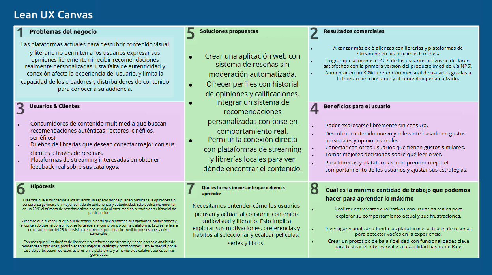
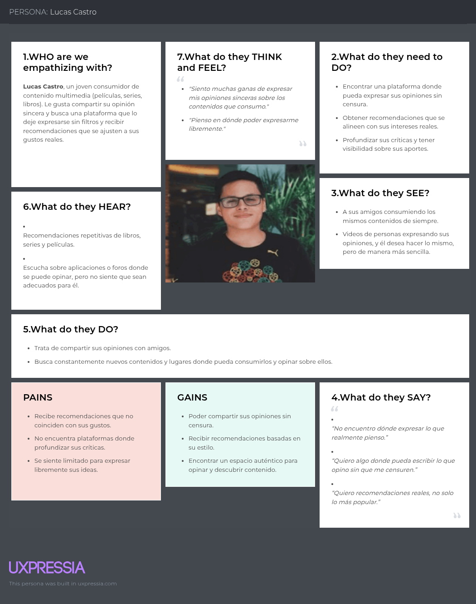
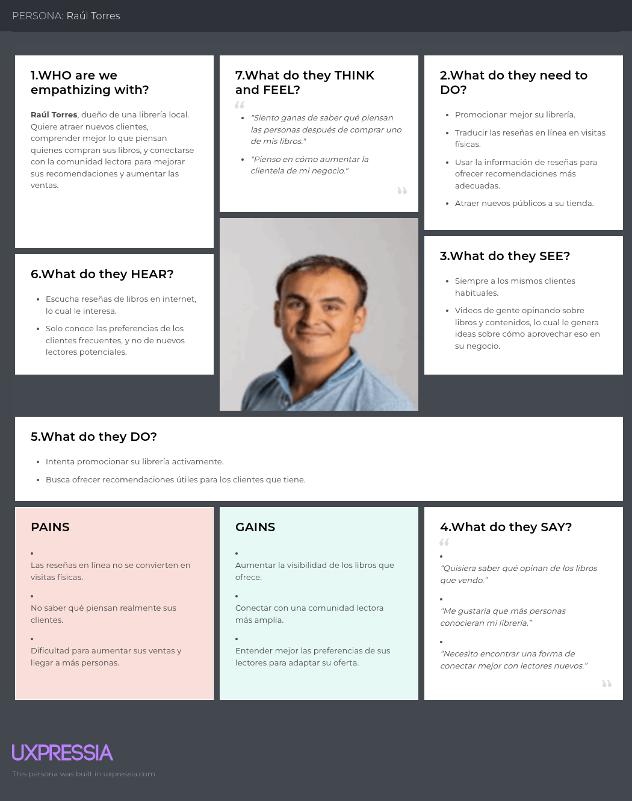
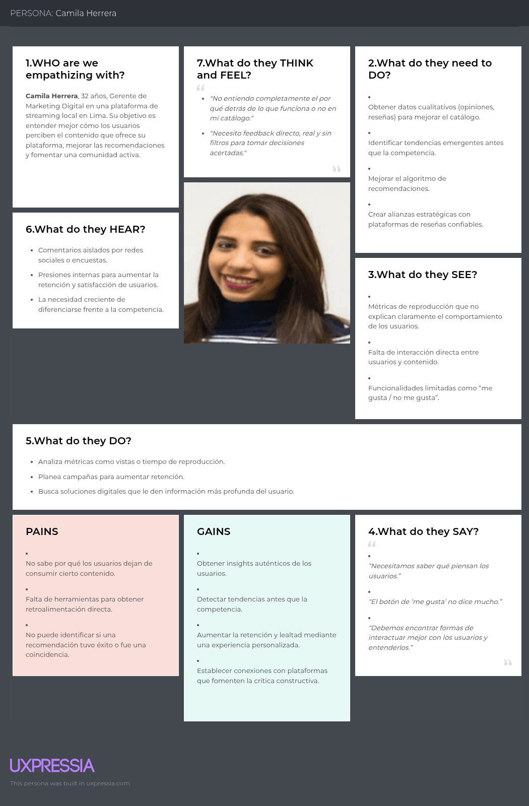
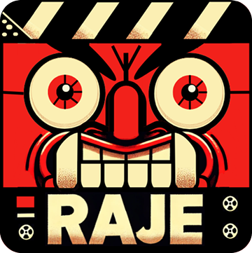
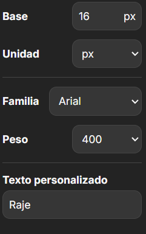
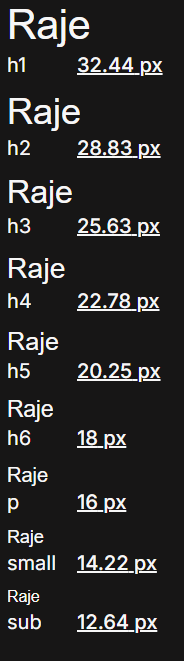
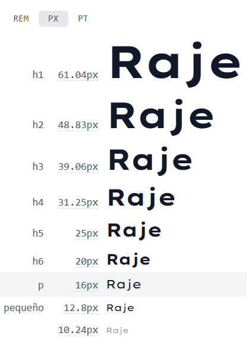
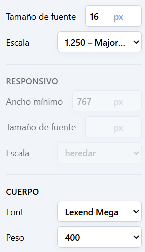
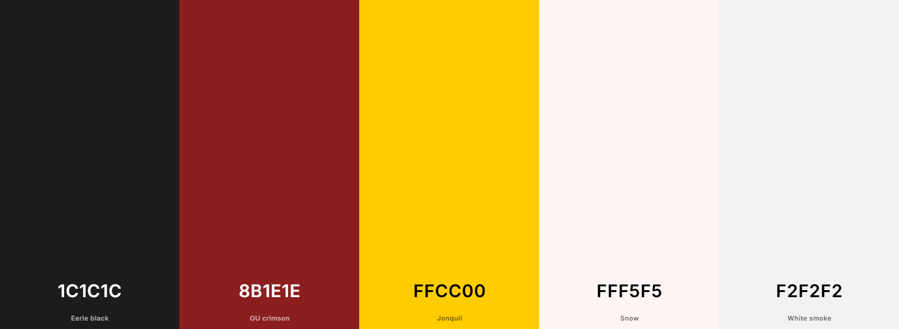

## Universidad Peruana de Ciencias Aplicadas

#### Nombre del curso: Desarrollo de aplicaciones Open Source

##### Carrera: Ingeniería de Software

##### Nombre del profesor: Hugo Allan Mori Paiva

##### NRC: 4334

#### "Informe de Trabajo Final"

##### Nombre de la Startup: Caleta Innovations

##### Nombre del Producto: Raje

#### Integrantes

U20 
Cabanillas Meza Jose Mateo U202311458 
Verona Flores Italo Sebastian U20221E617 
Aliaga Urbina Wilder Gonzalo U202222001 
Sarmiento Medina Loreley U202310005 

# *Abril de 2025*

## Registro de Versiones del Informe

<table>
  <thead>
    <tr>
      <th>Versión</th>
      <th>Fecha</th>
      <th>Autor</th>
      <th>Descripción de modificación</th>
    </tr>
  </thead>
  <tbody>
    <tr>
      <td>TB1</td>
      <td></td>
      <td></td>
      <td></td>
    </tr>
    <tr>
      <td>TP</td>
      <td></td>
      <td></td>
      <td></td>
    </tr>
    <tr>
      <td>TB2</td>
      <td></td>
      <td></td>
      <td></td>
    </tr>
    <tr>
      <td>TF</td>
      <td></td>
      <td></td>
      <td></td>
    </tr>
  </tbody>
</table>

## Contents

- [Student Outcome](#student-outcome)
- [Project Report Collaboration Insights](#project-report-collaboration-insights)

- [Capítulo I: Introducción](#capítulo-i-introducción)
    - [1.1. Startup Profile](#11-startup-profile)
        - [1.1.1. Descripción de la Startup](#111-descripción-de-la-startup)
        - [1.1.2. Perfiles de integrantes del equipo](#112-perfiles-de-integrantes-del-equipo)
    - [1.2. Solution Profile](#12-solution-profile)
        - [1.2.1. Antecedentes y problemática](#121-antecedentes-y-problemática)
        - [1.2.2. Lean UX Process](#122-lean-ux-process)
            - [1.2.2.1. Lean UX Problem Statements](#1221-lean-ux-problem-statements)
            - [1.2.2.2. Lean UX Assumptions](#1222-lean-ux-assumptions)
            - [1.2.2.3. Lean UX Hypothesis Statements](#1223-lean-ux-hypothesis-statements)
            - [1.2.2.4. Lean UX Canvas](#1224-lean-ux-canvas)
    - [1.3. Segmentos objetivos](#13-segmentos-objetivo)

- [Capítulo II: Requirements Elicitation & Analysis](#capítulo-ii-requirements-elicitation--analysis)
    - [2.1. Competidores](#21-competidores)
        - [2.1.1. Análisis competitivo](#211-análisis-competitivo)
        - [2.1.2. Estrategias y tácticas frente a competidores](#212-estrategias-y-tácticas-frente-a-competidores)
    - [2.2. Entrevistas](#22-entrevistas)
        - [2.2.1. Diseño de entrevistas](#221-diseño-de-entrevistas)
        - [2.2.2. Registro de entrevistas](#222-registro-de-entrevistas)
        - [2.2.3. Análisis de entrevistas](#223-análisis-de-entrevistas)
    - [2.3. Needfinding](#23-needfinding)
        - [2.3.1. User Personas](#231-user-personas)
        - [2.3.2. User Task Matrix](#232-user-task-matrix)
        - [2.3.3. User Journey Mapping](#233-user-journey-mapping)
        - [2.3.4. Empathy Mapping](#234-empathy-mapping)
        - [2.3.5. As-is Scenario Mapping](#235-as-is-scenario-mapping)
    - [2.4. Ubiquitous Language](#24-ubiquitous-language)

- [Capítulo III: Requirements Specification](#capítulo-iii-requirements-specification)
    - [3.1. To-Be Scenario Mapping](#31-to-be-scenario-mapping)
    - [3.2. User Stories](#32-user-stories)
    - [3.3. Impact Mapping](#33-impact-mapping)
    - [3.4. Product Backlog](#34-product-backlog)

- [Capítulo IV: Product Design](#capítulo-iv-product-design)
    - [4.1. Style Guidelines](#41-style-guidelines)
        - [4.1.1. General Style Guidelines](#411-general-style-guidelines)
        - [4.1.2. Web Style Guidelines](#412-web-style-guidelines)
    - [4.2. Information Architecture](#42-information-architecture)
        - [4.2.1. Organization Systems](#421-organization-systems)
        - [4.2.2. Labeling Systems](#422-labeling-systems)
        - [4.2.3. SEO Tags and Meta Tags](#423-seo-tags-and-meta-tags)
        - [4.2.4. Searching Systems](#424-searching-systems)
        - [4.2.5. Navigation Systems](#425-navigation-systems)
    - [4.3. Landing Page UI Design](#43-landing-page-ui-design)
        - [4.3.1. Landing Page Wireframe](#431-landing-page-wireframe)
        - [4.3.2. Landing Page Mock-up](#432-landing-page-mock-up)
    - [4.4. Web Applications UX/UI Design](#44-web-applications-uxui-design)
        - [4.4.1. Web Applications Wireframes](#441-web-applications-wireframes)
        - [4.4.2. Web Applications Wireflow Diagrams](#442-web-applications-wireflow-diagrams)
        - [4.4.3. Web Applications Mock-ups](#443-web-applications-mock-ups)
        - [4.4.4. Web Applications User Flow Diagrams](#444-web-applications-user-flow-diagrams)
    - [4.5. Web Applications Prototyping](#45-web-applications-prototyping)
    - [4.6. Domain-Driven Software Architecture](#46-domain-driven-software-architecture)
        - [4.6.1. Software Architecture Context Diagram](#461-software-architecture-context-diagram)
        - [4.6.2. Software Architecture Container Diagrams](#462-software-architecture-container-diagrams)
        - [4.6.3. Software Architecture Components Diagrams](#463-software-architecture-components-diagrams)
    - [4.7. Software Object-Oriented Design](#47-software-object-oriented-design)
        - [4.7.1. Class Diagrams](#471-class-diagrams)
        - [4.7.2. Class Dictionary](#472-class-dictionary)
    - [4.8. Database Design](#48-database-design)
        - [4.8.1. Database Diagram](#481-database-diagram)

- [Capítulo V: Product Implementation, Validation & Deployment](#capítulo-v-product-implementation-validation--deployment)
    - [5.1. Software Configuration Management](#51-software-configuration-management)
        - [5.1.1. Software Development Environment Configuration](#511-software-development-environment-configuration)
        - [5.1.2. Source Code Management](#512-source-code-management)
        - [5.1.3. Source Code Style Guide & Conventions](#513-source-code-style-guide--conventions)
        - [5.1.4. Software Deployment Configuration](#514-software-deployment-configuration)
    - [5.2. Landing Page, Services & Applications Implementation](#52-landing-page-services--applications-implementation)
        - [5.2.1. Sprint 1](#521-sprint-1)
- [Conclusiones](#conclusiones)
- [Bibliografía](#bibliografía)
- [Anexos](#anexos)

# Capítulo I: Introducción

## 1.1. Startup Profile

### 1.1.1. Descripción de la Startup

Caleta Innovations es una startup enfocada en revolucionar la forma en que las personas expresan sus opiniones y acceden
a contenido literario y audiovisual. En Caleta Innovations, valoramos la libertad de expresión y creemos en la
importancia de que cada voz sea escuchada sin filtros. Nos dedicamos a ofrecer soluciones innovadoras que permitan a
nuestros usuarios explorar una amplia variedad de contenido, mientras se sienten libres para compartir sus opiniones
auténticas.

Misión: Nuestra misión es empoderar a las personas para que puedan dar sus opiniones de manera sincera y sin censura,
mientras disfrutan de un acceso más amplio y diverso a contenido literario y audiovisual.

Visión: Nos vemos como una empresa líder en la creación de un entorno donde las opiniones auténticas y sin filtros son
el motor de una comunidad vibrante y dinámica. Aspiramos a ser la referencia global para aquellos que buscan compartir
sus perspectivas de manera genuina, enriqueciendo el acceso a contenido diverso y creando un espacio donde cada voz
tiene un impacto real y duradero.

### 1.1.2. Perfiles de integrantes del equipo

<table>
  <thead>
    <tr>
      <th>Integrantes</th>
      <th>Perfil de Integrante</th>
    </tr>
  </thead>
  <tbody>
    <tr>
      <td></td>
      <td></td>
    </tr>
    <tr>
       <td></td>
      <td> Jose Mateo Cabanillas Meza
        - Ingeniería de Software-u202311458 

Mi nombre es Mateo Cabanillas y en la
actualidad estoy cursando el quinto ciclo de
la carrera de ingeniería de software con una
mente creativa y una actitud colaborativa.
Mi amor por la programación y la
resolución de problemas me impulsa a
explorar nuevas soluciones y aportar ideas
frescas a los proyectos. Como compañero de
equipo, soy amable, atento y siempre estoy
dispuesto a ayudar. Creo firmemente en la
importancia de la comunicación efectiva y
la colaboración para lograr resultados
excepcionales. </td>
</tr>
<tr>
<td></td>
<td></td>
</tr>
<tr>
<td></td>
<td>Wilder Gonzalo Aliaga Urbina - U202222001

Como estudiante universitario de 19 años y cursando la carrera de Ingeniería de Software en el sexto ciclo, tengo una sólida base en programación en C++, Python, HTML y CSS, además de habilidades en creatividad y organización grupal. Mi enfoque está en fomentar un ambiente de aprendizaje eficiente y participativo en equipo. Me apasiona encontrar soluciones innovadoras y siempre estoy dispuesto a aprender nuevas tecnologías que potencien mis proyectos.
He trabajado en proyectos colaborativos donde la comunicación y la planificación fueron claves para lograr buenos resultados. Mi objetivo es seguir creciendo profesionalmente mientras contribuyo activamente al desarrollo de iniciativas tecnológicas con impacto positivo.
</td>
</tr>
<tr>
<td></td>
<td>Soy Loreley Sarmiento Medina con codigo de estudainte U202310005 y estudio la carrera de Ingeniería de Software y me
especializo en aportar soluciones tecnológicas integrales dentro de equipos multidisciplinarios. Cuento con sólidos
conocimientos en el modelado de wireframes y mockups utilizando Figma, lo que me permite contribuir eficazmente en la
etapa de diseño de interfaces centradas en el usuario. Además, tengo experiencia en el modelado de bases de datos,
facilitando la organización y estructura lógica de la información. Poseo conocimientos intermedios en HTML y CSS, lo
cual me permite colaborar en el desarrollo de interfaces web funcionales y visualmente atractivas. También tengo una
base sólida en lenguajes de programación, lo que me permite comprender e implementar soluciones tanto en el frontend
como en el backend, aportando al desarrollo integral del producto</td>
  </tr>
  </tbody>
</table>

## 1.2. Solution Profile

Raje de Caleta Innovations es una plataforma innovadora que permite a los usuarios expresar
sus opiniones de manera auténtica y sin filtros sobre películas, series, libros y más. Inspirada
en la jerga latina "rajar," que significa hablar sin rodeos, Raje ofrece un espacio donde la
libertad de expresión es fundamental. Además, la plataforma les muestra dónde está disponible
el contenido, ya sea en plataformas de streaming o librerías. Los usuarios pueden rankear el
contenido que consumen, dejar opiniones sinceras, y recibir recomendaciones personalizadas.
Además, podrán ver la lista de sus opiniones y calificaciones, así como el contenido que han
consumido, directamente en su perfil. Con un enfoque en la autenticidad, Raje redefine la
manera en que las personas interactúan con el entretenimiento, fomentando una comunidad
dinámica y vibrante donde cada voz cuenta.

### 1.2.1. Antecedentes y problemática

<table>

  <tbody>
    <tr>
      <td> What ( Qué ) </td>
      <td>En el área del entretenimiento digital, los usuarios buscan cada vez más plataformas 
donde puedan descubrir y compartir opiniones sobre películas, series y libros. Sin 
embargo, las opciones disponibles suelen estar limitadas por filtros y políticas de 
moderación que restringen la libertad de expresión y la autenticidad de las opiniones. 
Además, muchas de las aplicaciones disponibles carecen de funcionalidades clave, 
como la ausencia de perfiles y una interfaz para explorar las opiniones de otros usuarios. 
La falta de una aplicación adecuada a opiniones de películas, series y libros limita al 
público a tomar decisiones informadas. Sin un lugar en el que los usuarios expresen y 
lean opiniones auténticas se pierde la diversidad de perspectivas que enriquece la 
experiencia de descubrir nuevo contenido. Por ende, se restringe el acceso a un amplio 
conjunto de opiniones, lo cual afecta la experiencia general de entretenimiento y la 
capacidad de descubrir contenido relevante. </td>
    </tr>
    <tr>
      <td> When ( Cuándo ) </td>
      <td> El problema aparece cuando los usuarios quieren buscar de 
opiniones auténticas sobre películas, series y libros. A menudo, ellos se enfrentan a la 
frustración de encontrar reseñas moderadas en las plataformas existentes. En 
consecuencia, los usuarios no pueden evaluar de manera precisa si un contenido se 
alinea con sus intereses, porque las reseñas disponibles a menudo están influenciadas 
por restricciones. </td>
    </tr>
    <tr>
      <td> Where ( Dónde ) </td>
      <td> Los problemas de la falta de una aplicación que permita opiniones de 
películas, series y libros sin filtros ni censura se aprecia en múltiples lugares, como 
plataformas de streaming, redes sociales, sitios de crítica y reseñas, foros en línea, etc. 
En estas plataformas, las opiniones de los usuarios a menudo están sujetas a moderación 
o políticas que restringen la libre expresión. Esta situación limita el acceso a una 
diversidad de perspectivas que afecta la capacidad de los usuarios para descubrir 
opiniones auténticas. </td>
    </tr>
    <tr>
      <td> Who ( Quién ) </td>
      <td>  Esta problemática afecta a diversos grupos de personas. En primer 
lugar, los espectadores y lectores que buscan opiniones para decidir qué contenido 
consumir se ven limitados por la falta de un espacio que ofrezca críticas genuinas. 
También impacta a críticos independientes o aficionados, quienes no tienen una 
plataforma adecuada para expresar sus opiniones sin temor a la censura. Además, las 
comunidades de nicho con intereses específicos enfrentan dificultades para encontrar y 
compartir opiniones relevantes que se alineen con sus gustos únicos.  </td>
    </tr>
    <tr>
      <td> Why ( Por qué ) </td>
      <td> La causa principal del problema es la falta de espacios que prioricen 
la autenticidad y la libertad de expresión, lo que lleva a una interacción superficial o 
condicionada entre los usuarios y sus comunidades. Las plataformas tradicionales 
pueden estar influenciadas por agendas comerciales, lo que diluye la sinceridad de las 
opiniones compartidas. </td>
    </tr>
     <tr>
      <td> How ( Cómo) </td>
      <td> Utilizando una aplicación que te permite no solo expresar tus opiniones 
sobre contenido audiovisual y literario, sino también leer las críticas de otros usuarios. </td>
    </tr>
     <tr>
      <td> How much ( Cuánto ) </td>
      <td> </td>
    </tr>
  </tbody>
</table>

### 1.2.2. Lean UX Process

#### 1.2.2.1. Lean UX Problem Statements

Hoy en día, millones de personas buscan recomendaciones auténticas sobre libros, películas y series antes de decidir qué
consumir. Sin embargo, las plataformas actuales están llenas de filtros, políticas de moderación o algoritmos que
limitan la libertad de expresión. Esto impide que los usuarios compartan opiniones sinceras y que descubran contenido
relevante basado en experiencias reales.

Además, muchos consumidores se sienten frustrados porque no pueden dejar reseñas completas ni recibir sugerencias
personalizadas que realmente se ajusten a sus gustos. La ausencia de perfiles, historial de reseñas o interacción entre
usuarios reduce la calidad de la experiencia.

Del lado de los creadores o distribuidores de contenido, como dueños de librerías o plataformas de streaming, también
hay una brecha. No cuentan con herramientas para conectar directamente con su audiencia a través de opiniones genuinas,
ni aprovechar esa data para mejorar sus recomendaciones o promociones.

#### 1.2.2.2. Lean UX Assumptions

##### Opiniones auténticas tienen valor

Los usuarios valoran más una opinión real, aunque sea crítica, que una reseña genérica o influenciada por intereses
comerciales. Quieren sentirse parte de una comunidad donde puedan expresarse con libertad y conocer lo que piensan otros
usuarios parecidos a ellos.

##### Simplicidad y personalización en la experiencia

Los usuarios desean una plataforma que les permita explorar contenido fácilmente, con recomendaciones ajustadas a sus
gustos reales. Si tienen un perfil personal donde pueden ver sus opiniones, calificaciones y descubrimientos, se
sentirán más identificados con la plataforma y volverán con más frecuencia.

##### Integración con librerías y plataformas

Dueños de librerías y administradores de plataformas de streaming están interesados en conocer las opiniones reales de
los usuarios. Si pueden acceder a esta información de manera organizada y con análisis útiles, podrán adaptar su oferta
y conectar mejor con sus públicos objetivos.

#### 1.2.2.3. Lean UX Hypothesis Statements

##### Opinión libre y sin censura

Creemos que si brindamos a los usuarios un espacio donde puedan publicar sus opiniones sin censura, se generará un mayor
sentido de pertenencia y autenticidad. Esto podría incrementar en un 20 % el número de reseñas activas por usuario al
mes, medido a través de su historial de participación.

##### Perfil personalizado con historial

Creemos que si cada usuario puede tener un perfil que almacene sus opiniones, calificaciones y el contenido que ha
consumido, se fortalecerá el compromiso con la plataforma. Esto se reflejará en un aumento del 25 % en visitas
recurrentes por usuario, medido por sesiones activas semanales.

##### Valor para negocios y creadores de contenido

Creemos que si los dueños de librerías y plataformas de streaming tienen acceso a análisis de tendencias y opiniones,
podrán adaptar mejor su catálogo y promociones. Esto se medirá por la tasa de participación de estos actores en la
plataforma y el número de colaboraciones activas generadas.

#### 1.2.2.4. Lean UX Canvas

### 1.3. Segmentos objetivos

1. Consumidores de contenido multimedia
   Este segmento incluye a personas apasionadas por películas, libros, series que buscan un
   espacio para compartir opiniones auténticas y recibir recomendaciones personalizadas en Raje.

2. Dueños de Librerías
   Los dueños de librerías pueden conectar con lectores apasionados a través de Raje,
   promocionando sus libros en función de reseñas y calificaciones, y ofreciendo lanzamientos y
   eventos alineados con los intereses de los usuarios.

3. Plataformas de Streaming
   Las plataformas de streaming pueden usar Raje para analizar tendencias, ajustar su catálogo y
   recomendar contenido a usuarios que buscan nuevas películas y series, maximizando la
   visibilidad y engagement de su contenido.

# Capítulo II: Requirements Elicitation & Analysis

## 2.1. Competidores

### 2.1.1. Análisis competitivo

<table>
  <tr>
    <th colspan="1">Competitive Analysis Landscape</th>
  </tr>
  <tr>
    <td>
      <strong>¿Por qué llevar a cabo este análisis?</strong> 
      Comprender cómo se posiciona Raje frente a competidores actuales en la industria de reseñas de contenido, identificando ventajas competitivas y oportunidades de diferenciación.
    </td>
  </tr>
</table>

<table>
  <thead>
    <tr>
      <th>Aspecto</th>
      <th>Raje</th>
      <th>Letterboxd</th>
      <th>Goodreads</th>
      <th>Taste.io</th>
    </tr>
  </thead>
  <tbody>
    <tr>
      <td colspan="5"><strong>Perfil</strong></td>
    </tr>
    <tr>
      <td>Overview</td>
      <td>Plataforma que permite opinar libremente y sin censura sobre películas, libros y series.</td>
      <td>Red social centrada en reseñas y listas de películas.</td>
      <td>Comunidad centrada en la literatura con reseñas y ratings.</td>
      <td>Motor de recomendación de películas y series con IA.</td>
    </tr>
    <tr>
      <td>Mercado objetivo</td>
      <td>Jóvenes adultos con fuerte opinión cultural; lectores y cinéfilos activos.</td>
      <td>Cinéfilos de todas las edades que desean compartir y explorar críticas.</td>
      <td>Lectores frecuentes y amantes de los libros.</td>
      <td>Espectadores que buscan contenido afín a sus emociones o estados de ánimo.</td>
    </tr>
    <tr>
      <td colspan="5"><strong>Estrategia de marketing</strong></td>
    </tr>
    <tr>
      <td>Estrategias de marketing</td>
      <td>Libertad de expresión, alianzas con librerías y plataformas de streaming.</td>
      <td>Marketing de boca a boca y presencia en festivales de cine.</td>
      <td>Alianzas con editoriales y recomendaciones internas.</td>
      <td>Influencers, enfoque emocional, experiencia personalizada.</td>
    </tr>
    <tr>
      <td colspan="5"><strong>Producto</strong></td>
    </tr>
    <tr>
      <td>Valor ofrecido</td>
      <td>Opiniones sin censura, integración de libros, películas y series.</td>
      <td>Herramientas visuales y comunidad activa.</td>
      <td>Estadísticas de lectura y comunidad de lectores.</td>
      <td>Recomendaciones basadas en emociones y gustos.</td>
    </tr>
    <tr>
      <td>Productos y servicios</td>
      <td>Reseñas libres, rankings, perfiles personalizados, recomendaciones.</td>
      <td>Reseñas, listas, diarios de películas.</td>
      <td>Reseñas, retos de lectura, seguimiento de libros.</td>
      <td>Exploración visual, motor inteligente de recomendaciones.</td>
    </tr>
    <tr>
      <td>Precios y costos</td>
      <td>Gratuito, con posible modelo freemium.</td>
      <td>Gratuito, versión Pro con estadísticas.</td>
      <td>Gratuito.</td>
      <td>Gratuito con monetización por afiliaciones.</td>
    </tr>
    <tr>
      <td>Canales de distribución</td>
      <td>Aplicación móvil y web (en desarrollo).</td>
      <td>Web y app móvil.</td>
      <td>Web y app móvil.</td>
      <td>Web y app móvil.</td>
    </tr>
    <tr>
      <td colspan="5"><strong>Análisis SWOT</strong></td>
    </tr>
    <tr>
      <td>Fortalezas</td>
      <td>Opiniones sin filtros, integración multimedia, perfil personal.</td>
      <td>Comunidad activa, enfoque exclusivo en cine.</td>
      <td>Base de datos amplia, comunidad de lectores.</td>
      <td>IA personalizada, interfaz intuitiva.</td>
    </tr>
    <tr>
      <td>Debilidades</td>
      <td>Base de usuarios nueva, dependencia de alianzas.</td>
      <td>Limitado a cine e Interfaz poco intuitiva</td>
      <td>Interfaz anticuada, baja personalización.</td>
      <td>Sin comunidad visible, funciones limitadas.</td>
    </tr>
    <tr>
      <td>Oportunidades</td>
      <td>Alianzas con librerías y plataformas, adopción por nichos.</td>
      <td>Expandirse a otros formatos como series o libros.</td>
      <td>Integrar multimedia, mejorar experiencia visual.</td>
      <td>Expansión en LATAM, personalización avanzada.</td>
    </tr>
    <tr>
      <td>Amenazas</td>
      <td>Restricciones a la libertad de expresión, competencia consolidada.</td>
      <td>Nuevas apps con más libertad o funciones.</td>
      <td>Pérdida de usuarios por falta de innovación.</td>
      <td>Competencia de algoritmos de plataformas grandes.</td>
    </tr>
  </tbody>
</table>

### 2.1.2. Estrategias y tácticas frente a competidores

Esta sección presenta las estrategias iniciales de Raje para afrontar el entorno competitivo. Cada estrategia responde a al menos dos factores del análisis FODA (Fortalezas, Oportunidades, Debilidades y Amenazas), con el fin de posicionar a Raje como una plataforma única, atractiva y sostenible frente a sus principales competidores.

<table>
  <thead>
    <tr>
      <th>Estrategia</th>
      <th>Relación con FODA</th>
      <th>Tácticas específicas</th>
    </tr>
  </thead>
  <tbody>
    <tr>
      <td>Potenciar la experiencia de usuario con una interfaz superior</td>
      <td>Fortalezas (interfaz moderna), Amenazas (competencia consolidada)</td>
      <td>
        - Invertir en diseño UX/UI con enfoque en accesibilidad y velocidad. 
        - Probar con usuarios para mantener un diseño más atractivo que Letterboxd o Goodreads. 
        - Lanzar campañas comparativas resaltando la fluidez visual y usabilidad de Raje.
      </td>
    </tr>
    <tr>
      <td>Establecer alianzas estratégicas con plataformas de streaming y librerías</td>
      <td>Oportunidades (colaboraciones), Debilidades (poca base de usuarios)</td>
      <td>
        - Contactar librerías y plataformas de nicho para integración de contenido y promociones cruzadas. 
        - Crear funciones de "ver ahora" o "comprar el libro" directamente desde Raje. 
        - Usar estas alianzas como gancho para atraer nuevos usuarios.
      </td>
    </tr>
    <tr>
      <td>Fomentar la libertad de expresión como diferencial de marca</td>
      <td>Fortalezas (opiniones sin censura), Amenazas (regulaciones)</td>
      <td>
        - Establecer políticas claras de moderación sin censura injustificada. 
        - Posicionar a Raje como espacio seguro y libre para opinar sobre contenido cultural. 
        - Trabajar en un sistema de reputación comunitaria para balancear libertad con responsabilidad.
      </td>
    </tr>
    <tr>
      <td>Gamificar la participación para activar la comunidad</td>
      <td>Debilidades (poca base activa), Oportunidades (nicho que valora lo auténtico)</td>
      <td>
        - Crear sistemas de puntos, logros y recompensas para reseñadores frecuentes. 
        - Promover retos mensuales de reseñas. 
        - Integrar rankings locales y globales de actividad.
      </td>
    </tr>
    <tr>
      <td>Diferenciarse con una experiencia de contenido unificada (libros, películas y series)</td>
      <td>Fortalezas (multiformato), Debilidades (nueva plataforma)</td>
      <td>
        - Ofrecer exploración cruzada entre libros, series y películas. 
        - Implementar perfiles temáticos personalizados por tipo de contenido. 
        - Promover a Raje como la única app que centraliza toda tu vida cultural.
      </td>
    </tr>
    <tr>
      <td>Expandirse primero en nichos culturales activos</td>
      <td>Oportunidades (nicho cultural), Amenazas (plataformas masivas)</td>
      <td>
        - Realizar activaciones en eventos culturales con códigos de acceso exclusivo. 
        - Crear embajadores de Raje en comunidades culturales. 
        - Lanzar campañas específicas para cinéfilos y lectores intensivos.
      </td>
    </tr>
  </tbody>
</table>

## 2.2. Entrevistas

### 2.2.1. Diseño de entrevistas

-Preguntas para consumidores de contenido multimedia

1. ¿A menudo disfrutas de alguna serie,película o libro?
2. ¿Qué criterios utilizas al elegir qué contenido consumir?
3. ¿Sueles leer opiniones o reseñas antes de ver una película, serie o leer un libro?
4. ¿Cómo descubres nuevas películas, series o libros?
5. ¿Con qué frecuencia dejas opiniones o reseñas sobre el contenido que consumes? Si es
   así, ¿qué te motiva a hacerlo?
6. ¿Usualmente usas plataformas para dejar reseñas o donde sueles dejar tu opinión?
7. ¿Qué importancia le das a las opiniones de otros usuarios antes de elegir qué contenido
   consumir?
8. ¿Te gustaría que las recomendaciones de películas, series o libros se ajusten más a tus
   gustos? Si es asi, como?
9. ¿Qué aspectos no te han convencido o crees que deberían mejorarse en una plataforma
   que permite hacer reseñas sobre contenido?

-Preguntas para Dueños de Librerías

1. ¿Cómo promocionas actualmente los libros en tu librería?
2. ¿Cómo suelen descubrir los clientes tu librería?
3. ¿Te gustaría que existiera una plataforma donde los lectores descubran libros mediante
   reseñas de otros usuarios y como beneficiaria a tu negocio?
4. ¿Cree que las reseñas de libros influyen en la decisión de compra de los clientes? Si es
   así ¿De qué manera?
5. ¿Sueles recibir comentarios o recomendaciones de tus clientes? ¿Qué haces con esa
   información?
6. Si pudieras conectar tu librería con una plataforma donde las personas descubren libros
   según sus intereses, ¿cómo te gustaría que fuera esa colaboración?

-Preguntas para Plataformas de Streaming

1. ¿Cómo deciden qué series o películas promocionar?
2. ¿Qué aspectos consideran más importantes y útiles al promocionar una serie o película?
3. ¿Cómo sueles enterarte de lo que más disfrutan los usuarios en tu plataforma?
4. ¿Crees que obtener los datos de una aplicación, donde los usuarios dejen reseñas y
   reciban recomendaciones personalizadas, beneficiaría a tu plataforma?
5. ¿Cómo quisieras que los usuarios reciban sugerencias en la aplicación sobre el
   contenido de tu plataforma?
6. ¿Cómo crees que los comentarios de los usuarios podrían ayudarte a mejorar el
   contenido que ofreces?
7. ¿Cómo te gustaría que fuera una colaboración con una plataforma que permita a los
   usuarios encontrar nuevas películas y series según sus intereses?

### 2.2.2 Registro de entrevista

-Andres Jonathan Santos Espinoza (consumidor de contenido multimedia)

### Analisis de entrevista

-Andres Jonathan Santos Espinoza (consumidor de contenido multimedia):

En la entrevista, Andrés, estudiante de comunicaciones en la Universidad de Lima, se muestra como un consumidor
cuidadoso y con preferencias marcadas, especialmente por las películas. Suele apoyarse en reseñas y recomendaciones de
su entorno o de redes sociales como TikTok para decidir qué ver o leer. Destaca que, aunque toma en cuenta la opinión de
otros, cuando deja sus propias reseñas lo hace desde su experiencia personal. También señala su incomodidad con la
censura en los comentarios de algunas plataformas y plantea que le gustaría recibir sugerencias de contenido más
personalizadas según sus gustos. Su visión encaja muy bien con la propuesta de RAJE, que busca ser un espacio abierto
donde los usuarios puedan expresarse libremente y descubrir contenido afín a sus intereses.

## 2.3. Needfinding

### 2.3.1. User Personas

### 2.3.2. User Task Matrix

#### Consumidor de contenido multimedia – Lucas Castro

<table border="1" cellpadding="8" cellspacing="0">
  <tr>
    <th>Tarea</th>
    <th>Frecuencia</th>
    <th>Prioridad</th>
    <th>Frustración</th>
  </tr>
  <tr>
    <td>Leer reseñas de un contenido que le llama la atención</td>
    <td>Antes de decidir si verlo o leerlo</td>
    <td>Alta</td>
    <td>Media</td>
  </tr>
  <tr>
    <td>Escribir reseñas u opiniones sobre contenido consumido</td>
    <td>Después de ver una película, serie o leer un libro</td>
    <td>Alta</td>
    <td>Baja</td>
  </tr>
  <tr>
    <td>Calificar contenido con estrellas</td>
    <td>Después de consumir contenido multimedia</td>
    <td>Media</td>
    <td>Baja</td>
  </tr>
  <tr>
    <td>Buscar contenido según sus intereses (género, palabra clave, etc.)</td>
    <td>Diario</td>
    <td>Alta</td>
    <td>Media</td>
  </tr>
  <tr>
    <td>Consultar su historial de contenido y reseñas</td>
    <td>Semanal</td>
    <td>Alta</td>
    <td>Baja</td>
  </tr>
  <tr>
    <td>Seguir a otros usuarios con gustos similares</td>
    <td>Ocasional, cuando encuentra usuarios con opiniones afines</td>
    <td>Media</td>
    <td>Media</td>
  </tr>
  <tr>
    <td>Ver en qué plataforma está disponible un contenido</td>
    <td>Antes de decidir qué contenido ver o leer</td>
    <td>Alta</td>
    <td>Media</td>
  </tr>
  <tr>
    <td>Ver en qué librería cercana puede adquirir un libro</td>
    <td>Al buscar un libro que le interesa</td>
    <td>Alta</td>
    <td>Baja</td>
  </tr>
  <tr>
    <td>Explorar recomendaciones personalizadas</td>
    <td>Diario</td>
    <td>Muy Alta</td>
    <td>Baja</td>
  </tr>
  <tr>
    <td>Comentar reseñas de otros usuarios</td>
    <td>Ocasional, si una opinión le llama la atención</td>
    <td>Media</td>
    <td>Media</td>
  </tr>
  <tr>
    <td>Compartir sus opiniones sin censura</td>
    <td>Cada vez que publica una reseña o comentario</td>
    <td>Muy Alta</td>
    <td>Alta</td>
  </tr>
</table>

#### Dueño de librería – Raúl Torres

<table border="1" cellpadding="8" cellspacing="0">
  <thead>
    <tr>
      <th>Tarea</th>
      <th>Frecuencia</th>
      <th>Prioridad</th>
      <th>Frustración</th>
    </tr>
  </thead>
  <tbody>
    <tr>
      <td>Promocionar libros con base en tendencias</td>
      <td>Media</td>
      <td>Alta</td>
      <td>Alta</td>
    </tr>
    <tr>
      <td>Leer las reseñas de usuarios sobre los libros</td>
      <td>Media</td>
      <td>Alta</td>
      <td>Media</td>
    </tr>
    <tr>
      <td>Identificar los libros mejor valorados</td>
      <td>Media</td>
      <td>Alta</td>
      <td>Alta</td>
    </tr>
    <tr>
      <td>Conectar su librería con la plataforma</td>
      <td>Baja</td>
      <td>Alta</td>
      <td>Media</td>
    </tr>
    <tr>
      <td>Crear eventos con base en intereses</td>
      <td>Baja</td>
      <td>Media</td>
      <td>Baja</td>
    </tr>
    <tr>
      <td>Recibir recomendaciones de libros populares</td>
      <td>Media</td>
      <td>Alta</td>
      <td>Media</td>
    </tr>
    <tr>
      <td>Interactuar con lectores frecuentes</td>
      <td>Baja</td>
      <td>Media</td>
      <td>Media</td>
    </tr>
  </tbody>
</table>

#### Plataforma de streaming – Camila Herrera

<table border="1" cellpadding="8" cellspacing="0">
  <thead>
    <tr>
      <th>Tarea</th>
      <th>Frecuencia</th>
      <th>Prioridad</th>
      <th>Frustración</th>
    </tr>
  </thead>
  <tbody>
    <tr>
      <td>Ver qué contenido es más comentado</td>
      <td>Alta</td>
      <td>Alta</td>
      <td>Media</td>
    </tr>
    <tr>
      <td>Analizar reseñas detalladas</td>
      <td>Media</td>
      <td>Alta</td>
      <td>Alta</td>
    </tr>
    <tr>
      <td>Detectar patrones de consumo</td>
      <td>Media</td>
      <td>Alta</td>
      <td>Media</td>
    </tr>
    <tr>
      <td>Acceder a estadísticas de feedback</td>
      <td>Media</td>
      <td>Alta</td>
      <td>Alta</td>
    </tr>
    <tr>
      <td>Vincular contenido a reseñas dentro de Raje</td>
      <td>Baja</td>
      <td>Media</td>
      <td>Media</td>
    </tr>
    <tr>
      <td>Medir el impacto de las recomendaciones</td>
      <td>Baja</td>
      <td>Alta</td>
      <td>Alta</td>
    </tr>
    <tr>
      <td>Explorar colaboraciones con usuarios influyentes</td>
      <td>Baja</td>
      <td>Media</td>
      <td>Media</td>
    </tr>
  </tbody>
</table>

### 2.3.3. User Journey Mapping

### 2.3.4. Empathy Mapping

### 2.3.5. As-is Scenario Mapping

#### As Is – Lucas Castro

<table border="1" cellpadding="8" cellspacing="0">
  <thead>
    <tr>
      <th>Etapa</th>
      <th>Acciones</th>
      <th>Pensamientos</th>
      <th>Sentimientos</th>
    </tr>
  </thead>
  <tbody>
    <tr>
      <td>Buscar qué ver o leer</td>
      <td>Navega entre múltiples plataformas o redes sociales</td>
      <td>“¿Qué puedo ver hoy que realmente me guste?”</td>
      <td>Frustración, indecisión</td>
    </tr>
    <tr>
      <td>Leer opiniones</td>
      <td>Revisa reseñas filtradas en plataformas o redes</td>
      <td>“¿Esto es real o está influenciado por publicidad?”</td>
      <td>Desconfianza</td>
    </tr>
    <tr>
      <td>Escribir reseñas</td>
      <td>No encuentra un espacio claro para expresarse</td>
      <td>“Mi opinión no tiene espacio aquí.”</td>
      <td>Desmotivación</td>
    </tr>
    <tr>
      <td>Recibir recomendaciones</td>
      <td>Recibe sugerencias genéricas o repetitivas</td>
      <td>“Esto no tiene nada que ver conmigo.”</td>
      <td>Insatisfacción</td>
    </tr>
  </tbody>
</table>

#### As Is – Raúl Torres

<table border="1" cellpadding="8" cellspacing="0">
  <thead>
    <tr>
      <th>Etapa</th>
      <th>Acciones</th>
      <th>Pensamientos</th>
      <th>Sentimientos</th>
    </tr>
  </thead>
  <tbody>
    <tr>
      <td>Promocionar libros</td>
      <td>Usa Facebook o WhatsApp para dar visibilidad</td>
      <td>“No sé si estoy alcanzando al público correcto.”</td>
      <td>Incertidumbre</td>
    </tr>
    <tr>
      <td>Conocer intereses del público</td>
      <td>Se basa en intuición o conversación directa</td>
      <td>“Podría recomendar mejor si supiera qué buscan.”</td>
      <td>Limitado, curioso</td>
    </tr>
    <tr>
      <td>Recibir retroalimentación</td>
      <td>Escucha comentarios ocasionales</td>
      <td>“Ojalá más gente me dijera qué piensa.”</td>
      <td>Desconectado</td>
    </tr>
  </tbody>
</table>

#### As Is – Camila Herrera</h3>

<table border="1" cellpadding="8" cellspacing="0">
  <thead>
    <tr>
      <th>Etapa</th>
      <th>Acciones</th>
      <th>Pensamientos</th>
      <th>Sentimientos</th>
    </tr>
  </thead>
  <tbody>
    <tr>
      <td>Evaluar contenido</td>
      <td>Revisa métricas de reproducción y likes</td>
      <td>“Esto me dice qué ven, pero no qué sienten.”</td>
      <td>Incompleto</td>
    </tr>
    <tr>
      <td>Recibir feedback</td>
      <td>Depende de encuestas o redes sociales</td>
      <td>“Necesito algo más directo y específico.”</td>
      <td>Frustración</td>
    </tr>
    <tr>
      <td>Ajustar catálogo</td>
      <td>Toma decisiones con datos limitados</td>
      <td>“Estoy adivinando más que acertando.”</td>
      <td>Riesgo, duda</td>
    </tr>
  </tbody>
</table>
## 2.4. Ubiquitous Language

# Capítulo III: Requirements Specification

## 3.1. To-Be Scenario Mapping

#### To Be – Lucas Castro

<table border="1" cellpadding="8" cellspacing="0">
  <thead>
    <tr>
      <th>Etapa</th>
      <th>Acciones</th>
      <th>Pensamientos</th>
      <th>Sentimientos</th>
    </tr>
  </thead>
  <tbody>
    <tr>
      <td>Buscar qué ver o leer</td>
      <td>Usa Raje para ver contenido relacionado con sus gustos</td>
      <td>“¡Esto suena justo a lo que estaba buscando!”</td>
      <td>Entusiasmo, descubrimiento</td>
    </tr>
    <tr>
      <td>Leer opiniones</td>
      <td>Lee reseñas reales, sin censura</td>
      <td>“Confío en esta reseña, me ayuda a decidir.”</td>
      <td>Seguridad, confianza</td>
    </tr>
    <tr>
      <td>Escribir reseñas</td>
      <td>Publica libremente en su perfil</td>
      <td>“Puedo decir exactamente lo que pienso.”</td>
      <td>Empoderamiento</td>
    </tr>
    <tr>
      <td>Recibir recomendaciones</td>
      <td>Obtiene sugerencias personalizadas</td>
      <td>“¡Esta app realmente me entiende!”</td>
      <td>Satisfacción, fidelidad</td>
    </tr>
  </tbody>
</table>

#### To Be – Raúl Torres

<table border="1" cellpadding="8" cellspacing="0">
  <thead>
    <tr>
      <th>Etapa</th>
      <th>Acciones</th>
      <th>Pensamientos</th>
      <th>Sentimientos</th>
    </tr>
  </thead>
  <tbody>
    <tr>
      <td>Promocionar libros</td>
      <td>Publica los más valorados en Raje</td>
      <td>“Puedo destacar justo lo que está gustando más.”</td>
      <td>Confianza, control</td>
    </tr>
    <tr>
      <td>Conocer intereses del público</td>
      <td>Consulta tendencias en Raje</td>
      <td>“Ahora sé qué libros buscan mis lectores.”</td>
      <td>Enlace con su comunidad</td>
    </tr>
    <tr>
      <td>Recibir retroalimentación</td>
      <td>Lee reseñas sobre los libros que vende</td>
      <td>“Esto me ayuda a mejorar mi catálogo.”</td>
      <td>Participación, conexión</td>
    </tr>
  </tbody>
</table>

#### To Be – Camila Herrera

<table border="1" cellpadding="8" cellspacing="0">
  <thead>
    <tr>
      <th>Etapa</th>
      <th>Acciones</th>
      <th>Pensamientos</th>
      <th>Sentimientos</th>
    </tr>
  </thead>
  <tbody>
    <tr>
      <td>Evaluar contenido</td>
      <td>Accede a análisis cualitativo desde Raje</td>
      <td>“Ahora sé por qué ciertos títulos impactan más.”</td>
      <td>Claridad, enfoque</td>
    </tr>
    <tr>
      <td>Recibir feedback</td>
      <td>Visualiza reseñas auténticas</td>
      <td>“Esto me permite entender mejor al usuario final.”</td>
      <td>Precisión, estrategia</td>
    </tr>
    <tr>
      <td>Ajustar catálogo</td>
      <td>Aplica mejoras basadas en opiniones</td>
      <td>“Mis decisiones están alineadas con lo que importa.”</td>
      <td>Seguridad, confianza</td>
    </tr>
  </tbody>
</table>
## 3.2. User Stories

### Epics

<table>
  <thead>
    <tr>
      <th>Epic ID</th>
      <th>Título</th>
      <th>Descripción</th>
    </tr>
  </thead>
 <tbody>
  <tr>
  <td>EPIC-1</td>
  <td>Gestión de Cuenta</td>
  <td>Permite a los usuarios registrarse, iniciar sesión, recuperar contraseñas y gestionar la seguridad de sus credenciales en la plataforma Raje.</td>
</tr>
<tr>
  <td>EPIC-2</td>
  <td>Personalización de Perfil</td>
  <td>Permite a los usuarios editar su información personal, intereses (géneros favoritos, autores, directores), foto de perfil y configuraciones.</td>
</tr>
<tr>
  <td>EPIC-3</td>
  <td>Gestión de Reseñas y Calificaciones</td>
  <td>Permite a los usuarios publicar reseñas, otorgar calificaciones y leer comentarios de otros usuarios sobre libros, películas o series.</td>
</tr>
<tr>
  <td>EPIC-4</td>
  <td>Exploración de Contenido</td>
  <td>Permite descubrir nuevas obras por medio de filtros personalizados, recomendaciones basadas en intereses y acceso a contenido popular y reciente.</td>
</tr>
<tr>
  <td>EPIC-5</td>
  <td>Zonas Seguras</td>
  <td>Permite a los usuarios ver, compartir y calificar zonas seguras para actividades como leer o ver películas en espacios públicos de Lima.</td>
</tr>
<tr>
  <td>EPIC-6</td>
  <td>Gamificación y Logros</td>
  <td>Introduce elementos de gamificación como logros, insignias y recompensas para fomentar la participación activa y el descubrimiento de contenido.</td>
</tr>
<tr>
  <td>EPIC-7</td>
  <td>Sistema de Notificaciones</td>
  <td>Permite enviar alertas relevantes al usuario sobre interacciones, recomendaciones, cambios de seguridad o nuevas zonas seguras.</td>
</tr>
<tr>
  <td>EPIC-8</td>
  <td>Panel Administrativo</td>
  <td>Permite a los administradores gestionar usuarios, moderar contenido, analizar estadísticas de uso y mantener la integridad del sistema.</td>
</tr>
</tbody>
</table>

### User Stories

A continuación, se detallan las historias de usuario de nuestra aplicación. Cada una de ellas representa una necesidad
específica de los actores involucrados en la Plataforma, permitiendo identificar los requisitos funcionales que debe
cumplir el sistema.

Además, se incluyen los criterios de aceptación correspondientes, los cuales definen los distintos escenarios en los que
se validará cada historia de usuario. Finalmente, se indica a qué Epic pertenece cada historia, facilitando su
organización y trazabilidad dentro del desarrollo.

<table>
    <tr>
        <th>Historia de Usuario ID</th>
        <th>Título</th>
        <th>Descripción</th>
        <th>Criterios de Aceptación</th>
        <th>Relacionado con (Epic ID)</th>
    </tr>
    <tbody>
        <tr>
            <td>US-01</td>
            <td>Creación de Cuenta de Usuario</td>
            <td>Como usuario, deseo crear una cuenta en la plataforma para poder acceder y personalizar mi experiencia</td>
            <td>
Escenario 1:
                Dado que soy un usuario nuevo que desea registrarse en la plataforma,
                Cuando ingreso mi correo electrónico y contraseña en el formulario de registro,
                Entonces el sistema debe enviarme un correo de verificación para confirmar mi cuenta.

Escenario 2:
Dado que tengo una cuenta en Google o Facebook,
Cuando selecciono la opción para registrarme con estas redes sociales,
Entonces el sistema debe permitirme crear la cuenta utilizando mis credenciales de estas plataformas.

Escenario 3:
Dado que el correo electrónico que intento registrar ya está en uso,
Cuando intento crear la cuenta,
Entonces el sistema debe mostrarme un mensaje indicando que el correo ya está registrado y ofrecerme la opción de
recuperar la contraseña.
</td>
<td>EP01</td>
</tr>
<tr>
<td>US-02</td>
<td>
Inicio de Sesión
</td>
<td>
Como usuario, quiero poder iniciar sesión en mi cuenta para acceder a mi perfil y gestionar mis reseñas y preferencias.
</td>
<td>
Escenario 1:
Dado que tengo una cuenta registrada con mi correo electrónico y contraseña,
Cuando ingreso mis credenciales y hago clic en "Iniciar sesión",
Entonces el sistema debe autenticarme y llevarme a la página de inicio de mi perfil.

Escenario 2:
Dado que he olvidado mi contraseña,
Cuando selecciono la opción "Olvidé mi contraseña" y sigo las instrucciones,
Entonces el sistema debe enviarme un correo electrónico para restablecer mi contraseña.

Escenario 3:
Dado que he iniciado sesión en mi cuenta,
Cuando hago clic en "Cerrar sesión",
Entonces el sistema debe cerrar mi sesión y redirigirme a la página de inicio.
</td>
<td>EP01</td>
</tr>
<tr>
<td>US-03</td>
<td>Visualización de Opiniones y Calificaciones</td>
<td>Como consumidor de contenido multimedia, quiero tener un perfil donde pueda ver todas mis reseñas, calificaciones y
el contenido que he consumido, para poder hacer seguimiento de mis opiniones y compartirlo con otros.</td>
<td>
Escenario 1:
Dado que he publicado varias reseñas y calificaciones en mi perfil,
Cuando accedo a la página de mi perfil,
Entonces el sistema debe mostrarme una lista de todas mis reseñas y calificaciones de contenido (películas, series,
libros).

Escenario 2:
Dado que he consumido contenido recientemente,
Cuando accedo a mi perfil,
Entonces el sistema debe mostrarme un resumen de las películas, series y libros que he consumido.
</td>
<td>EP02</td>
</tr>
<tr>
<td>US-04</td>
<td>Publicación de Reseñas y Opiniones</td>
<td>Como consumidor de contenido multimedia, quiero poder escribir y publicar mis opiniones sobre el contenido que
consumo, sin censura ni moderación, para compartir mi pensamiento de manera auténtica con otros usuarios de la
comunidad.</td>
<td>
Escenario 1:
Dado que he terminado de ver una película o leer un libro,
Cuando accedo a la opción para escribir una reseña,
Entonces el sistema debe permitirme escribir mi reseña y calificación sin que se aplique ninguna moderación ni filtro, y
luego publicarla.

Escenario 2:
Dado que he publicado una reseña,
Cuando reviso mi perfil,
Entonces debo poder ver la reseña publicada junto con la calificación correspondiente.
</td>
<td>EP02</td>
</tr>
<tr>
<td>US-05</td>
<td>Calificación de Contenido</td>
<td>Como consumidor de contenido multimedia, quiero poder calificar las películas, series y libros que he visto o leído,
para que otros usuarios puedan ver qué tan bueno o malo es el contenido según mi experiencia.</td>
<td>
Escenario 1:
Dado que estoy viendo una película o serie,
Cuando termino de verla y decido calificarla,
Entonces el sistema debe permitir que seleccione una calificación de 1 a 5 estrellas y la publique junto con mi reseña.

Escenario 2:
Dado que ya he calificado una película o serie,
Cuando regreso a mi perfil,
Entonces debo poder ver mi calificación junto con mi reseña.

Escenario 3:
Dado que he calificado una película o serie,
Cuando decido cambiar mi calificación,
Entonces el sistema debe actualizar la calificación de acuerdo con la nueva selección.
</td>
<td>EP02</td>
</tr>
<tr>
<td>US-06</td>
<td>Recomendaciones Personalizadas</td>
<td>Como consumidor de contenido multimedia, quiero recibir recomendaciones personalizadas de películas, series y
libros, basadas en las calificaciones y reseñas que he hecho, para descubrir nuevo contenido que se alinee con mis
gustos.</td>
<td>
Escenario 1:
Dado que he calificado varias películas, series y libros,
Cuando accedo a la sección de recomendaciones personalizadas,
Entonces el sistema debe sugerirme contenido que coincida con mis preferencias y las calificaciones previas.

Escenario 2:
Dado que las recomendaciones anteriores no me gustan,
Cuando recalifico o hago nuevas reseñas,
Entonces el sistema debe actualizar las recomendaciones según mis nuevas preferencias.
</td>
<td>EP02</td>
</tr>
<tr>
<td>US-07</td>
<td>Seguimiento de Otros Usuarios</td>
<td>Como consumidor de contenido multimedia, quiero poder seguir a otros usuarios cuyas opiniones me interesan, para
poder ver sus reseñas y recomendaciones de manera constante en mi feed.</td>
<td>
Escenario 1:
Dado que estoy interesado en las opiniones de otro usuario,
Cuando sigo a ese usuario desde su perfil,
Entonces debo poder ver sus reseñas y recomendaciones en mi feed personal.

Escenario 2:
Dado que ya sigo a varios usuarios,
Cuando accedo a mi feed,
Entonces debo ver una lista de las reseñas y recomendaciones más recientes de los usuarios que sigo.

Escenario 3:
Dado que ya sigo a un usuario,
Cuando decido dejar de seguirlo,
Entonces el sistema debe dejar de mostrar sus reseñas y recomendaciones en mi feed.
</td>
<td>EP02</td>
</tr>
<tr>
<td>US-08</td>
<td>
Recuperación de Contraseña
</td>
<td>
Como usuario, deseo poder recuperar mi contraseña en caso de olvidarla, para poder acceder nuevamente a mi cuenta.
</td>
<td>
Escenario 1:
Dado que he olvidado mi contraseña y hago clic en "¿Olvidaste tu contraseña?",
Cuando ingreso mi correo electrónico en el formulario de recuperación,
Entonces el sistema debe enviarme un enlace para restablecer la contraseña.

Escenario 2:
Dado que he recibido el enlace de restablecimiento de contraseña,
Cuando hago clic en el enlace y establezco una nueva contraseña,
Entonces el sistema debe confirmar que mi contraseña ha sido actualizada correctamente y redirigirme a la página de
inicio de sesión.

Escenario 3:
Dado que he ingresado una nueva contraseña,
Cuando intento iniciar sesión con la nueva contraseña,
Entonces el sistema debe autenticarme correctamente y llevarme a mi página de inicio.

Escenario 4:
Dado que el correo electrónico ingresado no está registrado,
Cuando intento recuperar la contraseña,
Entonces el sistema debe mostrar un mensaje indicando que no se ha encontrado una cuenta asociada con ese correo.
</td>
<td>EP01</td>
<tr>
  <td>US-9</td>
  <td>Ver análisis de libros mejor valorados</td>
  <td>Como dueño de librería, quiero poder ver un análisis de los libros con mejor valoración y reseñas en la plataforma, para poder hacer promociones basadas en estas valoraciones.</td>
  <td>

Escenario 1: Acceso al top de libros valorados
Dado que soy un dueño de librería autenticado
Cuando ingreso al dashboard
Entonces veo una tabla con los 10 libros más valorados y reseñados

Escenario 2: Filtro por género
Dado que estoy en el panel de librería
Cuando selecciono el género “Mangas”
Entonces la lista se actualiza con los mejores libros valorados de ese género

Escenario 3: Filtro por género inexistente
Dado que estoy en el panel de librería
Cuando selecciono un genero inexistente
Entonces el sistema muestra un mensaje: “Genero no existente”
  </td>
  <td>EPIC-4</td>
</tr>
<tr>
  <td>US-10</td>
  <td>Analizar opiniones de usuarios</td>
  <td>Como administrador de plataforma de streaming, quiero analizar las opiniones de los usuarios sobre mi contenido, para ajustar mi catálogo y ofrecer mejores opciones que se alineen con sus preferencias.</td>
  <td>
Escenario 1: Métricas generales por contenido
    Dado que soy administrador de plataforma
    Cuando accedo al panel de análisis
    Entonces veo calificación promedio

Escenario 2: Filtro por fecha
Dado que quiero analizar los últimos 30 días
Cuando aplico un filtro de fecha
Entonces el panel muestra solo métricas del rango indicado

Escenario 3: Filtro por género
Dado que administro contenido de múltiples géneros
Cuando selecciono “Drama”
Entonces el sistema actualiza las métricas solo con contenido etiquetado como drama
  </td>
  <td>EPIC-8</td>
</tr>
<tr>
  <td>US-11</td>
  <td>Ver perfil de autor o actores</td>
  <td>Como usuario, quiero poder ver la biografía y datos de un autor o actor (nombre, biografía, fecha de nacimiento, etc.), para conocer más sobre sus trabajos.</td>
  <td>
Escenario 1: Registro exitoso
    Dado que soy un nuevo usuario
    Cuando completo el formulario de registro
    Entonces el sistema crea mi cuenta y me redirige al perfil

Escenario 2: Inicio de sesión válido
Dado que ya tengo una cuenta
Cuando ingreso mis credenciales correctamente
Entonces accedo a mi perfil y funciones completas

Escenario 3: Error en inicio de sesión
Dado que escribo mal mi contraseña
Cuando intento iniciar sesión
Entonces el sistema muestra un mensaje de error y permite reintentar
  </td>
  <td>EPIC-4</td>
</tr>
<tr>
  <td>US-12</td>
  <td>Consultar elenco de película/serie</td>
  <td>Como usuario, quiero ver el listado de actores y sus roles en una película o serie, para tener contexto sobre el reparto.</td>
  <td>
Escenario 1: Visualización básica de reparto
    Dado que estoy en una ficha de serie
    Cuando despliego la sección “Elenco”
    Entonces aparece una lista con los actores y sus roles

Escenario 2: Acceso a perfil desde reparto
Dado que veo a un actor en el elenco
Cuando hago clic en su nombre
Entonces accedo a su perfil detallado

Escenario 3: Mostrar número de episodios
Dado que es una serie con múltiples temporadas
Cuando consulto el elenco
Entonces cada actor muestra en cuántos episodios ha participado
  </td>
  <td>EPIC-4</td>
</tr>
<tr>
  <td>US-13</td>
  <td>Gestionar suscripciones a plataformas</td>
  <td>Como usuario, quiero vincular y desvincular mis suscripciones de streaming en mi perfil, para que la plataforma sepa dónde busco contenido.</td>
  <td>
    Escenario 1: Agregar plataforma
    Dado que estoy en “Plataformas suscritas”
    Cuando selecciono “Netflix” y guardo
    Entonces aparece en mi lista de suscripciones y se usa para filtrar disponibilidad

Escenario 2: Eliminar plataforma
Dado que ya no uso una plataforma
Cuando la desmarco y guardo
Entonces desaparece de mi perfil y afecta mis recomendaciones

Escenario 3: Ver contenido solo en mis plataformas
Dado que tengo varias suscripciones activas
Cuando activo el filtro “Solo mis plataformas”
Entonces solo se muestran contenidos disponibles en esas
  </td>
  <td>EPIC-2</td>
</tr>
<tr>
  <td>US-14</td>
  <td>Marcar contenido como favorito</td>
  <td>Como consumidor de contenido multimedia, quiero poder marcar una película, serie o libro como favorito, tener un acceso rápido a mi contenido preferido.</td>
  <td>

Escenario 1: Añadir a favoritos
Dado que estoy viendo una serie
Cuando pulso el ícono de estrella
Entonces se añade a mi lista de favoritos y el ícono cambia a relleno

Escenario 2: Eliminar de favoritos
Dado que un contenido ya es favorito
Cuando lo desmarco
Entonces se elimina de la lista de favoritos

Escenario 3: Visual feedback
Dado que hago clic en el icono
Cuando se registra la acción
Entonces veo una notificación “Agregado a favoritos” o “Eliminado de favoritos”
  </td>
  <td>EPIC-4</td>
</tr>
<tr>
  <td>US-15</td>
  <td>Listar mis favoritos</td>
  <td>Como consumidor de contenido multimedia, quiero ver en mi perfil una sección “Favoritos” con todas las obras que marqué, para acceder rápidamente a ellas.</td>
  <td>

Escenario 1: Acceso a favoritos
Dado que tengo contenidos marcados
Cuando voy a “Favoritos” desde mi perfil
Entonces veo una lista con portadas, títulos y calificaciones

Escenario 2: Lista vacía
Dado que aún no he agregado favoritos
Cuando ingreso a la sección
Entonces el sistema muestra un mensaje motivando a marcar contenido como favorito

Escenario 3: Navegación desde favoritos
Dado que estoy en la lista
Cuando hago clic en una obra
Entonces soy redirigido a la ficha completa de ese contenido
  </td>
  <td>EPIC-4</td>
</tr>
<tr>
  <td>US-16</td>
  <td>Feed de contenido trending</td>
  <td>Como usuario, quiero ver un feed de “Tendencias” con contenidos más reseñados y mejor valorados en la última semana, para descubrir lo más popular.</td>
  <td>
Escenario 1: Cargar contenido popular
    Dado que ingreso a la sección “Tendencias”
    Cuando la página se carga
    Entonces veo el top de contenidos más reseñados y valorados esta semana

Escenario 2: Tendencias sin reseñas
Dado que no hay reseñas recientes
Cuando accedo al feed
Entonces el sistema muestra un mensaje: “Aún no hay tendencias disponibles”

Escenario 3: Acceso desde la home
Dado que estoy en la pantalla principal
Cuando hago clic en “Ver más” bajo “Tendencias”
Entonces se abre la sección completa con más recomendaciones populares
  </td>
  <td>EPIC-4</td>
</tr>
<tr>
  <td>US-17</td>
  <td>Ver trailers y portadas</td>
  <td>Como usuario, quiero ver el tráiler y la portada oficial de cada película o serie dentro de la ficha de contenido, para tener un adelanto visual antes de consumirla.</td>
  <td>
Escenario 1: Mostrar tráiler
    Dado que estoy en la ficha de una película
    Cuando accedo a la sección “Multimedia”
    Entonces se muestra el tráiler en un reproductor de video embebido

Escenario 2: Imagen de portada cargada correctamente
Dado que consulto la página de una serie
Cuando accedo a la sección de contenido
Entonces aparece la imagen oficial de portada en alta resolución

Escenario 3: Multimedia no disponible
Dado que el contenido no tiene tráiler cargado
Cuando accedo a la sección “Multimedia”
Entonces el sistema muestra el mensaje: “Tráiler no disponible actualmente”
  </td>
  <td>EPIC-4</td>
</tr>
<tr>
  <td>US-18</td>
  <td>Marcar contenido como “Visto”</td>
  <td>Como usuario, quiero marcar manualmente una película, serie o libro como “Visto/Leído”, para mantener mi historial actualizado.</td>
  <td>

Escenario 1: Marcar manualmente como visto
Dado que he terminado de ver una serie
Cuando entro a su ficha y pulso “Marcar como visto”
Entonces se guarda en mi historial y el botón cambia a “Visto”

Escenario 2: Evitar recomendaciones repetidas
Dado que he marcado varios contenidos como vistos
Cuando se generan nuevas recomendaciones
Entonces no incluyen contenido ya visto

Escenario 3: Desmarcar un contenido visto
Dado que marqué por error una película como vista
Cuando entro a su ficha y desactivo el estado
Entonces se elimina del historial
  </td>
  <td>EPIC-4</td>
</tr>
<tr>
  <td>US-19</td>
  <td>Crear lista personalizada de contenido</td>
  <td>Como usuario, quiero poder crear listas personalizadas de películas, series o libros, para organizarlos de acuerdo a mis intereses.</td>
  <td>
Escenario 1: Crear nueva lista
    Dado que estoy en mi perfil
    Cuando selecciono “Crear nueva lista”
    Entonces puedo ingresar un nombre y descripción para la lista

Escenario 2: Agregar contenido a la lista
    Dado que he creado una lista
    Cuando selecciono una película y elijo “Agregar a lista”
    Entonces el contenido se agrega a la lista personalizada

Escenario 3: Eliminar contenido de la lista
    Dado que un contenido ya no me interesa
    Cuando selecciono la opción “Eliminar”
    Entonces el contenido es removido de mi lista

  </td>
  <td>EPIC-2</td>
</tr>
<tr>
  <td>US-20</td>
  <td>Ver recomendaciones personalizadas</td>
  <td>Como usuario, quiero recibir recomendaciones personalizadas basadas en mi historial de contenido, para descubrir cosas nuevas que me gusten.</td>
  <td>
Escenario 1: Recomendaciones basadas en vista
    Dado que he visto varias películas de acción
    Cuando accedo a la sección de recomendaciones
    Entonces veo una lista de películas de acción sugeridas

Escenario 2: Recomendaciones variadas
Dado que tengo preferencias por géneros diversos
Cuando entro a la sección de recomendaciones
Entonces veo sugerencias de distintos géneros de acuerdo a mi historial

Escenario 3: Actualización de recomendaciones
Dado que he visto nuevo contenido
Cuando regreso a la plataforma
Entonces las recomendaciones se actualizan según mi historial reciente
  </td>
  <td>EPIC-4</td>
</tr>
    </tbody>
</table>

**Technical Stories**

<table>
    <tr>
        <th>Historia de Usuario ID</th>
        <th>Título</th>
        <th>Descripción</th>
        <th>Criterios de Aceptación</th>
        <th>Relacionado con (Epic ID)</th>
    </tr>
    <tbody>
        <tr>
            <td>TS-01</td>
            <td>Diseño del Esquema Relacional en MySQL</td>
            <td>Como desarrollador, quiero diseñar el esquema relacional para MySQL basado en el modelo entidad-relación de RAJE, para estructurar correctamente los datos.</td>
            <td>
Escenario 1:
Dado que se ha definido el modelo E/R
Cuando se escriben los scripts de creación
Entonces el esquema debe reflejar todas las entidades y relaciones normalizadas.
Escenario 2:
Dado que se crean claves foráneas
Cuando se realizan consultas JOIN
Entonces deben retornar resultados consistentes.
</td>
<td>EP08</td>
</tr>
<tr>
<td>TS-02</td>
<td>Implementación de búsqueda por contenido/td>
<td>Como desarrollador, quiero permitir que los usuarios busquen contenido por título, género o palabra clave desde el frontend y backend.</td>
<td>
Escenario 1:
GET /api/contenido?search=acción devuelve coincidencias por título o género.
Escenario 2:
Si no hay resultados, se retorna un array vacío.
Escenario 3:
La búsqueda es insensible a mayúsculas/minúsculas.
</td>
<td>EP04</td>
</tr>
<tr>
<td>TS-03</td>
<td>Mockup funcional de perfil de usuario</td>
<td>Como desarrollador frontend, quiero construir el componente del perfil de usuario que muestre su nombre, foto, reseñas, calificaciones y lista de contenido visto.</td>
<td>
Escenario 1:
Se visualiza correctamente el perfil cargando desde una API.
Escenario 2:
El componente tiene diseño responsivo.
Escenario 3:
Las reseñas se muestran ordenadas cronológicamente.
</td>
<td>EP02</td>
</tr>
<tr>
<td>TS-04</td>
<td>Implementar relaciones N:M con tablas intermedias</td>
<td>Como desarrollador, quiero crear correctamente las relaciones muchos a muchos (por ejemplo, contenido-género o usuario-plataforma) usando tablas intermedias en MySQL.</td>
<td>
Escenario 1:
Existen tablas intermedias con claves foráneas y claves primarias compuestas.
Escenario 2:
Las consultas muestran correctamente los géneros asociados a un contenido y viceversa.
</td>
<td>EP08</td>
</tr>
<tr>
<td>TS-05</td>
<td>Sistema de ordenamiento y filtros en recomendaciones	</td>
<td>Como desarrollador, quiero implementar filtros por género, tipo de contenido y ordenamiento por calificación o popularidad en el sistema de recomendaciones.</td>
<td>
Escenario 1:
El usuario puede filtrar por "solo series", "drama", etc.
Escenario 2:
Puede ordenar por calificación descendente.
Escenario 3:
La URL incluye parámetros como ?genero=drama&orden=calificacion.
</td>
<td>EP04</td>
</tr>
<tr>
<td>US-06</td>
<td>Componente frontend de "Tendencias"</td>
<td>Como frontend developer, quiero crear un componente visual que muestre el contenido más reseñado y valorado de la semana, basado en datos reales.	</td>
<td>
Escenario 1:
Se cargan los títulos más populares desde una API.
Escenario 2:
Incluye imagen de portada, nombre, calificación y tipo.
Escenario 3:
Es visible tanto en desktop como móvil.
</td>
<td>EP04</td>
</tr>
<tr>
<td>TS-07</td>
<td>
Registro de actividad del usuario
</td>
<td>
Como desarrollador, quiero registrar las acciones clave de los usuarios (reseñas, calificaciones, favoritos) para análisis futuros y mostrar su historial.
</td>
<td>
Escenario 1:
La tabla actividad_usuario almacena el tipo, fecha y entidad relacionada.
Escenario 2:
Se puede consultar el historial desde /api/usuario/{id}/actividad.
</td>
<td>EP01</td>
<tr>
  <td>TS-8</td>
  <td>Agregar índices en campos clave de MySQL</td>
  <td>Como desarrollador, quiero agregar índices en campos consultados frecuentemente como idContenido, idUsuario, genero y titulo, para mejorar el rendimiento.</td>
  <td>

Escenario 1:
Los tiempos de consulta se reducen en más del 50%.
Escenario 2:
Las consultas con WHERE y JOIN son óptimas.
Escenario 3:
No hay duplicidad de índices innecesarios.
  </td>
  <td>EPIC-8</td>
</tr>
    </tbody>
</table>

## 3.3. Impact Mapping

## 3.4. Product Backlog

A continuación, presentaremos el Product Backlog, el cual contiene todas las funcionalidades y características necesarias para el desarrollo de la plataforma. Este listado incluye tanto las historias de usuario como las tareas técnicas que facilitarán el progreso del proyecto. Para priorizar las tareas, se ha utilizado la escala Fibonacci (1, 2, 3, 5, 8, 13, 21), la cual ayuda a estimar el esfuerzo relativo requerido para completar cada tarea. Además, hemos asignado cada item a un sprint, de acuerdo con su relevancia y dependencias.

Escala de Story Points (Fibonacci):

1: Tareas pequeñas que se pueden completar rápidamente.

2: Tareas de tamaño moderado.

3: Tareas que requieren más tiempo y esfuerzo.

5: Tareas complejas o con dependencia de otras tareas.

8: Tareas muy complejas o que afectan a múltiples áreas.

| Orden | User Story Id | Título                                   | Descripción                                                                                                                                                          | Story Points |
|-------|---------------|------------------------------------------|----------------------------------------------------------------------------------------------------------------------------------------------------------------------|--------------|
| 1     | US-10         | Analizar opiniones de usuarios           | Como administrador de plataforma de streaming quiero analizar las opiniones de los usuarios sobre mi contenido para ajustar mi catálogo y ofrecer mejores opciones que se alineen con sus preferencias | 8            |
| 2     | US-28         | Desactivar cuenta temporalmente          | Como usuario quiero poder desactivar mi cuenta temporalmente para pausarla sin eliminarla permanentemente                                                              | 8            |
| 3     | US-04         | Publicación de Reseñas y Opiniones       | Como consumidor de contenido multimedia quiero poder escribir y publicar mis opiniones sobre el contenido que consumo sin censura ni moderación para compartir mi pensamiento de manera auténtica con otros usuarios de la comunidad | 5            |
| 4     | US-05         | Calificación de Contenido                | Como consumidor de contenido multimedia quiero poder calificar las películas series y libros que he visto o leído para que otros usuarios puedan ver qué tan bueno o malo es el contenido según mi experiencia | 5            |
| 5     | US-06         | Recomendaciones Personalizadas           | Como consumidor de contenido multimedia quiero recibir recomendaciones personalizadas de películas series y libros basadas en las calificaciones y reseñas que he hecho para descubrir nuevo contenido que se alinee con mis gustos | 5            |
| 6     | US-07         | Seguimiento de Otros Usuarios            | Como consumidor de contenido multimedia quiero poder seguir a otros usuarios cuyas opiniones me interesan para poder ver sus reseñas y recomendaciones de manera constante en mi feed | 5            |
| 7     | US-09         | Ver análisis de libros mejor valorados   | Como dueño de librería quiero poder ver un análisis de los libros con mejor valoración y reseñas en la plataforma para poder hacer promociones basadas en estas valoraciones | 5            |
| 8     | US-16         | Feed de contenido trending               | Como usuario quiero ver un feed de “Tendencias” con contenidos más reseñados y mejor valorados en la última semana para descubrir lo más popular | 5            |
| 9     | US-17         | Ver trailers y portadas                  | Como usuario quiero ver el tráiler y la portada oficial de cada película o serie dentro de la ficha de contenido para tener un adelanto visual antes de consumirla | 5            |
| 10    | US-22         | Recibir notificaciones de nuevos comentarios | Como usuario quiero recibir notificaciones cuando alguien comente en mis reseñas para poder participar en las discusiones | 5            |
| 11    | US-23         | Recibir recomendaciones de contenido basado en mis intereses | Como usuario quiero recibir recomendaciones personalizadas basadas en mis intereses géneros autores etc. para descubrir contenido relevante | 5            |
| 12    | US-26         | Ver contenido en diferentes idiomas      | Como usuario quiero poder ver contenido en varios idiomas para disfrutar de películas o series en su idioma original o con subtítulos | 5            |
| 13    | US-27         | Ver contenido según mi estado de ánimo   | Como usuario quiero recibir recomendaciones de contenido basadas en mi estado de ánimo actual por ejemplo películas para relajarse emocionantes divertidas para elegir lo que mejor se adapte a mi estado de ánimo | 5            |
| 14    | US-01         | Creación de Cuenta de Usuario           | Como usuario deseo crear una cuenta en la plataforma para poder acceder y personalizar mi experiencia | 3            |
| 15    | US-02         | Inicio de Sesión                         | Como usuario quiero poder iniciar sesión en mi cuenta para acceder a mi perfil y gestionar mis reseñas y preferencias | 3            |
| 16    | US-03         | Visualización de Opiniones y Calificaciones | Como consumidor de contenido multimedia quiero tener un perfil donde pueda ver todas mis reseñas calificaciones y el contenido que he consumido | 3            |
| 17    | US-08         | Recuperación de Contraseña               | Como usuario deseo poder recuperar mi contraseña en caso de olvidarla para poder acceder nuevamente a mi cuenta | 3            |
| 18    | US-14         | Marcar contenido como favorito          | Como consumidor de contenido multimedia quiero poder marcar una película serie o libro como favorito tener un acceso rápido a mi contenido preferido | 3            |
| 19    | US-15         | Listar mis favoritos                     | Como consumidor de contenido multimedia quiero ver en mi perfil una sección “Favoritos” con todas las obras que marqué para acceder rápidamente a ellas | 3            |
| 20    | US-18         | Marcar contenido como “Visto”            | Como usuario quiero marcar manualmente una película serie o libro como “Visto/Leído” para mantener mi historial actualizado | 3            |
| 21    | US-21         | Participar en discusiones                | Como usuario quiero poder participar en discusiones sobre mis contenidos favoritos para compartir mis opiniones y ver las de otros | 3            |
| 22    | US-19         | Crear lista personalizada de contenido   | Como usuario quiero poder crear listas personalizadas de películas series o libros para organizarlos de acuerdo a mis intereses | 2            |
| 23    | US-24         | Guardar contenido para ver después      | Como usuario quiero poder guardar contenido para verlo más tarde para no olvidarlo y acceder a él fácilmente | 2            |
| 24    | US-29         | Ver mi historial de contenido            | Como usuario quiero poder ver mi historial de contenido películas vistas series completadas libros leídos para tener un registro de lo que he consumido | 2            |
| 25    | US-25         | Modificar preferencias de notificación  | Como usuario quiero poder modificar mis preferencias de notificación por ejemplo activarlas solo para interacciones importantes para controlar la frecuencia de alertas que recibo | 5            |
| 26    | US-13         | Gestionar suscripciones a plataformas    | Como usuario quiero vincular y desvincular mis suscripciones de streaming en mi perfil para que la plataforma sepa dónde busco contenido | 5            |
| 27    | US-11         | Ver perfil de autor o actores            | Como usuario quiero poder ver la biografía y datos de un autor o actor nombre biografía fecha de nacimiento etc. para conocer más sobre sus trabajos | 5            |
| 28    | US-12         | Consultar elenco de película/serie       | Como usuario quiero ver el listado de actores y sus roles en una película o serie para tener contexto sobre el reparto | 5            |
| 29    | US-30         | Agregar amigos a mi perfil              | Como usuario quiero poder agregar amigos a mi perfil para compartir recomendaciones de contenido con ellos | 5            |
| 30    | US-20         | Ver recomendaciones personalizadas       | Como usuario quiero recibir recomendaciones personalizadas basadas en mi historial de contenido para descubrir cosas nuevas que me gusten | 5            |

# Capítulo IV: Product Design
A continuación, se presentará un repositorio central y organizado que servirá como guía para el desarrolloenfocado y consistente de nuestra solución.

## 4.1. Style Guidelines
Una guía de estilo es un conjunto de normas que definen cómo debe redactarse, diseñarse o presentarse cualquier tipo de contenido, ya sea documentación, sitios web, aplicaciones u otras creaciones. A continuación, se detallan los lineamientos aplicados en la estructura del proyecto.

### 4.1.1. General Style Guidelines

- **Branding**
La identidad de RAJE se basa en la autenticidad, la fuerza expresiva y la irreverencia. El nombre mismo, "RAJE", hace alusión a la acción de opinar sin filtros, y esto se traduce gráficamente en un logo con un rostro exagerado, caricaturesco, casi tribal, que comunica intensidad y personalidad. El branding busca conectar con un público joven, urbano y sin miedo a decir lo que piensa.

- **Typography:** En el diseño de RAJE, se ha tomado la decisión de utilizar dos tipografías distintas para propósitos específicos:
  - Logo: Se emplea una tipografía sans-serif personalizada, de estilo robusto y expresivo. Esta elección busca transmitir una identidad de marca fuerte, irreverente y distintiva, alineada con el tono directo y auténtico que caracteriza a RAJE. El diseño del logo enfatiza originalidad y personalidad propia, diferenciándose visualmente del contenido convencional.

  - Texto general del sitio web: Se utiliza la tipografía Lexend Mega, una fuente sans-serif moderna, clara y amigable para la lectura digital. Esta tipografía fue elegida para garantizar una experiencia de usuario accesible, cómoda y coherente a lo largo de toda la plataforma, favoreciendo la lectura rápida y efectiva.

- **Color Palette** La identidad visual de RAJE se apoya en una paleta que equilibra fuerza, cercanía y claridad. Cada color ha sido seleccionado estratégicamente para reflejar la personalidad directa, auténtica y joven de la plataforma, sin perder la funcionalidad y legibilidad necesarias en entornos digitales.

  - **Dark Red / Sangría Oscura :**
  Este es el color primario de RAJE. Su tono rojizo oscuro comunica pasión, energía, decisión y audacia. Representa la intensidad de las opiniones y la sinceridad de las reseñas que se publican en la plataforma. Es un color emocionalmente poderoso que genera recordación y refuerza la identidad de marca.

  - **Light Beige / Crema suave :**
    Sirve como fondo neutro o de contraste. Su ligereza visual facilita la lectura y permite destacar los componentes más vibrantes de la paleta. Transmite claridad, limpieza y organización, fundamentales para una buena experiencia de usuario.

  - **Almost Black / Gris muy oscuro :**
    Este tono es usado para la barra de navegación. Al ser un gris casi negro, ofrece excelente legibilidad sin el contraste agresivo del negro puro. Mantiene la elegancia y mejora el confort visual en pantalla, especialmente en sesiones prolongadas de lectura.

  - **Light Gray / Gris muy claro :**
    Complementa la interfaz como fondo secundario o separador visual. Aporta profundidad sutil y orden sin robar protagonismo al contenido principal. Ideal para tarjetas, bordes suaves o secciones internas.
- **Spacing** Se definirá un sistema de espaciado modular que mantiene el diseño limpio, claro y ordenado, ideal para una interfaz orientada a reseñas y navegación amigable.

  - Se establecerá una unidad base de espaciado de 8 px, que se aplicará para márgenes, paddings y separación entre componentes.

  - El margen exterior mínimo en contenedores y secciones principales será de 24 px, asegurando un buen respiro visual.

  - La separación vertical entre bloques de contenido, como títulos, párrafos o tarjetas, seguirá una progresión de 16 px, 32 px y 48 px dependiendo del nivel jerárquico del contenido.

  - Se utilizará grillas de 12 columnas en la versión web con un gutter (espacio entre columnas) de 16 px, lo cual permitirá una distribución balanceada de contenido como reseñas, filtros y cards.

  - Para interfaces móviles, se aplicará una grilla de 4 columnas con márgenes laterales de 16 px y gutters reducidos a 8 px, facilitando la lectura y el scroll en pantallas reducidas.

  - Las tarjetas de contenido y botones mantendrán un padding interno estándar de 16 px, con un radio de borde ligeramente redondeado para suavizar la presentación.

### 4.1.2. Web Style Guidelines

En esta sección definimos los estándares visuales y de interacción para la versión web de RAJE, garantizando una experiencia de usuario coherente, accesible y atractiva en todos los dispositivos.

Dado el enfoque de la plataforma —centrada en reseñas, calificaciones y exploración de contenido multimedia— es esencial que las interfaces sean responsivas, lo que ofrece múltiples ventajas tanto para usuarios como para desarrolladores: mejor usabilidad en distintos dispositivos, eficiencia en el desarrollo y una experiencia consistente.

Adoptando un enfoque mobile-first, se implementa un sistema de grid de 12 columnas para versiones web y 4 columnas para dispositivos móviles, asegurando flexibilidad y organización en la distribución del contenido.

**Tipografía**

De acuerdo a la guía de estilo, se utilizará la tipografía Lexend Mega en la mayoría de los textos del sitio, ya que esta comunica modernidad, simplicidad y facilidad de lectura. Para el logotipo, se hace uso de una tipografía sans-serif personalizada, que otorga identidad única a la marca.

Los tamaños de fuente se adaptarán automáticamente al dispositivo mediante unidades relativas (rem/em), manteniendo jerarquía visual y legibilidad en todo momento.

**Paleta de Colores**

| **Color**                        | **Uso**                                                                      | **Hex** |
|----------------------------------|------------------------------------------------------------------------------|---------|
| **Sangría Oscura (Dark Red)**    | Elemento principal del branding, logotipo y botones destacados               | #8B1E1E |
| **Crema Suave (Light Beige)**    | Fondo neutro o de contraste, facilita la lectura y destaca otros componentes | #F5F5DC |
| **Gris Muy Oscuro (Almost Black)** | Barra de navegación, texto en elementos secundarios                          | #2C2C2C |
| **Gris Muy Claro (Light Gray)**  | Fondo secundario, separador visual, bordes suaves                            | #D3D3D3 |
| **Amarillo**                     | Representación visual de calificaciones y favoritos (estrellas)              | #FFCC00 |

## 4.2. Information Architecture

En esta sección planteamos cómo organizaremos el contenido tanto en la Landing Page como en la Aplicación Web de Raje. Nuestro objetivo es que los usuarios puedan adaptarse rápido a la plataforma y encuentren todo de manera sencilla y clara. Explicamos las decisiones tomadas respecto a los sistemas de organización, etiquetado, navegación, búsqueda y los aspectos de SEO que aplicaremos.

### 4.2.1. Organization Systems

En Raje, elegimos diferentes formas de organizar el contenido para que la experiencia sea más intuitiva:

**Organización Jerárquica:** 
En la Landing Page y en la Home de la app, mostramos primero lo más importante (contenido trending, reseñas destacadas y recomendaciones principales). La jerarquía ayuda a guiar la atención de los usuarios desde lo general hacia detalles más específicos.

**Organización Secuencial:** 
Aplicada en los procesos de registro, creación de reseñas y edición de perfil. Acompañamos al usuario paso a paso para que no se pierda y complete sus acciones de manera rápida.

**Organización Matricial:** 
En la sección de exploración de contenido (series, libros y películas), se pueden cruzar filtros como géneros, plataformas, valoraciones, etc., permitiendo buscar contenido desde distintos enfoques al mismo tiempo.

En cuanto al tipo de clasificación que usamos:

**Por tópicos:**
Dividimos el contenido en películas, series y libros.

**Cronológica:**
Para mostrar las opiniones y reseñas más recientes en el feed de tendencias.

**Por intereses:**
En las recomendaciones personalizadas basadas en los gustos del usuario.

### 4.2.2. Labeling Systems

Optamos por un sistema de etiquetas sencillo y amigable para que los usuarios entiendan todo de inmediato. Usamos palabras comunes y cortas. Algunos ejemplos:

-Home

-Tendencias

-Explorar

-Favoritos

-Mi Perfil

-Nueva Reseña

-Buscar

-Películas / Series / Libros

-Ranking

Las etiquetas se eligieron buscando que transmitan claramente lo que el usuario va a encontrar. Por ejemplo, en la sección "Explorar", el usuario sabe que podrá buscar contenido nuevo. Además, evitamos tecnicismos o nombres complicados.

### 4.2.3. SEO Tags and Meta Tags

Para que Raje pueda ser encontrado fácilmente en Google y otros buscadores, definimos lo siguiente:

-Landing Page

**Title:**
Raje - Tu espacio para opinar libremente sobre Películas, Series y Libros

**Meta Description:**
Únete a Raje y descubre dónde ver tus películas, series y libros favoritos. Deja tus opiniones sin filtros y recibe recomendaciones personalizadas.

**Meta Keywords:**
reseñas de películas, opiniones de libros, recomendaciones de series, Raje plataforma, libertad de expresión en entretenimiento

**Meta Author:** 
Caleta Innovations

-Aplicación Web (Home)

**Title:** 
Raje - Comunidad de Reseñas y Recomendaciones Culturales

**Meta Description:**
Comparte tus opiniones reales, explora nuevo contenido y conecta con personas que valoran la expresión auténtica en Raje.

**Meta Keywords:**
críticas de cine, reseñas auténticas, descubrir libros, series recomendadas, comunidad de opiniones

**Meta Author:**
Caleta Innovations

Estos metadatos ayudarán a que más personas encuentren Raje de manera natural en internet.

### 4.2.4. Searching Systems
Para que los usuarios no se pierdan buscando contenido dentro de Raje, diseñamos un sistema de búsqueda bastante práctico:

**Barra de búsqueda principal:**
Se encuentra arriba en toda la web y app. Permite buscar directamente por nombre de película, serie o libro.

**Filtros:**

-Tipo de contenido (película, serie, libro)

-Género

-Plataformas disponibles (Netflix, Amazon, Librerías)

-Calificación de usuarios

Resultados: Después de buscar, el usuario verá resultados en forma de tarjetas con imagen, nombre, puntuación promedio y acceso rápido para marcar como favorito o reseñar.

Con esto logramos que encontrar algo específico o explorar opciones relacionadas sea fácil y rápido.

### 4.2.5. Navigation Systems

Para que los usuarios se muevan por Raje fácilmente, organizamos la navegación de esta forma:

-Menú principal: Está siempre visible en la parte superior y tiene accesos directos a: Inicio, Tendencias, Explorar, Favoritos y Mi Perfil.

-Botones rápidos: En las páginas de contenido hay botones para:

1.Crear una nueva reseña

2.Agregar o quitar un contenido de favoritos

3.Ver dónde está disponible el contenido

4.Accesos desde el contenido: Desde la ficha de una película, serie o libro, el usuario puede ir directamente a ver reseñas de otros usuarios, información del autor o actor, o las plataformas donde puede ver o comprar el contenido.

Con esta forma de navegar, buscamos que cualquier usuario, nuevo o recurrente, se sienta cómodo usando Raje.

## 4.3. Landing Page UI Design
### 4.3.1. Landing Page Wireframe
Este wireframe muestra el diseño inicial de la página de inicio de Raje, con una navegación clara hacia contenido destacado como películas, series y libros recomendados. Además, incluye una sección interactiva donde los usuarios pueden compartir sus opiniones y recomendaciones, fomentando la participación dentro de la comunidad.

### 4.3.2. Landing Page Mock-up
Este mockup de la página de inicio de Raje muestra cómo se visualizarán los elementos clave de la plataforma. La interfaz destaca las recomendaciones más populares en películas, series y libros, permitiendo a los usuarios explorar el contenido según sus intereses. También se incluyen secciones interactivas donde los usuarios pueden leer y compartir opiniones, creando una experiencia dinámica y comunitaria. El diseño tiene un enfoque minimalista y atractivo, fomentando la participación mientras resalta las funcionalidades principales de la plataforma.

## 4.4. Web Applications UX/UI Design

### 4.4.1. Web Applications Wireframes

### 4.4.2. Web Applications Wireflow Diagrams

### 4.4.3. Web Applications Mock-ups

### 4.4.4. Web Applications User Flow Diagrams

## 4.5. Web Applications Prototyping

## 4.6. Domain-Driven Software Architecture

### 4.6.1. Software Architecture Context Diagram

### 4.6.2. Software Architecture Container Diagrams

### 4.6.3. Software Architecture Components Diagrams

## 4.7. Software Object-Oriented Design

### 4.7.1. Class Diagrams

### 4.7.2. Class Dictionary

## 4.8. Database Design

### 4.8.1. Database Diagram
