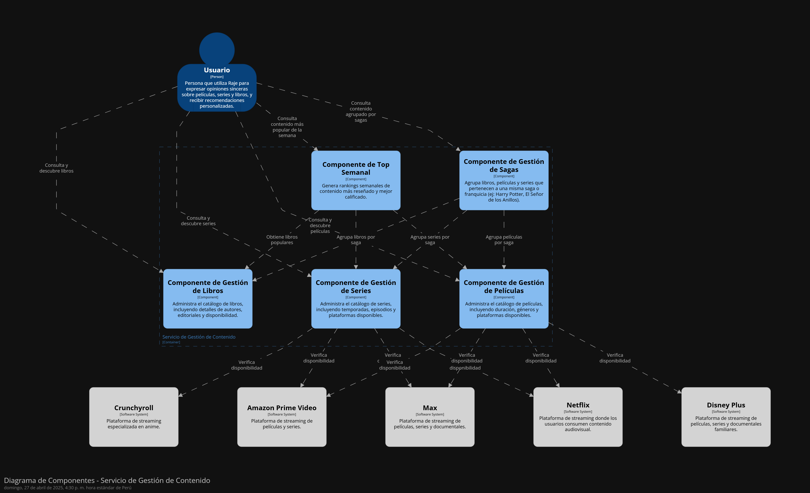
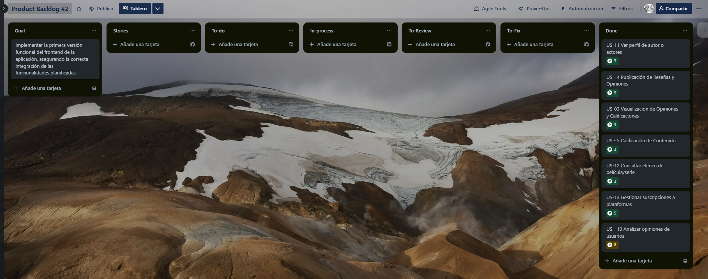
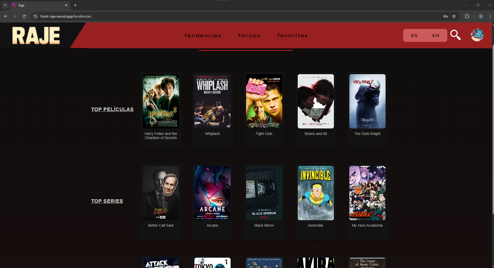

<div align="center">

## Universidad Peruana de Ciencias Aplicadas


#### Nombre del curso: Desarrollo de aplicaciones Open Source

##### Carrera: Ingeniería de Software

##### Nombre del profesor: Hugo Allan Mori Paiva

##### NRC: 4334

#### "Informe de Trabajo Final"

##### Nombre de la Startup: Caleta Innovations

##### Nombre del Producto: Raje

#### Integrantes

Bejarano Martínez Alvaro Leandro U202311640<br>
Cabanillas Meza Jose Mateo U202311458<br>
Aliaga Urbina Wilder Gonzalo U202222001<br>
Sarmiento Medina Loreley U202310005<br>

# *Julio de 2025*

</div>

## Registro de Versiones del Informe

<table>
  <thead>
    <tr>
      <th>Versión</th>
      <th>Fecha</th>
      <th>Autor</th>
      <th>Descripción de modificación</th>
    </tr>
  </thead>
  <tbody>
    <tr>
      <td>TB1</td>
      <td>27/04/2025</td>
      <td>- Bejarano Martínez, Álvaro Leandro
- Cabanillas Meza, José Mateo
- Verona Flores Italo Sebastian
        -Aliaga Urbina Wilder Gonzalo
- Sarmiento Medina, Loreley</td>
      <td>Se realizó un trabajo integral desde la investigación inicial hasta el diseño del producto RAJE Incluyó entrevistas, análisis de usuarios, construcción de user personas, journey maps, mapas de empatía, Lean UX Canvas, wireframes, mockups y diagramas de arquitectura, consolidando así la base estratégica y visual del proyecto.</td>
    </tr>
    <tr>
      <td>TP</td>
      <td>16/05/2025</td>
      <td>- Bejarano Martínez, Álvaro Leandro
- Cabanillas Meza, José Mateo
- Verona Flores Italo Sebastian
        -Aliaga Urbina Wilder Gonzalo
- Sarmiento Medina, Loreley</td>
      <td>Mejoramos los wireframes para desarrollar la primera versión de la aplicación web. Actualizamos el reporte con los avances y trabajamos en el desarrollo de la aplicación. Además, elaboramos el capítulo 5 y actualizamos nuevamente el reporte.</td>
    </tr>
    <tr>
      <td>TB2</td>
      <td>22/06/2025</td>
      <td>- Bejarano Martínez, Álvaro Leandro
- Cabanillas Meza, José Mateo
-Aliaga Urbina Wilder Gonzalo
- Sarmiento Medina, Loreley</td>
      <td>Para esta entrega se implementaron funcionalidades clave como favoritos, registro, 
validaciones en frontend. Se desplegó una nueva versión de la landing page y
aplicación web. Se documentaron evidencias técnicas (commits, ejecución), 
se elaboraron conclusiones, se actualizó el Student Outcome, 
y se completó el Registro de Entrevistas y Evaluación heurística.</td>
    </tr>
    <tr>
      <td>TF</td>
      <td>11/07/2025</td>
      <td>- Bejarano Martínez, Álvaro Leandro
- Cabanillas Meza, José Mateo
-Aliaga Urbina Wilder Gonzalo
- Sarmiento Medina, Loreley</td>
      <td>Desarrollamos funcionalidades que permitan a usuarios y propietarios gestionar catálogos de contenido y listas 
      personalizadas, visualizar estadísticas relevantes, y administrar ubicaciones físicas de librerías, 
        mejorando así la experiencia de exploración, control y análisis dentro de la plataforma RAJE. Tambien se realizo el backend de la app, de tal manera que puedan trabajar frontend y backend en simultaneo</td>
    </tr>
  </tbody>
</table>


<div align="center">

## Universidad Peruana de Ciencias Aplicadas


#### Nombre del curso: Desarrollo de aplicaciones Open Source

##### Carrera: Ingeniería de Software

##### Nombre del profesor: Hugo Allan Mori Paiva

##### NRC: 4334

#### "Informe de Trabajo Final"

##### Nombre de la Startup: Caleta Innovations

##### Nombre del Producto: Raje

#### Integrantes

Bejarano Martínez Alvaro Leandro U202311640<br>
Cabanillas Meza Jose Mateo U202311458<br>
Aliaga Urbina Wilder Gonzalo U202222001<br>
Sarmiento Medina Loreley U202310005<br>

# *Julio de 2025*

</div>

## Registro de Versiones del Informe

<table>
  <thead>
    <tr>
      <th>Versión</th>
      <th>Fecha</th>
      <th>Autor</th>
      <th>Descripción de modificación</th>
    </tr>
  </thead>
  <tbody>
    <tr>
      <td>TB1</td>
      <td>27/04/2025</td>
      <td>- Bejarano Martínez, Álvaro Leandro
- Cabanillas Meza, José Mateo
- Verona Flores Italo Sebastian
        -Aliaga Urbina Wilder Gonzalo
- Sarmiento Medina, Loreley</td>
      <td>Se realizó un trabajo integral desde la investigación inicial hasta el diseño del producto RAJE Incluyó entrevistas, análisis de usuarios, construcción de user personas, journey maps, mapas de empatía, Lean UX Canvas, wireframes, mockups y diagramas de arquitectura, consolidando así la base estratégica y visual del proyecto.</td>
    </tr>
    <tr>
      <td>TP</td>
      <td>16/05/2025</td>
      <td>- Bejarano Martínez, Álvaro Leandro
- Cabanillas Meza, José Mateo
- Verona Flores Italo Sebastian
        -Aliaga Urbina Wilder Gonzalo
- Sarmiento Medina, Loreley</td>
      <td>Mejoramos los wireframes para desarrollar la primera versión de la aplicación web. Actualizamos el reporte con los avances y trabajamos en el desarrollo de la aplicación. Además, elaboramos el capítulo 5 y actualizamos nuevamente el reporte.</td>
    </tr>
    <tr>
      <td>TB2</td>
      <td>22/06/2025</td>
      <td>- Bejarano Martínez, Álvaro Leandro
- Cabanillas Meza, José Mateo
-Aliaga Urbina Wilder Gonzalo
- Sarmiento Medina, Loreley</td>
      <td>Para esta entrega se implementaron funcionalidades clave como favoritos, registro, 
validaciones en frontend. Se desplegó una nueva versión de la landing page y
aplicación web. Se documentaron evidencias técnicas (commits, ejecución), 
se elaboraron conclusiones, se actualizó el Student Outcome, 
y se completó el Registro de Entrevistas y Evaluación heurística.</td>
    </tr>
    <tr>
      <td>TF</td>
      <td>11/07/2025</td>
      <td>- Bejarano Martínez, Álvaro Leandro
- Cabanillas Meza, José Mateo
-Aliaga Urbina Wilder Gonzalo
- Sarmiento Medina, Loreley</td>
      <td>Desarrollamos funcionalidades que permitan a usuarios y propietarios gestionar catálogos de contenido y listas 
      personalizadas, visualizar estadísticas relevantes, y administrar ubicaciones físicas de librerías, 
        mejorando así la experiencia de exploración, control y análisis dentro de la plataforma RAJE.</td>
    </tr>
  </tbody>
</table>

## Project Report Collaboration Insights
- **URL de la organización del proyecto:**  
  [https://github.com/Raje-OS]`https://github.com/Raje-OS`


- **URL del repositorio del informe del proyecto:**  
  [https://github.com/Raje-OS/Raje-repository]`https://github.com/Raje-OS/Raje-repository`
- 


- **URL del repositorio del landing page del proyecto:**  
  [https://github.com/Raje-OS/RAJELandingPage]`https://github.com/Raje-OS/RAJELandingPage`

  

- **URL del repositorio del frontend del proyecto:**  
  [https://github.com/Raje-OS/FrontEnd]`https://github.com/Raje-OS/FrontEnd`


- **URL del repositorio del backend del proyecto:**  
  [https://github.com/Raje-OS/Backend]`https://github.com/Raje-OS/Backend`


## Contents

- [Capítulo I: Introducción](#capítulo-i-introducción)
  - [1.1. Startup Profile](#11-startup-profile)
    - [1.1.1. Descripción de la Startup](#111-descripción-de-la-startup)
    - [1.1.2. Perfiles de integrantes del equipo](#112-perfiles-de-integrantes-del-equipo)
  - [1.2. Solution Profile](#12-solution-profile)
    - [1.2.1. Antecedentes y problemática](#121-antecedentes-y-problemática)
    - [1.2.2. Lean UX Process](#122-lean-ux-process)
      - [1.2.2.1. Lean UX Problem Statements](#1221-lean-ux-problem-statements)
      - [1.2.2.2. Lean UX Assumptions](#1222-lean-ux-assumptions)
      - [1.2.2.3. Lean UX Hypothesis Statements](#1223-lean-ux-hypothesis-statements)
      - [1.2.2.4. Lean UX Canvas](#1224-lean-ux-canvas)
  - [1.3. Segmentos objetivo](#13-segmentos-objetivo)

- [Capítulo II: Requirements Elicitation & Analysis](#capítulo-ii-requirements-elicitation--analysis)
  - [2.1. Competidores](#21-competidores)
    - [2.1.1. Análisis competitivo](#211-análisis-competitivo)
    - [2.1.2. Estrategias y tácticas frente a competidores](#212-estrategias-y-tácticas-frente-a-competidores)
  - [2.2. Entrevistas](#22-entrevistas)
    - [2.2.1. Diseño de entrevistas](#221-diseño-de-entrevistas)
    - [2.2.2. Registro de entrevistas](#222-registro-de-entrevistas)
    - [2.2.3. Análisis de entrevistas](#223-análisis-de-entrevistas)
  - [2.3. Needfinding](#23-needfinding)
    - [2.3.1. User Personas](#231-user-personas)
    - [2.3.2. User Task Matrix](#232-user-task-matrix)
    - [2.3.3. User Journey Mapping](#233-user-journey-mapping)
    - [2.3.4. Empathy Mapping](#234-empathy-mapping)
    - [2.3.5. As-is Scenario Mapping](#235-as-is-scenario-mapping)
  - [2.4. Ubiquitous Language](#24-ubiquitous-language)

- [Capítulo III: Requirements Specification](#capítulo-iii-requirements-specification)
  - [3.1. To-Be Scenario Mapping](#31-to-be-scenario-mapping)
  - [3.2. User Stories](#32-user-stories)
  - [3.3. Impact Mapping](#33-impact-mapping)
  - [3.4. Product Backlog](#34-product-backlog)

- [Capítulo IV: Product Design](#capítulo-iv-product-design)
  - [4.1. Style Guidelines](#41-style-guidelines)
    - [4.1.1. General Style Guidelines](#411-general-style-guidelines)
    - [4.1.2. Web Style Guidelines](#412-web-style-guidelines)
  - [4.2. Information Architecture](#42-information-architecture)
    - [4.2.1. Organization Systems](#421-organization-systems)
    - [4.2.2. Labeling Systems](#422-labeling-systems)
    - [4.2.3. SEO Tags and Meta Tags](#423-seo-tags-and-meta-tags)
    - [4.2.4. Searching Systems](#424-searching-systems)
    - [4.2.5. Navigation Systems](#425-navigation-systems)
  - [4.3. Landing Page UI Design](#43-landing-page-ui-design)
    - [4.3.1. Landing Page Wireframe](#431-landing-page-wireframe)
    - [4.3.2. Landing Page Mock-up](#432-landing-page-mock-up)
  - [4.4. Web Applications UX/UI Design](#44-web-applications-uxui-design)
    - [4.4.1. Web Applications Wireframes](#441-web-applications-wireframes)
    - [4.4.2. Web Applications Wireflow Diagrams](#442-web-applications-wireflow-diagrams)
    - [4.4.3. Web Applications Mock-ups](#443-web-applications-mock-ups)
    - [4.4.4. Web Applications User Flow Diagrams](#444-web-applications-user-flow-diagrams)
  - [4.5. Web Applications Prototyping](#45-web-applications-prototyping)
  - [4.6. Domain-Driven Software Architecture](#46-domain-driven-software-architecture)
    - [4.6.1. Software Architecture Context Diagram](#461-software-architecture-context-diagram)
    - [4.6.2. Software Architecture Container Diagrams](#462-software-architecture-container-diagrams)
    - [4.6.3. Software Architecture Components Diagrams](#463-software-architecture-components-diagrams)
  - [4.7. Software Object-Oriented Design](#47-software-object-oriented-design)
    - [4.7.1. Class Diagrams](#471-class-diagrams)
    - [4.7.2. Class Dictionary](#472-class-dictionary)
  - [4.8. Database Design](#48-database-design)
    - [4.8.1. Database Diagram](#481-database-diagram)

- [Capítulo V: Product Implementation, Validation & Deployment](#capítulo-v-product-implementation-validation--deployment)
  - [5.1. Software Configuration Management](#51-software-configuration-management)
    - [5.1.1. Software Development Environment Configuration](#511-software-development-environment-configuration)
    - [5.1.2. Source Code Management](#512-source-code-management)
    - [5.1.3. Source Code Style Guide & Conventions](#513-source-code-style-guide--conventions)
    - [5.1.4. Software Deployment Configuration](#514-software-deployment-configuration)
  - [5.2. Landing Page, Services & Applications Implementation](#52-landing-page-services--applications-implementation)
    - [5.2.1. Sprint 1](#521-sprint-1)
      - [5.2.1.1. Sprint Planning 1](#5211-sprint-planning-1)
      - [5.2.1.2. Aspect Leaders and Collaborators](#5212-aspect-leaders-and-collaborators)
      - [5.2.1.3. Sprint Backlog 1](#5213-sprint-backlog-1)
      - [5.2.1.4. Development Evidence for Sprint Review](#5214-development-evidence-for-sprint-review)
      - [5.2.1.5. Execution Evidence for Sprint Review](#5215-execution-evidence-for-sprint-review)
      - [5.2.1.6. Services Documentation Evidence for Sprint Review](#5216-services-documentation-evidence-for-sprint-review)
      - [5.2.1.7. Software Deployment Evidence for Sprint Review](#5217-software-deployment-evidence-for-sprint-review)
      - [5.2.1.8. Team Collaboration Insights during Sprint](#5218-team-collaboration-insights-during-sprint)
    - [5.2.2. Sprint 2](#522-sprint-2)
      - [5.2.2.1. Sprint Planning 1](#5221-sprint-planning-1)
      - [5.2.2.2. Aspect Leaders and Collaborators](#5222-aspect-leaders-and-collaborators)
      - [5.2.2.3. Sprint Backlog 1](#5223-sprint-backlog-1)
      - [5.2.2.4. Development Evidence for Sprint Review](#5224-development-evidence-for-sprint-review)
      - [5.2.2.5. Execution Evidence for Sprint Review](#5225-execution-evidence-for-sprint-review)
      - [5.2.2.6. Services Documentation Evidence for Sprint Review](#5226-services-documentation-evidence-for-sprint-review)
      - [5.2.2.7. Software Deployment Evidence for Sprint Review](#5227-software-deployment-evidence-for-sprint-review)
      - [5.2.2.8. Team Collaboration Insights during Sprint](#5228-team-collaboration-insights-during-sprint)
     - [5.2.3. Sprint 3](#523-sprint-3)
       - [5.2.3.1. Sprint Planning 1](#5231-sprint-planning-1)
       - [5.2.3.2. Aspect Leaders and Collaborators](#5232-aspect-leaders-and-collaborators)
       - [5.2.3.3. Sprint Backlog 1](#5233-sprint-backlog-1)
       - [5.2.3.4. Development Evidence for Sprint Review](#5234-development-evidence-for-sprint-review)
       - [5.2.3.5. Execution Evidence for Sprint Review](#5235-execution-evidence-for-sprint-review)
       - [5.2.3.6. Services Documentation Evidence for Sprint Review](#5236-services-documentation-evidence-for-sprint-review)
       - [5.2.3.7. Software Deployment Evidence for Sprint Review](#5237-software-deployment-evidence-for-sprint-review)
       - [5.2.3.8. Team Collaboration Insights during Sprint](#5238-team-collaboration-insights-during-sprint)
     - [5.2.4. Sprint 4](#523-sprint-4)
       - [5.2.4.1. Sprint Planning 4](#5231-sprint-planning-4)
       - [5.2.4.2. Aspect Leaders and Collaborators](#5232-aspect-leaders-and-collaborators)
       - [5.2.4.3. Sprint Backlog 4](#5233-sprint-backlog-4)
       - [5.2.4.4. Development Evidence for Sprint Review](#5234-development-evidence-for-sprint-review)
       - [5.2.4.5. Execution Evidence for Sprint Review](#5235-execution-evidence-for-sprint-review)
       - [5.2.4.6. Services Documentation Evidence for Sprint Review](#5236-services-documentation-evidence-for-sprint-review)
       - [5.2.4.7. Software Deployment Evidence for Sprint Review](#5237-software-deployment-evidence-for-sprint-review)
       - [5.2.4.8. Team Collaboration Insights during Sprint](#5238-team-collaboration-insights-during-sprint)
- [Conclusiones](#conclusiones)
- [Bibliografía](#bibliografía)
- [Anexos](#anexos)

## Student Outcome

ABET – EAC – Student Outcome 3: Habilidad para comunicarse de manera efectiva ante diversas audiencias.  
A continuación, se presenta un cuadro donde se detallan las actividades realizadas y las conclusiones alcanzadas por el equipo, evidenciando el cumplimiento de este resultado de aprendizaje.


| Criterio específico | Acciones realizadas                                                                                                                                                                                                                                                                                                                                                                                                                                                                                                                                                                                                                                                                                                                                                                                                                                                                                                                 | Conclusiones |
|:--------------------|:------------------------------------------------------------------------------------------------------------------------------------------------------------------------------------------------------------------------------------------------------------------------------------------------------------------------------------------------------------------------------------------------------------------------------------------------------------------------------------------------------------------------------------------------------------------------------------------------------------------------------------------------------------------------------------------------------------------------------------------------------------------------------------------------------------------------------------------------------------------------------------------------------------------------------------|:-------------|
| **Comunica oralmente con efectividad a diferentes rangos de audiencia** | Cabanillas MezaJose Mateo:<br/> TB1: Expuso la creación de cuenta. <br/>TP: Presentó funcionalidades en comunidad y creación de cuenta. <br/>TB2: Presentó publicación, edición y eliminación de reseñas y listas personalizadas.<br/>TF: Explicó funcionalidades de análisis, búsqueda y gestión de reseñas, libros, películas y series.<br/> <br/> Verona Flores Italo Sebastian: <br/>TB1: Expuso inicio de sesión. <br/>TP: Presentó comunidad y cierre de sesión. <br/>TB2: Explicó gestión de suscripciones y cierre de sesión. <br/><br/>Aliaga Urbina Wilder Gonzalo: <br/>TB1: Explicó visualización de opiniones y calificaciones. <br/>TP: Expuso perfil de actores/autores. <br/>TB2: Mostró favoritos, listas personalizadas y agregado de contenido. <br/>TF: Expuso integración de funcionalidades de listas, puntuaciones, ubicación, actores, plataformas y reseñas.<br/><br/>Sarmiento Medina Loreley: <br/>TB1: Expuso sección de inicio. <br/>TP: Explicó cierre de sesión y navegación. <br/>TB2: Presentó calificación, edición de perfil y creación de listas.<br/>TF: Explicó funcionalidades sobre obtención, actualización y eliminación de reseñas, libros y series.<br/><br/> Bejarano Martínez Alvaro Leandro: <br/>TB1: Expuso sección de contenido. <br/>TP: Presentó plataformas de contenido. <br/>TB2: Explicó visualización de plataformas de streaming.<br/>TF: Mostró integración de contenido y funcionalidades relacionadas a catálogos, directores, y creación de reseñas. | Estas presentaciones fortalecieron nuestra capacidad para explicar decisiones técnicas con claridad, mejorando nuestra comunicación con docentes y compañeros, así como nuestra capacidad de recibir y aplicar retroalimentación. |
| **Comunica por escrito con efectividad a diferentes rangos de audiencia** | Cabanillas Meza Jose Mateo: <br/>TB1: Documentó creación de cuenta. <br/>TP: Redactó comunidad y cierre de sesión.<br/> TB2: Registró avances de reseñas, listas y commits.<br/>TF: Documentó tareas sobre autores, reseñas, búsqueda por ID, libros y películas.<br/><br/> Verona Flores Italo Sebastian:<br/> TB1: Redactó inicio de sesión.<br/> TP: Documentó suscripciones y cierre de sesión. <br/>TB2: Colaboró en funcionalidades y sección de suscripciones.<br/><br/> Aliaga Urbina Wilder Gonzalo:<br/> TB1: Documentó visualización de opiniones. <br/>TP: Redactó perfil de actores. <br/>TB2: Registró favoritos, listas, y colaboró en Student Outcome y versiones.<br/>TF: Documentó integración de funcionalidades de actores, plataformas, ubicaciones y series; colaboró en redacción de conclusiones del equipo. <br/><br/>Sarmiento Medina Loreley: <br/>TB1: Documentó sección de inicio. <br/>TP: Redactó sobre cierre de sesión y navegación. <br/>TB2: Escribió sobre calificación, perfil y listas. <br/>TF: Documentó funcionalidades de reseñas, series y autores, además del seguimiento en Trello.<br/><br/>Bejarano Martínez Alvaro Leandro: <br/>TB1: Documentó sección contenido. <br/>TP: Redactó plataformas de streaming. <br/>TB2: Documentó visualización de plataformas y Student Outcome.<br/>TF: Redactó funcionalidades de reseñas, directores, catálogos, y colaboró en secciones del informe final.                                                                | Esta documentación mejoró nuestra organización como equipo, facilitó la claridad en los aportes individuales y dejó evidencia estructurada del desarrollo técnico para revisión académica y mejora continua. |


# Capítulo I: Introducción

## 1.1. Startup Profile

### 1.1.1. Descripción de la Startup*
*
Caleta Innovations es una startup enfocada en revolucionar la forma en que las personas expresan sus opiniones y acceden
a contenido literario y audiovisual. En Caleta Innovations, valoramos la libertad de expresión y creemos en la
importancia de que cada voz sea escuchada sin filtros. Nos dedicamos a ofrecer soluciones innovadoras que permitan a
nuestros usuarios explorar una amplia variedad de contenido, mientras se sienten libres para compartir sus opiniones
auténticas.

Misión: Nuestra misión es empoderar a las personas para que puedan dar sus opiniones de manera sincera y sin censura,
mientras disfrutan de un acceso más amplio y diverso a contenido literario y audiovisual.

Visión: Nos vemos como una empresa líder en la creación de un entorno donde las opiniones auténticas y sin filtros son
el motor de una comunidad vibrante y dinámica. Aspiramos a ser la referencia global para aquellos que buscan compartir
sus perspectivas de manera genuina, enriqueciendo el acceso a contenido diverso y creando un espacio donde cada voz
tiene un impacto real y duradero.

### 1.1.2. Perfiles de integrantes del equipo

<table>
  <thead>
    <tr>
      <th>Integrantes</th>
      <th>Perfil de Integrante</th>
    </tr>
  </thead>
  <tbody>
    <tr>
      <td></td>
      <td> Ingeniería de Software-u202311640
Mi nombre es Alvaro Leandro Bejarano Martínez, estudiante de la carrera Ingeniería de Software y me destaco por mi perseverancia, organización y capacidad para trabajar en equipo. Me esfuerzo por mantener un ambiente estructurado dentro del grupo, donde cada miembro se sienta valorado y sus ideas sean escuchadas y respetadas. Mi compromiso es fomentar la colaboración efectiva, asegurando que cada contribución se integre de manera ordenada y alineada con los objetivos comunes del equipo.</td>
    </tr>
    <tr>
       <td></td>
      <td> Jose Mateo Cabanillas Meza
        - Ingeniería de Software-u202311458 

Mi nombre es Mateo Cabanillas y en la
actualidad estoy cursando el quinto ciclo de
la carrera de ingeniería de software con una
mente creativa y una actitud colaborativa.
Mi amor por la programación y la
resolución de problemas me impulsa a
explorar nuevas soluciones y aportar ideas
frescas a los proyectos. Como compañero de
equipo, soy amable, atento y siempre estoy
dispuesto a ayudar. Creo firmemente en la
importancia de la comunicación efectiva y
la colaboración para lograr resultados
excepcionales. </td>
</tr>
<tr>
<td></td>
<td>
U20221e617 Verona Flores Italo Sebastián

Mi nombre es Italo Verona, tengo 20 años y actualmente curso el 5.º ciclo de la carrera de ingeniería de software en la UPC, una vez terminé la carrera quisiera especializarme en ciberseguridad en el país de España. Luego quisiera vivir en Finlandia. El objetivo de estudiar ciberseguridad es poder reforzar la seguridad informática que hoy en día es muy peligrosa ya sea para las personas o las empresas de todo el mundo.
</td>
</tr>
<tr>
<td></td>
<td>Wilder Gonzalo Aliaga Urbina - U202222001

Como estudiante universitario de 19 años y cursando la carrera de Ingeniería de Software en el sexto ciclo, tengo una sólida base en programación en C++, Python, HTML y CSS, además de habilidades en creatividad y organización grupal. Mi enfoque está en fomentar un ambiente de aprendizaje eficiente y participativo en equipo. Me apasiona encontrar soluciones innovadoras y siempre estoy dispuesto a aprender nuevas tecnologías que potencien mis proyectos.
He trabajado en proyectos colaborativos donde la comunicación y la planificación fueron claves para lograr buenos resultados. Mi objetivo es seguir creciendo profesionalmente mientras contribuyo activamente al desarrollo de iniciativas tecnológicas con impacto positivo.
</td>
</tr>
<tr>
<td></td>
<td>Soy Loreley Sarmiento Medina con código de estudainte U202310005 y estudio la carrera de Ingeniería de Software y me
especializo en aportar soluciones tecnológicas integrales dentro de equipos multidisciplinarios. Cuento con sólidos
conocimientos en el modelado de wireframes y mockups utilizando Figma, lo que me permite contribuir eficazmente en la
etapa de diseño de interfaces centradas en el usuario. Además, tengo experiencia en el modelado de bases de datos,
facilitando la organización y estructura lógica de la información. Poseo conocimientos intermedios en HTML y CSS, lo
cual me permite colaborar en el desarrollo de interfaces web funcionales y visualmente atractivas. También tengo una
base sólida en lenguajes de programación, lo que me permite comprender e implementar soluciones tanto en el frontend
como en el backend, aportando al desarrollo integral del producto</td>
  </tr>
  </tbody>
</table>

## 1.2. Solution Profile

Raje de Caleta Innovations es una plataforma innovadora que permite a los usuarios expresar
sus opiniones de manera auténtica y sin filtros sobre películas, series, libros y más. Inspirada
en la jerga latina "rajar," que significa hablar sin rodeos, Raje ofrece un espacio donde la
libertad de expresión es fundamental. Además, la plataforma les muestra dónde está disponible
el contenido, ya sea en plataformas de streaming o librerías. Los usuarios pueden rankear el
contenido que consumen, dejar opiniones sinceras, y recibir recomendaciones personalizadas.
Además, podrán ver la lista de sus opiniones y calificaciones, así como el contenido que han
consumido, directamente en su perfil. Con un enfoque en la autenticidad, Raje redefine la
manera en que las personas interactúan con el entretenimiento, fomentando una comunidad
dinámica y vibrante donde cada voz cuenta.

### 1.2.1. Antecedentes y problemática

<table>

  <tbody>
    <tr>
      <td> What ( Qué ) </td>
      <td>En el área del entretenimiento digital, los usuarios buscan cada vez más plataformas 
donde puedan descubrir y compartir opiniones sobre películas, series y libros. Sin 
embargo, las opciones disponibles suelen estar limitadas por filtros y políticas de 
moderación que restringen la libertad de expresión y la autenticidad de las opiniones. 
Además, muchas de las aplicaciones disponibles carecen de funcionalidades clave, 
como la ausencia de perfiles y una interfaz para explorar las opiniones de otros usuarios. 
La falta de una aplicación adecuada a opiniones de películas, series y libros limita al 
público a tomar decisiones informadas. Sin un lugar en el que los usuarios expresen y 
lean opiniones auténticas se pierde la diversidad de perspectivas que enriquece la 
experiencia de descubrir nuevo contenido. Por ende, se restringe el acceso a un amplio 
conjunto de opiniones, lo cual afecta la experiencia general de entretenimiento y la 
capacidad de descubrir contenido relevante. </td>
    </tr>
    <tr>
      <td> When ( Cuándo ) </td>
      <td> El problema aparece cuando los usuarios quieren buscar de 
opiniones auténticas sobre películas, series y libros. A menudo, ellos se enfrentan a la 
frustración de encontrar reseñas moderadas en las plataformas existentes. En 
consecuencia, los usuarios no pueden evaluar de manera precisa si un contenido se 
alinea con sus intereses, porque las reseñas disponibles a menudo están influenciadas 
por restricciones. </td>
    </tr>
    <tr>
      <td> Where ( Dónde ) </td>
      <td> Los problemas de la falta de una aplicación que permita opiniones de 
películas, series y libros sin filtros ni censura se aprecia en múltiples lugares, como 
plataformas de streaming, redes sociales, sitios de crítica y reseñas, foros en línea, etc. 
En estas plataformas, las opiniones de los usuarios a menudo están sujetas a moderación 
o políticas que restringen la libre expresión. Esta situación limita el acceso a una 
diversidad de perspectivas que afecta la capacidad de los usuarios para descubrir 
opiniones auténticas. </td>
    </tr>
    <tr>
      <td> Who ( Quién ) </td>
      <td>  Esta problemática afecta a diversos grupos de personas. En primer 
lugar, los espectadores y lectores que buscan opiniones para decidir qué contenido 
consumir se ven limitados por la falta de un espacio que ofrezca críticas genuinas. 
También impacta a críticos independientes o aficionados, quienes no tienen una 
plataforma adecuada para expresar sus opiniones sin temor a la censura. Además, las 
comunidades de nicho con intereses específicos enfrentan dificultades para encontrar y 
compartir opiniones relevantes que se alineen con sus gustos únicos.  </td>
    </tr>
    <tr>
      <td> Why ( Por qué ) </td>
      <td> La causa principal del problema es la falta de espacios que prioricen 
la autenticidad y la libertad de expresión, lo que lleva a una interacción superficial o 
condicionada entre los usuarios y sus comunidades. Las plataformas tradicionales 
pueden estar influenciadas por agendas comerciales, lo que diluye la sinceridad de las 
opiniones compartidas. </td>
    </tr>
     <tr>
      <td> How ( Cómo) </td>
      <td> Utilizando una aplicación que te permite no solo expresar tus opiniones 
sobre contenido audiovisual y literario, sino también leer las críticas de otros usuarios. </td>
    </tr>
     <tr>
      <td> How much ( Cuánto ) </td>
  <td>
     *- Acceso a Internet*
    
Población Mundial: 8,000 millones de personas.
Acceso a Internet: Aproximadamente el 66% de la población mundial tiene acceso a
Internet, lo que representa a unos 5.3 mil millones de personas (ITU Statistics, 2023).


*- Sin Acceso a Internet*

Cerca del 34% de la población mundial, es decir, unos 2.7 mil millones de personas, no
tienen acceso a Internet, limitando su capacidad para expresar opiniones en línea
(Statista, 2023).


*- Restricciones de Libertad de Expresión:*

Población en Países con Restricciones: Según Freedom House, alrededor del 40% de la
población mundial vive en países donde la libertad de expresión es "parcialmente libre"
o "no libre". Esto equivale a aproximadamente 3.2 mil millones de personas que podrían
enfrentar restricciones para compartir sus opiniones libremente en línea (Freedom
House, 2023).

*- Impacto de las Normas Sociales:*

En sociedades con normas culturales estrictas o donde
existe temor al juicio social, una parte de la población puede sentirse incómoda o
temerosa de expresar sus opiniones honestamente. Estimando que esto afecta a un 20%
de las personas con acceso a Internet y libertad de expresión, esto afectaría a alrededor de
1.06 mil millones de personas (World Values Survey y Pew Research Center, n./d.).     

*- Estimación Combinada:*

Personas sin acceso a Internet o con libertad de expresión restringida:
Aproximadamente 3.2 mil millones.
Personas con acceso pero con barreras culturales o sociales: Alrededor de 1.06 mil
millones.
Total estimado de personas que no pueden opinar libremente: Aproximadamente 4.26
mil millones de personas.

*- Estimación Combinada:*

Personas sin acceso a Internet o con libertad de expresión restringida:
Aproximadamente 3.2 mil millones.
Personas con acceso pero con barreras culturales o sociales: Alrededor de 1.06 mil
millones.
Total estimado de personas que no pueden opinar libremente: Aproximadamente 4.26
mil millones de personas.

*-  Interpretación:*

Aproximadamente 4.26 mil millones de personas, o el 53% de la población mundial,
podrían estar limitadas en su capacidad para opinar libremente sobre películas, series o
libros debido a la falta de acceso a Internet, restricciones de libertad de expresión o
barreras culturales. Esto destaca la importancia de crear plataformas accesibles y
seguras que permitan a más personas compartir sus opiniones y participar en
discusiones sobre contenido cultural sin restricciones.

  </td>
    </tr>
  </tbody>
</table>

### 1.2.2. Lean UX Process

#### 1.2.2.1. Lean UX Problem Statements

Hoy en día, millones de personas buscan recomendaciones auténticas sobre libros, películas y series antes de decidir qué
consumir. Sin embargo, las plataformas actuales están llenas de filtros, políticas de moderación o algoritmos que
limitan la libertad de expresión. Esto impide que los usuarios compartan opiniones sinceras y que descubran contenido
relevante basado en experiencias reales.

Además, muchos consumidores se sienten frustrados porque no pueden dejar reseñas completas ni recibir sugerencias
personalizadas que realmente se ajusten a sus gustos. La ausencia de perfiles, historial de reseñas o interacción entre
usuarios reduce la calidad de la experiencia.

Del lado de los creadores o distribuidores de contenido, como dueños de librerías o plataformas de streaming, también
hay una brecha. No cuentan con herramientas para conectar directamente con su audiencia a través de opiniones genuinas,
ni aprovechar esa data para mejorar sus recomendaciones o promociones.

#### 1.2.2.2. Lean UX Assumptions

##### Opiniones auténticas tienen valor

Los usuarios valoran más una opinión real, aunque sea crítica, que una reseña genérica o influenciada por intereses
comerciales. Quieren sentirse parte de una comunidad donde puedan expresarse con libertad y conocer lo que piensan otros
usuarios parecidos a ellos.

##### Simplicidad y personalización en la experiencia

Los usuarios desean una plataforma que les permita explorar contenido fácilmente, con recomendaciones ajustadas a sus
gustos reales. Si tienen un perfil personal donde pueden ver sus opiniones, calificaciones y descubrimientos, se
sentirán más identificados con la plataforma y volverán con más frecuencia.

##### Integración con librerías y plataformas

Dueños de librerías y administradores de plataformas de streaming están interesados en conocer las opiniones reales de
los usuarios. Si pueden acceder a esta información de manera organizada y con análisis útiles, podrán adaptar su oferta
y conectar mejor con sus públicos objetivos.

#### 1.2.2.3. Lean UX Hypothesis Statements

##### Opinión libre y sin censura

Creemos que si brindamos a los usuarios un espacio donde puedan publicar sus opiniones sin censura, se generará un mayor
sentido de pertenencia y autenticidad. Esto podría incrementar en un 20 % el número de reseñas activas por usuario al
mes, medido a través de su historial de participación.

##### Perfil personalizado con historial

Creemos que si cada usuario puede tener un perfil que almacene sus opiniones, calificaciones y el contenido que ha
consumido, se fortalecerá el compromiso con la plataforma. Esto se reflejará en un aumento del 25 % en visitas
recurrentes por usuario, medido por sesiones activas semanales.

##### Valor para negocios y creadores de contenido

Creemos que si los dueños de librerías y plataformas de streaming tienen acceso a análisis de tendencias y opiniones,
podrán adaptar mejor su catálogo y promociones. Esto se medirá por la tasa de participación de estos actores en la
plataforma y el número de colaboraciones activas generadas.

#### 1.2.2.4. Lean UX Canvas


### 1.3. Segmentos objetivos

1. Consumidores de contenido multimedia
   Este segmento incluye a personas apasionadas por películas, libros, series que buscan un
   espacio para compartir opiniones auténticas y recibir recomendaciones personalizadas en Raje.

2. Dueños de Librerías
   Los dueños de librerías pueden conectar con lectores apasionados a través de Raje,
   promocionando sus libros en función de reseñas y calificaciones, y ofreciendo lanzamientos y
   eventos alineados con los intereses de los usuarios.

3. Plataformas de Streaming
   Las plataformas de streaming pueden usar Raje para analizar tendencias, ajustar su catálogo y
   recomendar contenido a usuarios que buscan nuevas películas y series, maximizando la
   visibilidad y engagement de su contenido.

# Capítulo II: Requirements Elicitation & Analysis

## 2.1. Competidores

### 2.1.1. Análisis competitivo

<table>
  <tr>
    <th colspan="1">Competitive Analysis Landscape</th>
  </tr>
  <tr>
    <td>
      <strong>¿Por qué llevar a cabo este análisis?</strong><br>
      Comprender cómo se posiciona Raje frente a competidores actuales en la industria de reseñas de contenido, identificando ventajas competitivas y oportunidades de diferenciación.
    </td>
  </tr>
</table>

<table>
  <thead>
    <tr>
      <th>Aspecto</th>
      <th>Raje</th>
      <th>Letterboxd</th>
      <th>Goodreads</th>
      <th>Taste.io</th>
    </tr>
  </thead>
  <tbody>
    <tr>
      <td colspan="5"><strong>Perfil</strong></td>
    </tr>
    <tr>
      <td>Overview</td>
      <td>Plataforma que permite opinar libremente y sin censura sobre películas, libros y series.</td>
      <td>Red social centrada en reseñas y listas de películas.</td>
      <td>Comunidad centrada en la literatura con reseñas y ratings.</td>
      <td>Motor de recomendación de películas y series con IA.</td>
    </tr>
    <tr>
      <td>Mercado objetivo</td>
      <td>Jóvenes adultos con fuerte opinión cultural; lectores y cinéfilos activos.</td>
      <td>Cinéfilos de todas las edades que desean compartir y explorar críticas.</td>
      <td>Lectores frecuentes y amantes de los libros.</td>
      <td>Espectadores que buscan contenido afín a sus emociones o estados de ánimo.</td>
    </tr>
    <tr>
      <td colspan="5"><strong>Estrategia de marketing</strong></td>
    </tr>
    <tr>
      <td>Estrategias de marketing</td>
      <td>Libertad de expresión, alianzas con librerías y plataformas de streaming.</td>
      <td>Marketing de boca a boca y presencia en festivales de cine.</td>
      <td>Alianzas con editoriales y recomendaciones internas.</td>
      <td>Influencers, enfoque emocional, experiencia personalizada.</td>
    </tr>
    <tr>
      <td colspan="5"><strong>Producto</strong></td>
    </tr>
    <tr>
      <td>Valor ofrecido</td>
      <td>Opiniones sin censura, integración de libros, películas y series.</td>
      <td>Herramientas visuales y comunidad activa.</td>
      <td>Estadísticas de lectura y comunidad de lectores.</td>
      <td>Recomendaciones basadas en emociones y gustos.</td>
    </tr>
    <tr>
      <td>Productos y servicios</td>
      <td>Reseñas libres, rankings, perfiles personalizados, recomendaciones.</td>
      <td>Reseñas, listas, diarios de películas.</td>
      <td>Reseñas, retos de lectura, seguimiento de libros.</td>
      <td>Exploración visual, motor inteligente de recomendaciones.</td>
    </tr>
    <tr>
      <td>Precios y costos</td>
      <td>Gratuito, con posible modelo freemium.</td>
      <td>Gratuito, versión Pro con estadísticas.</td>
      <td>Gratuito.</td>
      <td>Gratuito con monetización por afiliaciones.</td>
    </tr>
    <tr>
      <td>Canales de distribución</td>
      <td>Aplicación móvil y web (en desarrollo).</td>
      <td>Web y app móvil.</td>
      <td>Web y app móvil.</td>
      <td>Web y app móvil.</td>
    </tr>
    <tr>
      <td colspan="5"><strong>Análisis SWOT</strong></td>
    </tr>
    <tr>
      <td>Fortalezas</td>
      <td>Opiniones sin filtros, integración multimedia, perfil personal.</td>
      <td>Comunidad activa, enfoque exclusivo en cine.</td>
      <td>Base de datos amplia, comunidad de lectores.</td>
      <td>IA personalizada, interfaz intuitiva.</td>
    </tr>
    <tr>
      <td>Debilidades</td>
      <td>Base de usuarios nueva, dependencia de alianzas.</td>
      <td>Limitado a cine e Interfaz poco intuitiva</td>
      <td>Interfaz anticuada, baja personalización.</td>
      <td>Sin comunidad visible, funciones limitadas.</td>
    </tr>
    <tr>
      <td>Oportunidades</td>
      <td>Alianzas con librerías y plataformas, adopción por nichos.</td>
      <td>Expandirse a otros formatos como series o libros.</td>
      <td>Integrar multimedia, mejorar experiencia visual.</td>
      <td>Expansión en LATAM, personalización avanzada.</td>
    </tr>
    <tr>
      <td>Amenazas</td>
      <td>Restricciones a la libertad de expresión, competencia consolidada.</td>
      <td>Nuevas apps con más libertad o funciones.</td>
      <td>Pérdida de usuarios por falta de innovación.</td>
      <td>Competencia de algoritmos de plataformas grandes.</td>
    </tr>
  </tbody>
</table>

### 2.1.2. Estrategias y tácticas frente a competidores

<p>
Esta sección presenta las estrategias iniciales de Raje para afrontar el entorno competitivo. Cada estrategia responde a al menos dos factores del análisis FODA (Fortalezas, Oportunidades, Debilidades y Amenazas), con el fin de posicionar a Raje como una plataforma única, atractiva y sostenible frente a sus principales competidores.
</p>

<table>
  <thead>
    <tr>
      <th>Estrategia</th>
      <th>Relación con FODA</th>
      <th>Tácticas específicas</th>
    </tr>
  </thead>
  <tbody>
    <tr>
      <td>Potenciar la experiencia de usuario con una interfaz superior</td>
      <td>Fortalezas (interfaz moderna), Amenazas (competencia consolidada)</td>
      <td>
        - Invertir en diseño UX/UI con enfoque en accesibilidad y velocidad.<br>
        - Probar con usuarios para mantener un diseño más atractivo que Letterboxd o Goodreads.<br>
        - Lanzar campañas comparativas resaltando la fluidez visual y usabilidad de Raje.
      </td>
    </tr>
    <tr>
      <td>Establecer alianzas estratégicas con plataformas de streaming y librerías</td>
      <td>Oportunidades (colaboraciones), Debilidades (poca base de usuarios)</td>
      <td>
        - Contactar librerías y plataformas de nicho para integración de contenido y promociones cruzadas.<br>
        - Crear funciones de "ver ahora" o "comprar el libro" directamente desde Raje.<br>
        - Usar estas alianzas como gancho para atraer nuevos usuarios.
      </td>
    </tr>
    <tr>
      <td>Fomentar la libertad de expresión como diferencial de marca</td>
      <td>Fortalezas (opiniones sin censura), Amenazas (regulaciones)</td>
      <td>
        - Establecer políticas claras de moderación sin censura injustificada.<br>
        - Posicionar a Raje como espacio seguro y libre para opinar sobre contenido cultural.<br>
        - Trabajar en un sistema de reputación comunitaria para balancear libertad con responsabilidad.
      </td>
    </tr>
    <tr>
      <td>Gamificar la participación para activar la comunidad</td>
      <td>Debilidades (poca base activa), Oportunidades (nicho que valora lo auténtico)</td>
      <td>
        - Crear sistemas de puntos, logros y recompensas para reseñadores frecuentes.<br>
        - Promover retos mensuales de reseñas.<br>
        - Integrar rankings locales y globales de actividad.
      </td>
    </tr>
    <tr>
      <td>Diferenciarse con una experiencia de contenido unificada (libros, películas y series)</td>
      <td>Fortalezas (multiformato), Debilidades (nueva plataforma)</td>
      <td>
        - Ofrecer exploración cruzada entre libros, series y películas.<br>
        - Implementar perfiles temáticos personalizados por tipo de contenido.<br>
        - Promover a Raje como la única app que centraliza toda tu vida cultural.
      </td>
    </tr>
    <tr>
      <td>Expandirse primero en nichos culturales activos</td>
      <td>Oportunidades (nicho cultural), Amenazas (plataformas masivas)</td>
      <td>
        - Realizar activaciones en eventos culturales con códigos de acceso exclusivo.<br>
        - Crear embajadores de Raje en comunidades culturales.<br>
        - Lanzar campañas específicas para cinéfilos y lectores intensivos.
      </td>
    </tr>
  </tbody>
</table>

## 2.2. Entrevistas

### 2.2.1. Diseño de entrevistas

-Preguntas para consumidores de contenido multimedia

1. ¿A menudo disfrutas de alguna serie,película o libro?
2. ¿Qué criterios utilizas al elegir qué contenido consumir?
3. ¿Sueles leer opiniones o reseñas antes de ver una película, serie o leer un libro?
4. ¿Cómo descubres nuevas películas, series o libros?
5. ¿Con qué frecuencia dejas opiniones o reseñas sobre el contenido que consumes? Si es
   así, ¿qué te motiva a hacerlo?
6. ¿Usualmente usas plataformas para dejar reseñas o donde sueles dejar tu opinión?
7. ¿Qué importancia le das a las opiniones de otros usuarios antes de elegir qué contenido
   consumir?
8. ¿Te gustaría que las recomendaciones de películas, series o libros se ajusten más a tus
   gustos? Si es asi, como?
9. ¿Qué aspectos no te han convencido o crees que deberían mejorarse en una plataforma
   que permite hacer reseñas sobre contenido?

-Preguntas para Dueños de Librerías

1. ¿Cómo promocionas actualmente los libros en tu librería?
2. ¿Cómo suelen descubrir los clientes tu librería?
3. ¿Te gustaría que existiera una plataforma donde los lectores descubran libros mediante
   reseñas de otros usuarios y como beneficiaria a tu negocio?
4. ¿Cree que las reseñas de libros influyen en la decisión de compra de los clientes? Si es
   así ¿De qué manera?
5. ¿Sueles recibir comentarios o recomendaciones de tus clientes? ¿Qué haces con esa
   información?
6. Si pudieras conectar tu librería con una plataforma donde las personas descubren libros
   según sus intereses, ¿cómo te gustaría que fuera esa colaboración?

-Preguntas para Plataformas de Streaming

1. ¿Cómo deciden qué series o películas promocionar?
2. ¿Qué aspectos consideran más importantes y útiles al promocionar una serie o película?
3. ¿Cómo sueles enterarte de lo que más disfrutan los usuarios en tu plataforma?
4. ¿Crees que obtener los datos de una aplicación, donde los usuarios dejen reseñas y
   reciban recomendaciones personalizadas, beneficiaría a tu plataforma?
5. ¿Cómo quisieras que los usuarios reciban sugerencias en la aplicación sobre el
   contenido de tu plataforma?
6. ¿Cómo crees que los comentarios de los usuarios podrían ayudarte a mejorar el
   contenido que ofreces?
7. ¿Cómo te gustaría que fuera una colaboración con una plataforma que permita a los
   usuarios encontrar nuevas películas y series según sus intereses?

### 2.2.2 Registro de entrevista

Consumidores de Contenido Multimedia

-Andres Jonathan Santos Espinoza ¡


Link de la entrevista:

<a href="https://upcedupe-my.sharepoint.com/:v:/g/personal/u202311640_upc_edu_pe/EX4KkBl_vfRCuW2NP1HL_9gBpUpL5q9Uc3l4KLgKpWcdzw?e=fW5QGa&nav=eyJyZWZlcnJhbEluZm8iOnsicmVmZXJyYWxBcHAiOiJTdHJlYW1XZWJBcHAiLCJyZWZlcnJhbFZpZXciOiJTaGFyZURpYWxvZy1MaW5rIiwicmVmZXJyYWxBcHBQbGF0Zm9ybSI6IldlYiIsInJlZmVycmFsTW9kZSI6InZpZXcifX0%3D" target="_blank">`https://upcedupe-my.sharepoint.com/:v:/g/personal/u202311640_upc_edu_pe/EX4KkBl_vfRCuW2NP1HL_9gBpUpL5q9Uc3l4KLgKpWcdzw?e=fW5QGa&nav=eyJyZWZlcnJhbEluZm8iOnsicmVmZXJyYWxBcHAiOiJTdHJlYW1XZWJBcHAiLCJyZWZlcnJhbFZpZXciOiJTaGFyZURpYWxvZy1MaW5rIiwicmVmZXJyYWxBcHBQbGF0Zm9ybSI6IldlYiIsInJlZmVycmFsTW9kZSI6InZpZXcifX0%3D`</a></td>


Transcripción resumen de entrevista:

En la entrevista, Andrés, estudiante de comunicaciones en la Universidad de Lima, se muestra como un consumidor
cuidadoso y con preferencias marcadas, especialmente por las películas. Suele apoyarse en reseñas y recomendaciones de
su entorno o de redes sociales como TikTok para decidir qué ver o leer. Destaca que, aunque toma en cuenta la opinión de
otros, cuando deja sus propias reseñas lo hace desde su experiencia personal. También señala su incomodidad con la
censura en los comentarios de algunas plataformas y plantea que le gustaría recibir sugerencias de contenido más
personalizadas según sus gustos. Su visión encaja muy bien con la propuesta de RAJE, que busca ser un espacio abierto
donde los usuarios puedan expresarse libremente y descubrir contenido afín a sus intereses.

-Mathias Medina Posito


Link de la entrevista:

<a href="https://upcedupe-my.sharepoint.com/:v:/g/personal/u202311640_upc_edu_pe/EfVJe4L2MB1Ik3WVHxxnxHMBsN10nr-yrkW0qU8iQ7TFMg?e=t97eTS&nav=eyJyZWZlcnJhbEluZm8iOnsicmVmZXJyYWxBcHAiOiJTdHJlYW1XZWJBcHAiLCJyZWZlcnJhbFZpZXciOiJTaGFyZURpYWxvZy1MaW5rIiwicmVmZXJyYWxBcHBQbGF0Zm9ybSI6IldlYiIsInJlZmVycmFsTW9kZSI6InZpZXcifX0%3D" target="_blank">`https://upcedupe-my.sharepoint.com/:v:/g/personal/u202311640_upc_edu_pe/EfVJe4L2MB1Ik3WVHxxnxHMBsN10nr-yrkW0qU8iQ7TFMg?e=t97eTS&nav=eyJyZWZlcnJhbEluZm8iOnsicmVmZXJyYWxBcHAiOiJTdHJlYW1XZWJBcHAiLCJyZWZlcnJhbFZpZXciOiJTaGFyZURpYWxvZy1MaW5rIiwicmVmZXJyYWxBcHBQbGF0Zm9ybSI6IldlYiIsInJlZmVycmFsTW9kZSI6InZpZXcifX0%3D`</a></td>


Transcripción resumen de entrevista:

En la entrevista, Matías Medina, consumidor habitual de cómics, explica que elige el contenido principalmente basado en sus gustos personales, priorizando el género antes que el autor. Aunque no suele leer opiniones antes de consumir contenido, sí revisa comentarios mientras avanza en la lectura, los cuales pueden influir en su percepción de la obra. Matías descubre nuevo contenido a través de recomendaciones automatizadas basadas en sus gustos y rara vez deja reseñas, haciéndolo solo cuando una obra le genera emociones intensas. Actualmente utiliza la propia plataforma donde lee cómics para dejar opiniones, aunque reconoce que no tiene otro espacio para hacerlo. Le gustaría que las recomendaciones fueran más precisas, ya que a veces el género declarado no coincide con el contenido real de la obra. Además, señala como área de mejora que las plataformas deberían verificar mejor las reseñas para evitar comentarios falsos o malintencionados que puedan desinformar a otros usuarios.

-Albino Alberto Cáseres Lizarbe


Link de la entrevista:

<a href="https://upcedupe-my.sharepoint.com/:v:/g/personal/u202311640_upc_edu_pe/EZLDi8mX6mhKlgdz9it-4VcB8b_Plm-0xPkVU7pRG_Esow?e=i2QMvz&nav=eyJyZWZlcnJhbEluZm8iOnsicmVmZXJyYWxBcHAiOiJTdHJlYW1XZWJBcHAiLCJyZWZlcnJhbFZpZXciOiJTaGFyZURpYWxvZy1MaW5rIiwicmVmZXJyYWxBcHBQbGF0Zm9ybSI6IldlYiIsInJlZmVycmFsTW9kZSI6InZpZXcifX0%3D" target="_blank">`https://upcedupe-my.sharepoint.com/:v:/g/personal/u202311640_upc_edu_pe/EZLDi8mX6mhKlgdz9it-4VcB8b_Plm-0xPkVU7pRG_Esow?e=i2QMvz&nav=eyJyZWZlcnJhbEluZm8iOnsicmVmZXJyYWxBcHAiOiJTdHJlYW1XZWJBcHAiLCJyZWZlcnJhbFZpZXciOiJTaGFyZURpYWxvZy1MaW5rIiwicmVmZXJyYWxBcHBQbGF0Zm9ybSI6IldlYiIsInJlZmVycmFsTW9kZSI6InZpZXcifX0%3D`</a></td>

Transcripción resumen de entrevista:

En la entrevista, Alvino Cáceres, estudiante de Ingeniería de Software, comenta que consume principalmente animes y series de drama que generen expectativa desde el primer capítulo. Descubre nuevo contenido mayormente a través de TikTok y redes sociales, dejando atrás las recomendaciones de amigos. No suele dejar reseñas, salvo cuando el contenido es muy malo, y cuando opina lo hace en redes sociales, no en plataformas formales. Aunque antes consideraba mucho las críticas de usuarios y expertos, una mala experiencia le llevó a confiar más en su propio criterio. Le gustaría que las recomendaciones de contenido se adaptaran mejor a sus gustos personales y sugiere que las plataformas deberían verificar mejor la autenticidad de las reseñas para evitar comentarios falsos o generados por bots.

Dueños de Librerías

-Jorge Manuel Linares Zegarra


Link de la entrevista:

<a href="https://upcedupe-my.sharepoint.com/:v:/g/personal/u202311640_upc_edu_pe/EU6UCxmBit1Ih9XKPD_p3w8BRh7k5tq5iE0DmcTKHohLFw?e=2WH8BR&nav=eyJyZWZlcnJhbEluZm8iOnsicmVmZXJyYWxBcHAiOiJTdHJlYW1XZWJBcHAiLCJyZWZlcnJhbFZpZXciOiJTaGFyZURpYWxvZy1MaW5rIiwicmVmZXJyYWxBcHBQbGF0Zm9ybSI6IldlYiIsInJlZmVycmFsTW9kZSI6InZpZXcifX0%3D" target="_blank">`https://upcedupe-my.sharepoint.com/:v:/g/personal/u202311640_upc_edu_pe/EU6UCxmBit1Ih9XKPD_p3w8BRh7k5tq5iE0DmcTKHohLFw?e=2WH8BR&nav=eyJyZWZlcnJhbEluZm8iOnsicmVmZXJyYWxBcHAiOiJTdHJlYW1XZWJBcHAiLCJyZWZlcnJhbFZpZXciOiJTaGFyZURpYWxvZy1MaW5rIiwicmVmZXJyYWxBcHBQbGF0Zm9ybSI6IldlYiIsInJlZmVycmFsTW9kZSI6InZpZXcifX0%3D`</a></td>

Transcripción resumen de entrevista:

En la entrevista, Jorge Linares, dueño de una librería en San Miguel, comenta que actualmente promociona sus libros principalmente mediante redes sociales como Facebook e Instagram, además del boca a boca dentro de la tienda. Señala que la mayoría de sus clientes descubren la librería por estos medios. Jorge considera que una plataforma donde los lectores compartan reseñas sería muy beneficiosa, ya que permitiría que más personas conozcan los libros a partir de opiniones reales, lo cual incrementaría la confianza y las ventas. También menciona que suelen recibir comentarios de los clientes y que usan esa información para ajustar y mejorar su oferta de libros. Finalmente, sugiere que una colaboración ideal con una plataforma incluiría destacar libros recomendados, mostrar la disponibilidad en tiempo real y organizar eventos basados en los intereses de los lectores.

-Diego Rodrigo Zapata Nuñes 


Link de la entrevista:

<a href="https://upcedupe-my.sharepoint.com/:v:/g/personal/u202311640_upc_edu_pe/EaShS2nRrR9Fi3eDGshxE90BIA7TGMSK8JjLQ7hU4E-TXA?e=XJRIdp&nav=eyJyZWZlcnJhbEluZm8iOnsicmVmZXJyYWxBcHAiOiJTdHJlYW1XZWJBcHAiLCJyZWZlcnJhbFZpZXciOiJTaGFyZURpYWxvZy1MaW5rIiwicmVmZXJyYWxBcHBQbGF0Zm9ybSI6IldlYiIsInJlZmVycmFsTW9kZSI6InZpZXcifX0%3D" target="_blank">`https://upcedupe-my.sharepoint.com/:v:/g/personal/u202311640_upc_edu_pe/EaShS2nRrR9Fi3eDGshxE90BIA7TGMSK8JjLQ7hU4E-TXA?e=XJRIdp&nav=eyJyZWZlcnJhbEluZm8iOnsicmVmZXJyYWxBcHAiOiJTdHJlYW1XZWJBcHAiLCJyZWZlcnJhbFZpZXciOiJTaGFyZURpYWxvZy1MaW5rIiwicmVmZXJyYWxBcHBQbGF0Zm9ybSI6IldlYiIsInJlZmVycmFsTW9kZSI6InZpZXcifX0%3D`</a></td>

Transcripción resumen de entrevista:

En la entrevista, Diego Zapata, dueño de una librería en El Agustino, comenta que actualmente promociona sus libros mediante redes sociales como TikTok e Instagram, y también a través de recomendaciones entre clientes. Los nuevos visitantes suelen llegar gracias a estas redes o por referencias de amigos o familiares. Diego considera muy positiva la idea de una plataforma donde los lectores descubran libros mediante reseñas, ya que muchos clientes llegan específicamente buscando títulos recomendados por terceros. Reconoce que las reseñas influyen fuertemente en la decisión de compra, más incluso que las propias redes sociales, ya que el cliente suele confiar en recomendaciones personales. Además, estaría interesado en una colaboración donde su librería pueda aparecer como punto de compra tras una reseña, aunque reconoce que habría competencia fuerte entre librerías. En general, ve este tipo de plataforma como una oportunidad para aumentar el tráfico físico y virtual a su negocio.

-Martin Sebastian Sarmiento Collantes


Link de la entrevista:

<a href="https://upcedupe-my.sharepoint.com/:v:/g/personal/u202311640_upc_edu_pe/EUrIOJhqFKlNvvhZIOjihGoBmCOlfWcjDQSIRAMa7fsBFQ?e=QSEkvQ&nav=eyJyZWZlcnJhbEluZm8iOnsicmVmZXJyYWxBcHAiOiJTdHJlYW1XZWJBcHAiLCJyZWZlcnJhbFZpZXciOiJTaGFyZURpYWxvZy1MaW5rIiwicmVmZXJyYWxBcHBQbGF0Zm9ybSI6IldlYiIsInJlZmVycmFsTW9kZSI6InZpZXcifX0%3D" target="_blank">`https://upcedupe-my.sharepoint.com/:v:/g/personal/u202311640_upc_edu_pe/EUrIOJhqFKlNvvhZIOjihGoBmCOlfWcjDQSIRAMa7fsBFQ?e=QSEkvQ&nav=eyJyZWZlcnJhbEluZm8iOnsicmVmZXJyYWxBcHAiOiJTdHJlYW1XZWJBcHAiLCJyZWZlcnJhbFZpZXciOiJTaGFyZURpYWxvZy1MaW5rIiwicmVmZXJyYWxBcHBQbGF0Zm9ybSI6IldlYiIsInJlZmVycmFsTW9kZSI6InZpZXcifX0%3D`</a></td>

Transcripción resumen de entrevista:

En la entrevista, Martín Sarmiento, dueño de una librería en San Isidro, explicó que actualmente promociona sus libros mediante Instagram, sorteos y publicaciones en grupos de lectura locales. Comentó que sus clientes suelen descubrir su librería principalmente a través de redes sociales y por recomendaciones de antiguos compradores. Martín considera muy beneficiosa la creación de una plataforma basada en reseñas de usuarios, ya que aumentaría la visibilidad de su catálogo y permitiría atraer a un público lector más segmentado. Confirmó que las reseñas influyen mucho en la decisión de compra de sus clientes, pues generan confianza a partir de experiencias auténticas. Además, indicó que suelen recoger sugerencias y opiniones de sus clientes, incorporándolas en sus futuras adquisiciones de libros. Finalmente, mencionó que le gustaría colaborar en una plataforma subiendo su catálogo y participando en promociones o eventos, permitiendo que los lectores descubran fácilmente los libros que su librería ofrece.

**Dueños de plataformas de Streaming**

- Gabriel Herrera


Link de la entrevista:

<a href="https://upcedupe-my.sharepoint.com/:v:/g/personal/u20221e617_upc_edu_pe/Eb4yO1LblFBPtoD3oFHIDqwBGEaiyQWEu0cJ8OK7EVu7tQ?nav=eyJyZWZlcnJhbEluZm8iOnsicmVmZXJyYWxBcHAiOiJPbmVEcml2ZUZvckJ1c2luZXNzIiwicmVmZXJyYWxBcHBQbGF0Zm9ybSI6IldlYiIsInJlZmVycmFsTW9kZSI6InZpZXciLCJyZWZlcnJhbFZpZXciOiJNeUZpbGVzTGlua0NvcHkifX0&e=hed0Vb" target="_blank">`https://upcedupe-my.sharepoint.com/:v:/g/personal/u20221e617_upc_edu_pe/Eb4yO1LblFBPtoD3oFHIDqwBGEaiyQWEu0cJ8OK7EVu7tQ?nav=eyJyZWZlcnJhbEluZm8iOnsicmVmZXJyYWxBcHAiOiJPbmVEcml2ZUZvckJ1c2luZXNzIiwicmVmZXJyYWxBcHBQbGF0Zm9ybSI6IldlYiIsInJlZmVycmFsTW9kZSI6InZpZXciLCJyZWZlcnJhbFZpZXciOiJNeUZpbGVzTGlua0NvcHkifX0&e=hed0Vb`</a></td>

Transcripción resumen de entrevista:

En la entrevista, Gabriel Herrera, gerente de TI en una plataforma de streaming, comenta que el contenido que promocionan, como series y películas, se elige principalmente en base a opiniones y encuestas realizadas entre los usuarios. Señala que el algoritmo de la plataforma detecta los momentos favoritos de los usuarios mediante mapas de calor, que registran las escenas más vistas o comentadas. Gabriel considera que una aplicación donde los usuarios dejen reseñas y reciban recomendaciones personalizadas sería muy beneficiosa, ya que facilitaría la recolección de comentarios valiosos para mejorar y ajustar el contenido ofrecido. También menciona que suelen considerar las preferencias de los usuarios para ofrecerles lo que más les gusta. Finalmente, sugiere que una colaboración ideal con otras plataformas debería ser poco invasiva, como a través de correos electrónicos o eventos presenciales, evitando notificaciones emergentes que puedan incomodar a los usuarios.

- Valeria Nicole Castillo Lopez


Link de la entrevista:

<a href="https://upcedupe-my.sharepoint.com/:v:/g/personal/u202311640_upc_edu_pe/EeAU5_trNxREnEC86qVdt54BRJSQdicBdV_jN2LxafOllg?e=PtMvJI&nav=eyJyZWZlcnJhbEluZm8iOnsicmVmZXJyYWxBcHAiOiJTdHJlYW1XZWJBcHAiLCJyZWZlcnJhbFZpZXciOiJTaGFyZURpYWxvZy1MaW5rIiwicmVmZXJyYWxBcHBQbGF0Zm9ybSI6IldlYiIsInJlZmVycmFsTW9kZSI6InZpZXcifX0%3D">`https://upcedupe-my.sharepoint.com/:v:/g/personal/u202311640_upc_edu_pe/EeAU5_trNxREnEC86qVdt54BRJSQdicBdV_jN2LxafOllg?e=PtMvJI&nav=eyJyZWZlcnJhbEluZm8iOnsicmVmZXJyYWxBcHAiOiJTdHJlYW1XZWJBcHAiLCJyZWZlcnJhbFZpZXciOiJTaGFyZURpYWxvZy1MaW5rIiwicmVmZXJyYWxBcHBQbGF0Zm9ybSI6IldlYiIsInJlZmVycmFsTW9kZSI6InZpZXcifX0%3D`</a></td>

Transcripción resumen de entrevista:

En la entrevista, Valeria Castillo, representante vinculada a la gestión de contenido en una plataforma de streaming (similar a Netflix), explicó que actualmente el contenido se promociona principalmente mediante algoritmos internos que configuran las recomendaciones según el país de origen del contenido y las preferencias iniciales del usuario. Reconoce que actualmente Netflix no permite dejar reseñas o comentarios y considera que una aplicación como RAJE sería muy útil para recopilar opiniones de usuarios, lo cual podría ayudar a mejorar el algoritmo de recomendaciones y segmentar mejor el contenido. Valeria señala que sería ideal que las sugerencias se envíen directamente a los usuarios dentro de la aplicación y que los comentarios, filtrados por perfiles logueados, permitirían mejorar la experiencia personalizada. Además, ve con buenos ojos una colaboración que facilite la interacción entre usuarios y contenido de forma accesible mediante una aplicación móvil.

- Adrián Casanova


Link de la entrevista:

<a href="https://upcedupe-my.sharepoint.com/:v:/g/personal/u202222001_upc_edu_pe/ETRsbNuiQrJInujY7XIVn4wBVNVSzxyMFTfQxgGCtVIXqA?nav=eyJyZWZlcnJhbEluZm8iOnsicmVmZXJyYWxBcHAiOiJPbmVEcml2ZUZvckJ1c2luZXNzIiwicmVmZXJyYWxBcHBQbGF0Zm9ybSI6IldlYiIsInJlZmVycmFsTW9kZSI6InZpZXciLCJyZWZlcnJhbFZpZXciOiJNeUZpbGVzTGlua0NvcHkifX0&e=sfFAVZ" target="_blank">`https://upcedupe-my.sharepoint.com/:v:/g/personal/u202222001_upc_edu_pe/ETRsbNuiQrJInujY7XIVn4wBVNVSzxyMFTfQxgGCtVIXqA?nav=eyJyZWZlcnJhbEluZm8iOnsicmVmZXJyYWxBcHAiOiJPbmVEcml2ZUZvckJ1c2luZXNzIiwicmVmZXJyYWxBcHBQbGF0Zm9ybSI6IldlYiIsInJlZmVycmFsTW9kZSI6InZpZXciLCJyZWZlcnJhbFZpZXciOiJNeUZpbGVzTGlua0NvcHkifX0&e=sfFAVZ`</a></td>

Transcripción resumen de entrevista:

En la entrevista, Adrián, de 24 años, estratega de contenido en una plataforma de streaming, explica que las decisiones sobre qué series o películas promocionar se basan en datos de tendencias, preferencias del público y calidad del contenido. Resalta la importancia de generar conexión emocional con el espectador y de ofrecer experiencias innovadoras. Menciona que las métricas de visualización y los comentarios de los usuarios son clave para identificar patrones y mejorar el contenido. Además, señala que un sistema de recomendaciones personalizadas, basado en los intereses de los usuarios, enriquecería la experiencia y facilitaría colaboraciones fluidas entre plataformas.

### Analisis de entrevista

Consumidores de Contenido Multimedia

En conjunto, los entrevistados Andrés, Matías Medina y Alvino Cáceres comparten la importancia de consumir contenido que se ajuste a sus gustos personales, aunque sus hábitos de interacción con reseñas varían. Andrés destaca la influencia de reseñas y recomendaciones de su entorno y redes sociales como TikTok para decidir qué consumir, pero enfatiza que sus propias reseñas son basadas en su experiencia personal, valorando un espacio libre de censura como el que propone RAJE. Matías, enfocado en cómics, prioriza el género sobre el autor y revisa reseñas durante la lectura, influenciado por ellas, aunque rara vez opina salvo que la obra le genere emociones fuertes; también recalca la necesidad de recomendaciones más precisas y de verificar la autenticidad de los comentarios. Por su parte, Alvino, fanático de animes y dramas, descubre contenido principalmente por redes sociales y desconfía de las reseñas externas tras una mala experiencia, confiando ahora más en su propio criterio, pero coincide en que debería haber mecanismos para validar la veracidad de las reseñas. En resumen, los tres participantes muestran interés en una plataforma que ofrezca recomendaciones personalizadas, fomente opiniones auténticas y cuide la calidad de las reseñas, aspectos que refuerzan la propuesta de valor de RAJE.

Dueños de Librerías

En las entrevistas, Jorge Linares, Diego Zapata y Martín Sarmiento coinciden en que las redes sociales y el boca a boca son los principales medios para promocionar sus librerías y atraer nuevos clientes. Todos consideran que una plataforma basada en reseñas de usuarios sería muy beneficiosa para sus negocios, ya que facilitaría la visibilidad de sus catálogos y fortalecería la confianza de los clientes al basar sus decisiones en opiniones auténticas. También reconocen que las reseñas influyen directamente en la compra de libros, superando incluso el impacto de la publicidad en redes sociales. Además, cada uno menciona que aprovecha el feedback de sus clientes para mejorar la selección de libros en sus tiendas. En cuanto a la colaboración ideal con una plataforma, sugieren incluir su catálogo actualizado, participar en promociones o eventos, y destacar libros recomendados según los intereses de los usuarios, lo que se alinea perfectamente con la propuesta de valor de RAJE.

Plataformas de Streaming

Las entrevistas coincidieron en que las plataformas de streaming utilizan algoritmos y datos de los usuarios para personalizar las recomendaciones. Gabriel Herrera comentó que el contenido se selecciona a partir de encuestas y opiniones de los usuarios, con el uso de mapas de calor para detectar sus momentos favoritos. Propuso una aplicación para dejar reseñas y recibir recomendaciones personalizadas. Valeria Nicole Castillo López mencionó que en plataformas como Netflix se emplean algoritmos internos, y consideró útil una herramienta que recopile opiniones para mejorar el algoritmo de recomendaciones. Adrián Casanova destacó que las decisiones de contenido se basan en tendencias y calidad, resaltando la importancia de las métricas y comentarios para mejorar la experiencia del usuario. Todos coincidieron en que las recomendaciones personalizadas y la recolección de opiniones mejorarían la oferta y experiencia del usuario.


## 2.3. Needfinding

### 2.3.1. User Personas


### 2.3.2. User Task Matrix

#### Consumidor de contenido multimedia – Lucas Castro

<table border="1" cellpadding="8" cellspacing="0">
  <tr>
    <th>Tarea</th>
    <th>Frecuencia</th>
    <th>Prioridad</th>
    <th>Frustración</th>
  </tr>
  <tr>
    <td>Leer reseñas de un contenido que le llama la atención</td>
    <td>Antes de decidir si verlo o leerlo</td>
    <td>Alta</td>
    <td>Media</td>
  </tr>
  <tr>
    <td>Escribir reseñas u opiniones sobre contenido consumido</td>
    <td>Después de ver una película, serie o leer un libro</td>
    <td>Alta</td>
    <td>Baja</td>
  </tr>
  <tr>
    <td>Calificar contenido con estrellas</td>
    <td>Después de consumir contenido multimedia</td>
    <td>Media</td>
    <td>Baja</td>
  </tr>
  <tr>
    <td>Buscar contenido según sus intereses (género, palabra clave, etc.)</td>
    <td>Diario</td>
    <td>Alta</td>
    <td>Media</td>
  </tr>
  <tr>
    <td>Consultar su historial de contenido y reseñas</td>
    <td>Semanal</td>
    <td>Alta</td>
    <td>Baja</td>
  </tr>
  <tr>
    <td>Seguir a otros usuarios con gustos similares</td>
    <td>Ocasional, cuando encuentra usuarios con opiniones afines</td>
    <td>Media</td>
    <td>Media</td>
  </tr>
  <tr>
    <td>Ver en qué plataforma está disponible un contenido</td>
    <td>Antes de decidir qué contenido ver o leer</td>
    <td>Alta</td>
    <td>Media</td>
  </tr>
  <tr>
    <td>Ver en qué librería cercana puede adquirir un libro</td>
    <td>Al buscar un libro que le interesa</td>
    <td>Alta</td>
    <td>Baja</td>
  </tr>
  <tr>
    <td>Explorar recomendaciones personalizadas</td>
    <td>Diario</td>
    <td>Muy Alta</td>
    <td>Baja</td>
  </tr>
  <tr>
    <td>Comentar reseñas de otros usuarios</td>
    <td>Ocasional, si una opinión le llama la atención</td>
    <td>Media</td>
    <td>Media</td>
  </tr>
  <tr>
    <td>Compartir sus opiniones sin censura</td>
    <td>Cada vez que publica una reseña o comentario</td>
    <td>Muy Alta</td>
    <td>Alta</td>
  </tr>
</table>

#### Dueño de librería – Raúl Torres

<table border="1" cellpadding="8" cellspacing="0">
  <thead>
    <tr>
      <th>Tarea</th>
      <th>Frecuencia</th>
      <th>Prioridad</th>
      <th>Frustración</th>
    </tr>
  </thead>
  <tbody>
    <tr>
      <td>Promocionar libros con base en tendencias</td>
      <td>Media</td>
      <td>Alta</td>
      <td>Alta</td>
    </tr>
    <tr>
      <td>Leer las reseñas de usuarios sobre los libros</td>
      <td>Media</td>
      <td>Alta</td>
      <td>Media</td>
    </tr>
    <tr>
      <td>Identificar los libros mejor valorados</td>
      <td>Media</td>
      <td>Alta</td>
      <td>Alta</td>
    </tr>
    <tr>
      <td>Conectar su librería con la plataforma</td>
      <td>Baja</td>
      <td>Alta</td>
      <td>Media</td>
    </tr>
    <tr>
      <td>Crear eventos con base en intereses</td>
      <td>Baja</td>
      <td>Media</td>
      <td>Baja</td>
    </tr>
    <tr>
      <td>Recibir recomendaciones de libros populares</td>
      <td>Media</td>
      <td>Alta</td>
      <td>Media</td>
    </tr>
    <tr>
      <td>Interactuar con lectores frecuentes</td>
      <td>Baja</td>
      <td>Media</td>
      <td>Media</td>
    </tr>
  </tbody>
</table>

#### Plataforma de streaming – Camila Herrera

<table border="1" cellpadding="8" cellspacing="0">
  <thead>
    <tr>
      <th>Tarea</th>
      <th>Frecuencia</th>
      <th>Prioridad</th>
      <th>Frustración</th>
    </tr>
  </thead>
  <tbody>
    <tr>
      <td>Ver qué contenido es más comentado</td>
      <td>Alta</td>
      <td>Alta</td>
      <td>Media</td>
    </tr>
    <tr>
      <td>Analizar reseñas detalladas</td>
      <td>Media</td>
      <td>Alta</td>
      <td>Alta</td>
    </tr>
    <tr>
      <td>Detectar patrones de consumo</td>
      <td>Media</td>
      <td>Alta</td>
      <td>Media</td>
    </tr>
    <tr>
      <td>Acceder a estadísticas de feedback</td>
      <td>Media</td>
      <td>Alta</td>
      <td>Alta</td>
    </tr>
    <tr>
      <td>Vincular contenido a reseñas dentro de Raje</td>
      <td>Baja</td>
      <td>Media</td>
      <td>Media</td>
    </tr>
    <tr>
      <td>Medir el impacto de las recomendaciones</td>
      <td>Baja</td>
      <td>Alta</td>
      <td>Alta</td>
    </tr>
    <tr>
      <td>Explorar colaboraciones con usuarios influyentes</td>
      <td>Baja</td>
      <td>Media</td>
      <td>Media</td>
    </tr>
  </tbody>
</table>

### 2.3.3. User Journey Mapping


### 2.3.4. Empathy Mapping


### 2.3.5. As-is Scenario Mapping

#### As Is – Lucas Castro

<table border="1" cellpadding="8" cellspacing="0">
  <thead>
    <tr>
      <th>Etapa</th>
      <th>Acciones</th>
      <th>Pensamientos</th>
      <th>Sentimientos</th>
    </tr>
  </thead>
  <tbody>
    <tr>
      <td>Buscar qué ver o leer</td>
      <td>Navega entre múltiples plataformas o redes sociales</td>
      <td>“¿Qué puedo ver hoy que realmente me guste?”</td>
      <td>Frustración, indecisión</td>
    </tr>
    <tr>
      <td>Leer opiniones</td>
      <td>Revisa reseñas filtradas en plataformas o redes</td>
      <td>“¿Esto es real o está influenciado por publicidad?”</td>
      <td>Desconfianza</td>
    </tr>
    <tr>
      <td>Escribir reseñas</td>
      <td>No encuentra un espacio claro para expresarse</td>
      <td>“Mi opinión no tiene espacio aquí.”</td>
      <td>Desmotivación</td>
    </tr>
    <tr>
      <td>Recibir recomendaciones</td>
      <td>Recibe sugerencias genéricas o repetitivas</td>
      <td>“Esto no tiene nada que ver conmigo.”</td>
      <td>Insatisfacción</td>
    </tr>
  </tbody>
</table>

#### As Is – Raúl Torres

<table border="1" cellpadding="8" cellspacing="0">
  <thead>
    <tr>
      <th>Etapa</th>
      <th>Acciones</th>
      <th>Pensamientos</th>
      <th>Sentimientos</th>
    </tr>
  </thead>
  <tbody>
    <tr>
      <td>Promocionar libros</td>
      <td>Usa Facebook o WhatsApp para dar visibilidad</td>
      <td>“No sé si estoy alcanzando al público correcto.”</td>
      <td>Incertidumbre</td>
    </tr>
    <tr>
      <td>Conocer intereses del público</td>
      <td>Se basa en intuición o conversación directa</td>
      <td>“Podría recomendar mejor si supiera qué buscan.”</td>
      <td>Limitado, curioso</td>
    </tr>
    <tr>
      <td>Recibir retroalimentación</td>
      <td>Escucha comentarios ocasionales</td>
      <td>“Ojalá más gente me dijera qué piensa.”</td>
      <td>Desconectado</td>
    </tr>
  </tbody>
</table>

#### As Is – Camila Herrera</h3>

<table border="1" cellpadding="8" cellspacing="0">
  <thead>
    <tr>
      <th>Etapa</th>
      <th>Acciones</th>
      <th>Pensamientos</th>
      <th>Sentimientos</th>
    </tr>
  </thead>
  <tbody>
    <tr>
      <td>Evaluar contenido</td>
      <td>Revisa métricas de reproducción y likes</td>
      <td>“Esto me dice qué ven, pero no qué sienten.”</td>
      <td>Incompleto</td>
    </tr>
    <tr>
      <td>Recibir feedback</td>
      <td>Depende de encuestas o redes sociales</td>
      <td>“Necesito algo más directo y específico.”</td>
      <td>Frustración</td>
    </tr>
    <tr>
      <td>Ajustar catálogo</td>
      <td>Toma decisiones con datos limitados</td>
      <td>“Estoy adivinando más que acertando.”</td>
      <td>Riesgo, duda</td>
    </tr>
  </tbody>
</table>

### 2.4. Ubiquitous Language

| Término                      | Definición |
|-------------------------------|------------|
| Usuario                       | Persona registrada en la plataforma RAJE que puede realizar reseñas, calificar contenido, recibir recomendaciones y gestionar su perfil. |
| Contenido                     | Elemento cultural disponible en RAJE, como una película, serie o libro, sobre el cual los usuarios pueden opinar. |
| Película                      | Tipo de contenido audiovisual de duración fija, asociado a directores, actores y géneros. |
| Serie                         | Tipo de contenido audiovisual compuesto por episodios distribuidos en temporadas. |
| Libro                         | Tipo de contenido literario disponible para ser reseñado o recomendado. |
| Plataforma                    | Servicio de streaming o librería física/online donde un contenido está disponible para ser visualizado o comprado. |
| Reseña                        | Opinión escrita por un usuario sobre un contenido específico, incluyendo calificación y comentario libre. |
| Calificación                  | Valor numérico (por ejemplo, 1 a 5 estrellas) asignado por un usuario para evaluar un contenido. |
| Preferencia                   | Intereses declarados o inferidos de un usuario, usados para personalizar recomendaciones de contenido. |
| Comentario                    | Texto breve que un usuario escribe en respuesta a una reseña de otro usuario. |
| Recomendación                 | Sugerencia de contenido realizada por el sistema basada en el perfil de usuario, sus preferencias o su historial. |
| Actor                         | Persona que interpreta un personaje en una película o serie. |
| Autor                         | Persona que ha escrito un libro disponible en RAJE. |
| Clasificación por Edad        | Restricción de edad sugerida para el consumo de un contenido específico (por ejemplo, +13, +18). |
| Género                        | Categoría de clasificación de contenido como drama, comedia, acción, ciencia ficción, romance, etc. |
| Plataforma por Usuario        | Relación que indica en qué plataformas está suscrito un usuario (por ejemplo, Netflix, Amazon Prime). |
| Contenido por Plataforma      | Relación que indica en qué plataformas específicas está disponible cada contenido. |
| Detalle Actor Película         | Relación que describe qué papel interpreta un actor en una película. |
| Detalle Actor Serie            | Relación que describe qué papel interpreta un actor en una serie y cuántos episodios participa. |
| Historial de Visto/Leído       | Registro de los contenidos que un usuario ha marcado como consumidos. |
| Favorito                      | Contenido que un usuario ha marcado como preferido para acceso rápido posterior. |
| Estrategia de Recomendación    | Algoritmo usado para personalizar sugerencias de contenido (por género, ranking, historial). |
| Perfil de Usuario              | Sección personal del usuario donde se muestran sus reseñas, calificaciones, favoritos, historial y suscripciones. |
| Plataforma de Distribución     | Empresa o servicio encargado de ofrecer el contenido (ej.: Netflix, Disney+, Amazon Kindle, Librerías SBS). |
| Zonas Seguras                  | (Si aplica) Espacios sugeridos donde los usuarios pueden leer o ver contenido en lugares públicos recomendados. |
# Capítulo III: Requirements Specification

## 3.1. To-Be Scenario Mapping

#### To Be – Lucas Castro

<table border="1" cellpadding="8" cellspacing="0">
  <thead>
    <tr>
      <th>Etapa</th>
      <th>Acciones</th>
      <th>Pensamientos</th>
      <th>Sentimientos</th>
    </tr>
  </thead>
  <tbody>
    <tr>
      <td>Buscar qué ver o leer</td>
      <td>Usa Raje para ver contenido relacionado con sus gustos</td>
      <td>“¡Esto suena justo a lo que estaba buscando!”</td>
      <td>Entusiasmo, descubrimiento</td>
    </tr>
    <tr>
      <td>Leer opiniones</td>
      <td>Lee reseñas reales, sin censura</td>
      <td>“Confío en esta reseña, me ayuda a decidir.”</td>
      <td>Seguridad, confianza</td>
    </tr>
    <tr>
      <td>Escribir reseñas</td>
      <td>Publica libremente en su perfil</td>
      <td>“Puedo decir exactamente lo que pienso.”</td>
      <td>Empoderamiento</td>
    </tr>
    <tr>
      <td>Recibir recomendaciones</td>
      <td>Obtiene sugerencias personalizadas</td>
      <td>“¡Esta app realmente me entiende!”</td>
      <td>Satisfacción, fidelidad</td>
    </tr>
  </tbody>
</table>

#### To Be – Raúl Torres

<table border="1" cellpadding="8" cellspacing="0">
  <thead>
    <tr>
      <th>Etapa</th>
      <th>Acciones</th>
      <th>Pensamientos</th>
      <th>Sentimientos</th>
    </tr>
  </thead>
  <tbody>
    <tr>
      <td>Promocionar libros</td>
      <td>Publica los más valorados en Raje</td>
      <td>“Puedo destacar justo lo que está gustando más.”</td>
      <td>Confianza, control</td>
    </tr>
    <tr>
      <td>Conocer intereses del público</td>
      <td>Consulta tendencias en Raje</td>
      <td>“Ahora sé qué libros buscan mis lectores.”</td>
      <td>Enlace con su comunidad</td>
    </tr>
    <tr>
      <td>Recibir retroalimentación</td>
      <td>Lee reseñas sobre los libros que vende</td>
      <td>“Esto me ayuda a mejorar mi catálogo.”</td>
      <td>Participación, conexión</td>
    </tr>
  </tbody>
</table>

#### To Be – Camila Herrera

<table border="1" cellpadding="8" cellspacing="0">
  <thead>
    <tr>
      <th>Etapa</th>
      <th>Acciones</th>
      <th>Pensamientos</th>
      <th>Sentimientos</th>
    </tr>
  </thead>
  <tbody>
    <tr>
      <td>Evaluar contenido</td>
      <td>Accede a análisis cualitativo desde Raje</td>
      <td>“Ahora sé por qué ciertos títulos impactan más.”</td>
      <td>Claridad, enfoque</td>
    </tr>
    <tr>
      <td>Recibir feedback</td>
      <td>Visualiza reseñas auténticas</td>
      <td>“Esto me permite entender mejor al usuario final.”</td>
      <td>Precisión, estrategia</td>
    </tr>
    <tr>
      <td>Ajustar catálogo</td>
      <td>Aplica mejoras basadas en opiniones</td>
      <td>“Mis decisiones están alineadas con lo que importa.”</td>
      <td>Seguridad, confianza</td>
    </tr>
  </tbody>
</table>

## 3.2. User Stories

### Epics

<table>
  <thead>
    <tr>
      <th>Epic ID</th>
      <th>Título</th>
      <th>Descripción</th>
    </tr>
  </thead>
 <tbody>
  <tr>
  <td>EPIC-1</td>
  <td>Gestión de Cuenta</td>
  <td>Permite a los usuarios registrarse, iniciar sesión, recuperar contraseñas y gestionar la seguridad de sus credenciales en la plataforma Raje.</td>
</tr>
<tr>
  <td>EPIC-2</td>
  <td>Personalización de Perfil</td>
  <td>Permite a los usuarios editar su información personal, intereses (géneros favoritos, autores, directores), foto de perfil y configuraciones.</td>
</tr>
<tr>
  <td>EPIC-3</td>
  <td>Gestión de Reseñas y Calificaciones</td>
  <td>Permite a los usuarios publicar reseñas, otorgar calificaciones y leer comentarios de otros usuarios sobre libros, películas o series.</td>
</tr>
<tr>
  <td>EPIC-4</td>
  <td>Exploración de Contenido</td>
  <td>Permite descubrir nuevas obras por medio de filtros personalizados, recomendaciones basadas en intereses y acceso a contenido popular y reciente.</td>
</tr>
<tr>
  <td>EPIC-5</td>
  <td>Zonas Seguras</td>
  <td>Permite a los usuarios ver, compartir y calificar zonas seguras para actividades como leer o ver películas en espacios públicos de Lima.</td>
</tr>
<tr>
  <td>EPIC-6</td>
  <td>Gamificación y Logros</td>
  <td>Introduce elementos de gamificación como logros, insignias y recompensas para fomentar la participación activa y el descubrimiento de contenido.</td>
</tr>
<tr>
  <td>EPIC-7</td>
  <td>Sistema de Notificaciones</td>
  <td>Permite enviar alertas relevantes al usuario sobre interacciones, recomendaciones, cambios de seguridad o nuevas zonas seguras.</td>
</tr>
<tr>
  <td>EPIC-8</td>
  <td>Panel Administrativo</td>
  <td>Permite a los administradores gestionar usuarios, moderar contenido, analizar estadísticas de uso y mantener la integridad del sistema.</td>
</tr>
</tbody>
</table>

### User Stories

A continuación, se detallan las historias de usuario de nuestra aplicación. Cada una de ellas representa una necesidad
específica de los actores involucrados en la Plataforma, permitiendo identificar los requisitos funcionales que debe
cumplir el sistema.

Además, se incluyen los criterios de aceptación correspondientes, los cuales definen los distintos escenarios en los que
se validará cada historia de usuario. Finalmente, se indica a qué Epic pertenece cada historia, facilitando su
organización y trazabilidad dentro del desarrollo.

<table>
    <tr>
        <th>Historia de Usuario ID</th>
        <th>Título</th>
        <th>Descripción</th>
        <th>Criterios de Aceptación</th>
        <th>Relacionado con (Epic ID)</th>
    </tr>
    <tbody>
        <tr>
            <td>US-01</td>
            <td>Creación de Cuenta de Usuario</td>
            <td>Como usuario, deseo crear una cuenta en la plataforma para poder acceder y personalizar mi experiencia</td>
            <td>
Escenario 1:
                Dado que soy un usuario nuevo que desea registrarse en la plataforma,
                Cuando ingreso mi correo electrónico y contraseña en el formulario de registro,
                Entonces el sistema debe enviarme un correo de verificación para confirmar mi cuenta.

Escenario 2:
Dado que el correo electrónico que intento registrar ya está en uso,
Cuando intento crear la cuenta,
Entonces el sistema debe mostrarme un mensaje indicando que el correo ya está registrado y ofrecerme la opción de
recuperar la contraseña.
</td>
<td>EP01</td>
</tr>
<tr>
<td>US-02</td>
<td>
Inicio de Sesión
</td>
<td>
Como usuario, quiero poder iniciar sesión en mi cuenta para acceder a mi perfil y gestionar mis reseñas y preferencias.
</td>
<td>
Escenario 1:
Dado que tengo una cuenta registrada con mi correo electrónico y contraseña,
Cuando ingreso mis credenciales y hago clic en "Iniciar sesión",
Entonces el sistema debe autenticarme y llevarme a la página de inicio de mi perfil.

Escenario 2:
Dado que he olvidado mi contraseña,
Cuando selecciono la opción "Olvidé mi contraseña" y sigo las instrucciones,
Entonces el sistema debe enviarme un correo electrónico para restablecer mi contraseña.

Escenario 3:
Dado que he iniciado sesión en mi cuenta,
Cuando hago clic en "Cerrar sesión",
Entonces el sistema debe cerrar mi sesión y redirigirme a la página de inicio.
</td>
<td>EP01</td>
</tr>
<tr>
<td>US-03</td>
<td>Visualización de Opiniones y Calificaciones</td>
<td>Como consumidor de contenido multimedia, quiero tener un perfil donde pueda ver todas mis reseñas, calificaciones y
el contenido que he consumido, para poder hacer seguimiento de mis opiniones y compartirlo con otros.</td>
<td>
Escenario 1:
Dado que he publicado varias reseñas y calificaciones en mi perfil,
Cuando accedo a la página de mi perfil,
Entonces el sistema debe mostrarme una lista de todas mis reseñas y calificaciones de contenido (películas, series,
libros).

Escenario 2:
Dado que he consumido contenido recientemente,
Cuando accedo a mi perfil,
Entonces el sistema debe mostrarme un resumen de las películas, series y libros que he consumido.
</td>
<td>EP02</td>
</tr>
<tr>
<td>US-04</td>
<td>Publicación de Reseñas y Opiniones</td>
<td>Como consumidor de contenido multimedia, quiero poder escribir y publicar mis opiniones sobre el contenido que
consumo, sin censura ni moderación, para compartir mi pensamiento de manera auténtica con otros usuarios de la
comunidad.</td>
<td>
Escenario 1:
Dado que he terminado de ver una película o leer un libro,
Cuando accedo a la opción para escribir una reseña,
Entonces el sistema debe permitirme escribir mi reseña y calificación sin que se aplique ninguna moderación ni filtro, y
luego publicarla.

Escenario 2:
Dado que he publicado una reseña,
Cuando reviso mi perfil,
Entonces debo poder ver la reseña publicada junto con la calificación correspondiente.
</td>
<td>EP02</td>
</tr>
<tr>
<td>US-05</td>
<td>Calificación de Contenido</td>
<td>Como consumidor de contenido multimedia, quiero poder calificar las películas, series y libros que he visto o leído,
para que otros usuarios puedan ver qué tan bueno o malo es el contenido según mi experiencia.</td>
<td>
Escenario 1:
Dado que estoy viendo una película o serie,
Cuando termino de verla y decido calificarla,
Entonces el sistema debe permitir que seleccione una calificación de 1 a 5 estrellas y la publique junto con mi reseña.

Escenario 2:
Dado que ya he calificado una película o serie,
Cuando regreso a mi perfil,
Entonces debo poder ver mi calificación junto con mi reseña.

Escenario 3:
Dado que he calificado una película o serie,
Cuando decido cambiar mi calificación,
Entonces el sistema debe actualizar la calificación de acuerdo con la nueva selección.
</td>
<td>EP02</td>
</tr>
<tr>
<td>US-06</td>
<td>Recomendaciones Personalizadas</td>
<td>Como consumidor de contenido multimedia, quiero recibir recomendaciones personalizadas de películas, series y
libros, basadas en las calificaciones y reseñas que he hecho, para descubrir nuevo contenido que se alinee con mis
gustos.</td>
<td>
Escenario 1:
Dado que he calificado varias películas, series y libros,
Cuando accedo a la sección de recomendaciones personalizadas,
Entonces el sistema debe sugerirme contenido que coincida con mis preferencias y las calificaciones previas.

Escenario 2:
Dado que las recomendaciones anteriores no me gustan,
Cuando recalifico o hago nuevas reseñas,
Entonces el sistema debe actualizar las recomendaciones según mis nuevas preferencias.
</td>
<td>EP02</td>
</tr>
<tr>

<tr>
  <td>US-07</td>
  <td>Ver análisis de libros mejor valorados</td>
  <td>Como dueño de librería, quiero poder ver un análisis de los libros con mejor valoración y reseñas en la plataforma, para poder hacer promociones basadas en estas valoraciones.</td>
  <td>

Escenario 1: Acceso al top de libros valorados
Dado que soy un dueño de librería autenticado
Cuando ingreso al dashboard
Entonces veo una tabla con los 10 libros más valorados y reseñados

Escenario 2: Filtro por género
Dado que estoy en el panel de librería
Cuando selecciono el género “Mangas”
Entonces la lista se actualiza con los mejores libros valorados de ese género

Escenario 3: Filtro por género inexistente
Dado que estoy en el panel de librería
Cuando selecciono un genero inexistente
Entonces el sistema muestra un mensaje: “Genero no existente”
  </td>
  <td>EPIC-4</td>
</tr>

<tr>
  <td>US-08</td>
  <td>Ver perfil de autor o actores</td>
  <td>Como usuario, quiero poder ver la biografía y datos de un autor o actor (nombre, biografía, fecha de nacimiento, etc.), para conocer más sobre sus trabajos.</td>
  <td>
Escenario 1: Vista exitosa
    Dado que le doy click a la foto de una actor o autor
    Cuando estoy en el detalle de un contenido
    Entonces el sistema me muestra el detalle del elenco

Escenario 2: Vista fallida
  Dado que le doy click a la foto de una actor o autor
    Cuando estoy en el detalle de un contenido
    Entonces el sistema me muestra un mensaje de error al cargar la biografia

  </td>
  <td>EPIC-4</td>
</tr>
<tr>
  <td>US-09</td>
  <td>Consultar elenco de película/serie</td>
  <td>Como usuario, quiero ver el listado de actores y sus roles en una película o serie, para tener contexto sobre el reparto.</td>
  <td>
Escenario 1: Visualización básica de reparto
    Dado que estoy en una ficha de serie
    Cuando despliego la sección “Elenco”
    Entonces aparece una lista con los actores y sus roles

Escenario 2: Acceso a perfil desde reparto
Dado que veo a un actor en el elenco
Cuando hago clic en su nombre
Entonces accedo a su perfil detallado

Escenario 3: Mostrar número de episodios
Dado que es una serie con múltiples temporadas
Cuando consulto el elenco
Entonces cada actor muestra en cuántos episodios ha participado
  </td>
  <td>EPIC-4</td>
</tr>
<tr>
  <td>US-10</td>
  <td>Gestionar suscripciones a plataformas</td>
  <td>Como usuario, quiero vincular y desvincular mis suscripciones de streaming en mi perfil, para que la plataforma sepa dónde busco contenido.</td>
  <td>
    Escenario 1: Agregar plataforma
    Dado que estoy en “Plataformas suscritas”
    Cuando selecciono “Netflix” y guardo
    Entonces aparece en mi lista de suscripciones y se usa para filtrar disponibilidad

Escenario 2: Eliminar plataforma
Dado que ya no uso una plataforma
Cuando la desmarco y guardo
Entonces desaparece de mi perfil y afecta mis recomendaciones

Escenario 3: Ver contenido solo en mis plataformas
Dado que tengo varias suscripciones activas
Cuando activo el filtro “Solo mis plataformas”
Entonces solo se muestran contenidos disponibles en esas
  </td>
  <td>EPIC-2</td>
</tr>
<tr>
  <td>US-11</td>
  <td>Marcar contenido como favorito</td>
  <td>Como consumidor de contenido multimedia, quiero poder marcar una película, serie o libro como favorito, tener un acceso rápido a mi contenido preferido.</td>
  <td>

Escenario 1: Añadir a favoritos
Dado que estoy viendo una serie
Cuando pulso el ícono de estrella
Entonces se añade a mi lista de favoritos y el ícono cambia a relleno

Escenario 2: Eliminar de favoritos
Dado que un contenido ya es favorito
Cuando lo desmarco
Entonces se elimina de la lista de favoritos

Escenario 3: Visual feedback
Dado que hago clic en el icono
Cuando se registra la acción
Entonces veo una notificación “Agregado a favoritos” o “Eliminado de favoritos”
  </td>
  <td>EPIC-4</td>
</tr>
<tr>
  <td>US-12</td>
  <td>Listar mis favoritos</td>
  <td>Como consumidor de contenido multimedia, quiero ver en mi perfil una sección “Favoritos” con todas las obras que marqué, para acceder rápidamente a ellas.</td>
  <td>

Escenario 1: Acceso a favoritos
Dado que tengo contenidos marcados
Cuando voy a “Favoritos” desde mi perfil
Entonces veo una lista con portadas, títulos y calificaciones

Escenario 2: Lista vacía
Dado que aún no he agregado favoritos
Cuando ingreso a la sección
Entonces el sistema muestra un mensaje motivando a marcar contenido como favorito

Escenario 3: Navegación desde favoritos
Dado que estoy en la lista
Cuando hago clic en una obra
Entonces soy redirigido a la ficha completa de ese contenido
  </td>
  <td>EPIC-4</td>
</tr>
<tr>
  <td>US-13</td>
  <td>Feed de contenido trending</td>
  <td>Como usuario, quiero ver un feed de “Tendencias” con contenidos más reseñados y mejor valorados en la última semana, para descubrir lo más popular.</td>
  <td>
Escenario 1: Cargar contenido popular
    Dado que ingreso a la sección “Tendencias”
    Cuando la página se carga
    Entonces veo el top de contenidos más reseñados y valorados esta semana

Escenario 2: Tendencias sin reseñas
Dado que no hay reseñas recientes
Cuando accedo al feed
Entonces el sistema muestra un mensaje: “Aún no hay tendencias disponibles”

Escenario 3: Acceso desde la home
Dado que estoy en la pantalla principal
Cuando hago clic en “Ver más” bajo “Tendencias”
Entonces se abre la sección completa con más recomendaciones populares
  </td>
  <td>EPIC-4</td>
</tr>


<tr>
  <td>US-15</td>
  <td>Marcar contenido como “Visto”</td>
  <td>Como usuario, quiero marcar manualmente una película, serie o libro como “Visto/Leído”, para mantener mi historial actualizado.</td>
  <td>

Escenario 1: Marcar manualmente como visto
Dado que he terminado de ver una serie
Cuando entro a su ficha y pulso “Marcar como visto”
Entonces se guarda en mi historial y el botón cambia a “Visto”

Escenario 2: Evitar recomendaciones repetidas
Dado que he marcado varios contenidos como vistos
Cuando se generan nuevas recomendaciones
Entonces no incluyen contenido ya visto

Escenario 3: Desmarcar un contenido visto
Dado que marqué por error una película como vista
Cuando entro a su ficha y desactivo el estado
Entonces se elimina del historial
  </td>
  <td>EPIC-4</td>
</tr>
<tr>
  <td>US-16</td>
  <td>Crear lista personalizada de contenido</td>
  <td>Como usuario, quiero poder crear listas personalizadas de películas, series o libros, para organizarlos de acuerdo a mis intereses.</td>
  <td>
Escenario 1: Crear nueva lista
    Dado que estoy en mi perfil
    Cuando selecciono “Crear nueva lista”
    Entonces puedo ingresar un nombre y descripción para la lista

Escenario 2: Agregar contenido a la lista
    Dado que he creado una lista
    Cuando selecciono una película y elijo “Agregar a lista”
    Entonces el contenido se agrega a la lista personalizada

Escenario 3: Eliminar contenido de la lista
    Dado que un contenido ya no me interesa
    Cuando selecciono la opción “Eliminar”
    Entonces el contenido es removido de mi lista

  </td>
  <td>EPIC-2</td>
</tr>
<tr>
  <td>US-17</td>
  <td>Ver recomendaciones personalizadas</td>
  <td>Como usuario, quiero recibir recomendaciones personalizadas basadas en mi historial de contenido, para descubrir cosas nuevas que me gusten.</td>
  <td>
Escenario 1: Recomendaciones basadas en vista
    Dado que he visto varias películas de acción
    Cuando accedo a la sección de recomendaciones
    Entonces veo una lista de películas de acción sugeridas

Escenario 2: Recomendaciones variadas
Dado que tengo preferencias por géneros diversos
Cuando entro a la sección de recomendaciones
Entonces veo sugerencias de distintos géneros de acuerdo a mi historial

Escenario 3: Actualización de recomendaciones
Dado que he visto nuevo contenido
Cuando regreso a la plataforma
Entonces las recomendaciones se actualizan según mi historial reciente
  </td>
  <td>EPIC-4</td>
</tr>
<tr>
  <td>US-18</td>
  <td>Cambio de idioma en Landing Page</td>
  <td>Como usuario, quiero poder cambiar el idioma de la página entre español e inglés, para entender el contenido en mi idioma preferido.</td>
  <td>
 Escenario 1: Cambio a inglés
   Dado que estoy en la landing page y está en español
   Cuando hago clic en el botón "EN",
  Entonces todo el contenido de la página se traduce al inglés.
Escenario 2: Cambio de regreso a español
            Dado que la página está en inglés,
            Cuando hago clic en el botón "ES",
            Entonces todo el contenido vuelve a mostrarse en español.
  </td>
  <td>EPIC-4</td>
</tr>
<tr>
        <td>US-19</td>
        <td>Explorar la sección Inicio en Landing Page</td>
        <td>Como visitante, quiero ver contenido destacado y opiniones auténticas al ingresar a la sección de Inicio, para entender el valor diferencial de RAJE.</td>
        <td>
            Escenario 1: Visualización de reseñas destacadas
            Dado que estoy en la sección de inicio,
            Cuando cargo la página,
            Entonces veo una reseña destacada en el centro con una película y dos opiniones destacadas a los costados.
            Escenario 2: Acceso al botón de inicio
            Dado que quiero empezar a usar la plataforma,
            Cuando hago clic en “INICIA AHORA”,
            Entonces se me redirige a la página de registro o inicio de sesión.
        </td>
        <td>EPIC-4</td>
    </tr>
<tr>
        <td>US-20</td>
        <td>Explorar la sección Contenido en Landing Page</td>
        <td>Como visitante, quiero explorar fácilmente las películas y series destacadas en la sección Contenido, para conocer lo que RAJE ofrece.</td>
        <td>
            Escenario 1: Carrusel de contenido
            Dado que me encuentro en la sección Contenido,
            Cuando navego hacia abajo,
            Entonces visualizo tarjetas de películas y series con sus respectivas portadas.
            Escenario 2: Acceso a más información
            Dado que me interesa una portada específica,
            Cuando hago clic sobre ella,
            Entonces accedo a la ficha de detalles del contenido.
        </td>
        <td>EPIC-5</td>
    </tr>
<tr>
        <td>US-21</td>
        <td>Explorar la sección Comunidad en Landing Page</td>
        <td>Como usuario nuevo, quiero ver lo que otras personas opinan en la sección Comunidad, para entender el tipo de experiencias compartidas en RAJE.</td>
        <td>
            Escenario 1: Ver últimas opiniones<br>
            Dado que ingreso a la sección Comunidad,
            Cuando visualizo el contenido,
            Entonces veo tarjetas con usuarios, opiniones y calificaciones recientes.
            Escenario 2: Lectura del mensaje comunitario
            Dado que estoy en Comunidad,
            Cuando leo el mensaje de bienvenida,
            Entonces entiendo que RAJE valora la sinceridad, la autenticidad y la libertad de expresión.
        </td>
        <td>EPIC-5</td>
    </tr>
<tr>
        <td>US-22</td>
        <td>Explorar la sección RAJE en Landing Page</td>
        <td>Como visitante, quiero conocer la misión y esencia de la plataforma en la sección RAJE, para entender su identidad y propuesta de valor.</td>
        <td>
            Escenario 1: Visualización del logo e identidad
            Dado que accedo a la sección RAJE,
            Cuando bajo por la página,
            Entonces veo el logo gráfico central y el texto con el mensaje de la marca.
            Escenario 2: Comprensión del mensaje
            Dado que leo el texto en la sección RAJE,
            Cuando termino de leer,
            Entonces entiendo que RAJE es una plataforma para opinar sin filtros ni censura sobre contenido multimedia.
        </td>
        <td>EPIC-1</td>
    </tr>
    <tr>
        <td>US-23</td>
        <td>Búsqueda de Contenido por Título</td>
        <td>Como usuario, quiero poder buscar películas, series o libros por título, para encontrar fácilmente el contenido que me interesa.	</td>
        <td>
          Escenario 1:
          Dado que estoy en la barra de búsqueda, 
          Cuando ingreso el nombre de un contenido, 
          Entonces el sistema debe mostrar una lista de resultados relevantes.
          Escenario 2:
          Dado que no hay coincidencias,
          Cuando realizo la búsqueda, 
          Entonces el sistema debe mostrar un mensaje como “No se encontraron resultados para tu búsqueda”.
        </td>
        <td>EPIC-2</td>
    </tr>
    <tr>
        <td>US-24</td>
        <td>Visualizar Mis Listas de Contenido</td>
        <td>Como usuario, quiero poder visualizar las listas que he creado, para acceder fácilmente al contenido que he organizado.</td>
        <td>
          Escenario 1:
          Dado que ya he creado listas, 
          Cuando accedo a mi perfil, 
          Entonces debo ver una sección con todas mis listas personalizadas.
          Escenario 2:
          Dado que aún no he creado ninguna lista, 
          Cuando ingreso a la sección de listas, 
          Entonces el sistema debe mostrar un boton para crear una lista.
        </td>
        <td>EPIC-2</td>
    </tr>
    <tr>
        <td>US-25</td>
        <td>Ver Plataforma de Streaming del Contenido</td>
        <td>Como usuario, quiero ver en qué plataforma de streaming está cada contenido multimedia, para saber dónde puedo verlo.	</td>
        <td>
          Escenario 1: 
          Dado que estoy en la ficha de un contenido, 
          Cuando la visualizo, 
          Entonces el sistema debe mostrar las plataformas de streaming donde está disponible.
          Escenario 2: 
          Dado que estoy en la ficha de un contenido, 
          Cuando la visualizo y no hay plataformas para ese contenido, 
          Entonces el sistema no imprimirá ninguna plataforma de streaming.
        </td>
        <td>EPIC-4</td>
    </tr>
    <tr>
        <td>US-26</td>
        <td>Eliminar Reseña</td>
        <td>Como usuario, quiero poder borrar las reseñas que realicé, para tener control total sobre mi contenido.</td>
        <td>
          Escenario 1: 
          Dado que ya tengo reseñas publicadas y estoy dentro de mi perfil, 
          Cuando le doy al boton de borar, 
          Entonces el sistema debe borrar la reseña que seleccioné.
        </td>
        <td>EPIC-3</td>
    </tr>
    <tr>
        <td>US-27</td>
        <td>Editar Reseña</td>
        <td>Como usuario, quiero poder modificar las reseñas que realicé, para corregir errores o actualizar mis opiniones.</td>
        <td>
          Escenario 1: 
          Dado que tengo una reseña publicada y estoy en mi perfil, 
          Cuando accedo al boton de modificar, edito los datos y presiono el boton de guardar, 
          Entonces la reseña se habrá modificado.
          Escenario 2: 
          Dado que tengo una reseña publicada y estoy en mi perfil, 
          Cuando accedo al boton de modificar, edito los datos y presiono el boton de cancelar, 
          Entonces la reseña no se habrá modificado.
        </td>
        <td>EPIC-3</td>
    </tr>
    <tr>
        <td>US-28</td>
        <td>Editar Perfil de Usuario</td>
        <td>Como usuario, quiero poder editar mi perfil, incluyendo nombre, foto y descripción, para personalizar mi identidad en la plataforma.</td>
        <td>
        Escenario 1:
        Dado que estoy en mi perfil, 
        Cuando hago clic en “Editar Perfil”, cambio mis datos y presiono guardar cambios,
        Entonces los datos del perfil se habran modificado.
        Escenario 2: 
        Dado que estoy en mi perfil, 
        Cuando hago clic en “Editar Perfil”, cambio mis datos y presiono retroseder,
        Entonces los datos del perfil no se habran modificado.
        </td>
        <td>EPIC-2</td>
    </tr>
    <tr>
        <td>US-29</td>
        <td>Agregar Contenido a Lista</td>
        <td>Como usuario, quiero poder agregar contenido multimedia a mis listas personalizadas, para organizar lo que quiero ver o ya he visto.</td>
        <td>
        Escenario 1: Dado que tengo listas creadas, 
        Cuando visualizo una película o libro, 
        Entonces debo tener la opción “Agregar a lista” y seleccionar una lista existente.
        Escenario 2: Dado que no tengo listas, 
        Cuando intento agregar un contenido, 
        Entonces el sistema debe mostrar un mensaje invitando a crear una lista primero.
        </td>
        <td>EPIC-2</td>
    </tr>
    <tr>
        <td>US-30</td>
        <td>Cerrar Sesión</td>
        <td>Como usuario, quiero poder cerrar sesión de mi cuenta, para asegurar la privacidad de mi información.</td>
        <td>
        Escenario 1: Dado que estoy autenticado, 
        Cuando selecciono “Cerrar sesión”, 
        Entonces el sistema debe cerrar mi sesión y redirigirme a la página de inicio.
        Escenario 2: Dado que cierro sesión,
        Cuando intento volver a una página protegida, 
        Entonces el sistema debe pedirme que inicie sesión nuevamente.
        </td>
        <td>EPIC-2</td>
    </tr>
    <tr>
        <td>US-31</td>
        <td>Eliminar Lista Personalizada</td>
        <td>Como usuario, quiero poder borrar mi lista creada, para eliminar contenido que ya no deseo organizar.</td>
        <td>
        Escenario 1: Dado que estoy en la sección de mis listas, cuando accedo a una lista específica, entonces el sistema debe mostrar un botón o icono para eliminarla.
Escenario 2: Dado que selecciono eliminar una lista, cuando confirmo la acción, entonces el sistema debe eliminar la lista permanentemente y mostrar un mensaje de éxito.
Escenario 3: Dado que la lista fue eliminada, cuando regreso a la sección de listas, entonces esta ya no debe aparecer en mi perfil.
        </td>
        <td>EPIC-1</td>
    </tr>
    <tr>
        <td>US-32</td>
        <td>Eliminar Contenido de una Lista	</td>
        <td>Como usuario, quiero poder borrar contenido dentro de mi lista, para mantenerla organizada según mis preferencias.</td>
        <td>
        Escenario 1: Dado que estoy visualizando una lista personalizada, cuando accedo a los elementos dentro de ella, entonces el sistema debe mostrar una opción para eliminar cada contenido.
Escenario 2: Dado que elimino un contenido de la lista, cuando actualizo o regreso a la lista, entonces el contenido eliminado ya no debe aparecer.
        </td>
        <td>EPIC-1</td>
    </tr>
    <tr>
        <td>US-33</td>
        <td>Añadir contenido al catálogo</td>
        <td>Como plataforma de streaming, quiero poder añadir nuevas series o películas a mi catálogo para tener un mejor catálogo y ofrecer más opciones a los usuarios.</td>
        <td>
          Escenario 1:
        Dado que soy un administrador autenticado,
Cuando ingreso los datos de un contenido nuevo y presiono "Agregar",
Entonces el sistema debe guardar el contenido y mostrarlo en el catálogo disponible para los usuarios.
Escenario 2:
Dado que he dejado campos obligatorios sin completar,
Cuando intento guardar el nuevo contenido,
Entonces el sistema debe mostrar un mensaje de validación indicando los campos faltantes.
        </td>
        <td>EPIC-8</td>
    </tr>
    <tr>
        <td>US-34</td>
        <td>Quitar contenido del catálogo</td>
        <td>Como plataforma de streaming, quiero quitar series o películas de mi catálogo para mantener actualizada la oferta disponible para los usuarios.</td>
        <td>
          Escenario 1:
        Dado que soy un administrador autenticado,
Cuando selecciono un contenido del catálogo y presiono “Eliminar”,
Entonces el sistema debe eliminar ese contenido del listado público.
Escenario 2:
Dado que el contenido seleccionado tiene reseñas asociadas,
Cuando intento eliminarlo,
Entonces el sistema debe mostrar una advertencia de impacto y solicitar confirmación.
        </td>
        <td>EPIC-8</td>
    </tr>
    <tr>
        <td>US-35</td>
        <td>Ver estadísticas del catálogo</td>
        <td>Como plataforma de streaming, quiero ver estadísticas sobre mi catálogo para entender qué contenido es más popular y cómo se comportan los usuarios.</td>
        <td>
          Escenario 1:
       Dado que estoy en el panel administrativo,
Cuando ingreso a la sección de estadísticas,
Entonces debo ver métricas como número total de obras por género y cantidad de reseñas por tipo de contenido.
Escenario 2:
Dado que deseo analizar contenido reciente,
Cuando aplico un filtro por fecha,
Entonces el sistema debe actualizar las estadísticas mostradas según ese rango.
        </td>
        <td>EPIC-8</td>
    </tr>
    <tr>
        <td>US-36</td>
        <td>Ver puntuación promedio de contenido</td>
        <td>Como plataforma de streaming, quiero ver la puntuación promedio de cada serie y película de mi catálogo para evaluar su recepción por parte del público.</td>
        <td>
        Escenario 1: Dado que estoy en el listado de contenidos,
Cuando visualizo los datos de una obra,
Entonces debo ver su calificación promedio basada en las reseñas de los usuarios.
Escenario 2:
Dado que quiero más detalle,
Cuando hago clic sobre el título de una obra,
Entonces el sistema debe mostrar el número total de reseñas, calificación promedio y comentarios destacados.
        </td>
        <td>EPIC-8</td>
    </tr>
    <tr>
        <td>US-37</td>
        <td>Añadir libros al catálogo	</td>
        <td>Como dueño de librería, quiero añadir libros a mi catálogo para ampliar la oferta disponible y facilitar que los usuarios descubran mis productos.</td>
        <td>
        Escenario 1: Dado que soy un dueño de librería autenticado,
Cuando accedo a mi panel y completo el formulario de nuevo libro,
Entonces el sistema debe guardar el libro y mostrarlo en mi catálogo visible en RAJE.
Escenario 2:
Dado que he dejado campos obligatorios vacíos,
Cuando intento guardar el libro,
Entonces el sistema debe mostrar un mensaje indicando que falta completar los campos requeridos.
        </td>
        <td>EPIC-8</td>
    </tr>
    <tr>
        <td>US-38</td>
        <td>Eliminar libros del catálogo</td>
        <td>Como dueño de librería, quiero eliminar libros de mi catálogo, para mantener actualizada la lista de libros disponibles.</td>
        <td>
        Escenario 1: Dado que soy un dueño de librería autenticado,
Cuando selecciono un libro de mi catálogo y presiono “Eliminar”,
Entonces el sistema debe quitar ese libro de la vista pública.
Escenario 2:
Dado que el libro tiene reseñas asociadas,
Cuando intento eliminarlo,
Entonces el sistema debe mostrar una advertencia sobre la eliminación y pedir confirmación.
        </td>
        <td>EPIC-8</td>
    </tr>
    <tr>
        <td>US-39</td>
        <td>Ver estadísticas del catálogo</td>
        <td>Como dueño de librería,
quiero ver estadísticas sobre los libros de mi catálogo,
para identificar cuáles son los más valorados o buscados por los usuarios.</td>
        <td>
        Escenario 1: Dado que soy dueño de librería autenticado,
Cuando ingreso a la sección de estadísticas,
Entonces el sistema debe mostrar un ranking de mis libros con mayor calificación y cantidad de reseñas.
Escenario 2:
Dado que deseo analizar el rendimiento por género,
Cuando selecciono un filtro de género,
Entonces el sistema debe mostrar las estadísticas segmentadas según ese género.
        </td>
        <td>EPIC-8</td>
    </tr>
    <tr>
        <td>US-40</td>
        <td>Agregar ubicación de mi librería</td>
        <td>Como dueño de librería,
quiero poder agregar la ubicación de mi librería,
para que los usuarios sepan dónde encontrar mis libros físicamente.</td>
        <td>
        Escenario 1: Dado que soy dueño de librería autenticado,
Cuando accedo al formulario de ubicación y agrego dirección y mapa,
Entonces el sistema debe registrar la ubicación y mostrarla en el perfil de mi librería.
Escenario 2:
Dado que ya he registrado una ubicación,
Cuando edito la dirección,
Entonces el sistema debe actualizar la nueva ubicación en el mapa visible para los usuarios.
        </td>
        <td>EPIC-8</td>
    </tr>
    <tr>
        <td>US-41</td>
        <td>Eliminar ubicación de mi librería</td>
        <td>Como dueño de librería,
quiero eliminar la ubicación registrada de mi librería,
para que deje de mostrarse públicamente en mi perfil si ya no está activa o disponible.</td>
        <td>
        Escenario 1:
Dado que tengo una ubicación ya registrada,
Cuando ingreso a la configuración de mi perfil y presiono “Eliminar ubicación”,
Entonces el sistema debe borrar los datos geográficos y dejar de mostrar la ubicación en el perfil público.

Escenario 2:
Dado que no tengo ninguna ubicación registrada,
Cuando accedo a la opción de “Eliminar ubicación”,
Entonces el sistema debe mostrar un mensaje indicando que no hay ninguna ubicación registrada actualmente.
        </td>
        <td>EPIC-8</td>
    </tr>
        <tr>
        <td>US-42</td>
        <td>Ver Librerias del Contenido</td>
        <td>Como usuario,
quiero ver en qué libreria está cada contenido, para saber dónde puedo comprarlo.</td>
        <td>
        Escenario 1:
 Dado que estoy en la ficha de un contenido, 
 Cuando la visualizo, 
 Entonces el sistema debe mostrar las librerias donde está disponible

Escenario 2:
 Dado que estoy en la ficha de un contenido, 
 Cuando la visualizo y no hay libreriras para ese contenido, 
Entonces el sistema no imprimirá ninguna libreria.
</td>
        <td>EPIC-4</td>
    </tr>
          <tr>
        <td>US-43</td>
        <td>Ver Ubicaciones de las Librerias</td>
        <td>Como usuario,
quiero poder ver las ubiaciones de mis librerias para saber como encontrarlas.</td>
        <td>
       Escenario 1: Vista exitosa
    Dado que le doy click a la foto de una libreria
    Cuando estoy en el detalle de un contenido
    Entonces el sistema me muestra un mapa con las ubicaciones de esa libreria

Escenario 2: Vista fallida
Dado que le doy click a la foto de una libreria
    Cuando estoy en el detalle de un contenido, y la libreria no cuenta con ubicaciones
    Entonces el sistema me muestra un mapa vacio
</td>
        <td>EPIC-4</td>
    </tr>
    </tbody>

</table>


**Technical Stories**


<table>
    <tr>
        <th>Historia de Usuario ID</th>
        <th>Título</th>
        <th>Descripción</th>
        <th>Criterios de Aceptación</th>
        <th>Relacionado con (Epic ID)</th>
    </tr>
    <tbody>
        <tr>
            <td>TS-01</td>
            <td>Crear un nuevo autor/td>
            <td>Como desarrollador quiero crear un nuevo author para registrar su información en el sistema</td>
            <td>
Escenario 1: Dado que tengo el nombre y la biografía del autor, cuando realizo la solicitud POST /api/v1/authors, entonces el autor se registra correctamente.
Escenario 2: Dado que omito el campo nombre, cuando realizo la solicitud, entonces recibo un error 400 de validación.
</td>
<td>EP04</td>
</tr>
<tr>
<td>TS-02</td>
<td>Obtener autor por ID</td>
<td>Como desarrollador quiero obtener el author por id para mostrar su información completa</td>
<td>
Escenario 1: Dado que el ID del autor existe, cuando realizo una solicitud GET /api/v1/authors/{id}, entonces obtengo los datos del autor.

Escenario 2: Dado que el ID no existe, cuando realizo la solicitud, entonces recibo un error 404.
</td>
<td>EP04</td>
</tr>
<tr>
  <td>TS-03</td>
  <td>Remover ubicación de una librería</td>
  <td>Como desarrollador quiero remover la ubicación de una librería para mantener actualizada su información</td>
  <td>
    Escenario 1: Dado que envío un ID válido de librería y una ubicación existente, cuando realizo la solicitud PUT /api/v1/libraries/{id}/remove-location, entonces la ubicación es eliminada correctamente.<br>
    Escenario 2: Dado que la ubicación no existe, cuando intento removerla, entonces el sistema responde con error 404.
  </td>
  <td>EP08</td>
</tr>
<tr>
  <td>TS-04</td>
  <td>Añadir ubicación a una librería</td>
  <td>Como desarrollador quiero añadir una ubicación de una librería para registrar una nueva sede</td>
  <td>
    Escenario 1: Dado que envío una dirección, latitud y longitud válidas, cuando realizo la solicitud PUT /api/v1/libraries/{id}/add-location, entonces la ubicación se registra correctamente.<br>
    Escenario 2: Dado que falta un campo obligatorio, cuando realizo la solicitud, entonces el sistema responde con error 400.
  </td>
  <td>EP08</td>
</tr>
<tr>
  <td>TS-05</td>
  <td>Obtener librería por email</td>
  <td>Como desarrollador quiero obtener una librería por email para validar su existencia</td>
  <td>
    Escenario 1: Dado que el email está registrado, cuando realizo una solicitud GET /api/v1/libraries?email=biblio@raje.com, entonces obtengo los datos de la librería.<br>
    Escenario 2: Dado que el email no está registrado, cuando hago la solicitud, entonces el sistema responde con error 404.
  </td>
  <td>EP08</td>
</tr>
<tr>
  <td>TS-06</td>
  <td>Obtener librería por ID</td>
  <td>Como desarrollador quiero obtener una librería por id para acceder a todos sus detalles</td>
  <td>
    Escenario 1: Dado que el ID existe, cuando realizo una solicitud GET /api/v1/libraries/{id}, entonces recibo todos los datos de la librería.<br>
    Escenario 2: Dado que el ID no existe, cuando hago la solicitud, entonces el sistema responde con error 404.
  </td>
  <td>EP08</td>
</tr>
<tr>
  <td>TS-07</td>
  <td>Crear un nuevo director</td>
  <td>Como desarrollador quiero crear un director para registrarlo como responsable de contenido</td>
  <td>
    Escenario 1: Dado que envío nombre, biografía y fecha de nacimiento válidos, cuando realizo la solicitud POST /api/v1/directors, entonces el director se registra correctamente.<br>
    Escenario 2: Dado que falta algún campo obligatorio, cuando hago la solicitud, entonces obtengo un error 400.
  </td>
  <td>EP04</td>
</tr>
<tr>
  <td>TS-08</td>
  <td>Obtener director por ID</td>
  <td>Como desarrollador quiero obterner un director por id para mostrar su perfil</td>
  <td>
    Escenario 1: Dado que el ID del director existe, cuando realizo una solicitud GET /api/v1/directors/{id}, entonces obtengo todos sus datos.<br>
    Escenario 2: Dado que el ID no existe, cuando realizo la solicitud, entonces recibo un error 404.
  </td>
  <td>EP04</td>
</tr>
<tr>
  <td>TS-09</td>
  <td>Obtener todas las películas</td>
  <td>Como desarrollador quiero obtener todas las películas para mostrar el catálogo completo</td>
  <td>
    Escenario 1: Dado que existen películas en la base de datos, cuando realizo una solicitud GET /api/v1/movies, entonces obtengo la lista completa.<br>
    Escenario 2: Dado que no hay películas registradas, cuando hago la solicitud, entonces el sistema responde con una lista vacía.
  </td>
  <td>EP04</td>
</tr>
<tr>
  <td>TS-10</td>
  <td>Obtener película por ID</td>
  <td>Como desarrollador quiero obtener una película por id para mostrar su información detallada</td>
  <td>
    Escenario 1: Dado que el ID de la película existe, cuando realizo una solicitud GET /api/v1/movies/{id}, entonces obtengo los datos completos.<br>
    Escenario 2: Dado que el ID no existe, cuando hago la solicitud, entonces obtengo un error 404.
  </td>
  <td>EP04</td>
</tr>
<tr>
  <td>TS-11</td>
  <td>Obtener todas las plataformas</td>
  <td>Como desarrollador quiero obterner todas las plataformas para mostrar servicios disponibles</td>
  <td>
    Escenario 1: Dado que hay plataformas registradas, cuando realizo una solicitud GET /api/v1/platforms, entonces obtengo la lista completa.<br>
    Escenario 2: Dado que no hay plataformas registradas, cuando hago la solicitud, entonces obtengo una lista vacía.
  </td>
  <td>EP04</td>
</tr>
<tr>
  <td>TS-12</td>
  <td>Obtener plataforma por ID</td>
  <td>Como desarrollador quiero obtener una plataforma por id para mostrar sus detalles</td>
  <td>
    Escenario 1: Dado que el ID de la plataforma existe, cuando realizo una solicitud GET /api/v1/platforms/{id}, entonces obtengo los datos de la plataforma.<br>
    Escenario 2: Dado que el ID no existe, cuando hago la solicitud, entonces obtengo un error 404.
  </td>
  <td>EP04</td>
</tr>
<tr>
  <td>TS-13</td>
  <td>Obtener varias plataformas por ID</td>
  <td>Como desarrollador quiero obterner varias plataformas por varios id para consultar múltiples resultados</td>
  <td>
    Escenario 1: Dado que envío múltiples IDs válidos, cuando realizo una solicitud GET /api/v1/platforms/by-ids?ids=1,2,3, entonces obtengo las plataformas correspondientes.<br>
    Escenario 2: Dado que uno de los IDs no existe, cuando hago la solicitud, entonces el sistema lo ignora o responde con error según configuración.
  </td>
  <td>EP04</td>
</tr>
<tr>
  <td>TS-14</td>
  <td>Obtener actores por múltiples IDs</td>
  <td>Como desarrollador quiero obtener actores por multiples ids para mostrar perfiles simultáneamente</td>
  <td>
    Escenario 1: Dado que envío varios IDs válidos, cuando realizo una solicitud GET /api/v1/actors?ids=1,2,3, entonces obtengo los actores correspondientes.<br>
    Escenario 2: Dado que uno de los IDs no existe, cuando hago la solicitud, entonces el sistema responde con error o lista parcial.
  </td>
  <td>EP04</td>
</tr>
<tr>
  <td>TS-15</td>
  <td>Crear un nuevo actor</td>
  <td>Como desarrollador quiero crear un nuevco actor para incluirlo en el sistema</td>
  <td>
    Escenario 1: Dado que envío todos los campos requeridos, cuando realizo la solicitud POST /api/v1/actors, entonces el actor se registra correctamente.<br>
    Escenario 2: Dado que falta algún campo obligatorio, cuando realizo la solicitud, entonces el sistema responde con error 400.
  </td>
  <td>EP04</td>
</tr>
<tr>
  <td>TS-16</td>
  <td>Obtener actor por ID</td>
  <td>Como desarrollador quiero obtener un actor por id para mostrar su información completa</td>
  <td>
    Escenario 1: Dado que el ID del actor existe, cuando realizo una solicitud GET /api/v1/actors/{id}, entonces obtengo su perfil completo.<br>
    Escenario 2: Dado que el ID no existe, cuando hago la solicitud, entonces obtengo error 404.
  </td>
  <td>EP04</td>
</tr>
<tr>
  <td>TS-17</td>
  <td>Obtener libro por ID</td>
  <td>Como desarrollador quiero obtener un libro por id para mostrar su información completa.</td>
  <td>
   Escenario 1:
Dado que el ID del libro existe,
cuando realizo una solicitud GET a /api/v1/books/{id},
entonces obtengo los detalles del libro.

Escenario 2:
Dado que el ID no existe en la base de datos,
cuando realizo la solicitud,
entonces recibo un error 404.
  </td>
  <td>EP04</td>
</tr>
<tr>
  <td>TS-18</td>
  <td>Actualizar un libro</td>
  <td>Como desarrollador quiero actualizar un libro para modificar su información almacenada.</td>
  <td>
   Escenario 1:
Dado que el ID del libro existe y envío datos válidos,
cuando realizo una solicitud PUT a /api/v1/books/{id},
entonces el libro se actualiza correctamente.

Escenario 2:
Dado que envío datos incompletos,
cuando realizo la solicitud,
entonces obtengo un error 400 de validación.
  </td>
  <td>EP04</td>
</tr>
<tr>
  <td>TS-19</td>
  <td>Obtener todos los libros</td>
  <td>Como desarrollador quiero obtener todos los libros para listar el catálogo de lectura.</td>
  <td>
    Escenario 1:  
    Dado que hay libros registrados,  
    cuando realizo una solicitud GET a /api/v1/books,  
    entonces obtengo una lista con todos los libros.  
    Escenario 2:  
    Dado que no hay libros en el sistema,  
    cuando realizo la solicitud,  
    entonces obtengo una lista vacía.
  </td>
  <td>EP04</td>
</tr>
<tr>
  <td>TS-20</td>
  <td>Obtener libros por orden de calificación</td>
  <td>Como desarrollador quiero obtener todos los libros por orden de calificación para mostrar los mejores.</td>
  <td>
    Escenario 1:  
    Dado que hay libros con calificaciones registradas,  
    cuando realizo una solicitud GET a /api/v1/books/ordered-by-rating,  
    entonces obtengo los libros ordenados por puntuación.  
    Escenario 2:  
    Dado que no hay libros,  
    cuando hago la solicitud,  
    entonces obtengo una lista vacía.
  </td>
  <td>EP04</td>
</tr>
<tr>
  <td>TS-21</td>
  <td>Actualizar una reseña</td>
  <td>Como desarrollador quiero actualizar una reseña para reflejar una opinión modificada.</td>
  <td>
    Escenario 1:  
    Dado que el ID de la reseña existe y tengo permisos,  
    cuando realizo una solicitud PUT a /api/v1/reviews/{id},  
    entonces la reseña se actualiza exitosamente.  
    Escenario 2:  
    Dado que no tengo permisos sobre la reseña,  
    cuando realizo la solicitud,  
    entonces obtengo un error 403.
  </td>
  <td>EP03</td>
</tr>
<tr>
  <td>TS-22</td>
  <td>Eliminar una reseña por ID</td>
  <td>Como desarrollador quiero eliminar una reseña por id para permitir su eliminación del sistema.</td>
  <td>
    Escenario 1:  
    Dado que el usuario es el autor de la reseña,  
    cuando realiza una solicitud DELETE a /api/v1/reviews/{id},  
    entonces la reseña se elimina correctamente.  
    Escenario 2:  
    Dado que el ID no existe,  
    cuando realizo la solicitud,  
    entonces obtengo un error 404.
  </td>
  <td>EP03</td>
</tr>
<tr>
  <td>TS-23</td>
  <td>Obtener todas las reseñas</td>
  <td>Como desarrollador quiero obterner todas las reseñas para mostrarlas en la sección de comunidad.</td>
  <td>
    Escenario 1:  
    Dado que existen reseñas en el sistema,  
    cuando realizo una solicitud GET a /api/v1/reviews,  
    entonces obtengo la lista completa.  
    Escenario 2:  
    Dado que no hay reseñas registradas,  
    cuando realizo la solicitud,  
    entonces obtengo una lista vacía.
  </td>
  <td>EP03</td>
</tr>
<tr>
  <td>TS-24</td>
  <td>Crear una reseña</td>
  <td>Como desarrollador quiero crear una reseña para que los usuarios puedan dejar su opinión sobre contenido.</td>
  <td>
    Escenario 1:  
    Dado que envío contenido válido y rating,  
    cuando realizo una solicitud POST a /api/v1/reviews,  
    entonces se crea la reseña correctamente.  
    Escenario 2:  
    Dado que no se incluye el ID del contenido,  
    cuando realizo la solicitud,  
    entonces recibo un error 400.
  </td>
  <td>EP03</td>
</tr>
<tr>
  <td>TS-25</td>
  <td>Obtener reseñas por ID de usuario</td>
  <td>Como desarrollador quiero obtener las reseñas por id del usuario para mostrar su historial de opiniones.</td>
  <td>
    Escenario 1:  
    Dado que el usuario tiene reseñas registradas,  
    cuando realizo GET a /api/v1/reviews/user/{userId},  
    entonces obtengo su historial.  
    Escenario 2:  
    Dado que no tiene reseñas,  
    cuando hago la solicitud,  
    entonces obtengo una lista vacía.
  </td>
  <td>EP03</td>
</tr>
<tr>
  <td>TS-26</td>
  <td>Obtener reseñas por ID de contenido</td>
  <td>Como desarrollador quiero obtener las reseñas por id del contenido para mostrarlas en su página detallada.</td>
  <td>
    Escenario 1:  
    Dado que hay reseñas para el contenido,  
    cuando hago GET a /api/v1/reviews/content/{contenidoId},  
    entonces obtengo la lista correspondiente.  
    Escenario 2:  
    Dado que el contenido no tiene reseñas,  
    cuando hago la solicitud,  
    entonces obtengo una lista vacía.
  </td>
  <td>EP03</td>
</tr>
<tr>
  <td>TS-27</td>
  <td>Actualizar una película</td>
  <td>Como desarrollador quiero actualizar una película para modificar su información registrada.</td>
  <td>
    Escenario 1:  
    Dado que el ID existe y los datos son válidos,  
    cuando realizo una solicitud PUT a /api/v1/movies/{id},  
    entonces la película se actualiza.  
    Escenario 2:  
    Dado que el ID no existe,  
    cuando hago la solicitud,  
    entonces obtengo error 404.
  </td>
  <td>EP04</td>
</tr>
<tr>
  <td>TS-28</td>
  <td>Obtener películas por orden de calificación</td>
  <td>Como desarrollador quiero obtener todas las películas por orden de calificación para mostrar las destacadas.</td>
  <td>
    Escenario 1:  
    Dado que hay películas calificadas,  
    cuando realizo GET a /api/v1/movies/ordered-by-rating,  
    entonces obtengo la lista ordenada.  
    Escenario 2:  
    Dado que no hay películas registradas,  
    cuando realizo la solicitud,  
    entonces obtengo una lista vacía.
  </td>
  <td>EP04</td>
</tr>
<tr>
  <td>TS-29</td>
  <td>Obtener serie por ID</td>
  <td>Como desarrollador quiero obtener una serie por id para mostrar su información completa.</td>
  <td>
    Escenario 1:  
    Dado que el ID de la serie existe,  
    cuando realizo GET a /api/v1/series/{id},  
    entonces obtengo sus detalles.  
    Escenario 2:  
    Dado que el ID no existe,  
    cuando hago la solicitud,  
    entonces recibo un error 404.
  </td>
  <td>EP04</td>
</tr>
<tr>
  <td>TS-30</td>
  <td>Actualizar una serie</td>
  <td>Como desarrollador quiero actualizar una serie para modificar sus datos guardados.</td>
  <td>
    Escenario 1:  
    Dado que el ID es válido y los datos correctos,  
    cuando realizo PUT a /api/v1/series/{id},  
    entonces la serie se actualiza exitosamente.  
    Escenario 2:  
    Dado que falta un campo requerido,  
    cuando hago la solicitud,  
    entonces obtengo error 400.
  </td>
  <td>EP04</td>
</tr>
<tr>
  <td>TS-31</td>
  <td>Obtener todas las series</td>
  <td>Como desarrollador quiero obtener todas las series para listarlas en el catálogo.</td>
  <td>
    Escenario 1:  
    Dado que existen series registradas,  
    cuando hago GET a /api/v1/series,  
    entonces obtengo la lista completa.  
    Escenario 2:  
    Dado que no hay series en el sistema,  
    cuando hago la solicitud,  
    entonces obtengo una lista vacía.
  </td>
  <td>EP04</td>
</tr>
<tr>
  <td>TS-32</td>
  <td>Obtener series por orden de calificación</td>
  <td>Como desarrollador quiero obtener todas las series por orden de calificación para mostrar las mejor valoradas.</td>
  <td>
    Escenario 1:  
    Dado que hay series con calificaciones,  
    cuando hago GET a /api/v1/series/ordered-by-rating,  
    entonces obtengo la lista ordenada.  
    Escenario 2:  
    Dado que no hay calificaciones disponibles,  
    cuando hago la solicitud,  
    entonces obtengo una lista vacía.
  </td>
  <td>EP04</td>
</tr>
    </tbody>
</table>

## 3.3. Impact Mapping


## 3.4. Product Backlog

A continuación, presentaremos el Product Backlog, el cual contiene todas las funcionalidades y características necesarias para el desarrollo de la plataforma. Este listado incluye tanto las historias de usuario como las tareas técnicas que facilitarán el progreso del proyecto. Para priorizar las tareas, se ha utilizado la escala Fibonacci (1, 2, 3, 5, 8, 13, 21), la cual ayuda a estimar el esfuerzo relativo requerido para completar cada tarea. Además, hemos asignado cada item a un sprint, de acuerdo con su relevancia y dependencias.

Escala de Story Points (Fibonacci):

1: Tareas pequeñas que se pueden completar rápidamente.

2: Tareas de tamaño moderado.

3: Tareas que requieren más tiempo y esfuerzo.

5: Tareas complejas o con dependencia de otras tareas.

8: Tareas muy complejas o que afectan a múltiples áreas.


| Orden | User Story Id | Título                           | Descripción                                                                                                                                                          | Story Points |
|-------|---------------|----------------------------------|----------------------------------------------------------------------------------------------------------------------------------------------------------------------|--------------|
| 1     | US-01         | Creación de Cuenta de Usuario    | Como usuario, deseo crear una cuenta en la plataforma para poder acceder y personalizar mi experiencia                                                              | 3            |
| 2     | US-02         | Inicio de Sesión                 | Como usuario, quiero poder iniciar sesión en mi cuenta para acceder a mi perfil y gestionar mis reseñas y preferencias.                                             | 3            |
| 3     | US-03         | Visualización de Opiniones y Calificaciones | Como consumidor de contenido multimedia, quiero tener un perfil donde pueda ver todas mis reseñas, calificaciones y el contenido que he consumido. | 3            |
| 4     | US-04         | Publicación de Reseñas y Opiniones | Como consumidor de contenido multimedia, quiero poder escribir y publicar mis opiniones sobre el contenido que consumo, sin censura ni moderación. | 5            |
| 5     | US-05         | Calificación de Contenido        | Como consumidor de contenido multimedia, quiero poder calificar películas, series y libros que he visto o leído, para que otros puedan ver qué tan bueno o malo es. | 3            |
| 6     | US-06         | Recomendaciones Personalizadas   | Como consumidor de contenido multimedia, quiero recibir recomendaciones personalizadas basadas en mis calificaciones y reseñas.                                     | 5            |
| 7     | US-07         | Ver análisis de libros mejor valorados | Como dueño de librería, quiero ver un análisis de los libros con mejor valoración y reseñas en la plataforma.                                                      | 5            |
| 8     | US-08         | Ver perfil de autor o actores    | Como usuario, quiero poder ver la biografía y datos de un autor o actor.                                                                                            | 3            |
| 9     | US-09         | Consultar elenco de película/serie | Como usuario, quiero ver el listado de actores y sus roles en una película o serie.                                                                                 | 3            |
| 10    | US-10         | Gestionar suscripciones a plataformas | Como usuario, quiero vincular y desvincular mis suscripciones de streaming en mi perfil.                                                                            | 5            |
| 11    | US-11         | Marcar contenido como favorito   | Como consumidor de contenido multimedia, quiero poder marcar contenido como favorito para acceso rápido.                                                           | 2            |
| 12    | US-12         | Listar mis favoritos             | Como consumidor de contenido multimedia, quiero ver una sección “Favoritos” en mi perfil.                                                                           | 2            |
| 13    | US-13         | Feed de contenido trending       | Como usuario, quiero ver un feed con contenidos más reseñados y mejor valorados de la semana.                                                                       | 3            |
| 14    | US-14         | Ver trailers y portadas          | Como usuario, quiero ver el tráiler y la portada oficial de cada película o serie.                                                                                  | 3            |
| 15    | US-15         | Marcar contenido como “Visto”    | Como usuario, quiero marcar manualmente contenido como “Visto/Leído”.                                                                                               | 2            |
| 16    | US-16         | Crear lista personalizada de contenido | Como usuario, quiero crear listas personalizadas de películas, series o libros.                                                                                     | 3            |
| 17    | US-17         | Ver recomendaciones personalizadas | Como usuario, quiero recibir recomendaciones personalizadas basadas en mi historial.                                                                                | 5            |
| 18    | US-18         | Cambio de idioma en Landing Page | Como usuario, quiero poder cambiar el idioma de la página entre español e inglés, para entender el contenido en mi idioma preferido.                               | 2            |
| 19    | US-19         | Explorar la sección Inicio en Landing Page | Como visitante, quiero ver contenido destacado y opiniones auténticas en la sección de Inicio, para entender el valor diferencial de RAJE.                  | 2            |
| 20    | US-20         | Explorar la sección Contenido en Landing Page | Como visitante, quiero explorar fácilmente películas y series destacadas, para conocer lo que RAJE ofrece en la sección Contenido.                             | 2            |
| 21    | US-21         | Explorar la sección Comunidad en Landing Page | Como usuario nuevo, quiero ver lo que otras personas opinan en la sección Comunidad, para entender el tipo de experiencias compartidas en RAJE.            | 2            |
| 22    | US-22         | Explorar la sección RAJE en Landing Page | Como visitante, quiero conocer la misión y esencia de la plataforma en la sección RAJE, para entender su identidad y propuesta de valor.                   | 2            |
| 23    | US-23         | Búsqueda de Contenido por Título | Como usuario, quiero poder buscar películas, series o libros por título, para encontrar fácilmente el contenido que me interesa.                                   | 3            |
| 24    | US-24         | Visualizar Mis Listas de Contenido | Como usuario, quiero poder visualizar las listas que he creado, para acceder fácilmente al contenido que he organizado.                                            | 3            |
| 25    | US-25         | Ver Plataforma de Streaming del Contenido | Como usuario, quiero ver en qué plataforma de streaming está cada contenido multimedia, para saber dónde puedo verlo.                                              | 5            |
| 26    | US-26         | Eliminar Reseña                  | Como usuario, quiero poder borrar las reseñas que realicé, para tener control total sobre mi contenido.                                                            | 3            |
| 27    | US-27         | Editar Reseña                    | Como usuario, quiero poder modificar las reseñas que realicé, para corregir errores o actualizar mis opiniones.                                                    | 3            |
| 28    | US-28         | Editar Perfil de Usuario         | Como usuario, quiero poder editar mi perfil, incluyendo nombre, foto y descripción, para personalizar mi identidad en la plataforma.                              | 3            |
| 29    | US-29         | Agregar Contenido a Lista        | Como usuario, quiero poder agregar contenido multimedia a mis listas personalizadas, para organizar lo que quiero ver o ya he visto.                              | 2            |
| 30    | US-30         | Cerrar Sesión                    | Como usuario, quiero poder cerrar sesión de mi cuenta, para asegurar la privacidad de mi información.                                                              | 2            |
| 31    | US-31         | Eliminar Lista Personalizada     | Como usuario, quiero poder borrar mi lista creada, para eliminar contenido que ya no deseo organizar.                                                              | 2            |
| 32    | US-32         | Eliminar Contenido de una Lista  | Como usuario, quiero poder borrar contenido dentro de mi lista, para mantenerla organizada según mis preferencias.                                                 | 3            |
| 33    | US-33         | Añadir contenido al catálogo     | Como plataforma de streaming, quiero poder añadir nuevas series o películas a mi catálogo para tener un mejor catálogo y ofrecer más opciones a los usuarios.     | 5            |
| 34    | US-34         | Quitar contenido del catálogo    | Como plataforma de streaming, quiero quitar series o películas de mi catálogo para mantener actualizada la oferta disponible para los usuarios.                   | 5            |
| 35    | US-35         | Ver estadísticas del catálogo    | Como plataforma de streaming, quiero ver estadísticas sobre mi catálogo para entender qué contenido es más popular y cómo se comportan los usuarios.             | 5            |
| 36    | US-36         | Ver puntuación promedio de contenido | Como plataforma de streaming, quiero ver la puntuación promedio de cada serie y película de mi catálogo para evaluar su recepción por parte del público.     | 3            |
| 37    | US-37         | Añadir libros al catálogo        | Como dueño de librería, quiero añadir libros a mi catálogo para ampliar la oferta disponible y facilitar que los usuarios descubran mis productos.               | 5            |
| 38    | US-38         | Eliminar libros del catálogo     | Como dueño de librería, quiero eliminar libros de mi catálogo para mantener actualizada la lista de libros disponibles.                                           | 3            |
| 39    | US-39         | Ver estadísticas del catálogo    | Como dueño de librería, quiero ver estadísticas sobre los libros de mi catálogo para identificar cuáles son los más valorados o buscados por los usuarios.       | 5            |
| 40    | US-40         | Agregar ubicación de la librería | Como dueño de librería, quiero poder agregar la ubicación de mi librería para que los usuarios sepan dónde encontrar mis libros físicamente.                     | 3            |
| 41    | US-41         | Eliminar ubicación de la librería | Como dueño de librería, quiero eliminar la ubicación registrada de mi librería para que deje de mostrarse públicamente en caso ya no esté activa.                | 3            |
| 42    | US-42         | Ver Librerías del Contenido      | Como usuario, quiero ver en qué librería está cada contenido, para saber dónde puedo comprarlo.                                                                     | 3 |
| 43    | US-43         | Ver Ubicaciones de las Librerías | Como usuario, quiero poder ver las ubicaciones de mis librerías para saber cómo encontrarlas.                                                                        | 3 |
| 44    | TS-01         | Crear un nuevo autor                     | Como desarrollador quiero crear un nuevo author para registrar su información en el sistema                     | 3            |
| 45    | TS-02         | Obtener autor por ID                     | Como desarrollador quiero obtener el author por id para mostrar su información completa                         | 2            |
| 46    | TS-03         | Remover ubicación de una librería        | Como desarrollador quiero remover la ubicación de una librería para mantener actualizada su información         | 3            |
| 47    | TS-04         | Añadir ubicación a una librería          | Como desarrollador quiero añadir una ubicación de una librería para registrar una nueva sede                    | 3            |
| 48    | TS-05         | Obtener librería por email               | Como desarrollador quiero obtener una librería por email para validar su existencia                             | 2            |
| 49    | TS-06         | Obtener librería por ID                  | Como desarrollador quiero obtener una librería por id para acceder a todos sus detalles                         | 2            |
| 50    | TS-07         | Crear un nuevo director                  | Como desarrollador quiero crear un director para registrarlo como responsable de contenido                      | 3            |
| 51    | TS-08         | Obtener director por ID                  | Como desarrollador quiero obterner un director por id para mostrar su perfil                                    | 2            |
| 52    | TS-09         | Obtener todas las películas              | Como desarrollador quiero obtener todas las películas para mostrar el catálogo completo                         | 3            |
| 53    | TS-10         | Obtener película por ID                  | Como desarrollador quiero obtener una película por id para mostrar su información detallada                     | 2            |
| 54    | TS-11         | Obtener todas las plataformas            | Como desarrollador quiero obterner todas las plataformas para mostrar servicios disponibles                     | 2            |
| 55    | TS-12         | Obtener plataforma por ID                | Como desarrollador quiero obtener una plataforma por id para mostrar sus detalles                               | 2            |
| 56    | TS-13         | Obtener varias plataformas por ID        | Como desarrollador quiero obterner varias plataformas por varios id para consultar múltiples resultados         | 3            |
| 57    | TS-14         | Obtener actores por múltiples IDs        | Como desarrollador quiero obtener actores por multiples ids para mostrar perfiles simultáneamente               | 3            |
| 58    | TS-15         | Crear un nuevo actor                     | Como desarrollador quiero crear un nuevco actor para incluirlo en el sistema                                    | 3            |
| 59    | TS-16         | Obtener actor por ID                     | Como desarrollador quiero obtener un actor por id para mostrar su información completa                          | 2            |
| 60    | TS-17         | Obtener libro por ID                     | Como desarrollador quiero obtener un libro por id para mostrar su información completa                          | 2            |
| 61    | TS-18         | Actualizar un libro                      | Como desarrollador quiero actualizar un libro para modificar su información almacenada                          | 3            |
| 62    | TS-19         | Obtener todos los libros                 | Como desarrollador quiero obtener todos los libros para listar el catálogo de lectura                           | 2            |
| 63    | TS-20         | Obtener libros por orden de calificación | Como desarrollador quiero obtener todos los libros por orden de calificación para mostrar los mejores           | 2            |
| 64    | TS-21         | Actualizar una reseña                    | Como desarrollador quiero actualizar una reseña para reflejar una opinión modificada                            | 3            |
| 65    | TS-22         | Eliminar una reseña por ID               | Como desarrollador quiero eliminar una reseña por id para permitir su eliminación del sistema                   | 3            |
| 66    | TS-23         | Obtener todas las reseñas                | Como desarrollador quiero obterner todas las reseñas para mostrarlas en la sección de comunidad                 | 2            |
| 67    | TS-24         | Crear una reseña                         | Como desarrollador quiero crear una reseña para que los usuarios puedan dejar su opinión sobre contenido        | 3            |
| 68    | TS-25         | Obtener reseñas por ID de usuario        | Como desarrollador quiero obtener las reseñas por id del usuario para mostrar su historial de opiniones         | 2            |
| 69    | TS-26         | Obtener reseñas por ID de contenido      | Como desarrollador quiero obtener las reseñas por id del contenido para mostrarlas en su página detallada       | 2            |
| 70    | TS-27         | Actualizar una película                  | Como desarrollador quiero actualizar una película para modificar su información registrada                      | 3            |
| 71    | TS-28         | Obtener películas por calificación       | Como desarrollador quiero obtener todas las películas por orden de calificación para mostrar las destacadas     | 2            |
| 72    | TS-29         | Obtener serie por ID                     | Como desarrollador quiero obtener una serie por id para mostrar su información completa                         | 2            |
| 73    | TS-30         | Actualizar una serie                     | Como desarrollador quiero actualizar una serie para modificar sus datos guardados                               | 3            |
| 74    | TS-31         | Obtener todas las series                 | Como desarrollador quiero obtener todas las series para listarlas en el catálogo                                | 2            |
| 75    | TS-32         | Obtener series por calificación          | Como desarrollador quiero obtener todas las series por orden de calificación para mostrar las mejor valoradas   | 2            |


# Capítulo IV: Product Design
A continuación, se presentará un repositorio central y organizado que servirá como guía para el desarrolloenfocado y consistente de nuestra solución.

## 4.1. Style Guidelines
Una guía de estilo es un conjunto de normas que definen cómo debe redactarse, diseñarse o presentarse cualquier tipo de contenido, ya sea documentación, sitios web, aplicaciones u otras creaciones. A continuación, se detallan los lineamientos aplicados en la estructura del proyecto.

### 4.1.1. General Style Guidelines

- **Branding**
La identidad de RAJE se basa en la autenticidad, la fuerza expresiva y la irreverencia. El nombre mismo, "RAJE", hace alusión a la acción de opinar sin filtros, y esto se traduce gráficamente en un logo con un rostro exagerado, caricaturesco, casi tribal, que comunica intensidad y personalidad. El branding busca conectar con un público joven, urbano y sin miedo a decir lo que piensa.


- **Typography:** En el diseño de RAJE, se ha tomado la decisión de utilizar dos tipografías distintas para propósitos específicos:
  - Logo: Se emplea una tipografía sans-serif personalizada, de estilo robusto y expresivo. Esta elección busca transmitir una identidad de marca fuerte, irreverente y distintiva, alineada con el tono directo y auténtico que caracteriza a RAJE. El diseño del logo enfatiza originalidad y personalidad propia, diferenciándose visualmente del contenido convencional.


  - Texto general del sitio web: Se utiliza la tipografía Lexend Mega, una fuente sans-serif moderna, clara y amigable para la lectura digital. Esta tipografía fue elegida para garantizar una experiencia de usuario accesible, cómoda y coherente a lo largo de toda la plataforma, favoreciendo la lectura rápida y efectiva.


- **Color Palette** La identidad visual de RAJE se apoya en una paleta que equilibra fuerza, cercanía y claridad. Cada color ha sido seleccionado estratégicamente para reflejar la personalidad directa, auténtica y joven de la plataforma, sin perder la funcionalidad y legibilidad necesarias en entornos digitales.


  - **Dark Red / Sangría Oscura :**
  Este es el color primario de RAJE. Su tono rojizo oscuro comunica pasión, energía, decisión y audacia. Representa la intensidad de las opiniones y la sinceridad de las reseñas que se publican en la plataforma. Es un color emocionalmente poderoso que genera recordación y refuerza la identidad de marca.

  - **Light Beige / Crema suave :**
    Sirve como fondo neutro o de contraste. Su ligereza visual facilita la lectura y permite destacar los componentes más vibrantes de la paleta. Transmite claridad, limpieza y organización, fundamentales para una buena experiencia de usuario.

  - **Almost Black / Gris muy oscuro :**
    Este tono es usado para la barra de navegación. Al ser un gris casi negro, ofrece excelente legibilidad sin el contraste agresivo del negro puro. Mantiene la elegancia y mejora el confort visual en pantalla, especialmente en sesiones prolongadas de lectura.

  - **Light Gray / Gris muy claro :**
    Complementa la interfaz como fondo secundario o separador visual. Aporta profundidad sutil y orden sin robar protagonismo al contenido principal. Ideal para tarjetas, bordes suaves o secciones internas.
- **Spacing** Se definirá un sistema de espaciado modular que mantiene el diseño limpio, claro y ordenado, ideal para una interfaz orientada a reseñas y navegación amigable.

  - Se establecerá una unidad base de espaciado de 8 px, que se aplicará para márgenes, paddings y separación entre componentes.

  - El margen exterior mínimo en contenedores y secciones principales será de 24 px, asegurando un buen respiro visual.

  - La separación vertical entre bloques de contenido, como títulos, párrafos o tarjetas, seguirá una progresión de 16 px, 32 px y 48 px dependiendo del nivel jerárquico del contenido.

  - Se utilizará grillas de 12 columnas en la versión web con un gutter (espacio entre columnas) de 16 px, lo cual permitirá una distribución balanceada de contenido como reseñas, filtros y cards.

  - Para interfaces móviles, se aplicará una grilla de 4 columnas con márgenes laterales de 16 px y gutters reducidos a 8 px, facilitando la lectura y el scroll en pantallas reducidas.

  - Las tarjetas de contenido y botones mantendrán un padding interno estándar de 16 px, con un radio de borde ligeramente redondeado para suavizar la presentación.

### 4.1.2. Web Style Guidelines

En esta sección definimos los estándares visuales y de interacción para la versión web de RAJE, garantizando una experiencia de usuario coherente, accesible y atractiva en todos los dispositivos.

Dado el enfoque de la plataforma —centrada en reseñas, calificaciones y exploración de contenido multimedia— es esencial que las interfaces sean responsivas, lo que ofrece múltiples ventajas tanto para usuarios como para desarrolladores: mejor usabilidad en distintos dispositivos, eficiencia en el desarrollo y una experiencia consistente.

Adoptando un enfoque mobile-first, se implementa un sistema de grid de 12 columnas para versiones web y 4 columnas para dispositivos móviles, asegurando flexibilidad y organización en la distribución del contenido.

**Tipografía**

De acuerdo a la guía de estilo, se utilizará la tipografía Lexend Mega en la mayoría de los textos del sitio, ya que esta comunica modernidad, simplicidad y facilidad de lectura. Para el logotipo, se hace uso de una tipografía sans-serif personalizada, que otorga identidad única a la marca.

Los tamaños de fuente se adaptarán automáticamente al dispositivo mediante unidades relativas (rem/em), manteniendo jerarquía visual y legibilidad en todo momento.

**Paleta de Colores**

| **Color**                        | **Uso**                                                                      | **Hex** |
|----------------------------------|------------------------------------------------------------------------------|---------|
| **Sangría Oscura (Dark Red)**    | Elemento principal del branding, logotipo y botones destacados               | #8B1E1E |
| **Crema Suave (Light Beige)**    | Fondo neutro o de contraste, facilita la lectura y destaca otros componentes | #F5F5DC |
| **Gris Muy Oscuro (Almost Black)** | Barra de navegación, texto en elementos secundarios                          | #2C2C2C |
| **Gris Muy Claro (Light Gray)**  | Fondo secundario, separador visual, bordes suaves                            | #D3D3D3 |
| **Amarillo**                     | Representación visual de calificaciones y favoritos (estrellas)              | #FFCC00 |


## 4.2. Information Architecture

En esta sección planteamos cómo organizaremos el contenido tanto en la Landing Page como en la Aplicación Web de Raje. Nuestro objetivo es que los usuarios puedan adaptarse rápido a la plataforma y encuentren todo de manera sencilla y clara. Explicamos las decisiones tomadas respecto a los sistemas de organización, etiquetado, navegación, búsqueda y los aspectos de SEO que aplicaremos.

### 4.2.1. Organization Systems

En Raje, elegimos diferentes formas de organizar el contenido para que la experiencia sea más intuitiva:

**Organización Jerárquica:** 
En la Landing Page y en la Home de la app, mostramos primero lo más importante (contenido trending, reseñas destacadas y recomendaciones principales). La jerarquía ayuda a guiar la atención de los usuarios desde lo general hacia detalles más específicos.

**Organización Secuencial:** 
Aplicada en los procesos de registro, creación de reseñas y edición de perfil. Acompañamos al usuario paso a paso para que no se pierda y complete sus acciones de manera rápida.

**Organización Matricial:** 
En la sección de exploración de contenido (series, libros y películas), se pueden cruzar filtros como géneros, plataformas, valoraciones, etc., permitiendo buscar contenido desde distintos enfoques al mismo tiempo.

En cuanto al tipo de clasificación que usamos:

**Por tópicos:**
Dividimos el contenido en películas, series y libros.

**Cronológica:**
Para mostrar las opiniones y reseñas más recientes en el feed de tendencias.

**Por intereses:**
En las recomendaciones personalizadas basadas en los gustos del usuario.

### 4.2.2. Labeling Systems

Optamos por un sistema de etiquetas sencillo y amigable para que los usuarios entiendan todo de inmediato. Usamos palabras comunes y cortas. Algunos ejemplos:

-Home

-Tendencias

-Explorar

-Favoritos

-Mi Perfil

-Nueva Reseña

-Buscar

-Películas / Series / Libros

-Ranking

Las etiquetas se eligieron buscando que transmitan claramente lo que el usuario va a encontrar. Por ejemplo, en la sección "Explorar", el usuario sabe que podrá buscar contenido nuevo. Además, evitamos tecnicismos o nombres complicados.

### 4.2.3. SEO Tags and Meta Tags

Para que Raje pueda ser encontrado fácilmente en Google y otros buscadores, definimos lo siguiente:

-Landing Page

**Title:**
Raje - Tu espacio para opinar libremente sobre Películas, Series y Libros

**Meta Description:**
Únete a Raje y descubre dónde ver tus películas, series y libros favoritos. Deja tus opiniones sin filtros y recibe recomendaciones personalizadas.

**Meta Keywords:**
reseñas de películas, opiniones de libros, recomendaciones de series, Raje plataforma, libertad de expresión en entretenimiento

**Meta Author:** 
Caleta Innovations

-Aplicación Web (Home)

**Title:** 
Raje - Comunidad de Reseñas y Recomendaciones Culturales

**Meta Description:**
Comparte tus opiniones reales, explora nuevo contenido y conecta con personas que valoran la expresión auténtica en Raje.

**Meta Keywords:**
críticas de cine, reseñas auténticas, descubrir libros, series recomendadas, comunidad de opiniones

**Meta Author:**
Caleta Innovations

Estos metadatos ayudarán a que más personas encuentren Raje de manera natural en internet.

### 4.2.4. Searching Systems
Para que los usuarios no se pierdan buscando contenido dentro de Raje, diseñamos un sistema de búsqueda bastante práctico:

**Barra de búsqueda principal:**
Se encuentra arriba en toda la web y app. Permite buscar directamente por nombre de película, serie o libro.

**Filtros:**

-Tipo de contenido (película, serie, libro)

-Género

-Plataformas disponibles (Netflix, Amazon, Librerías)

-Calificación de usuarios

Resultados: Después de buscar, el usuario verá resultados en forma de tarjetas con imagen, nombre, puntuación promedio y acceso rápido para marcar como favorito o reseñar.

Con esto logramos que encontrar algo específico o explorar opciones relacionadas sea fácil y rápido.

### 4.2.5. Navigation Systems

Para que los usuarios se muevan por Raje fácilmente, organizamos la navegación de esta forma:

-Menú principal: Está siempre visible en la parte superior y tiene accesos directos a: Inicio, Tendencias, Explorar, Favoritos y Mi Perfil.

-Botones rápidos: En las páginas de contenido hay botones para:

1.Crear una nueva reseña

2.Agregar o quitar un contenido de favoritos

3.Ver dónde está disponible el contenido

4.Accesos desde el contenido: Desde la ficha de una película, serie o libro, el usuario puede ir directamente a ver reseñas de otros usuarios, información del autor o actor, o las plataformas donde puede ver o comprar el contenido.

Con esta forma de navegar, buscamos que cualquier usuario, nuevo o recurrente, se sienta cómodo usando Raje.

## 4.3. Landing Page UI Design
### 4.3.1. Landing Page Wireframe
Este wireframe muestra el diseño inicial de la página de inicio de Raje, con una navegación clara hacia contenido destacado como películas, series y libros recomendados. Además, incluye una sección interactiva donde los usuarios pueden compartir sus opiniones y recomendaciones, fomentando la participación dentro de la comunidad.


### 4.3.2. Landing Page Mock-up
Este mockup de la página de inicio de Raje muestra cómo se visualizarán los elementos clave de la plataforma. La interfaz destaca las recomendaciones más populares en películas, series y libros, permitiendo a los usuarios explorar el contenido según sus intereses. También se incluyen secciones interactivas donde los usuarios pueden leer y compartir opiniones, creando una experiencia dinámica y comunitaria. El diseño tiene un enfoque minimalista y atractivo, fomentando la participación mientras resalta las funcionalidades principales de la plataforma.


## 4.4. Web Applications UX/UI Design
### 4.4.1. Web Applications Wireframes
Los wireframes de la aplicación web Raje presentan de manera estructurada la disposición de las principales pantallas y funciones, como la gestión de cuentas, publicación de reseñas, exploración de contenido y seguimiento de usuarios. Estos esquemas visuales priorizan la funcionalidad y la usabilidad, sirviendo como guía esencial para diseñadores y desarrolladores en la construcción de una experiencia intuitiva, dinámica y alineada con los intereses de los usuarios.


### 4.4.2. Web Applications Wireflow Diagrams
Esta sección presenta los wireflows de la aplicación web, ilustrando los principales flujos de navegación y las interacciones del usuario en cada funcionalidad clave. Cada diagrama combina la estructura visual de las pantallas con la lógica de los recorridos, facilitando la comprensión del comportamiento esperado dentro de la plataforma.


**User Flow: Registro e Inicio de Sesión**:  
Este flujo describe el proceso que sigue un usuario para registrarse o iniciar sesión en la plataforma Raje.


**User Flow: Gestión de Perfil**:  
Este flujo muestra cómo los usuarios pueden gestionar su perfil y editarlo segun la informacion deseada.


**User Flow: Creación y Gestión de Listas Personalizadas**:  
Este flujo permite a los usuarios crear nuevas listas de contenido, así como editar o eliminar listas existentes para organizar sus películas, series y libros favoritos.


**User Flow: Gestión de Listas y Plataformas**:  
Este flujo muestra cómo los usuarios pueden acceder a sus reseñas, listas favoritas y administrar plataformas suscritas.


**User Flow: Exploración de Tendencias y Top en Específico** :  
Este flujo permite a los usuarios descubrir el contenido más popular de la semana y acceder a un top en específico.


**User Flow: Creación y Visualización de Reseñas**:  
Este flujo permite a los usuarios escribir nuevas reseñas y visualizar opiniones existentes sobre películas, series o libros dentro de la plataforma.


**User Flow: Visualización de Ficha de Contenido y Detalle de Elenco**:  
Este flujo permite al usuario explorar la ficha completa de una pelicula, y acceder a información detallada de cada actor o actriz.


### 4.4.3. Web Applications Mock-ups
En esta sección se presentan los mock-ups de la aplicación web, los cuales ilustran de manera visual cómo se verá la interfaz de usuario en diferentes pantallas. Estos diseños detallan la disposición de los elementos, los colores, y las interacciones previstas, proporcionando una representación visual clara y detallada del aspecto final de la plataforma, lo que facilita la validación y optimización del diseño antes de su implementación.


### 4.4.4. Web Applications User Flow Diagrams
A continuación un diagrama que representa los user goals.


## 4.5. Web Applications Prototyping
A continuación, se presenta el prototipo de la aplicación web de Raje, diseñado para que los usuarios interactúen con la interfaz y exploren las diversas secciones de la plataforma. Este prototipo incluye las funcionalidades clave de la aplicación, ofreciendo una vista preliminar de la experiencia del usuario y facilitando la evaluación y prueba de la interfaz antes de su implementación definitiva.

<a href="https://www.figma.com/proto/yQOHEffT3HtfRTe35KBqDI/Open-Source---Wireframes-and-Mockups?node-id=477-946&t=Lu61ROu1zhCVlT7z-1&scaling=min-zoom&content-scaling=fixed&page-id=27%3A63&starting-point-node-id=477%3A946" target="_blank">`https://www.figma.com/proto/yQOHEffT3HtfRTe35KBqDI/Open-Source---Wireframes-and-Mockups?node-id=477-946&t=Lu61ROu1zhCVlT7z-1&scaling=min-zoom&content-scaling=fixed&page-id=27%3A63&starting-point-node-id=477%3A946`</a>

## 4.6. Domain-Driven Software Architecture

### 4.6.1. Software Architecture Context Diagram


### 4.6.2. Software Architecture Container Diagrams

### 4.6.3. Software Architecture Components Diagrams

## 4.7. Software Object-Oriented Design

### 4.7.1. Class Diagrams

### 4.7.2. Class Dictionary

## 4.8. Database Design

El diseño de la base de datos es crucial para nuestro proyecto porque garantiza que toda la información se almacene de manera organizada, consistente y segura. Una estructura sólida nos permitirá manejar grandes volúmenes de datos relacionados —como usuarios, contenidos, plataformas y reseñas— de forma eficiente, asegurando rapidez en las consultas, integridad en las relaciones entre datos y facilidad para escalar o adaptar el sistema conforme evolucionen las necesidades del proyecto.

### 4.8.1. Database Diagram


# Capítulo V: Product Implementation, Validation & Deployment
## 5.1 Software Configuration Management
A continuación, describiremos el proceso mediante el cual organizamos, gestionamos y supervisamos los cambios a lo largo del desarrollo de este proyecto.

### 5.1.1. Software Development Environment Configuration.
En esta sección, se detallarán los diferentes productos de software utilizados por el equipo de desarrollo para realizar las actividades vinculadas con la creación del proyecto.

**Project Management**  

Para la organización del proyecto, se requiere un sistema para la asignación de tareas, plataformas de comunicación, puntos de reunión y un repositorio donde se gestionen los avances de manera colaborativa. A continuación, se detallan los productos utilizados y su propósito en el proyecto:
<ul>
  <li>Repositorio de trabajo: Github</li>
  <li>Gestión de tareas: Trello</li>
  <li>Reuniones en línea: Google Meet</li>
  <li>Comunicación grupal: WhatsApp</li>
</ul>


<br>

**Requirements Management**

Utilizamos Trello para asignar tareas y actividades a cada miembro del equipo, especialmente en casos de revisión o modificaciones.

<table>
  <tr>
    <td>Herramienta</td>
    <td>Descripción</td>
    <td>Enlace</td>
  </tr>
  <tr>
    <td>UXPressia</td>
    <td>Utilizamos UXPressia para crear mapas de empatía, user journey maps y user personas, lo que nos permitió comprender mejor las necesidades y expectativas de los usuarios finales.</td>
    <td><a href="https://uxpressia.com/" target="_blank">`https://uxpressia.com/`</a></td>
  </tr>
  <tr>
    <td>Structurizr</td>
    <td>Utilizamos Structurizr para crear diagramas de arquitectura de software, lo que nos permitió visualizar y documentar la estructura de nuestro sistema y sus componentes.</td>
    <td><a href="https://structurizr.com/" target="_blank">`https://structurizr.com/`</a></td>
  </tr>
</table>


<br>

**Product UX/UI Design**

Para el diseño de los wireframes y mockups, así como para la creación del prototipo de la aplicación web, utilizamos Figma.

<table>
  <tr>
    <td>Herramienta</td>
    <td>Descripción</td>
    <td>Enlace</td>
  </tr>
  <tr>
    <td>Figma</td>
    <td>Se emplea para diseñar los wireframes y mockups, además de desarrollar el prototipo de la aplicación web.</td>
    <td><a href="https://www.figma.com/" target="_blank">`https://www.figma.com/`</a></td>
  </tr>
  <tr>
    <td>LucidChart</td>
    <td>Se utiliza para crear diagramas de flujo y mapas de procesos, facilitando la visualización de la estructura y el flujo de trabajo de la aplicación.</td>
    <td><a href="https://www.lucidchart.com/" target="_blank">`https://www.lucidchart.com/`</a></td>
  </tr>
</table>


<br>

**Software Development**

**HTML5**:  
HTML5 es el estándar actual para estructurar páginas web. Permite la integración de componentes multimedia y gráficos, lo que mejora la interactividad y la accesibilidad del contenido en línea.

**CSS**:  
CSS es el lenguaje utilizado para definir la presentación visual de los documentos HTML. Se emplea para estilizar los elementos y garantizar una experiencia de usuario atractiva y coherente.

**JavaScript**:  
JavaScript es un lenguaje de programación que agrega interactividad a las páginas web. Es esencial para implementar lógica dinámica y funcionalidades avanzadas en los sitios web.

**WebStorm**:  
WebStorm es un entorno de desarrollo integrado (IDE) que soporta JavaScript, TypeScript, HTML y CSS. Mejora la productividad de los desarrolladores al ofrecer características avanzadas como la detección de errores en tiempo real y autocompletado de código.


<br>

**Software Deployment**

Utilizamos GitHub Pages para desplegar nuestra landing page.

<table>
  <tr>
    <td>Herramienta</td>
    <td>Descripción</td>
    <td>Enlace</td>
  </tr>
  <tr>
    <td>GitHub Pages</td>
    <td>Se emplea para desplegar nuestra landing page.</td>
    <td><a href="https://pages.github.com/" target="_blank">`https://pages.github.com/`</a></td>
  </tr>
</table>

<br>

**Software Documentation**

Para la gestión de la documentación del proyecto, utilizamos GitHub y MarkDown para redactar y organizar la información.

<table>
  <tr>
    <td>Herramienta</td>
    <td>Descripción</td>
    <td>Enlace</td>
  </tr>
  <tr>
    <td>GitHub</td>
    <td>Se utiliza para gestionar la documentación del proyecto.</td>
    <td><a href="https://github.com/Raje-OS/Raje-repository/" target="_blank">`https://github.com/Raje-OS/Raje-repository/`</a></td>
  </tr>
  <tr>
    <td>MarkDown</td>
    <td>Se emplea para redactar y documentar el proyecto.</td>
    <td><a href="https://markdown.es/" target="_blank">`https://markdown.es/`</a></td>
  </tr>
</table>


### 5.1.2. Source Code Management.

Para la gestión del código fuente, utilizamos los siguientes repositorios:

<table>
    <tbody>
        <tr>
            <td> Producto </td>
            <td> Repositorio </td>
            <td> URL </td>
        </tr>
        <tr>
            <td> Landing Page </td>
            <td> Raje-landing-page </td>
            <td><a href="https://github.com/Raje-OS/RAJELandingPage" target="_blank">`https://github.com/Raje-OS/RAJELandingPage`</a></td>
        </tr>


</table>

### 5.1.3. Source Code Style Guide & Conventions.
Para el desarrollo de este proyecto, se utilizó como guía de estilo la Google HTML/CSS Style Guide, asegurando un código limpio, legible y consistente.


## HTML

### Use Lowercase Element Names:
Es recomendable utilizar minúsculas para los nombres de los elementos HTML.

```html
<body>
    <p>This is a paragraph</p>
</body>
```

### Use Lowercase Attribute Names:
Los nombres de los atributos HTML deben estar en minúsculas.

```html
<a href="https://www.example.com">Link</a>
```

### Use Double Quotes for Attribute Values:
Se recomienda utilizar comillas dobles para los valores de los atributos.

```html

```

### Omit Type Attributes for Style Sheets and Scripts:
No es necesario incluir el atributo type para las hojas de estilo y los scripts.

```html
<link rel="stylesheet" href="styles.css">
<script src="script.js"></script>
```

## CSS

### Use Lowercase and Hyphens for Property Names:
Los nombres de las propiedades CSS deben estar en minúsculas y separados por guiones.

```css
.example-class {
    background-color: #ffffff;
    font-size: 16px;
}
```

### ID and Class Name Style:
Utilice nombres descriptivos y significativos para las clases y los IDs.

```css
#nav {}
.header {}
```

### Use Shorthand Properties:
Se recomienda utilizar propiedades abreviadas para reducir la redundancia en el código.

```css
border-top: 0;
font: 100%/1.6 palatino, georgia, serif;
padding: 0 1em 2em;
```

### 5.1.4. Software Deployment Configuration.

En este proyecto, utilizamos **GitHub Pages** para desplegar la landing page de Raje. GitHub Pages es un servicio gratuito de alojamiento web que permite publicar sitios web estáticos directamente desde un repositorio en GitHub.

Para configurar el despliegue de la landing page en GitHub Pages, seguimos los siguientes pasos:

1. **Crear un Repositorio de GitHub**:  
   Creamos un repositorio en GitHub para el proyecto de la landing page con el nombre **RAJELandingPage**.

2. **Clonar el Repositorio**:  
   Clonamos el repositorio en nuestra máquina local utilizando el comando `git clone`.

3. **Crear la Estructura del Proyecto**:  
   Creamos la estructura de archivos y carpetas para la landing page, asegurándonos de incluir el archivo **index.html**, así como los archivos **styles.css** y **README.md** necesarios.

4. **Desplegar en GitHub Pages**:  
   Para desplegar la landing page en GitHub Pages, seguimos estos pasos:
    - Navegamos a la pestaña **Settings** del repositorio en GitHub.
    - En la sección **GitHub Pages**, seleccionamos la rama **main** como fuente para el despliegue.
    - Guardamos la configuración y esperamos a que GitHub Pages publique la landing page.

5. **Acceder a la URL**:  
   Una vez publicada, accedemos a la URL proporcionada por GitHub Pages para ver la landing page en línea.

## 5.2. Landing Page, Services & Applications Implementation
En esta sección se describe y demuestra el proceso de implementación, pruebas, documentación y despliegue de la Landing Page de Raje.

### 5.2.1. Sprint 1
En esta sección se describen los resultados del primer sprint de desarrollo del proyecto, abarcando el Sprint Planning, Sprint Backlog, Sprint Review y Sprint Retrospective.

### 5.2.1.1. Sprint Planning 1
En este ítem se describe el Sprint Planning del primer sprint de desarrollo del proyecto, incluyendo la fecha, hora, ubicación, preparador, asistentes, objetivo del sprint y las user stories. A continuación, se detalla el proceso de planificación realizado para el Sprint 1.

<table>
  <tr>
    <td colspan="1"><strong>Sprint #</strong></td>
    <td colspan="1"> Sprint 1 </td>
  </tr>
  <tr>
    <td colspan="2"><strong>Sprint Planning Background</strong></td>
  </tr>
  <tr>
    <td colspan="1"><strong>Date</strong></td>
    <td colspan="1">27 - 04 - 2025</td>
  </tr>
  <tr>
    <td colspan="1"><strong>Time</strong></td>
    <td colspan="1"> 10:30 pm - 11:00 pm </td>
  </tr>
  <tr>
    <td colspan="1"><strong>Location</strong></td>
    <td colspan="1">Reunión en google meet</td>
  </tr>
  <tr>
    <td colspan="1"><strong>Prepared by</strong></td>
    <td colspan="1">Sarmiento Medina Loreley</td>
  </tr>
  <tr>
    <td colspan="1"><strong>Attendees (to planning meeting)</strong></td>
    <td colspan="1"> 
Cabanillas Meza Jose Mateo

Verona Flores Italo Sebastian

Aliaga Urbina Wilder Gonzalo

Sarmiento Medina Loreley
</td>
  </tr>
  <tr>
    <td colspan="1"><strong>Sprint n – 1 Review Summary</strong></td>
    <td colspan="1">
        Se desarrollaron el wireframe, mockup y prototipo de la landing page de Raje. Además, se elaboraron los wireframes, diagramas, user flow y prototipos de la aplicación web. También se diseñó la base de datos y se realizó la primera planificación del sprint.
    </td>
  </tr>
  <tr>
    <td colspan="1"><strong>Sprint n – 1 Retrospective Summary</strong></td>
    <td colspan="1">
        Mejorar la comunicación entre los miembros del equipo y la gestión de tareas.
    </td>
  </tr>
  <tr>
    <td colspan="2"><strong>Sprint Goal & User Stories</strong></td>
  </tr>
  <tr>
    <td colspan="1"><strong>Sprint 1 Goal</strong></td>
    <td colspan="1">
        Nuestro enfoque en este sprint es implementar la landing page de nuestro producto. Creemos que esto proporcionará una presentación atractiva y clara.
    </td>
  </tr>
  <tr>
    <td colspan="1"><strong>Sprint 1 Velocity</strong></td>
    <td colspan="1"> 
        22 Story Points
    </td>
  </tr>
  <tr>
    <td colspan="1"><strong>Sum of Story Points</strong></td>
    <td colspan="1">
        22 Story points
    </td>
  </tr>
</table>

### 5.2.1.2. Aspect Leaders and Collaborators

<p>Con el fin de organizar de manera más eficiente el trabajo colaborativo, se ha elaborado la matriz de Liderazgo y Colaboración (LACX) para la plataforma RAJE. Esta matriz asigna responsabilidades específicas a cada miembro del equipo en relación con los aspectos clave del Sprint 1.</p>

<table>
  <tr>
    <td colspan="2"><strong>Team Member (Last Name, First Name)</strong></td>
    <td><strong>GitHub Username</strong></td>
    <td><strong>User Account & Session<br>Leader (L) / Collaborator (C)</strong></td>
    <td><strong>User Interaction (Ratings & Reviews)<br>Leader (L) / Collaborator (C)</strong></td>
    <td><strong>Landing Page (UI/UX)<br>Leader (L) / Collaborator (C)</strong></td>
  </tr>
  <tr>
    <td colspan="2">Cabanillas Meza, Jose Mateo</td>
    <td>marckszz</td>
    <td>L</td>
    <td>C</td>
    <td>C</td>
  </tr>
  <tr>
    <td colspan="2">Verona Flores, Italo Sebastián</td>
    <td>atomdragon1318</td>
    <td>C</td>
    <td>C</td>
    <td>L</td>
  </tr>
  <tr>
    <td colspan="2">Aliaga Urbina, Wilder Gonzalo</td>
    <td>Gonzalo1905</td>
    <td>C</td>
    <td>L</td>
    <td>C</td>
  </tr>
  <tr>
    <td colspan="2">Sarmiento Medina, Loreley</td>
    <td>loreleySarmiento</td>
    <td>C</td>
    <td>C</td>
    <td>C</td>
  </tr>
  <tr>
    <td colspan="2">Bejarano Martínez, Alvaro Leandro</td>
    <td>Albro310306</td>
    <td>C</td>
    <td>C</td>
    <td>C</td>
  </tr>
</table>


### 5.2.1.3. Sprint Backlog 1
En este ítem se describe el Sprint Backlog del primer sprint de desarrollo del proyecto, incluyendo el ID, la user story, las tareas/work-items, la descripción, la estimación, la asignación de responsabilidades y el estado.

El siguiente apartado detalla el alcance del Sprint 1. El Sprint Backlog 1, que se presenta a continuación, establece las tareas concretas que el equipo se comprometió a realizar durante la primera iteración.


<table>
  <tr>
    <td colspan="1"><strong>Sprint #</strong></td>
    <td colspan="7"><strong>Sprint 1</strong></td>
  </tr>
  <tr>
    <td colspan="2"><strong>User Story</strong></td>
    <td colspan="6"><strong>Work-Item/task</strong></td>
  </tr>
  <tr>
    <td colspan="1"><strong>Id</strong></td>
    <td colspan="1"><strong>Title</strong></td>
    <td colspan="1"><strong>Id</strong></td>
    <td colspan="1"><strong>Title</strong></td>
    <td colspan="1"><strong>Description</strong></td>
    <td colspan="1"><strong>Estimation(Hrs)</strong></td>
    <td colspan="1"><strong>Assigned To</strong></td>
    <td colspan="1"><strong>Status (To-do / In- Process / To- Review / Done)</strong></td>
  </tr>
  <tr>
    <td colspan="1">US-1 </td>
    <td colspan="1">Creación de Cuenta de Usuario </td>
    <td colspan="1">W01 </td>
    <td colspan="1">Creación de Cuenta de Usuario </td>
    <td colspan="1">Como usuario, deseo crear una cuenta en la plataforma para poder acceder y personalizar mi experiencia </td>
    <td colspan="1">8 </td>
    <td colspan="1">Cabanillas Meza Jose Mateo </td>
    <td colspan="1">In-Process</td>
  </tr>
  <tr>
    <td colspan="1">US-2 </td>
    <td colspan="1">Inicio de Sesión </td>
    <td colspan="1">W02 </td>
    <td colspan="1">Inicio de Sesión </td>
    <td colspan="1">Como usuario, quiero poder iniciar sesión en mi cuenta para acceder a mi perfil y gestionar mis reseñas y preferencias. </td>
    <td colspan="1">6 </td>
    <td colspan="1">Verona Flores Italo Sebastian </td>
    <td colspan="1">In-Process</td>
  </tr>
  <tr>
    <td colspan="1">US-03</td>
    <td colspan="1">Visualización de Opiniones y Calificaciones</td>
    <td colspan="1">W03 </td>
    <td colspan="1">Ver Reseñas y Calificaciones</td>
    <td colspan="1">Como consumidor de contenido multimedia, quiero tener un perfil donde pueda ver todas mis reseñas, calificaciones y el contenido que he consumido.</td>
    <td colspan="1">6</td>
    <td colspan="1">Aliaga Urbina Wilder Gonzalo</td>
    <td colspan="1">In-Process</td>
  </tr>
  <tr>
    <td colspan="1">US-18</td>
    <td colspan="1">Cambio de idioma en Landing Page</td>
    <td colspan="1">W04 </td>
    <td colspan="1">Cambiar de idioma</td>
    <td colspan="1">Como usuario, quiero poder cambiar el idioma de la página entre español e inglés, para entender el contenido en mi idioma preferido.</td>
    <td colspan="1">7 </td>
    <td colspan="1">Aliaga Urbina Wilder Gonzalo </td>
    <td colspan="1">Done </td>
  </tr>
  <tr>
    <td colspan="1">US-19</td>
    <td colspan="1">Explorar la sección Inicio en Landing Page</td>
    <td colspan="1">W05 </td>
    <td colspan="1">Landing: Inicio</td>
    <td colspan="1">Como visitante, quiero ver contenido destacado y opiniones auténticas al ingresar a la sección de Inicio, para entender el valor diferencial de RAJE.</td>
    <td colspan="1">5</td>
    <td colspan="1">Sarmiento Medina Loreley</td>
    <td colspan="1">Done </td>
  </tr>
  <tr>
    <td colspan="1">US-20</td>
    <td colspan="1">Explorar la sección Contenido en Landing Page	</td>
    <td colspan="1">W06 </td>
    <td colspan="1">Landing: Contenido</td>
    <td colspan="1">Como visitante, quiero explorar fácilmente las películas y series destacadas en la sección Contenido, para conocer lo que RAJE ofrece.</td>
    <td colspan="1">4 </td>
    <td colspan="1">Bejarano Martínez Alvaro Leandro</td>
    <td colspan="1">Done </td>
  </tr>
  <tr>
    <td colspan="1">US-21</td>
    <td colspan="1">Explorar la sección Comunidad </td>
    <td colspan="1">W07</td>
    <td colspan="1">Landing: Comunidad </td>
    <td colspan="1">Como usuario nuevo, quiero ver lo que otras personas opinan en la sección Comunidad, para entender el tipo de experiencias compartidas en RAJE.</td>
    <td colspan="1">4</td>
    <td colspan="1">Verona Flores Italo Sebastian</td>
    <td colspan="1">Done</td>
  </tr>
  <tr>
    <td colspan="1">US-22</td>
    <td colspan="1">Explorar la sección RAJE</td>
    <td colspan="1">W08</td>
    <td colspan="1">Landing: RAJE</td>
    <td colspan="1">Como visitante, quiero conocer la misión y esencia de la plataforma en la sección RAJE, para entender su identidad y propuesta de valor.</td>
    <td colspan="1">4</td>
    <td colspan="1">Cabanillas Meza Jose Mateo</td>
    <td colspan="1">Done</td>
  </tr>
</table>


### 5.2.1.4. Development Evidence for Sprint Review

En esta sección se presentan las evidencias del desarrollo de la Landing Page de Raje durante el primer sprint de desarrollo.

A continuación, se muestra una recopilación de los commits realizados en la landing page durante el sprint. Esta evidencia resalta el avance logrado en el desarrollo y ajuste de la Landing Page.

**Tabla de commits de la landing-page**
<table>
  <tr>
    <td><strong>Repository</strong></td>
    <td><strong>Branch</strong></td>
    <td><strong>Commit Id</strong></td>
    <td><strong>Commit Message</strong></td>
    <td><strong>Commit Message Body</strong></td>
    <td><strong>Committed on (Date)</strong></td>
  </tr>
  <tr>
    <td>RAJELandingPage</td>
    <td>main</td>
    <td>6390c67</td>
    <td>Add files via upload</td>
    <td>Add files via upload</td>
    <td>26/04/2025</td>
  </tr>
  <tr>
    <td>RAJELandingPage</td>
    <td>main</td>
    <td>87e8691</td>
    <td>Add files via upload</td>
    <td>Add files via upload</td>
    <td>26/04/2025</td>
  </tr>
  <tr>
    <td>RAJELandingPage</td>
    <td>main</td>
    <td>b12e7a2</td>
    <td>Create styles.css</td>
    <td>Create styles.css</td>
    <td>26/04/2025</td>
  </tr>
  <tr>
    <td>RAJELandingPage</td>
    <td>main</td>
    <td>5e0b68d</td>
    <td>Create uwu</td>
    <td>Create uwu</td>
    <td>26/04/2025</td>
  </tr>
  <tr>
    <td>RAJELandingPage</td>
    <td>main</td>
    <td>448699f</td>
    <td>Update index.html</td>
    <td>Update index.html</td>
    <td>26/04/2025</td>
  </tr>
  <tr>
    <td>RAJELandingPage</td>
    <td>main</td>
    <td>5c5a59b</td>
    <td>Create index.html</td>
    <td>Create index.html</td>
    <td>26/04/2025</td>
  </tr>
  <tr>
    <td>RAJELandingPage</td>
    <td>main</td>
    <td>9aeb07f</td>
    <td>Create README.md</td>
    <td>Create README.md</td>
    <td>26/04/2025</td>
  </tr>
</table>


### 5.2.1.5. Testing Suite Evidence for Sprint Review
No se llevaron a cabo pruebas en este sprint, ya que se centró únicamente en el desarrollo de la landing page.

### 5.2.1.6. Execution Evidence for Sprint Review
En esta sección se presenta el despliegue de la landing page de la solución Raje:

Enlace de la landing page: https://raje-os.github.io/RAJELandingPage/


### 5.2.1.7. Services Documentation Evidence for Sprint Review

No se utilizaron servicios adicionales, ya que el enfoque principal de este primer sprint fue la implementación de la landing page.

### 5.2.1.7. Software Deployment Evidence for Sprint Review

**Diseño** 

Para llevar a cabo este apartado del sprint, se utilizó la plataforma Figma, en la cual se creó un archivo colaborativo para desarrollar los mock-ups y wireframes. Además, mediante esta herramienta se creó el prototipo de la aplicación.

- Para utilizar Figma, es necesario crear una cuenta. Para ello, se debe acceder al sitio oficial de Figma (`https://www.figma.com/`) y registrarse.


- Una vez creada la cuenta, es necesario generar un borrador (draft) donde se trabajarán los diseños de forma colaborativa.


**Despliegue** 

Para llevar a cabo los procesos relacionados con la creación de la landing page en este sprint, fue necesario crear una organización en GitHub y establecer un repositorio para almacenar la landing page.

- Para utilizar GitHub, es necesario crear una cuenta. Para ello, se debe acceder al sitio oficial de GitHub `https://github.com/` y registrarse.


- Una vez creado el usuario, es necesario crear una organización, en este caso con el nombre Raje-OS. Además, se deben añadir todos los miembros a la organización.


- Una vez creada la organización, es necesario crear los repositorios donde se trabajará en el proyecto.


- Una vez creados todos los repositorios, el proyecto está listo para comenzar a ser trabajado. Se crearon 2 repositorios, los cuales son:

**Raje-repository**: Este repositorio se utiliza para elaborar el informe del proyecto de manera continua.

**RAJE-Landing-Page**: Este repositorio se emplea para codificar y desplegar la landing page del proyecto.

### 5.2.1.8. Team Collaboration Insights during Sprint

En este sprint, las tareas se dividieron entre el diseño y la implementación de la landing page. Todos los integrantes participaron en el desarrollo del diseño, mientras que la responsabilidad del desarrollo e implementación de la landing page fue asumida por Mateo Cabanillas.


### 5.2.2. Sprint 2

En esta sección se presentan los resultados obtenidos durante el primer sprint del proyecto, incluyendo la planificación, el backlog, la revisión y la retrospectiva del sprint.

### 5.2.2.1. Sprint Planning 2

En este apartado se describe la planificación del segundo sprint del proyecto, incluyendo detalles como la fecha, horario, lugar, responsable de la preparación, participantes, objetivo del sprint y las historias de usuario. A continuación, se presenta un resumen del proceso de planificación realizado para el Sprint 2.

<table>
  <tr>
    <td colspan="1"><strong>Sprint #</strong></td>
    <td colspan="1">Sprint 2</td>
  </tr>
  <tr>
    <td colspan="2"><strong>Sprint Planning Background</strong></td>
  </tr>
  <tr>
    <td colspan="1"><strong>Date</strong></td>
    <td colspan="1">10 - 05 - 2025</td>
  </tr>
  <tr>
    <td colspan="1"><strong>Time</strong></td>
    <td colspan="1">9:00 pm - 9:45 pm</td>
  </tr>
  <tr>
    <td colspan="1"><strong>Location</strong></td>
    <td colspan="1">Reunión en Google Meet</td>
  </tr>
  <tr>
    <td colspan="1"><strong>Prepared by</strong></td>
    <td colspan="1">Cabanillas Meza Jose Mateo</td>
  </tr>
  <tr>
    <td colspan="1"><strong>Attendees (to planning meeting)</strong></td>
    <td colspan="1">
      Cabanillas Meza Jose Mateo<br>
      Verona Flores Italo Sebastian<br>
      Aliaga Urbina Wilder Gonzalo<br>
      Sarmiento Medina Loreley<br>
      Bejarano Martínez Álvaro Leandro
    </td>
  </tr>
  <tr>
    <td colspan="1"><strong>Sprint n – 1 Review Summary</strong></td>
    <td colspan="1">
      Se mejoraron los wireframes para la primera versión de la aplicación web y se avanzó en el desarrollo del frontend, logrando implementar funcionalidades clave. Además, se actualizó la documentación y reporte del proyecto.
    </td>
  </tr>
  <tr>
    <td colspan="1"><strong>Sprint n – 1 Retrospective Summary</strong></td>
    <td colspan="1">
      Se fortaleció la comunicación dentro del equipo y se mejoró la organización de las tareas para optimizar el flujo de trabajo.
    </td>
  </tr>
  <tr>
    <td colspan="2"><strong>Sprint Goal & User Stories</strong></td>
  </tr>
  <tr>
    <td colspan="1"><strong>Sprint 2 Goal</strong></td>
    <td colspan="1">
      Implementar la primera versión funcional del frontend de la aplicación, asegurando la correcta integración de las funcionalidades planificadas.
    </td>
  </tr>
  <tr>
    <td colspan="1"><strong>Sprint 2 Velocity</strong></td>
    <td colspan="1">30 Story Points</td>
  </tr>
  <tr>
    <td colspan="1"><strong>Sum of Story Points</strong></td>
    <td colspan="1">30 Story Points</td>
  </tr>
</table>

### 5.2.2.2. Aspect Leaders and Collaborators
| Integrante del equipo              | GitHub                | Recomendaciones Personalizadas | Análisis de Libros | Multimedia (Trailers/Portadas) | “Visto” / Historial | Recomendaciones según historial |
|-----------------------------------|------------------------|-------------------------------|--------------------|--------------------------------|---------------------|---------------------------------|
| Wilder Gonzalo       | Gonzalo1905      | C                             | L                  | C                              | C                   | C                               |
| Cabanillas Meza Jose Mateo        | marckszz               | C                             | C                  | C                              | L                   | C                               |
| Sarmiento Medina Loreley          | loreleysarmiento       | C                             | C                  | C                              | C                   | L                               |
| Alvaro Leandro Bejarano Martínez | Albro310306            | C                             | C                  | C                              | C                   | C                               |

### 5.2.2.3. Sprint Backlog 2
En este apartado se describe el Sprint Backlog correspondiente al segundo sprint del proyecto, incluyendo el identificador, la historia de usuario, las tareas asignadas, su descripción, estimación de tiempo, responsable y estado. A continuación, se presenta el desglose de las actividades que conformaron el Sprint Backlog 2. Esta tabla refleja las historias de usuario, tareas y estimaciones que orientaron el trabajo del equipo durante este sprint.



<table>
  <tr>
    <td colspan="1"><strong>Sprint #</strong></td>
    <td colspan="7"><strong>Sprint 2</strong></td>
  </tr>
  <tr>
    <td colspan="2"><strong>User Story</strong></td>
    <td colspan="6"><strong>Work-Item/task</strong></td>
  </tr>
  <tr>
    <td colspan="1"><strong>Id</strong></td>
    <td colspan="1"><strong>Title</strong></td>
    <td colspan="1"><strong>Id</strong></td>
    <td colspan="1"><strong>Title</strong></td>
    <td colspan="1"><strong>Description</strong></td>
    <td colspan="1"><strong>Estimation(Hrs)</strong></td>
    <td colspan="1"><strong>Assigned To</strong></td>
    <td colspan="1"><strong>Status (To-do / In- Process / To- Review / Done)</strong></td>
  </tr>
  <tr>
    <td colspan="1">US-01</td>
    <td colspan="1">Creación de Cuenta de Usuario</td>
    <td colspan="1">W1</td>
    <td colspan="1">Crear cuenta</td>
    <td colspan="1">Como usuario, deseo crear una cuenta en la plataforma para poder acceder y personalizar mi experiencia</td>
    <td colspan="1">2</td>
    <td colspan="1">Cabanillas Meza Jose Mateo</td>
    <td colspan="1">Done</td>
  </tr>
  <tr>
    <td colspan="1">US-02</td>
    <td colspan="1">Inicio de Sesión</td>
    <td colspan="1">W2</td>
    <td colspan="1">Inicio de sesión</td>
    <td colspan="1">Como usuario, quiero poder iniciar sesión en mi cuenta para acceder a mi perfil y gestionar mis reseñas y preferencias.</td>
    <td colspan="1">4</td>
    <td colspan="1">Verona Flores Italo Sebastian</td>
    <td colspan="1">Done</td>
  </tr>
  <tr>
    <td colspan="1">US-08</td>
    <td colspan="1">Ver perfil de autor o actores</td>
    <td colspan="1">W3</td>
    <td colspan="1">Ver perfil de autor/actor</td>
    <td colspan="1">Como usuario, quiero poder ver la biografía y datos de un autor o actor.</td>
    <td colspan="1">3</td>
    <td colspan="1">Aliaga Urbina Wilder Gonzalo</td>
    <td colspan="1">Done</td>
  </tr>
  <tr>
    <td colspan="1">US-30</td>
    <td colspan="1">Cerrar Sesión</td>
    <td colspan="1">W4</td>
    <td colspan="1">Cerrar sesión</td>
    <td colspan="1">Como usuario, quiero poder cerrar sesión de mi cuenta, para asegurar la privacidad de mi información.</td>
    <td colspan="1">4</td>
    <td colspan="1">Sarmiento Medina Loreley</td>
    <td colspan="1">Done</td>
  </tr>
  <tr>
    <td colspan="1">US-09</td>
    <td colspan="1">Consultar elenco de película/serie</td>
    <td colspan="1">W5</td>
    <td colspan="1">Consultar elenco</td>
    <td colspan="1">Como usuario, quiero ver el listado de actores y sus roles en una película o serie.</td>
    <td colspan="1">5</td>
    <td colspan="1">Cabanillas Meza Jose Mateo</td>
    <td colspan="1">In-Process</td>
  </tr>
  <tr>
    <td colspan="1">US-13</td>
    <td colspan="1">Gestionar suscripciones a plataformas</td>
    <td colspan="1">W6</td>
    <td colspan="1">Gestionar suscripciones</td>
    <td colspan="1">Como usuario, quiero vincular y desvincular mis suscripciones de streaming en mi perfil.</td>
    <td colspan="1">4</td>
    <td colspan="1">Verona Flores Italo Sebastian</td>
    <td colspan="1">In-Process</td>
  </tr>
  <tr>
    <td colspan="1">US-25</td>
    <td colspan="1">Ver Plataforma de Streaming del Contenido</td>
    <td colspan="1">W7</td>
    <td colspan="1">Ver plataformas de streaming</td>
    <td colspan="1">Como usuario, quiero ver en qué plataforma de streaming está cada contenido multimedia, para saber dónde puedo verlo.</td>
    <td colspan="1">5</td>
    <td colspan="1">Bejarano Martínez Alvaro Leandro</td>
    <td colspan="1">In-Process</td>
  </tr>
</table>


### 5.2.2.4. Development Evidence for Sprint Review

En esta sección se muestran las evidencias del desarrollo del Frontend de Raje durante el segundo sprint. A continuación, se detallan los commits realizados en el frontend durante este periodo, demostrando el avance logrado en la implementación de las funcionalidades previstas.

**Tabla de commits del Frontend**
<table>
  <tr>
    <td><strong>Repository</strong></td>
    <td><strong>Branch</strong></td>
    <td><strong>Commit Id</strong></td>
    <td><strong>Commit Message</strong></td>
    <td><strong>Commit Message Body</strong></td>
    <td><strong>Committed on (Date)</strong></td>
  </tr>
  <tr>
    <td>RAJELandingPage</td>
    <td>main      </td>
    <td>a73b5f2    </td>
    <td>Add logo assets</td>
    <td>Added SVG and PNG logo</td>
    <td>15/05/2025</td>
  </tr>
  <tr>
    <td>RAJELandingPage</td>
    <td>main      </td>
    <td>3c1d902      </td>
    <td>Fix footer alignment</td>
    <td>Added SVG and PNG logo</td>
    <td>15/05/2025</td>
  </tr>
  <tr>
    <td>RAJELandingPage</td>
    <td>main      </td>
    <td>3c1d902      </td>
    <td>Fix footer alignment</td>
    <td>Added SVG and PNG logo</td>
    <td>15/05/2025</td>
  </tr>
  <tr>
    <td>RAJELandingPage   </td>
    <td>main      </td>
    <td>3c1d902</td>
    <td>Create script</td>
    <td>Added SVG and PNG logo</td>
    <td>15/05/2025</td>
  </tr>
  <tr>
    <td>RAJELandingPage   </td>
    <td>main      </td>
    <td>3c1d902      </td>
    <td>Create script</td>
    <td>Added SVG and PNG logo</td>
    <td>15/05/2025</td>
  </tr>
  <tr>
    <td>RAJELandingPage   </td>
    <td>main      </td>
    <td>3c1d902      </td>
    <td>Create script</td>
    <td>Added SVG and PNG logo</td>
    <td>15/05/2025</td>
  </tr>
</table>


### 5.2.2.5. Execution Evidence for Sprint Review
En esta sección se presenta el despliegue de la landing page de la solución Raje:

A continuación se entrega el enlace a la landing page actualizada: <a href="https://raje-os.github.io/RAJELandingPage/" target="_blank">https://raje-os.github.io/RAJELandingPage/</a></td>


Tambien se presenta el enlace a la aplicación web desplegada: <a href="https://web-4n0sskth2-albro310306s-projects.vercel.app/" target="_blank">`https://web-4n0sskth2-albro310306s-projects.vercel.app/`</a></td>


### 5.2.2.6. Services Documentation Evidence for Sprint Review

No se emplearon servicios adicionales, ya que este segundo sprint se centró exclusivamente en la implementación de la primera versión del web application.

### 5.2.2.7. Software Deployment Evidence for Sprint Review

Antes de hacer el deployment de la aplicacion web, primero se utilizó my json server para hacer el deployment de la fake api y poder consumir los servicios de la aplicacion web desplegada.


Luego se realizo el deployment de la aplicacion web, se utilizó Vercel.


### 5.2.2.8. Team Collaboration Insights during Sprint

Para este sprint se dividieron las tareas en diseño e implementación de la primera version del web application. El desarrollo e implementación de la web application estuvo bajo responsabilidad de Mateo Cabanillas.


### 5.2.3. Sprint 3

En esta sección se presenta el reporte del sprint 3, el cual se enfocó en el desarrollo del Backend, la implementación de nuevas funcionalidades y mejoras en la experiencia de usuario de la web application.

#### 5.2.3.1. Sprint Planning 3

En este sprint se planteó el desarrollo de la primera versión del backend de la aplicación web, la implementación de nuevas funcionalidades y mejoras en la experiencia de usuario de la web application.

<table>
  <tr>
    <td colspan="1"><strong>Sprint #</strong></td>
    <td colspan="1">Sprint 3</td>
  </tr>
  <tr>
    <td colspan="2"><strong>Sprint Planning Background</strong></td>
  </tr>
  <tr>
    <td colspan="1"><strong>Date</strong></td>
    <td colspan="1">13 - 06 - 2025</td>
  </tr>
  <tr>
    <td colspan="1"><strong>Time</strong></td>
    <td colspan="1">9:00 pm - 9:45 pm</td>
  </tr>
  <tr>
    <td colspan="1"><strong>Location</strong></td>
    <td colspan="1">Reunión en Google Meet</td>
  </tr>
  <tr>
    <td colspan="1"><strong>Prepared by</strong></td>
    <td colspan="1">Cabanillas Meza Jose Mateo</td>
  </tr>
  <tr>
    <td colspan="1"><strong>Attendees (to planning meeting)</strong></td>
    <td colspan="1">
      Cabanillas Meza Jose Mateo<br>
      Verona Flores Italo Sebastian<br>
      Aliaga Urbina Wilder Gonzalo<br>
      Sarmiento Medina Loreley<br>
      Bejarano Martínez Álvaro Leandro
    </td>
  </tr>
  <tr>
    <td colspan="1"><strong>Sprint n – 2 Review Summary</strong></td>
    <td colspan="1">
      Se realizó el primer despliegue de la web application, implementando funcionalidades básicas como la creación de servicios y visualización de datos.    </td>
  </tr>
  <tr>
    <td colspan="1"><strong>Sprint n – 2 Retrospective Summary</strong></td>
    <td colspan="1">
      Hubo un incremento considerable en la productividad y compromiso del equipo hacia el trabajo. Ademá se plantearon las bases para una organización efectiva.
    </td>
  </tr>
  <tr>
    <td colspan="2"><strong>Sprint Goal & User Stories</strong></td>
  </tr>
  <tr>
    <td colspan="1"><strong>Sprint 3 Goal</strong></td>
    <td colspan="1">
      Completar las funcionalidades del frontend para permitir el manejo de usuarios, autenticación, y la creación y consulta de opiniones sobre el contenido en el app, agregar adicionalmente funcionalidades de listas y demás.
    </td>
  </tr>
  <tr>
    <td colspan="1"><strong>Sprint 3 Velocity</strong></td>
    <td colspan="1">30 Story Points</td>
  </tr>
  <tr>
    <td colspan="1"><strong>Sum of Story Points</strong></td>
    <td colspan="1">30 Story Points</td>
  </tr>
</table>

#### 5.2.3.2. Aspect Leaders and Collaborators

Con el fin de organizar de manera más eficiente el trabajo colaborativo, se ha elaborado la matriz de Liderazgo y Colaboración (LACX) para la plataforma RAJE. Esta matriz asigna responsabilidades específicas a cada miembro del equipo en relación con los aspectos clave del Sprint 3.

| Team Member (Last Name, First Name)    | GitHub Username         | Reviews & Ratings (L/C) | Cast & Profiles (L/C) | Favorites & Lists (L/C) | Subscriptions & Platforms (L/C) | Profile Management (L/C) |
|----------------------------------------|--------------------------|--------------------------|------------------------|--------------------------|----------------------------------|---------------------------|
| Cabanillas Meza, Jose Mateo           | marckszz             | L                        | C                      | C                        | C                                | C                         |
| Sarmiento Medina, Loreley             | loreleySarmiento         | C                        | C                      | L                        | C                                | L                         |
| Aliaga Urbina, Wilder Gonzalo         | Gonzalo1905              | C                        | L                      | L                        | C                                | C                         |
| Bejarano Martínez, Alvaro Leandro     | Albro310306             | C                        | C                      | C                        | L                                | C                         |


#### 5.2.3.3. Sprint Backlog 3.

<table>
  <tr>
    <td colspan="1"><strong>Sprint #</strong></td>
    <td colspan="7"><strong>Sprint 3</strong></td>
  </tr>
  <tr>
    <td colspan="2"><strong>User Story</strong></td>
    <td colspan="6"><strong>Work-Item/task</strong></td>
  </tr>
  <tr>
    <td colspan="1"><strong>Id</strong></td>
    <td colspan="1"><strong>Title</strong></td>
    <td colspan="1"><strong>Id</strong></td>
    <td colspan="1"><strong>Title</strong></td>
    <td colspan="1"><strong>Description</strong></td>
    <td colspan="1"><strong>Estimation(Hrs)</strong></td>
    <td colspan="1"><strong>Assigned To</strong></td>
    <td colspan="1"><strong>Status (To-do / In- Process / To- Review / Done)</strong></td>
  </tr>
  <tr>
    <td colspan="1">US-04</td>
    <td colspan="1">Publicación de Reseñas y Opiniones</td>
    <td colspan="1">W1</td>
    <td colspan="1">Publicar reseñas</td>
    <td colspan="1">Como consumidor de contenido multimedia, quiero poder escribir y publicar mis opiniones sobre el contenido que consumo, sin censura ni moderación.</td>
    <td colspan="1">5</td>
    <td colspan="1">Cabanillas Meza Jose Mateo</td>
    <td colspan="1">Done</td>
  </tr>
  <tr>
    <td colspan="1">US-05</td>
    <td colspan="1">Calificación de Contenido</td>
    <td colspan="1">W2</td>
    <td colspan="1">Calificar contenido</td>
    <td colspan="1">Como consumidor de contenido multimedia, quiero poder calificar películas, series y libros que he visto o leído, para que otros puedan ver qué tan bueno o malo es.</td>
    <td colspan="1">3</td>
    <td colspan="1">Sarmiento Medina Loreley</td>
    <td colspan="1">Done</td>
  </tr>
  <tr>
    <td colspan="1">US-09</td>
    <td colspan="1">Consultar elenco de película/serie</td>
    <td colspan="1">W3</td>
    <td colspan="1">Consultar elenco</td>
    <td colspan="1">Como usuario, quiero ver el listado de actores y sus roles en una película o serie.</td>
    <td colspan="1">3</td>
    <td colspan="1">Aliaga Urbina Wilder Gonzalo/td>
    <td colspan="1">Done</td>
  </tr>
  <tr>
    <td colspan="1">US-10</td>
    <td colspan="1">Gestionar suscripciones a plataformas</td>
    <td colspan="1">W4</td>
    <td colspan="1">Gestionar suscripciones/td>
    <td colspan="1">Como usuario, quiero vincular y desvincular mis suscripciones de streaming en mi perfil.</td>
    <td colspan="1">5</td>
    <td colspan="1">Bejarano Martínez Alvaro Leandro</td>
    <td colspan="1">Done</td>
  </tr>
  <tr>
    <td colspan="1">US-11</td>
    <td colspan="1">Marcar contenido como favorito</td>
    <td colspan="1">W5</td>
    <td colspan="1">Marcar favoritos</td>
    <td colspan="1">Como consumidor de contenido multimedia, quiero poder marcar contenido como favorito para acceso rápido.</td>
    <td colspan="1">3</td>
    <td colspan="1">Cabanillas Meza Jose Mateo</td>
    <td colspan="1">Done</td>
  </tr>
  <tr>
    <td colspan="1">US-12</td>
    <td colspan="1">Listar mis favoritos</td>
    <td colspan="1">W6</td>
    <td colspan="1">Listar favoritos</td>
    <td colspan="1">Como consumidor de contenido multimedia, quiero ver una sección “Favoritos” en mi perfil.</td>
    <td colspan="1">3</td>
    <td colspan="1">Aliaga Urbina Wilder Gonzalo</td>
    <td colspan="1">Done</td>
  </tr>
  <tr>
    <td colspan="1">US-13</td>
    <td colspan="1">Feed de contenido trending/td>
    <td colspan="1">W7</td>
    <td colspan="1">Ver contenido trending</td>
    <td colspan="1">Como usuario, quiero ver un feed con contenidos más reseñados y mejor valorados de la semana.</td>
    <td colspan="1">4</td>
    <td colspan="1">Cabanillas Meza Jose Mateo</td>
    <td colspan="1">Done</td>
  </tr>
  <tr>
    <td colspan="1">US-16</td>
    <td colspan="1">Crear lista personalizada de contenido</td>
    <td colspan="1">W7</td>
    <td colspan="1">Crear lista personalizada</td>
    <td colspan="1">Como usuario, quiero crear listas personalizadas de películas, series o libros.</td>
    <td colspan="1">5</td>
    <td colspan="1">Sarmiento Medina Loreley</td>
    <td colspan="1">Done</td>
  </tr>
   <tr>
    <td colspan="1">US-24</td>
    <td colspan="1">Visualizar Mis Listas de Contenido</td>
    <td colspan="1">W8</td>
    <td colspan="1">Ver mis listas</td>
    <td colspan="1">Como usuario, quiero poder visualizar las listas que he creado, para acceder fácilmente al contenido que he organizado.</td>
    <td colspan="1">3</td>
    <td colspan="1">Aliaga Urbina Wilder Gonzalo</td>
    <td colspan="1">Done</td>
  </tr>
  <tr>
    <td colspan="1">US-25</td>
    <td colspan="1">Ver Plataforma de Streaming del Contenido</td>
    <td colspan="1">W9</td>
    <td colspan="1">Mostrar plataformas de streaming</td>
    <td colspan="1">Como usuario, quiero ver en qué plataforma de streaming está cada contenido multimedia, para saber dónde puedo verlo.</td>
    <td colspan="1">5</td>
    <td colspan="1">Bejarano Martínez Alvaro Leandro</td>
    <td colspan="1">Done</td>
  </tr>
  <tr>
    <td colspan="1">US-26</td>
    <td colspan="1">Eliminar Reseña</td>
    <td colspan="1">W10</td>
    <td colspan="1">Eliminar reseña</td>
    <td colspan="1">Como usuario, quiero poder borrar las reseñas que realicé, para tener control total sobre mi contenido.</td>
    <td colspan="1">3</td>
    <td colspan="1">Sarmiento Medina Loreley</td>
    <td colspan="1">Done</td>
  </tr>
  <tr>
    <td colspan="1">US-27</td>
    <td colspan="1">Editar Reseña</td>
    <td colspan="1">W11</td>
    <td colspan="1">Editar reseña</td>
    <td colspan="1">Como usuario, quiero poder modificar las reseñas que realicé, para corregir errores o actualizar mis opiniones.</td>
    <td colspan="1">3</td>
    <td colspan="1">Cabanillas Meza Jose Mateo</td>
    <td colspan="1">Done</td>
  </tr>
  <tr>
    <td colspan="1">US-28</td>
    <td colspan="1">Editar Perfil de Usuario</td>
    <td colspan="1">W12</td>
    <td colspan="1">Editar perfil</td>
    <td colspan="1">Como usuario, quiero poder editar mi perfil, incluyendo nombre, foto y descripción, para personalizar mi identidad en la plataforma.</td>
    <td colspan="1">3</td>
    <td colspan="1">Sarmiento Medina Loreley</td>
    <td colspan="1">Done</td>
  </tr>
  <tr>
    <td colspan="1">US-29</td>
    <td colspan="1">Agregar Contenido a Lista</td>
    <td colspan="1">W13</td>
    <td colspan="1">Agregar a lista</td>
    <td colspan="1">Como usuario, quiero poder agregar contenido multimedia a mis listas personalizadas, para organizar lo que quiero ver o ya he visto.</td>
    <td colspan="1">2</td>
    <td colspan="1">Aliaga Urbina Wilder Gonzalo</td>
    <td colspan="1">Done</td>
  </tr>
  <tr>
    <td colspan="1">US-31</td>
    <td colspan="1">Eliminar Lista Personalizada</td>
    <td colspan="1">W14</td>
    <td colspan="1">Eliminar lista</td>
    <td colspan="1">Como usuario, quiero poder borrar mi lista creada, para eliminar contenido que ya no deseo organizar.</td>
    <td colspan="1">2</td>
    <td colspan="1">Bejarano Martínez Alvaro Leandro</td>
    <td colspan="1">Done</td>
  </tr>
</table>


#### 5.2.3.4. Development Evidence for Sprint Review.
En esta sección se presentan los commits realizados en el repositorio del frontend durante el Sprint 3 del proyecto RAJE. Cada commit representa avances en funcionalidades clave, mejoras visuales, validaciones y organización del código.


<table>
  <tr>
    <td><b>Repository</b></td>
    <td><b>Branch</b></td>
    <td><b>Commit Id</b></td>
    <td><b>Commit Message</b></td>
    <td><b>Commit Message Body</b></td>
    <td><b>Committed on (Date)</b></td>
  </tr>
  <tr>
    <td>`https://github.com/Raje-OS/FrontEnd`</td>
    <td>main</td>
    <td>f6c1f26</td>
    <td>register tests</td>
    <td>register tests</td>
    <td>22/06/2025</td>
  </tr>
  <tr>
    <td>`https://github.com/Raje-OS/FrontEnd`</td>
    <td>main</td>
    <td>7915e89</td>
    <td>favoritos component ts</td>
    <td>favoritos component ts</td>
    <td>22/06/2025</td>
  </tr>
  <tr>
    <td>`https://github.com/Raje-OS/FrontEnd`</td>
    <td>main</td>
    <td>16c0d8b</td>
    <td>favoritos component</td>
    <td>favoritos component</td>
    <td>22/06/2025</td>
  </tr>
  <tr>
    <td>`https://github.com/Raje-OS/FrontEnd`</td>
    <td>main</td>
    <td>fb2242e</td>
    <td>Registrationvalidation</td>
    <td>Registrationvalidation</td>
    <td>22/06/2025</td>
  </tr>
  <tr>
    <td>`https://github.com/Raje-OS/FrontEnd`</td>
    <td>main</td>
    <td>7a3a178</td>
    <td>Merge pull request #3 from Raje-OS/Favorites</td>
    <td>Merge favorito feature branch to main</td>
    <td>22/06/2025</td>
  </tr>
  <tr>
    <td>`https://github.com/Raje-OS/FrontEnd`</td>
    <td>main</td>
    <td>3286971</td>
    <td>Merge pull request #2 from Raje-OS/Tendencies</td>
    <td>Merge branch tendencies to main</td>
    <td>19/06/2025</td>
  </tr>
  <tr>
    <td>`https://github.com/Raje-OS/FrontEnd`</td>
    <td>main</td>
    <td>9fa8b0a</td>
    <td>Merge pull request #1 from Raje-OS/reviews</td>
    <td>Review feature integrated to main</td>
    <td>18/06/2025</td>
  </tr>
  <tr>
    <td>`https://github.com/Raje-OS/FrontEnd`</td>
    <td>main</td>
    <td>e9bc606</td>
    <td>first commit</td>
    <td>Initial setup of the frontend</td>
    <td>18/06/2025</td>
  </tr>
</table>


#### 5.2.3.5. Execution Evidence for Sprint Review.

En esta sección se presentan las evidencias de la ejecución de la aplicación para el sprint 3.
En esta sección, presentamos una recopilación visual y detallada de los avances logrados durante el sprint.


#### 5.2.3.6. Services Documentation Evidence for Sprint Review.


#### 5.2.3.7. Software Deployment Evidence for Sprint Review.

**Landing Page**

Para hacer el deployment de la landing page se utilizó Github Pages, una funcionalidad de Github que permite hacer el deployment de páginas web de forma rápida y pública. Dentro del repositorio, en el apartado de settings , se encuentra la opcion de Pages.
Enlace de la landing page: <a href="https://raje-os.github.io/RAJELandingPage/">`https://raje-os.github.io/RAJELandingPage/`</a>


**FrontEnd App**
Para el deployment del Front Web usamos Vercel, dandole acceso a la cuenta de github donde se encontraba el repositorio de esta desplegandolo, se uso una api estatica deployada en render para conectar los datos


#### 5.2.3.8. Team Collaboration Insights during Sprint.

**FrontEnd Repository**


### 5.2.4. Sprint 4

En esta sección se presenta el reporte del sprint 4, el cual se enfocó en la culminación del desarrollo de la plataforma, implementando nuevas funcionalidades y mejoras en la experiencia de usuario.

### 5.2.4.1. Sprint Planning 4

<table>
  <tr>
    <td colspan="1"><strong>Sprint #</strong></td>
    <td colspan="1">Sprint 4</td>
  </tr>
  <tr>
    <td colspan="2"><strong>Sprint Planning Background</strong></td>
  </tr>
  <tr>
    <td colspan="1"><strong>Date</strong></td>
    <td colspan="1">26 - 06 - 2025</td>
  </tr>
  <tr>
    <td colspan="1"><strong>Time</strong></td>
    <td colspan="1">9:00 pm - 9:45 pm</td>
  </tr>
  <tr>
    <td colspan="1"><strong>Location</strong></td>
    <td colspan="1">Reunión en Google Meet</td>
  </tr>
  <tr>
    <td colspan="1"><strong>Prepared by</strong></td>
    <td colspan="1">Cabanillas Meza Jose Mateo</td>
  </tr>
  <tr>
    <td colspan="1"><strong>Attendees (to planning meeting)</strong></td>
    <td colspan="1">
      Cabanillas Meza Jose Mateo<br>
      Aliaga Urbina Wilder Gonzalo<br>
      Sarmiento Medina Loreley<br>
      Bejarano Martínez Álvaro Leandro
    </td>
  </tr>
  <tr>
    <td colspan="1"><strong>Sprint n – 3 Review Summary</strong></td>
    <td colspan="1">
      Se implementaron funcionalidades críticas en el frontend, avanzando en la integración del sistema.   </td>
  </tr>
  <tr>
    <td colspan="1"><strong>Sprint n – 3 Retrospective Summary</strong></td>
    <td colspan="1">
      El equipo mostró un alto nivel de colaboración, con mejoras sustanciales en la organización y planificación.
    </td>
  </tr>
  <tr>
    <td colspan="2"><strong>Sprint Goal & User Stories</strong></td>
  </tr>
  <tr>
    <td colspan="1"><strong>Sprint 4 Goal</strong></td>
    <td colspan="1">
      Desarrollar funcionalidades que permitan a usuarios y propietarios gestionar catálogos de contenido y listas 
      personalizadas, visualizar estadísticas relevantes, y administrar ubicaciones físicas de librerías, 
        mejorando así la experiencia de exploración, control y análisis dentro de la plataforma RAJE.
    </td>
  </tr>
  <tr>
    <td colspan="1"><strong>Sprint 4 Velocity</strong></td>
    <td colspan="1">30 Story Points</td>
  </tr>
  <tr>
    <td colspan="1"><strong>Sum of Story Points</strong></td>
    <td colspan="1">30 Story Points</td>
  </tr>
</table>

##### 5.2.4.2. Aspect Leaders and Collaborators

| Team Member (Last Name, First Name)     | GitHub Username     | Personalized Lists (L/C) | Catalog Management (L/C) | Catalog Statistics (L/C) | Store Locations (L/C) |
|-----------------------------------------|----------------------|--------------------------|--------------------------|--------------------------|-----------------------|
| Cabanillas Meza, Jose Mateo            | marckszz         | C                        | L                        | C                        | L                     |
| Sarmiento Medina, Loreley              | loreleySarmiento     | L                        | C                        | L                        | C                     |
| Aliaga Urbina, Wilder Gonzalo          | Gonzalo1905          | L                        | C                        | C                        | C                     |
| Bejarano Martínez, Alvaro Leandro      | Albro310306         | C                        | C                        | C                        | C                     |


##### 5.2.4.3. Sprint Backlog 4

Nuestro enfoque principal para este Sprint ha sido el desarrollo del frontend y backend de la plataforma RAJE. Hemos estructurado nuestras tareas siguiendo las User Stories y Technical Stories que hemos detallado, asegurando un progreso claro y alineado con los objetivos de negocio y la arquitectura técnica.

Para la gestión y el control de estas tareas, estamos utilizando Trello.


<table>
  <tr>
    <td colspan="1"><strong>Sprint #</strong></td>
    <td colspan="7"><strong>Sprint 4</strong></td>
  </tr>
  <tr>
    <td colspan="2"><strong>User Story</strong></td>
    <td colspan="6"><strong>Work-Item/task</strong></td>
  </tr>
  <tr>
    <td colspan="1"><strong>Id</strong></td>
    <td colspan="1"><strong>Title</strong></td>
    <td colspan="1"><strong>Id</strong></td>
    <td colspan="1"><strong>Title</strong></td>
    <td colspan="1"><strong>Description</strong></td>
    <td colspan="1"><strong>Estimation(Hrs)</strong></td>
    <td colspan="1"><strong>Assigned To</strong></td>
    <td colspan="1"><strong>Status (To-do / In- Process / To- Review / Done)</strong></td>
  </tr>
  <tr>
    <td colspan="1">US-07</td>
    <td colspan="1">Ver análisis de libros mejor valorados</td>
    <td colspan="1">W1</td>
    <td colspan="1">Ver análisis de libros</td>
    <td colspan="1">Como dueño de librería, quiero poder ver un análisis de los libros mejor valorados para hacer promociones basadas en estas valoraciones.</td>
    <td colspan="1">5</td>
    <td colspan="1">Cabanillas Meza Jose Mateo</td>
    <td colspan="1">Done</td>
</tr>
<tr>
    <td colspan="1">US-31</td>
    <td colspan="1">Eliminar Lista Personalizada</td>
    <td colspan="1">W2</td>
    <td colspan="1">Eliminar lista personalizada</td>
    <td colspan="1">Como usuario, quiero poder borrar mi lista creada, para eliminar contenido que ya no deseo organizar.</td>
    <td colspan="1">4</td>
    <td colspan="1">Sarmiento Medina Loreley</td>
    <td colspan="1">Done</td>
</tr>
<tr>
    <td colspan="1">US-32</td>
    <td colspan="1">Eliminar Contenido de una Lista</td>
    <td colspan="1">W3</td>
    <td colspan="1">Eliminar contenido de lista</td>
    <td colspan="1">Como usuario, quiero poder borrar contenido dentro de mi lista, para mantenerla organizada según mis preferencias.</td>
    <td colspan="1">4</td>
    <td colspan="1">Aliaga Urbina Wilder Gonzalo</td>
    <td colspan="1">Done</td>
</tr>
<tr>
    <td colspan="1">US-33</td>
    <td colspan="1">Añadir contenido al catálogo</td>
    <td colspan="1">W4</td>
    <td colspan="1">Añadir contenido al catálogo</td>
    <td colspan="1">Como plataforma de streaming, quiero poder añadir nuevas series o películas a mi catálogo para tener un mejor catálogo y ofrecer más opciones a los usuarios.</td>
    <td colspan="1">6</td>
    <td colspan="1">Bejarano Martínez Alvaro Leandro</td>
    <td colspan="1">Done</td>
</tr>
<tr>
    <td colspan="1">US-34</td>
    <td colspan="1">Quitar contenido del catálogo</td>
    <td colspan="1">W5</td>
    <td colspan="1">Quitar contenido del catálogo</td>
    <td colspan="1">Como plataforma de streaming, quiero quitar series o películas de mi catálogo para mantener actualizada la oferta disponible para los usuarios.</td>
    <td colspan="1">5</td>
    <td colspan="1">Cabanillas Meza Jose Mateo</td>
    <td colspan="1">Done</td>
</tr>
<tr>
    <td colspan="1">US-35</td>
    <td colspan="1">Ver estadísticas del catálogo</td>
    <td colspan="1">W6</td>
    <td colspan="1">Ver estadísticas del catálogo</td>
    <td colspan="1">Como plataforma de streaming, quiero ver estadísticas sobre mi catálogo para entender qué contenido es más popular y cómo se comportan los usuarios.</td>
    <td colspan="1">6</td>
    <td colspan="1">Sarmiento Medina Loreley</td>
    <td colspan="1">Done</td>
</tr>
<tr>
    <td colspan="1">US-36</td>
    <td colspan="1">Ver puntuación promedio de contenido</td>
    <td colspan="1">W7</td>
    <td colspan="1">Ver puntuación promedio</td>
    <td colspan="1">Como plataforma de streaming, quiero ver la puntuación promedio de cada serie y película de mi catálogo para evaluar su recepción por parte del público.</td>
    <td colspan="1">5</td>
    <td colspan="1">Aliaga Urbina Wilder Gonzalo</td>
    <td colspan="1">Done</td>
</tr>
<tr>
    <td colspan="1">US-37</td>
    <td colspan="1">Añadir libros al catálogo</td>
    <td colspan="1">W8</td>
    <td colspan="1">Añadir libros al catálogo</td>
    <td colspan="1">Como dueño de librería, quiero añadir libros a mi catálogo para ampliar la oferta disponible y facilitar que los usuarios descubran mis productos.</td>
    <td colspan="1">5</td>
    <td colspan="1">Bejarano Martínez Alvaro Leandro</td>
    <td colspan="1">Done</td>
</tr>
<tr>
    <td colspan="1">US-38</td>
    <td colspan="1">Eliminar libros del catálogo</td>
    <td colspan="1">W9</td>
    <td colspan="1">Eliminar libros del catálogo</td>
    <td colspan="1">Como dueño de librería, quiero eliminar libros de mi catálogo para mantener actualizada la lista de libros disponibles.</td>
    <td colspan="1">5</td>
    <td colspan="1">Cabanillas Meza Jose Mateo</td>
    <td colspan="1">Done</td>
</tr>
<tr>
    <td colspan="1">US-39</td>
    <td colspan="1">Ver estadísticas del catálogo de librería</td>
    <td colspan="1">W10</td>
    <td colspan="1">Ver estadísticas de librería</td>
    <td colspan="1">Como dueño de librería, quiero ver estadísticas sobre los libros de mi catálogo, para identificar cuáles son los más valorados o buscados por los usuarios.</td>
    <td colspan="1">6</td>
    <td colspan="1">Sarmiento Medina Loreley</td>
    <td colspan="1">Done</td>
</tr>
<tr>
    <td colspan="1">US-40</td>
    <td colspan="1">Agregar ubicación de mi librería</td>
    <td colspan="1">W11</td>
    <td colspan="1">Agregar ubicación de librería</td>
    <td colspan="1">Como dueño de librería, quiero poder agregar la ubicación de mi librería, para que los usuarios sepan dónde encontrar mis libros físicamente.</td>
    <td colspan="1">4</td>
    <td colspan="1">Aliaga Urbina Wilder Gonzalo</td>
    <td colspan="1">Done</td>
</tr>
<tr>
    <td colspan="1">US-41</td>
    <td colspan="1">Eliminar ubicación de mi librería</td>
    <td colspan="1">W12</td>
    <td colspan="1">Eliminar ubicación de librería</td>
    <td colspan="1">Como dueño de librería, quiero eliminar la ubicación registrada de mi librería, para que deje de mostrarse públicamente en mi perfil si ya no está activa o disponible.</td>
    <td colspan="1">4</td>
    <td colspan="1">Bejarano Martínez Alvaro Leandro</td>
    <td colspan="1">Done</td>
</tr>
<tr>
    <td colspan="1">US-42</td>
    <td colspan="1">Ver librerías del contenido</td>
    <td colspan="1">W13</td>
    <td colspan="1">Ver librerías del contenido</td>
    <td colspan="1">Como usuario, quiero ver en qué librería está cada contenido, para saber dónde puedo comprarlo.</td>
    <td colspan="1">4</td>
    <td colspan="1">Cabanillas Meza Jose Mateo</td>
    <td colspan="1">Done</td>
</tr>
<tr>
    <td colspan="1">US-43</td>
    <td colspan="1">Ver ubicaciones de las librerías</td>
    <td colspan="1">W14</td>
    <td colspan="1">Ver ubicaciones de librerías</td>
    <td colspan="1">Como usuario, quiero poder ver las ubicaciones de mis librerías para saber cómo encontrarlas.</td>
    <td colspan="1">4</td>
    <td colspan="1">Sarmiento Medina Loreley</td>
    <td colspan="1">Done</td>
</tr>
  <tr>
    <td colspan="1">TS-01	</td>
    <td colspan="1">Crear nuevo autor</td>
    <td colspan="1">W15</td>
    <td colspan="1">Crear a un nuevo actor</td>
    <td colspan="1">Como desarrollador quiero crear un nuevo author para registrar su información en el sistema	</td>
    <td colspan="1">6</td>
    <td colspan="1">Cabannillas Meza Jose Mateo</td>
    <td colspan="1">Done</td>
</tr>
  <tr>
    <td colspan="1">TS-02	</td>
    <td colspan="1">Obtener autor por ID	</td>
    <td colspan="1">W16</td>
    <td colspan="1">Obtener autor por ID	</td>
    <td colspan="1">Como desarrollador quiero obtener el author por id para mostrar su información completa	</td>
    <td colspan="1">3</td>
    <td colspan="1">Sarmiento Medina Loreley</td>
    <td colspan="1">Done</td>
</tr>
  <tr>
    <td colspan="1">TS-03</td>
    <td colspan="1">Remover ubicación</td>
    <td colspan="1">W17</td>
    <td colspan="1">Remover ubicación</td>
    <td colspan="1">Como desarrollador quiero remover la ubicación de una librería para mantener actualizada su información</td>
    <td colspan="1">3</td>
    <td colspan="1">Aliaga Urbina Wilder Gonzalo</td>
    <td colspan="1">Done</td>
</tr>
<tr>
    <td colspan="1">TS-04</td>
    <td colspan="1">Añadir ubicación</td>
    <td colspan="1">W18</td>
    <td colspan="1">Añadir ubicación</td>
    <td colspan="1">Como desarrollador quiero añadir una ubicación de una librería para registrar una nueva sede</td>
    <td colspan="1">3</td>
    <td colspan="1">Bejarano Martínez Alvaro Leandro</td>
    <td colspan="1">Done</td>
</tr>
<tr>
    <td colspan="1">TS-05</td>
    <td colspan="1">Buscar librería por email</td>
    <td colspan="1">W19</td>
    <td colspan="1">Buscar librería por email</td>
    <td colspan="1">Como desarrollador quiero obtener una librería por email para validar su existencia</td>
    <td colspan="1">6</td>
    <td colspan="1">Cabannillas Meza Jose Mateo</td>
    <td colspan="1">Done</td>
</tr>
<tr>
    <td colspan="1">TS-06</td>
    <td colspan="1">Buscar librería por ID</td>
    <td colspan="1">W20</td>
    <td colspan="1">Buscar librería por ID</td>
    <td colspan="1">Como desarrollador quiero obtener una librería por id para acceder a todos sus detalles</td>
    <td colspan="1">4</td>
    <td colspan="1">Sarmiento Medina Loreley</td>
    <td colspan="1">Done</td>
</tr>
<tr>
    <td colspan="1">TS-07</td>
    <td colspan="1">Registrar director</td>
    <td colspan="1">W21</td>
    <td colspan="1">Registrar director</td>
    <td colspan="1">Como desarrollador quiero crear un director para registrarlo como responsable de contenido</td>
    <td colspan="1">3</td>
    <td colspan="1">Aliaga Urbina Wilder Gonzalo</td>
    <td colspan="1">Done</td>
</tr>
<tr>
    <td colspan="1">TS-08</td>
    <td colspan="1">Obtener director por ID</td>
    <td colspan="1">W22</td>
    <td colspan="1">Obtener director por ID</td>
    <td colspan="1">Como desarrollador quiero obterner un director por id para mostrar su perfil</td>
    <td colspan="1">2</td>
    <td colspan="1">Bejarano Martínez Alvaro Leandro</td>
    <td colspan="1">Done</td>
</tr>
<tr>
    <td colspan="1">TS-09</td>
    <td colspan="1">Listar películas</td>
    <td colspan="1">W23</td>
    <td colspan="1">Listar películas</td>
    <td colspan="1">Como desarrollador quiero obtener todas las películas para mostrar el catálogo completo</td>
    <td colspan="1">5</td>
    <td colspan="1">Cabannillas Meza Jose Mateo</td>
    <td colspan="1">Done</td>
</tr>
<tr>
    <td colspan="1">TS-10</td>
    <td colspan="1">Buscar película por ID</td>
    <td colspan="1">W24</td>
    <td colspan="1">Buscar película por ID</td>
    <td colspan="1">Como desarrollador quiero obtener una película por id para mostrar su información detallada</td>
    <td colspan="1">2</td>
    <td colspan="1">Sarmiento Medina Loreley</td>
    <td colspan="1">Done</td>
</tr>
<tr>
    <td colspan="1">TS-11</td>
    <td colspan="1">Listar plataformas</td>
    <td colspan="1">W25</td>
    <td colspan="1">Listar plataformas</td>
    <td colspan="1">Como desarrollador quiero obterner todas las plataformas para mostrar servicios disponibles</td>
    <td colspan="1">3</td>
    <td colspan="1">Aliaga Urbina Wilder Gonzalo</td>
    <td colspan="1">Done</td>
</tr>
<tr>
    <td colspan="1">TS-12</td>
    <td colspan="1">Buscar plataforma por ID</td>
    <td colspan="1">W26</td>
    <td colspan="1">Buscar plataforma por ID</td>
    <td colspan="1">Como desarrollador quiero obtener una plataforma por id para mostrar sus detalles</td>
    <td colspan="1">2</td>
    <td colspan="1">Bejarano Martínez Alvaro Leandro</td>
    <td colspan="1">Done</td>
</tr>
<tr>
    <td colspan="1">TS-13</td>
    <td colspan="1">Buscar plataformas por ID</td>
    <td colspan="1">W27</td>
    <td colspan="1">Buscar plataformas por ID</td>
    <td colspan="1">Como desarrollador quiero obterner varias plataformas por varios id para consultar múltiples resultados</td>
    <td colspan="1">5</td>
    <td colspan="1">Cabannillas Meza Jose Mateo</td>
    <td colspan="1">Done</td>
</tr>
<tr>
    <td colspan="1">TS-14</td>
    <td colspan="1">Buscar actores por ID</td>
    <td colspan="1">W28</td>
    <td colspan="1">Buscar actores por ID</td>
    <td colspan="1">Como desarrollador quiero obtener actores por multiples ids para mostrar perfiles simultáneamente</td>
    <td colspan="1">4</td>
    <td colspan="1">Sarmiento Medina Loreley</td>
    <td colspan="1">Done</td>
</tr>
<tr>
    <td colspan="1">TS-15</td>
    <td colspan="1">Registrar actor</td>
    <td colspan="1">W29</td>
    <td colspan="1">Registrar actor</td>
    <td colspan="1">Como desarrollador quiero crear un nuevco actor para incluirlo en el sistema</td>
    <td colspan="1">3</td>
    <td colspan="1">Aliaga Urbina Wilder Gonzalo</td>
    <td colspan="1">Done</td>
</tr>
<tr>
    <td colspan="1">TS-16</td>
    <td colspan="1">Buscar actor por ID</td>
    <td colspan="1">W30</td>
    <td colspan="1">Buscar actor por ID</td>
    <td colspan="1">Como desarrollador quiero obtener un actor por id para mostrar su información completa</td>
    <td colspan="1">2</td>
    <td colspan="1">Bejarano Martínez Alvaro Leandro</td>
    <td colspan="1">Done</td>
</tr>
  <tr>
    <td colspan="1">TS-17</td>
    <td colspan="1">Obtener libro por ID</td>
    <td colspan="1">W31</td>
    <td colspan="1">Obtener libro por ID</td>
    <td colspan="1">Como desarrollador quiero obtener un libro por id para mostrar su información completa</td>
    <td colspan="1">2</td>
    <td colspan="1">Cabannillas Meza Jose Mateo</td>
    <td colspan="1">Done</td>
</tr>
<tr>
    <td colspan="1">TS-18</td>
    <td colspan="1">Actualizar un libro</td>
    <td colspan="1">W32</td>
    <td colspan="1">Actualizar un libro</td>
    <td colspan="1">Como desarrollador quiero actualizar un libro para modificar su información almacenada</td>
    <td colspan="1">3</td>
    <td colspan="1">Sarmiento Medina Loreley</td>
    <td colspan="1">Done</td>
</tr>
<tr>
    <td colspan="1">TS-19</td>
    <td colspan="1">Obtener todos los libros</td>
    <td colspan="1">W33</td>
    <td colspan="1">Obtener todos los libros</td>
    <td colspan="1">Como desarrollador quiero obtener todos los libros para listar el catálogo de lectura</td>
    <td colspan="1">2</td>
    <td colspan="1">Aliaga Urbina Wilder Gonzalo</td>
    <td colspan="1">Done</td>
</tr>
<tr>
    <td colspan="1">TS-20</td>
    <td colspan="1">Obtener libros por calificación</td>
    <td colspan="1">W34</td>
    <td colspan="1">Obtener libros por calificación</td>
    <td colspan="1">Como desarrollador quiero obtener todos los libros por orden de calificación para mostrar los mejores</td>
    <td colspan="1">2</td>
    <td colspan="1">Bejarano Martínez Alvaro Leandro</td>
    <td colspan="1">Done</td>
</tr>
<tr>
    <td colspan="1">TS-21</td>
    <td colspan="1">Actualizar una reseña</td>
    <td colspan="1">W35</td>
    <td colspan="1">Actualizar reseña</td>
    <td colspan="1">Como desarrollador quiero actualizar una reseña para reflejar una opinión modificada</td>
    <td colspan="1">3</td>
    <td colspan="1">Cabannillas Meza Jose Mateo</td>
    <td colspan="1">Done</td>
</tr>
<tr>
    <td colspan="1">TS-22</td>
    <td colspan="1">Eliminar una reseña por ID</td>
    <td colspan="1">W36</td>
    <td colspan="1">Eliminar reseña</td>
    <td colspan="1">Como desarrollador quiero eliminar una reseña por id para permitir su eliminación del sistema</td>
    <td colspan="1">3</td>
    <td colspan="1">Sarmiento Medina Loreley</td>
    <td colspan="1">Done</td>
</tr>
<tr>
    <td colspan="1">TS-23</td>
    <td colspan="1">Obtener todas las reseñas</td>
    <td colspan="1">W37</td>
    <td colspan="1">Obtener reseñas</td>
    <td colspan="1">Como desarrollador quiero obterner todas las reseñas para mostrarlas en la sección de comunidad</td>
    <td colspan="1">2</td>
    <td colspan="1">Aliaga Urbina Wilder Gonzalo</td>
    <td colspan="1">Done</td>
</tr>
<tr>
    <td colspan="1">TS-24</td>
    <td colspan="1">Crear una reseña</td>
    <td colspan="1">W38</td>
    <td colspan="1">Crear reseña</td>
    <td colspan="1">Como desarrollador quiero crear una reseña para que los usuarios puedan dejar su opinión sobre contenido</td>
    <td colspan="1">3</td>
    <td colspan="1">Bejarano Martínez Alvaro Leandro</td>
    <td colspan="1">Done</td>
</tr>
<tr>
    <td colspan="1">TS-25</td>
    <td colspan="1">Obtener reseñas por ID de usuario</td>
    <td colspan="1">W39</td>
    <td colspan="1">Obtener reseñas por usuario</td>
    <td colspan="1">Como desarrollador quiero obtener las reseñas por id del usuario para mostrar su historial de opiniones</td>
    <td colspan="1">2</td>
    <td colspan="1">Cabannillas Meza Jose Mateo</td>
    <td colspan="1">Done</td>
</tr>
<tr>
    <td colspan="1">TS-26</td>
    <td colspan="1">Obtener reseñas por ID de contenido</td>
    <td colspan="1">W40</td>
    <td colspan="1">Obtener reseñas por contenido</td>
    <td colspan="1">Como desarrollador quiero obtener las reseñas por id del contenido para mostrarlas en su página detallada</td>
    <td colspan="1">2</td>
    <td colspan="1">Sarmiento Medina Loreley</td>
    <td colspan="1">Done</td>
</tr>
<tr>
    <td colspan="1">TS-27</td>
    <td colspan="1">Actualizar una película</td>
    <td colspan="1">W41</td>
    <td colspan="1">Actualizar película</td>
    <td colspan="1">Como desarrollador quiero actualizar una película para modificar su información registrada</td>
    <td colspan="1">3</td>
    <td colspan="1">Aliaga Urbina Wilder Gonzalo</td>
    <td colspan="1">Done</td>
</tr>
<tr>
    <td colspan="1">TS-28</td>
    <td colspan="1">Obtener películas por calificación</td>
    <td colspan="1">W42</td>
    <td colspan="1">Películas por calificación</td>
    <td colspan="1">Como desarrollador quiero obtener todas las películas por orden de calificación para mostrar las destacadas</td>
    <td colspan="1">2</td>
    <td colspan="1">Bejarano Martínez Alvaro Leandro</td>
    <td colspan="1">Done</td>
</tr>
<tr>
    <td colspan="1">TS-29</td>
    <td colspan="1">Obtener serie por ID</td>
    <td colspan="1">W43</td>
    <td colspan="1">Obtener serie por ID</td>
    <td colspan="1">Como desarrollador quiero obtener una serie por id para mostrar su información completa</td>
    <td colspan="1">2</td>
    <td colspan="1">Cabannillas Meza Jose Mateo</td>
    <td colspan="1">Done</td>
</tr>
<tr>
    <td colspan="1">TS-30</td>
    <td colspan="1">Actualizar una serie</td>
    <td colspan="1">W44</td>
    <td colspan="1">Actualizar serie</td>
    <td colspan="1">Como desarrollador quiero actualizar una serie para modificar sus datos guardados</td>
    <td colspan="1">3</td>
    <td colspan="1">Sarmiento Medina Loreley</td>
    <td colspan="1">Done</td>
</tr>
<tr>
    <td colspan="1">TS-31</td>
    <td colspan="1">Obtener todas las series</td>
    <td colspan="1">W45</td>
    <td colspan="1">Listar series</td>
    <td colspan="1">Como desarrollador quiero obtener todas las series para listarlas en el catálogo</td>
    <td colspan="1">2</td>
    <td colspan="1">Aliaga Urbina Wilder Gonzalo</td>
    <td colspan="1">Done</td>
</tr>
<tr>
    <td colspan="1">TS-32</td>
    <td colspan="1">Obtener series por calificación</td>
    <td colspan="1">W46</td>
    <td colspan="1">Series por calificación</td>
    <td colspan="1">Como desarrollador quiero obtener todas las series por orden de calificación para mostrar las mejor valoradas</td>
    <td colspan="1">2</td>
    <td colspan="1">Bejarano Martínez Alvaro Leandro</td>
    <td colspan="1">Done</td>
</tr>
</table>


##### 5.2.4.4. Development Evidence for Sprint Review

En esta sección se presentan los commits realizados en el repositorio de backend y frontend durante el sprint 4.

**Commits realizados en el repositorio de frontend durante el sprint 4:**

A continuación se presenta un registro de los cambios realizados en la interfaz de usuario de nuestra aplicación. Cada commit detalla las modificaciones efectuadas en el diseño, la estructura y la interacción de los elementos visuales durante este Sprint.

| Repository     | Branch | Commit Id | Commit Message                          | Commit Message Body                    | Committed on (Date) |
|----------------|--------|-----------|-----------------------------------------|----------------------------------------|----------------------|
| RAJE-Frontend  | main   | 74bb250   | json update fechaNacimiento cards       | json update fechaNacimiento cards      | Jul 11, 2025         |
| RAJE-Frontend  | main   | 2c21a7e   | json update authors                     | json update authors                    | Jul 11, 2025         |
| RAJE-Frontend  | main   | 334b776   | json update directors                   | json update directors                  | Jul 10, 2025         |
| RAJE-Frontend  | main   | bbd1b47   | fix platform statistics and dashboard appearances | fix platform statistics and dashboard appearances | Jul 10, 2025 |
| RAJE-Frontend  | main   | 880f78c   | fix platform statistics and dashboard   | fix platform statistics and dashboard  | Jul 10, 2025         |
| RAJE-Frontend  | main   | 94631ad   | fix padding top favorites               | fix padding top favorites              | Jul 9, 2025          |
| RAJE-Frontend  | main   | 746bf70   | fix padding top tendencies              | fix padding top tendencies             | Jul 9, 2025          |
| RAJE-Frontend  | main   | c56d481   | fix tendencies                          | fix tendencies                          | Jul 9, 2025          |
| RAJE-Frontend  | main   | 570087c   | fix db.json                             | fix db.json                             | Jul 9, 2025          |
| RAJE-Frontend  | main   | 5e30d9f   | correct json                            | correct json                            | Jul 9, 2025          |
| RAJE-Frontend  | main   | ea3f59f   | Libreria json                           | Libreria json                           | Jul 9, 2025          |
| RAJE-Frontend  | main   | f355eb9   | Merge remote-tracking branch 'origin/main' | Merge remote-tracking branch 'origin/main' | Jul 9, 2025      |
| RAJE-Frontend  | main   | 0d5d139   | Libreria json                           | Libreria json                           | Jul 9, 2025          |
| RAJE-Frontend  | main   | 56048aa   | Update content-mixed.component.ts       | Update content-mixed.component.ts       | Jul 9, 2025         |
| RAJE-Frontend  | main   | 16150a3   | Merge pull request #6 from Raje-OS/library | Merge pull request #6 from Raje-OS/library | Jul 8, 2025     |
| RAJE-Frontend  | main   | 564b7b9   | Historial                                | Historial                                | Jul 8, 2025         |
| RAJE-Frontend  | main   | 8da28bf   | Merge pull request #5 from Raje-OS/library | Merge pull request #5 from Raje-OS/library | Jul 7, 2025     |
| RAJE-Frontend  | main   | b32421e   | Library User                             | Library User                             | Jul 7, 2025         |
| RAJE-Frontend  | main   | 7f20c21   | Library User                             | Library User                             | Jul 7, 2025         |
| RAJE-Frontend  | main   | 588699b   | Merge pull request #4 from Raje-OS/library | Merge pull request #4 from Raje-OS/library | Jul 7, 2025     |
| RAJE-Frontend  | main   | eb7610a   | Library Entity                           | Library Entity                           | Jul 7, 2025         |
| RAJE-Frontend  | main   | 4e0ad92   | ADD PLATFORM FUNCTIONSssss               | ADD PLATFORM FUNCTIONSssss               | Jul 6, 2025         |
| RAJE-Frontend  | main   | 7718fb3   | ADD PLATFORM FUNCTIONSsss                | ADD PLATFORM FUNCTIONSsss                | Jul 6, 2025         |
| RAJE-Frontend  | main   | 7f1595b   | ADD PLATFORM FUNCTIONSsss                | ADD PLATFORM FUNCTIONSsss                | Jul 6, 2025         |
| RAJE-Frontend  | main   | 20710b6   | ADD PLATFORM FUNCTIONS                   | ADD PLATFORM FUNCTIONS                   | Jul 6, 2025         |
| RAJE-Frontend  | main   | fd3f839   | fix stream platforms dashboard           | fix stream platforms dashboard           | Jul 6, 2025         |
| RAJE-Frontend  | main   | 85da7d9   | fix stream platforms pages               | fix stream platforms pages               | Jul 5, 2025         |
| RAJE-Frontend  | main   | 7aa617f   | fix stream platforms pages               | fix stream platforms pages               | Jul 5, 2025         |
| RAJE-Frontend  | main   | f630669   | add stream platforms pages               | add stream platforms pages               | Jul 5, 2025         |
| RAJE-Frontend  | main   | 667e376   | Update user-detail.entity.ts             | Update user-detail.entity.ts             | Jun 22, 2025        |
| RAJE-Frontend  | main   | 97d0be1   | Update user-detail.entity.ts             | Update user-detail.entity.ts             | Jun 22, 2025        |
| RAJE-Frontend  | main   | 41fc731   | Update edit-profile.component.ts         | Update edit-profile.component.ts         | Jun 22, 2025        |
| RAJE-Frontend  | main   | cb61477   | Update edit-profile.component.css        | Update edit-profile.component.css        | Jun 22, 2025        |
| RAJE-Frontend  | main   | f6c1f26   | register tests                           | register tests                           | Jun 22, 2025        |
| RAJE-Frontend  | main   | 7915e89   | favoritos component ts                   | favoritos component ts                   | Jun 22, 2025        |
| RAJE-Frontend  | main   | 16c0d8b   | favoritos component                      | favoritos component                      | Jun 22, 2025        |
| RAJE-Frontend  | main   | fb2242e   | Registrationvalidation                   | Registrationvalidation                   | Jun 22, 2025        |
| RAJE-Frontend  | main   | d4a6544   | Registrationjson                         | Registrationjson                         | Jun 22, 2025        |
| RAJE-Frontend  | main   | 24da214   | Registration                             | Registration                             | Jun 22, 2025        |
| RAJE-Frontend  | main   | 57a0a08   | FavoritesRoutess                         | FavoritesRoutess                         | Jun 22, 2025        |
| RAJE-Frontend  | main   | 84dd8e2   | FavoritesRoute                           | FavoritesRoute                           | Jun 22, 2025        |
| RAJE-Frontend  | main   | 7a3a178   | Merge pull request #3 from Raje-OS/Favorites | Merge pull request #3 from Raje-OS/Favorites | Jun 22, 2025    |
| RAJE-Frontend  | main   | 2039575   | Favorites                                | Favorites                                | Jun 22, 2025        |
| RAJE-Frontend  | main   | 3286971   | Merge pull request #2 from Raje-OS/Tendencies | Merge pull request #2 from Raje-OS/Tendencies | Jun 19, 2025    |
| RAJE-Frontend  | main   | dc1ccd5   | Merge branch 'main' into Tendencies      | Merge branch 'main' into Tendencies      | Jun 19, 2025        |
| RAJE-Frontend  | main   | abea30a   | Tendencies and top Update                | Tendencies and top Update                | Jun 19, 2025        |
| RAJE-Frontend  | main   | 7a9393e   | Tendencies and top Update                | Tendencies and top Update                | Jun 19, 2025        |
| RAJE-Frontend  | main   | 9fa8b0a   | Merge pull request #1 from Raje-OS/reviews | Merge pull request #1 from Raje-OS/reviews | Jun 19, 2025     |
| RAJE-Frontend  | main   | 7388bb2   | Review update                            | Review update                            | Jun 19, 2025        |
| RAJE-Frontend  | main   | e9bc606   | first commit                             | first commit                             | Jun 18, 2025        |


**Commits realizados en el repositorio de backend durante el sprint 4:**

A continuación se presenta un registro detallado de los commits realizados en el repositorio, enfocados a la parte de backend. Cada entrada incluye el identificador único del commit (ID), descripciones realizados durante la elaboracion de esta.

| Repository     | Branch | Commit Id | Commit Message                          | Commit Message Body                    | Committed on (Date) |
|----------------|--------|-----------|-----------------------------------------|----------------------------------------|----------------------|
| RAJE-Backend   | main   | dff3505   | oka                                     | oka                                    | Jul 12, 2025         |
| RAJE-Backend   | main   | 62bcab8   | .                                       | .                                      | Jul 12, 2025         |
| RAJE-Backend   | main   | d5f1097   | .                                       | .                                      | Jul 12, 2025         |
| RAJE-Backend   | main   | 9615084   | review                                  | review                                 | Jul 12, 2025         |
| RAJE-Backend   | main   | 4fab5f    | .                                       | .                                      | Jul 11, 2025         |
| RAJE-Backend   | main   | cac95e8   | books                                   | books                                  | Jul 11, 2025         |
| RAJE-Backend   | main   | 3aa0d2d   | uwu,corrección de errores del back anterior, librerías y plataformas añadidas, lógica de contenidos iniciada | uwu,corrección de errores del back anterior, librerías y plataformas añadidas, lógica de contenidos iniciada | Jul 10, 2025         |
| RAJE-Backend   | main   | d738e33   | uwu,corrección de errores del back anterior, librerías y plataformas añadidas, lógica de contenidos iniciada | uwu,corrección de errores del back anterior, librerías y plataformas añadidas, lógica de contenidos iniciada | Jul 10, 2025         |
| RAJE-Backend   | main   | 36565a0   | actors actualization                    | actors actualization                   | Jul 10, 2025         |
| RAJE-Backend   | main   | 0da337c   | actors actualization                    | actors actualization                   | Jul 10, 2025         |
| RAJE-Backend   | main   | 2e3e0d0   | actors actualization                    | actors actualization                   | Jul 10, 2025         |
| RAJE-Backend   | main   | 8c2484f   | Add files via upload                    | Add files via upload                   | Jul 09, 2025         |
| RAJE-Backend   | main   | 6763ceb   | Delete Raje-Backend.zip                 | Delete Raje-Backend.zip                | Jul 09, 2025         |
| RAJE-Backend   | main   | 17a2e6a   | Add files via upload                    | Add files via upload                   | Jul 09, 2025         |

##### 5.2.4.5. Execution Evidence for Sprint Review
En esta sección se presentan las evidencias de la ejecución de la aplicación para el sprint 4.
En esta sección, presentamos una recopilación visual y detallada de los avances logrados durante el sprint.


### 5.2.4.6. Services Documentation Evidence for Sprint Review

Durante el Sprint 4 se integraron múltiples endpoints para cubrir operaciones CRUD sobre recursos clave del sistema RAJE como libros, autores, librerías, reseñas, directores, películas, series, plataformas y actores. Esta documentación presenta los endpoints expuestos en el backend, organizados por entidad y funcionalidad.

---

### Books - Operaciones relacionadas con libros

| Método | Endpoint                                 | Descripción                                      |
|--------|------------------------------------------|--------------------------------------------------|
| GET    | `/api/v1/books/{id}`                     | Obtener un libro por ID                          |
| PUT    | `/api/v1/books/{id}`                     | Actualizar un libro existente                    |
| GET    | `/api/v1/books`                          | Obtener todos los libros                         |
| GET    | `/api/v1/books/ordered-by-rating`        | Obtener libros ordenados por calificación        |


---

### Authors - Operaciones relacionadas con autores

| Método | Endpoint                                 | Descripción                                      |
|--------|------------------------------------------|--------------------------------------------------|
| POST   | `/api/v1/authors`                        | Crear un nuevo autor                             |
| GET    | `/api/v1/authors/{id}`                   | Obtener un autor por ID                          |


---

### Libraries - Operaciones relacionadas con librerías

| Método | Endpoint                                             | Descripción                                           |
|--------|------------------------------------------------------|-------------------------------------------------------|
| PUT    | `/api/v1/libraries/{id}/remove-location`            | Remover una ubicación de una librería                |
| PUT    | `/api/v1/libraries/{id}/add-location`               | Añadir una ubicación a una librería                  |
| GET    | `/api/v1/libraries`                                  | Obtener librería por correo electrónico              |
| GET    | `/api/v1/libraries/{id}`                             | Obtener una librería por ID                          |


---

### Reviews - Operaciones relacionadas con reseñas de usuarios

| Método | Endpoint                                                  | Descripción                                         |
|--------|-----------------------------------------------------------|-----------------------------------------------------|
| PUT    | `/api/v1/reviews/{id}`                                    | Actualizar una reseña existente                     |
| DELETE | `/api/v1/reviews/{id}`                                    | Eliminar una reseña por ID                          |
| GET    | `/api/v1/reviews`                                         | Obtener todas las reseñas                           |
| POST   | `/api/v1/reviews`                                         | Crear una nueva reseña                              |
| GET    | `/api/v1/reviews/user/{userId}`                           | Obtener reseñas realizadas por un usuario           |
| GET    | `/api/v1/reviews/content/{contenidoId}`                  | Obtener reseñas asociadas a un contenido específico |


---

### Directors - Operaciones relacionadas con directores

| Método | Endpoint                                 | Descripción                                      |
|--------|------------------------------------------|--------------------------------------------------|
| POST   | `/api/v1/directors`                      | Crear un nuevo director                          |
| GET    | `/api/v1/directors/{id}`                 | Obtener director por ID                          |


---

### Movies - Operaciones relacionadas con películas

| Método | Endpoint                                 | Descripción                                      |
|--------|------------------------------------------|--------------------------------------------------|
| GET    | `/api/v1/movies/{id}`                    | Obtener película por ID                          |
| PUT    | `/api/v1/movies/{id}`                    | Actualizar información de una película           |
| GET    | `/api/v1/movies`                         | Obtener todas las películas                      |
| GET    | `/api/v1/movies/ordered-by-rating`       | Obtener películas ordenadas por calificación     |


---

### Series - Operaciones relacionadas con series

| Método | Endpoint                                 | Descripción                                      |
|--------|------------------------------------------|--------------------------------------------------|
| GET    | `/api/v1/series/{id}`                    | Obtener una serie por ID                         |
| PUT    | `/api/v1/series/{id}`                    | Actualizar una serie existente                   |
| GET    | `/api/v1/series`                         | Obtener todas las series                         |
| GET    | `/api/v1/series/ordered-by-rating`       | Obtener series ordenadas por calificación        |


---

### Platforms - Operaciones relacionadas con plataformas

| Método | Endpoint                                 | Descripción                                      |
|--------|------------------------------------------|--------------------------------------------------|
| GET    | `/api/v1/platforms`                      | Obtener todas las plataformas                    |
| GET    | `/api/v1/platforms/{id}`                 | Obtener plataforma por ID                        |
| GET    | `/api/v1/platforms/by-ids`               | Obtener plataformas por múltiples IDs            |


---

### Actors - Operaciones relacionadas con actores

| Método | Endpoint                                 | Descripción                                      |
|--------|------------------------------------------|--------------------------------------------------|
| GET    | `/api/v1/actors`                         | Obtener actores por múltiples IDs                |
| POST   | `/api/v1/actors`                         | Crear un nuevo actor                             |
| GET    | `/api/v1/actors/{id}`                    | Obtener un actor por ID                          |


##### 5.2.4.7. Software Deployment Evidence for Sprint Review


##### 5.2.4.8. Team Collaboration Insights during Sprint

**Landing Page**


**Frontend**


**Backend**


## 5.3. Validation Interviews.
### 5.3.1. Diseño de Entrevistas.

Como parte de la validación de la experiencia de usuario de la plataforma **RAJE**, elaboramos una serie de preguntas dirigidas a usuarios potenciales. El objetivo fue recopilar percepciones cualitativas sobre la navegación, la claridad del mensaje, la interfaz y la utilidad general de las funcionalidades desarrolladas durante el Sprint 3.

Estas entrevistas nos permiten identificar oportunidades de mejora desde la perspectiva del usuario final y orientar futuras iteraciones del producto.


### **Preguntas de la entrevista**

**Segmento objetivo Usuarios:**  

**1. ¿Qué tan fácil te resultó navegar por la aplicación RAJE?**  

**2. ¿RAJE cumplió con tus expectativas?**  

**3. ¿Qué funcionalidad de RAJE te resultó más valiosa?**  

**4. ¿Hay alguna funcionalidad o característica que sentiste que faltaba o debería mejorarse?**  

**5. ¿Hay pantallas, formularios o secciones de RAJE que no se vean bien o generen confusión al usarlas?**  

**6. ¿El mensaje principal de la plataforma (libertad de opinar y descubrir contenido auténtico) te quedó claro al primer vistazo?**  

**7. ¿Qué tan claro fue el llamado a la acción principal de la landing page?**  

**8. ¿Hubo alguna parte del diseño o navegación que te resultó confusa o poco intuitiva?**  

**9. En una escala del 1 al 10, ¿qué tan probable es que recomiendes RAJE a un amigo o colega? ¿Por qué?**  

**10. ¿Qué nueva funcionalidad te gustaría que agregáramos o qué parte te gustaría que mejoráramos en RAJE?**  

**Segmento objetivo Dueños de librerías:**

**1. ¿Qué tan fácil te resultó navegar por la sección de administración de libros dentro de RAJE?**

*2. ¿RAJE cumplió con tus expectativas para gestionar el catálogo de libros de tu librería?**

*3.¿Qué funcionalidad te resultó más útil dentro de RAJE?
(Por ejemplo: ver libros con mejores reseñas, publicar promociones, descubrir intereses del público, etc.)**

*4.¿Sentiste que faltaba alguna funcionalidad clave para gestionar correctamente tu catálogo o conocer las tendencias de lectura?**

*5.¿Hubo alguna pantalla, formulario o sección de RAJE que te generó confusión o no funcionó como esperabas?**

*6.¿El propósito principal de RAJE (crear un espacio libre para opinar y descubrir contenido auténtico) se entendió claramente desde el inicio?**

*7.¿El llamado a la acción para gestionar tu catálogo o conocer los libros más valorados fue claro desde la página principal o dashboard?**

*8.¿Hubo alguna parte del diseño o navegación de la plataforma que te pareció poco intuitiva o complicada de usar como administrador de librería?**

*9.En una escala del 1 al 10, ¿qué tan probable es que recomiendes RAJE a otros dueños de librerías? ¿Por qué?**

*10.¿Qué funcionalidad nueva te gustaría que incluyéramos o qué parte de RAJE mejorarías para facilitar la gestión de tu librería?**

**Segmento objetivo Plataformas de Streaming:**

**1. ¿Qué tan fácil te resultó navegar por la sección de administración de tu contenido en RAJE?**

**2. ¿La plataforma RAJE cumplió con tus expectativas para gestionar el contenido asociado a tu servicio de streaming?**

**3. ¿Qué funcionalidad te resultó más útil dentro de RAJE (por ejemplo, editar catálogo, ver estadísticas por género o ranking, etc.)?**

**4. ¿Sentiste que faltaba alguna funcionalidad clave para gestionar correctamente tu contenido o estadísticas?**

**5. ¿Hubo alguna pantalla, formulario o sección de RAJE que te generó confusión o no funcionó como esperabas?**

**6. ¿El propósito principal de RAJE (brindar un espacio libre para opinar y descubrir contenido auténtico) se entendió claramente desde el inicio?**

**7. ¿El llamado a la acción para gestionar o revisar tu catálogo fue claro desde la landing page?**

**8. ¿Hubo alguna parte del diseño o navegación de la plataforma que te pareció poco intuitiva o complicada de usar como administrador?**

**9. En una escala del 1 al 10, ¿qué tan probable es que recomiendes RAJE a otros dueños o administradores de plataformas de streaming? ¿Por qué?**

**10. ¿Qué funcionalidad nueva te gustaría que incluyéramos o qué parte de RAJE mejorarías para facilitar la gestión de tu plataforma de streaming?**


### 5.3.2. Registro de Entrevistas.


COnsumidores de contenido multimedia:

**Entrevista 1**
| **Dato**                             | **Información**                                                                                                                                                      |
|--------------------------------------|----------------------------------------------------------------------------------------------------------------------------------------------------------------------|
| **Entrevistado**                     | Victor andré Amado Horna                                                                                                                                       |
| **Edad**                             | 25 años                                                                                                                                                               |
| **Distrito**                         | Lima - Surco                                                                                                                                                          |
| **Inicio de la entrevista**          | 00:00                                                                                                                                                                 |
| **Foto captura**                     |                                                                                                                     |
| **Diseño de presentación del producto** | El entrevistado percibió el diseño como comprensible, visualmente atractivo y fácil de usar. Indicó que la navegación fue fluida y no encontró dificultades para ubicar la información que necesitaba.     |
| **Información de presentación del producto** | Le quedó claro el mensaje de que es una plataforma para vender ropa. Los botones, instrucciones e imágenes comunican bien la propuesta de valor.              |
| **Visualización de la página**       | Mencionó el buen rendimiento de la app y que todo se visualiza correctamente en general.                                                                             |
| **Evaluación de funcionalidades clave** | Valoró mucho la funcionalidad de “listar” y sugirió mejorar el diseño a la hora de rajar. |

`https://upcedupe-my.sharepoint.com/:v:/g/personal/u202311558_upc_edu_pe/EVRn8dnNNdxMkP8A2LYtHQgBz-c_IQUE3mmtp-cugLk49g?e=5xlr7S&nav=eyJyZWZlcnJhbEluZm8iOnsicmVmZXJyYWxBcHAiOiJTdHJlYW1XZWJBcHAiLCJyZWZlcnJhbFZpZXciOiJTaGFyZURpYWxvZy1MaW5rIiwicmVmZXJyYWxBcHBQbGF0Zm9ybSI6IldlYiIsInJlZmVycmFsTW9kZSI6InZpZXcifX0%3D`

Resumen de entrevista:
Víctor André Amadi Horna, joven de 19 años del distrito de San Miguel, evaluó positivamente su experiencia con la aplicación RAJE, destinada a criticar películas y series. Destacó que la navegación le resultó muy fácil e intuitiva, cumpliendo con sus expectativas como usuario. Considera especialmente valiosa la opción de editar comentarios, ya que le permite mejorar o corregir sus opiniones tras publicarlas. Mencionó que la aplicación está mayormente bien realizada y no identifica mejoras urgentes que necesite. Además, afirmó que el llamado de acción en el Landing Page es claro y atractivo, reforzando la comprensión del propósito de la app. En general, considera muy probable que recomiende RAJE a otros, lo cual valida su nivel de satisfacción con la experiencia ofrecida.


**Entrevista 2**
| **Dato**                             | **Información**                                                                                                                                                      |
|--------------------------------------|----------------------------------------------------------------------------------------------------------------------------------------------------------------------|
| **Entrevistado**                     | Anthony Jose Chavez Villafuerte                                                                                                                                       |
| **Edad**                             | 18 años                                                                                                                                                               |
| **Distrito**                         | Lima - San Juan de Lurigancho                                                                                                                                                          |
| **Inicio de la entrevista**          | 00:00                                                                                                                                                                 |
| **Foto captura**                     |                                                                                                                     |
| **Diseño de presentación del producto** | El entrevistado describió el diseño como claro, agradable a la vista y de uso sencillo. Comentó que la experiencia de navegación fue ágil y que pudo encontrar la información que buscaba sin complicaciones.    |
| **Información de presentación del producto** | Le quedó claro el mensaje de que es una plataforma para vender ropa. Los botones, instrucciones e imágenes comunican bien la propuesta de valor.              |
| **Visualización de la página**       | Mencionó el buen rendimiento de la app y que todo se visualiza correctamente en general.                                                                             |
| **Evaluación de funcionalidades clave** | Valoró mucho la funcionalidad de “listar” y sugirió mejorar el diseño a la hora de rajar. |

`https://upcedupe-my.sharepoint.com/:v:/g/personal/u202311558_upc_edu_pe/Eeb3KPhgKM1IjaJvgdO-TvIBvOPCMO92HH4_-SEbj8ykdA?e=fAoUPw&nav=eyJyZWZlcnJhbEluZm8iOnsicmVmZXJyYWxBcHAiOiJTdHJlYW1XZWJBcHAiLCJyZWZlcnJhbFZpZXciOiJTaGFyZURpYWxvZy1MaW5rIiwicmVmZXJyYWxBcHBQbGF0Zm9ybSI6IldlYiIsInJlZmVycmFsTW9kZSI6InZpZXcifX0%3D`

Resumen de entrevista:
Anthony Chávez, fanático del contenido multimedia y con 18 años, disfruta ver películas y compartir opiniones sobre ellas. Al probar la aplicación RAJE, expresó que esta cumple con sus expectativas y valoró especialmente la funcionalidad de calificación de contenido, ya que le permite expresar su experiencia como espectador. Sugirió como mejora importante la incorporación de una funcionalidad que permita ver en qué plataformas están disponibles las películas o series, algo que considera necesario para enriquecer la experiencia del usuario. También destacó el diseño llamativo y estéticamente atractivo de la app, y afirmó que el mensaje de la plataforma es claro desde el primer uso. Su opinión refuerza la importancia de seguir desarrollando funciones que conecten la crítica con la disponibilidad del contenido.


**Entrevista 3**

| **Dato**                             | **Información**                                                                                                                                                      |
|--------------------------------------|----------------------------------------------------------------------------------------------------------------------------------------------------------------------|
| **Entrevistado**                     | Angelo Alejos                                                                                                                                                        |
| **Edad**                             | 20 años                                                                                                                                                              |
| **Distrito**                         | Lima - San Miguel                                                                                                                                                    |
| **Inicio de la entrevista**          | 00:00                                                                                                                                                                |
| **Foto captura**                     |                                                                                                                     |
| **Diseño de presentación del producto** | Le pareció visualmente adecuado en general, aunque mencionó que algunos botones podrían mejorarse a nivel estético.                                                 |
| **Información de presentación del producto** | Consideró que el mensaje principal de RAJE (libertad de opinar y descubrir contenido auténtico) fue claro desde el primer vistazo gracias a la landing page.        |
| **Visualización de la página**       | La navegación le pareció muy fácil e intuitiva. No tuvo ningún tipo de dificultad.                                                                                   |
| **Evaluación de funcionalidades clave** | Destacó la funcionalidad de crear listas como la más valiosa, ya que permite guardar películas para ver luego y acceder fácilmente a ellas. No sintió que faltaran funciones, salvo mejorar el estilo visual de algunos botones. |

`https://upcedupe-my.sharepoint.com/:v:/g/personal/u202222001_upc_edu_pe/EWBn5R62falLgeS7M8JT-UgBk90oT8Yp-lR3FOpxKarjYA?nav=eyJyZWZlcnJhbEluZm8iOnsicmVmZXJyYWxBcHAiOiJPbmVEcml2ZUZvckJ1c2luZXNzIiwicmVmZXJyYWxBcHBQbGF0Zm9ybSI6IldlYiIsInJlZmVycmFsTW9kZSI6InZpZXciLCJyZWZlcnJhbFZpZXciOiJNeUZpbGVzTGlua0NvcHkifX0&e=apWT1A`

**Resumen de entrevista:**  
Angelo Alejos, estudiante de Ingeniería de Software en la UPC, expresó que RAJE le pareció muy fácil de usar y navegar, destacando su interfaz intuitiva. Afirmó que la aplicación cumplió completamente con sus expectativas, ya que desde el inicio comprendió que se trataba de una plataforma para compartir reseñas sin filtros. Valoró especialmente la funcionalidad de listas, que le permite organizar contenido por ver. Aunque no encontró secciones confusas, sugirió mejorar el estilo de algunos botones. También consideró que tanto el mensaje principal como el llamado a la acción estaban claros y bien diseñados. Finalmente, calificó con un 10 la probabilidad de recomendar RAJE a otras personas, resaltando la utilidad de acceder a opiniones auténticas.

**Entrevista 4**


| **Dato**                             | **Información**                                                                                                                                                                                                                  |
|--------------------------------------|----------------------------------------------------------------------------------------------------------------------------------------------------------------------------------------------------------------------------------|
| **Entrevistado**                     | Isabella Rodriguez                                                                                                                                                                                                               |
| **Edad**                             | 22 años                                                                                                                                                                                                                          |
| **Distrito**                         | 	Trujillo – Mall Aventura                                                                                                                                                                                                                |
| **Inicio de la entrevista**          | 00:02                                                                                                                                                                                                                            |
| **Foto captura**                     |                                                                                                                                                                               |
| **Diseño de presentación del producto** |        Le pareció bastante claro e intuitivo. Mencionó que solo la parte de añadir sedes podría simplificarse un poco más.                              |
| **Información de presentación del producto** |       Comprendió de inmediato el propósito de RAJE como un espacio libre para opinar sobre contenido multimedia sin filtros.|
| **Visualización de la página**       |       Consideró que la navegación fue muy clara, sin confusiones en las pantallas ni formularios.|
| **Evaluación de funcionalidades clave** | Destacó como más útil la funcionalidad de conocer cuáles son los libros mejor y peor rankeados, ya que le permite ajustar el stock de su librería en base a opiniones. También valoró el sistema de catálogo y estadísticas.|

`https://upcedupe-my.sharepoint.com/:v:/g/personal/u202222001_upc_edu_pe/EfUWYDtZnCJHihMdj6ZHYXYB4zMAJNFjopcdpipTWbZ72Q?nav=eyJyZWZlcnJhbEluZm8iOnsicmVmZXJyYWxBcHAiOiJPbmVEcml2ZUZvckJ1c2luZXNzIiwicmVmZXJyYWxBcHBQbGF0Zm9ybSI6IldlYiIsInJlZmVycmFsTW9kZSI6InZpZXciLCJyZWZlcnJhbFZpZXciOiJNeUZpbGVzTGlua0NvcHkifX0&e=nkv0dP`

**Resumen de entrevista:**

Isabela Rodríguez Ruiz, administradora de la librería Crisol en la sede Mall Aventura Trujillo, valoró muy positivamente la experiencia con RAJE. Indicó que la sección de administración de libros fue sencilla de usar, sin dificultades en la navegación. La funcionalidad que más destacó fue la visualización de reseñas y rankings de libros, lo cual le ayuda a tomar decisiones sobre stock. No encontró pantallas confusas, aunque sugirió mejorar la facilidad para añadir sedes. Afirmó que el propósito principal de la plataforma fue claro desde el inicio, al igual que el llamado a la acción para gestionar el catálogo. Finalmente, calificó con un 10 la probabilidad de recomendar RAJE a otros gestores de librerías, destacando su utilidad para mejorar el servicio al cliente. Sugirió como mejora incorporar un catálogo más amplio para tener mayor variedad de títulos disponibles.

**Entrevista 4**


| **Dato**                             | **Información**                                                                                                                                                                                                                  |
|--------------------------------------|----------------------------------------------------------------------------------------------------------------------------------------------------------------------------------------------------------------------------------|
| **Entrevistado**                     | Matías Medina Posito                                                                                                                                                                                                               |
| **Edad**                             | 19 años                                                                                                                                                                                                                          |
| **Distrito**                         | 	La Molina                                                                                                                                                                                                                |
| **Inicio de la entrevista**          | 00:04                                                                                                                                                                                                                           |
| **Foto captura**                     |                                                                                                                                                                               |
| **Diseño de presentación del producto** |  Consideró que el diseño es claro e intuitivo en general. Sin embargo, identificó detalles como el efecto de zoom en tarjetas que no se pueden cliquear, lo cual genera confusión.     |
| **Información de presentación del producto** |      Entendió el propósito de RAJE desde el primer contacto. Señaló que el mensaje de libertad de opinión es visible desde el nombre y la estructura de la página.|
| **Visualización de la página**       |       La navegación le pareció intuitiva y bien organizada. Sugirió que la sección de listas sea más accesible (por ejemplo, junto a favoritos) y que se facilite regresar al landing page.                                                                                                         |
| **Evaluación de funcionalidades clave** | Las funcionalidades que más valoró fueron las reseñas y el apartado “Para Ti” por su capacidad de ofrecer recomendaciones personalizadas, algo poco común en otras plataformas. También destacó la edición de perfil y el historial de contenido visto.


`https://upcedupe-my.sharepoint.com/personal/u202222001_upc_edu_pe/_layouts/15/stream.aspx?id=%2Fpersonal%2Fu202222001_upc_edu_pe%2FDocuments%2Fentrevistas%20open%2FEntrevista%20Mathias%20Medina%2Emp4&referrer=StreamWebApp%2EWeb&referrerScenario=AddressBarCopied%2Eview%2E10caeb56-d713-4050-bd46-05de82a177cb&mode=Edit`

**Resumen de entrevista:**

Matías Medina, de 19 años, valoró positivamente la experiencia con RAJE, destacando su diseño intuitivo, la funcionalidad de reseñas y el apartado “Para Ti” como sus elementos más útiles. Sugirió mejoras como permitir borrar listas, añadir accesos directos a las listas desde la barra superior, incluir enlaces a tráilers o sitios de lectura/compra, y facilitar el regreso al landing page. Aunque percibió claramente el mensaje principal de la plataforma, señaló detalles de usabilidad que podrían optimizarse. Calificó con un 7 u 8 la probabilidad de recomendar la aplicación, reconociendo su potencial y utilidad para los usuarios interesados en contenido multimedia.


### 5.3.3. Evaluaciones según heurísticas.
## EVALUACIÓN HEURÍSTICA - RAJE

**ENTREVISTADO**: Grupo general de usuarios testers (incluye observaciones específicas de Víctor André Amado Horna)  
**Rol o segmento**: Consumidores de contenido multimedia  
**Fecha de evaluación**: 22/06/2025

---

### TAREAS EVALUADAS

1. Ingreso a la landing page y comprensión del valor de RAJE.  
2. Publicación de una reseña sin censura.  
3. Visualización de recomendaciones personalizadas.  
4. Acceso al perfil y visualización de historial de reseñas.  
5. Agregar contenido a favoritos.  
6. Editar información del perfil personal.  
7. Visualizar listas creadas por el usuario.  
8. Consultar recomendaciones personalizadas desde la sección de tendencias.  
9. Interacción general con la plataforma.

---

### ESCALA DE SEVERIDAD

| Nivel | Descripción |
|-------|-------------|
| 1     | Problema superficial: puede ser fácilmente superado por el usuario. |
| 2     | Problema menor: ocurre ocasionalmente o requiere poco esfuerzo para solucionarlo. |
| 3     | Problema mayor: afecta la experiencia o genera errores relevantes. |
| 4     | Problema crítico: impide continuar o causa confusión grave. |

---

### TABLA RESUMEN DE PROBLEMAS

| Nº | Problema identificado                                                                 | Severidad | Heurística violada                        |
|----|----------------------------------------------------------------------------------------|-----------|-------------------------------------------|
| 1  | El diseño de la landing page no guía explícitamente al usuario nuevo                  | 2         | Visibilidad del estado del sistema        |
| 2  | El botón de “rajar” o dejar una opinión no es lo suficientemente intuitivo            | 2         | Reconocer mejor que recordar              |
| 3  | No hay indicadores visuales al seleccionar contenidos para listar o evaluar           | 2         | Feedback inmediato                        |
| 4  | Ausencia de ayuda contextual o mensajes de guía en el primer uso                      | 2         | Ayuda y documentación                     |
| 5  | Algunas tarjetas de contenido y secciones como plataformas no se visualizan claramente | 2         | Consistencia y estándares                 |
| 6  | La funcionalidad de rajar no es clara ni estéticamente cómoda para algunos usuarios   | 3         | Estética y diseño minimalista             |

---

### DESCRIPCIÓN DE PROBLEMAS

#### PROBLEMA #1  
**Descripción**: Aunque el diseño fue percibido como claro y visualmente atractivo, los usuarios no identificaron inmediatamente una llamada a la acción o guía inicial.  
**Recomendación**: Incluir un mensaje inicial o banner con instrucciones simples del primer paso a seguir.  
**Heurística violada**: Visibilidad del estado del sistema

---

#### PROBLEMA #2  
**Descripción**: Los usuarios valoraron la funcionalidad de “rajar”, pero mencionaron que su ubicación o presentación puede pasar desapercibida.  
**Recomendación**: Aumentar la prominencia visual del botón “rajar” mediante color o animación contextual.  
**Heurística violada**: Reconocer mejor que recordar

---

#### PROBLEMA #3  
**Descripción**: Al listar o seleccionar contenido, no hay retroalimentación inmediata o visual clara que indique que la acción se ha registrado.  
**Recomendación**: Añadir confirmaciones visuales, como resaltado, animaciones o mensajes breves.  
**Heurística violada**: Feedback inmediato

---

#### PROBLEMA #4  
**Descripción**: No se encontraron elementos de ayuda para usuarios nuevos sobre cómo usar la aplicación en su primer acceso.  
**Recomendación**: Incorporar tooltips, mensajes de bienvenida o tutorial básico inicial.  
**Heurística violada**: Ayuda y documentación

---

#### PROBLEMA #5  
**Descripción**: Algunas cards de contenido no se visualizaron correctamente, y las plataformas asociadas a las obras no estaban claras.  
**Recomendación**: Optimizar el diseño responsivo y validar las condiciones de carga para los elementos visuales.  
**Heurística violada**: Consistencia y estándares

---

#### PROBLEMA #6  
**Descripción**: La forma de comentar o “rajar” no resultó cómoda ni estéticamente clara para el usuario Víctor André Amado Horna. No le agradó la disposición visual de los elementos ni el flujo de interacción.  
**Recomendación**: Rediseñar el módulo de comentarios con un enfoque más amigable y moderno, mejorando también la jerarquía visual.  
**Heurística violada**: Estética y diseño minimalista

---

### COMENTARIOS DEL USUARIO

- **Percepción general**: El diseño fue considerado visualmente atractivo y claro en general, aunque con espacios de mejora en la comodidad estética y visual de ciertos componentes.  
- **Facilidad de uso**: La navegación fue fluida y sin dificultades mayores para entender la propuesta general.  
- **Satisfacción con el flujo evaluado**: Alta en términos de rendimiento; media en cuanto a experiencia estética con algunas funcionalidades clave como rajar.  
- **Sugerencias**: Incluir guía inicial, revisar visualización de cards y plataformas, rediseñar la experiencia de dejar comentarios, y mejorar claridad de botones relacionados con edición de perfil, favoritos y tendencias.


## 5.4. Video About-the-Product.

| **Sección**                          | **Descripción**                                                                                                                                                                                                                                                                                                                                                     |
|--------------------------------------|---------------------------------------------------------------------------------------------------------------------------------------------------------------------------------------------------------------------------------------------------------------------------------------------------------------------------------------------------------------------|
| **Resumen del Video**                | Se muestra una descripción general del modelo de negocio de RAJE y las principales características del mismo, por otro lado, se muestra un recorrido por la aplicación y las acciones que se pueden realizar en la misma.                                                                                                                                           |
| **Pauta de Secuencias de Contenido** | **00:00:00**: Introducción <br> **00:00:13**: Features <br> **00:00:43**: Recorrido del usuario <br> **00:04:06**: Recorrido de plataformas <br> **00:04:53**: Recorrido de librerias <br> **00:05:52**: Cierre y conclusiones                                                                                                                                      |
| **Cuadro de Video Representativo**   |                                                                                                                                                                                                                                                            |
| **URL del Video**                    | **Microsoft Stream**: [Link de acceso]`https://upcedupe-my.sharepoint.com/:v:/g/personal/u202222001_upc_edu_pe/EcSPOzCkHS1Gti7FOzhxv8YBRmIkqHR6fiBt7tabVVBUcg?nav=eyJyZWZlcnJhbEluZm8iOnsicmVmZXJyYWxBcHAiOiJPbmVEcml2ZUZvckJ1c2luZXNzIiwicmVmZXJyYWxBcHBQbGF0Zm9ybSI6IldlYiIsInJlZmVycmFsTW9kZSI6InZpZXciLCJyZWZlcnJhbFZpZXciOiJNeUZpbGVzTGlua0NvcHkifX0&e=BhSChd` |


# Conclusiones

- **Impacto de RAJE en la experiencia de los usuarios:**  
  RAJE logró desarrollar un espacio auténtico donde los usuarios pueden expresar libremente sus opiniones sobre películas, series y libros, cubriendo una necesidad real que no era satisfecha por las plataformas tradicionales.

- **Construcción de una comunidad basada en opiniones genuinas:**  
  A través de su propuesta centrada en la libertad de expresión y la recomendación personalizada, RAJE fomenta la creación de una comunidad vibrante, dinámica y diversa, donde cada voz tiene un impacto real.

- **Base sólida para el crecimiento futuro del proyecto:**  
  El desarrollo de una arquitectura tecnológica robusta, acompañada de la validación de necesidades reales de usuarios, dueños de librerías y plataformas de streaming, sienta las bases para la expansión y evolución continua de RAJE como un referente en el descubrimiento de contenido cultural auténtico.

# Bibliografía

- Cohn, M. (s.f.). *User stories articles*. Mountain Goat Software. Recuperado el 10 de julio de 2025, de `https://www.mountaingoatsoftware.com/blog/tag/user-stories`

- Google. (s.f.). *Google HTML/CSS style guide*. Recuperado el 10 de julio de 2025, de `https://google.github.io/styleguide/htmlcssguide.html`

- Nielsen Norman Group. (s.f.). *Front-end style-guides: Definition, requirements, component checklist*. Recuperado el 10 de julio de 2025, de `https://www.nngroup.com/articles/front-end-style-guides/`

- Render. (s.f.). *Deployments*. Recuperado el 10 de julio de 2025, de `https://render.com/docs/deploys`

- REST API Tutorial. (s.f.). *What is REST?*. Recuperado el 10 de julio de 2025, de `https://www.restapitutorial.com/introduction/whatisrest`

- RESTfulAPI.net. (s.f.). *REST API tutorial*. Recuperado el 10 de julio de 2025, de `https://restfulapi.net`

# Anexos

- Link de exposicion TB1: [Link TB1]`https://upcedupe-my.sharepoint.com/:v:/g/personal/u202311640_upc_edu_pe/EXKoaVFEs3JBs3IbIqDWjfoBKeys4BBPvKu93_60IV57Wg?e=3G2OQf&nav=eyJyZWZlcnJhbEluZm8iOnsicmVmZXJyYWxBcHAiOiJTdHJlYW1XZWJBcHAiLCJyZWZlcnJhbFZpZXciOiJTaGFyZURpYWxvZy1MaW5rIiwicmVmZXJyYWxBcHBQbGF0Zm9ybSI6IldlYiIsInJlZmVycmFsTW9kZSI6InZpZXcifX0%3D`
- Link de exposicion TP: [Link TP]`https://upcedupe-my.sharepoint.com/:v:/g/personal/u202222001_upc_edu_pe/EU9mbwcLC9ZHguxqAA2eThkBgjlHSZBPsofFPEjz6pFRpg?nav=eyJyZWZlcnJhbEluZm8iOnsicmVmZXJyYWxBcHAiOiJPbmVEcml2ZUZvckJ1c2luZXNzIiwicmVmZXJyYWxBcHBQbGF0Zm9ybSI6IldlYiIsInJlZmVycmFsTW9kZSI6InZpZXciLCJyZWZlcnJhbFZpZXciOiJNeUZpbGVzTGlua0NvcHkifX0&e=GyTQUH`
- Link de exposicion TB2: [Link TB2]()
https://github.com/Raje-OS)


- **URL del repositorio del informe del proyecto:**  
  [https://github.com/Raje-OS/Raje-repository](https://github.com/Raje-OS/Raje-repository)
- 


- **URL del repositorio del landing page del proyecto:**  
  [https://github.com/Raje-OS/RAJELandingPage](https://github.com/Raje-OS/RAJELandingPage)

  

- **URL del repositorio del frontend del proyecto:**  
  [https://github.com/Raje-OS/FrontEnd](https://github.com/Raje-OS/FrontEnd)


- **URL del repositorio del backend del proyecto:**  
  [https://github.com/Raje-OS/Backend](https://github.com/Raje-OS/Backend)


## Contents

- [Capítulo I: Introducción](#capítulo-i-introducción)
  - [1.1. Startup Profile](#11-startup-profile)
    - [1.1.1. Descripción de la Startup](#111-descripción-de-la-startup)
    - [1.1.2. Perfiles de integrantes del equipo](#112-perfiles-de-integrantes-del-equipo)
  - [1.2. Solution Profile](#12-solution-profile)
    - [1.2.1. Antecedentes y problemática](#121-antecedentes-y-problemática)
    - [1.2.2. Lean UX Process](#122-lean-ux-process)
      - [1.2.2.1. Lean UX Problem Statements](#1221-lean-ux-problem-statements)
      - [1.2.2.2. Lean UX Assumptions](#1222-lean-ux-assumptions)
      - [1.2.2.3. Lean UX Hypothesis Statements](#1223-lean-ux-hypothesis-statements)
      - [1.2.2.4. Lean UX Canvas](#1224-lean-ux-canvas)
  - [1.3. Segmentos objetivo](#13-segmentos-objetivo)

- [Capítulo II: Requirements Elicitation & Analysis](#capítulo-ii-requirements-elicitation--analysis)
  - [2.1. Competidores](#21-competidores)
    - [2.1.1. Análisis competitivo](#211-análisis-competitivo)
    - [2.1.2. Estrategias y tácticas frente a competidores](#212-estrategias-y-tácticas-frente-a-competidores)
  - [2.2. Entrevistas](#22-entrevistas)
    - [2.2.1. Diseño de entrevistas](#221-diseño-de-entrevistas)
    - [2.2.2. Registro de entrevistas](#222-registro-de-entrevistas)
    - [2.2.3. Análisis de entrevistas](#223-análisis-de-entrevistas)
  - [2.3. Needfinding](#23-needfinding)
    - [2.3.1. User Personas](#231-user-personas)
    - [2.3.2. User Task Matrix](#232-user-task-matrix)
    - [2.3.3. User Journey Mapping](#233-user-journey-mapping)
    - [2.3.4. Empathy Mapping](#234-empathy-mapping)
    - [2.3.5. As-is Scenario Mapping](#235-as-is-scenario-mapping)
  - [2.4. Ubiquitous Language](#24-ubiquitous-language)

- [Capítulo III: Requirements Specification](#capítulo-iii-requirements-specification)
  - [3.1. To-Be Scenario Mapping](#31-to-be-scenario-mapping)
  - [3.2. User Stories](#32-user-stories)
  - [3.3. Impact Mapping](#33-impact-mapping)
  - [3.4. Product Backlog](#34-product-backlog)

- [Capítulo IV: Product Design](#capítulo-iv-product-design)
  - [4.1. Style Guidelines](#41-style-guidelines)
    - [4.1.1. General Style Guidelines](#411-general-style-guidelines)
    - [4.1.2. Web Style Guidelines](#412-web-style-guidelines)
  - [4.2. Information Architecture](#42-information-architecture)
    - [4.2.1. Organization Systems](#421-organization-systems)
    - [4.2.2. Labeling Systems](#422-labeling-systems)
    - [4.2.3. SEO Tags and Meta Tags](#423-seo-tags-and-meta-tags)
    - [4.2.4. Searching Systems](#424-searching-systems)
    - [4.2.5. Navigation Systems](#425-navigation-systems)
  - [4.3. Landing Page UI Design](#43-landing-page-ui-design)
    - [4.3.1. Landing Page Wireframe](#431-landing-page-wireframe)
    - [4.3.2. Landing Page Mock-up](#432-landing-page-mock-up)
  - [4.4. Web Applications UX/UI Design](#44-web-applications-uxui-design)
    - [4.4.1. Web Applications Wireframes](#441-web-applications-wireframes)
    - [4.4.2. Web Applications Wireflow Diagrams](#442-web-applications-wireflow-diagrams)
    - [4.4.3. Web Applications Mock-ups](#443-web-applications-mock-ups)
    - [4.4.4. Web Applications User Flow Diagrams](#444-web-applications-user-flow-diagrams)
  - [4.5. Web Applications Prototyping](#45-web-applications-prototyping)
  - [4.6. Domain-Driven Software Architecture](#46-domain-driven-software-architecture)
    - [4.6.1. Software Architecture Context Diagram](#461-software-architecture-context-diagram)
    - [4.6.2. Software Architecture Container Diagrams](#462-software-architecture-container-diagrams)
    - [4.6.3. Software Architecture Components Diagrams](#463-software-architecture-components-diagrams)
  - [4.7. Software Object-Oriented Design](#47-software-object-oriented-design)
    - [4.7.1. Class Diagrams](#471-class-diagrams)
    - [4.7.2. Class Dictionary](#472-class-dictionary)
  - [4.8. Database Design](#48-database-design)
    - [4.8.1. Database Diagram](#481-database-diagram)

- [Capítulo V: Product Implementation, Validation & Deployment](#capítulo-v-product-implementation-validation--deployment)
  - [5.1. Software Configuration Management](#51-software-configuration-management)
    - [5.1.1. Software Development Environment Configuration](#511-software-development-environment-configuration)
    - [5.1.2. Source Code Management](#512-source-code-management)
    - [5.1.3. Source Code Style Guide & Conventions](#513-source-code-style-guide--conventions)
    - [5.1.4. Software Deployment Configuration](#514-software-deployment-configuration)
  - [5.2. Landing Page, Services & Applications Implementation](#52-landing-page-services--applications-implementation)
    - [5.2.1. Sprint 1](#521-sprint-1)
      - [5.2.1.1. Sprint Planning 1](#5211-sprint-planning-1)
      - [5.2.1.2. Aspect Leaders and Collaborators](#5212-aspect-leaders-and-collaborators)
      - [5.2.1.3. Sprint Backlog 1](#5213-sprint-backlog-1)
      - [5.2.1.4. Development Evidence for Sprint Review](#5214-development-evidence-for-sprint-review)
      - [5.2.1.5. Execution Evidence for Sprint Review](#5215-execution-evidence-for-sprint-review)
      - [5.2.1.6. Services Documentation Evidence for Sprint Review](#5216-services-documentation-evidence-for-sprint-review)
      - [5.2.1.7. Software Deployment Evidence for Sprint Review](#5217-software-deployment-evidence-for-sprint-review)
      - [5.2.1.8. Team Collaboration Insights during Sprint](#5218-team-collaboration-insights-during-sprint)
    - [5.2.2. Sprint 2](#522-sprint-2)
      - [5.2.2.1. Sprint Planning 1](#5221-sprint-planning-1)
      - [5.2.2.2. Aspect Leaders and Collaborators](#5222-aspect-leaders-and-collaborators)
      - [5.2.2.3. Sprint Backlog 1](#5223-sprint-backlog-1)
      - [5.2.2.4. Development Evidence for Sprint Review](#5224-development-evidence-for-sprint-review)
      - [5.2.2.5. Execution Evidence for Sprint Review](#5225-execution-evidence-for-sprint-review)
      - [5.2.2.6. Services Documentation Evidence for Sprint Review](#5226-services-documentation-evidence-for-sprint-review)
      - [5.2.2.7. Software Deployment Evidence for Sprint Review](#5227-software-deployment-evidence-for-sprint-review)
      - [5.2.2.8. Team Collaboration Insights during Sprint](#5228-team-collaboration-insights-during-sprint)
     - [5.2.3. Sprint 3](#523-sprint-3)
       - [5.2.3.1. Sprint Planning 1](#5231-sprint-planning-1)
       - [5.2.3.2. Aspect Leaders and Collaborators](#5232-aspect-leaders-and-collaborators)
       - [5.2.3.3. Sprint Backlog 1](#5233-sprint-backlog-1)
       - [5.2.3.4. Development Evidence for Sprint Review](#5234-development-evidence-for-sprint-review)
       - [5.2.3.5. Execution Evidence for Sprint Review](#5235-execution-evidence-for-sprint-review)
       - [5.2.3.6. Services Documentation Evidence for Sprint Review](#5236-services-documentation-evidence-for-sprint-review)
       - [5.2.3.7. Software Deployment Evidence for Sprint Review](#5237-software-deployment-evidence-for-sprint-review)
       - [5.2.3.8. Team Collaboration Insights during Sprint](#5238-team-collaboration-insights-during-sprint)
     - [5.2.4. Sprint 4](#523-sprint-4)
       - [5.2.4.1. Sprint Planning 4](#5231-sprint-planning-4)
       - [5.2.4.2. Aspect Leaders and Collaborators](#5232-aspect-leaders-and-collaborators)
       - [5.2.4.3. Sprint Backlog 4](#5233-sprint-backlog-4)
       - [5.2.4.4. Development Evidence for Sprint Review](#5234-development-evidence-for-sprint-review)
       - [5.2.4.5. Execution Evidence for Sprint Review](#5235-execution-evidence-for-sprint-review)
       - [5.2.4.6. Services Documentation Evidence for Sprint Review](#5236-services-documentation-evidence-for-sprint-review)
       - [5.2.4.7. Software Deployment Evidence for Sprint Review](#5237-software-deployment-evidence-for-sprint-review)
       - [5.2.4.8. Team Collaboration Insights during Sprint](#5238-team-collaboration-insights-during-sprint)
- [Conclusiones](#conclusiones)
- [Bibliografía](#bibliografía)
- [Anexos](#anexos)

## Student Outcome

ABET – EAC – Student Outcome 3: Habilidad para comunicarse de manera efectiva ante diversas audiencias.  
A continuación, se presenta un cuadro donde se detallan las actividades realizadas y las conclusiones alcanzadas por el equipo, evidenciando el cumplimiento de este resultado de aprendizaje.


| Criterio específico | Acciones realizadas                                                                                                                                                                                                                                                                                                                                                                                                                                                                                                                                                                                                                                                                                                                                                                                                                                                                                                                 | Conclusiones |
|:--------------------|:------------------------------------------------------------------------------------------------------------------------------------------------------------------------------------------------------------------------------------------------------------------------------------------------------------------------------------------------------------------------------------------------------------------------------------------------------------------------------------------------------------------------------------------------------------------------------------------------------------------------------------------------------------------------------------------------------------------------------------------------------------------------------------------------------------------------------------------------------------------------------------------------------------------------------------|:-------------|
| **Comunica oralmente con efectividad a diferentes rangos de audiencia** | Cabanillas MezaJose Mateo:<br/> TB1: Expuso la creación de cuenta. <br/>TP: Presentó funcionalidades en comunidad y creación de cuenta. <br/>TB2: Presentó publicación, edición y eliminación de reseñas y listas personalizadas.<br/>TF: Explicó funcionalidades de análisis, búsqueda y gestión de reseñas, libros, películas y series.<br/> <br/> Verona Flores Italo Sebastian: <br/>TB1: Expuso inicio de sesión. <br/>TP: Presentó comunidad y cierre de sesión. <br/>TB2: Explicó gestión de suscripciones y cierre de sesión. <br/><br/>Aliaga Urbina Wilder Gonzalo: <br/>TB1: Explicó visualización de opiniones y calificaciones. <br/>TP: Expuso perfil de actores/autores. <br/>TB2: Mostró favoritos, listas personalizadas y agregado de contenido. <br/>TF: Expuso integración de funcionalidades de listas, puntuaciones, ubicación, actores, plataformas y reseñas.<br/><br/>Sarmiento Medina Loreley: <br/>TB1: Expuso sección de inicio. <br/>TP: Explicó cierre de sesión y navegación. <br/>TB2: Presentó calificación, edición de perfil y creación de listas.<br/>TF: Explicó funcionalidades sobre obtención, actualización y eliminación de reseñas, libros y series.<br/><br/> Bejarano Martínez Alvaro Leandro: <br/>TB1: Expuso sección de contenido. <br/>TP: Presentó plataformas de contenido. <br/>TB2: Explicó visualización de plataformas de streaming.<br/>TF: Mostró integración de contenido y funcionalidades relacionadas a catálogos, directores, y creación de reseñas. | Estas presentaciones fortalecieron nuestra capacidad para explicar decisiones técnicas con claridad, mejorando nuestra comunicación con docentes y compañeros, así como nuestra capacidad de recibir y aplicar retroalimentación. |
| **Comunica por escrito con efectividad a diferentes rangos de audiencia** | Cabanillas Meza Jose Mateo: <br/>TB1: Documentó creación de cuenta. <br/>TP: Redactó comunidad y cierre de sesión.<br/> TB2: Registró avances de reseñas, listas y commits.<br/>TF: Documentó tareas sobre autores, reseñas, búsqueda por ID, libros y películas.<br/><br/> Verona Flores Italo Sebastian:<br/> TB1: Redactó inicio de sesión.<br/> TP: Documentó suscripciones y cierre de sesión. <br/>TB2: Colaboró en funcionalidades y sección de suscripciones.<br/><br/> Aliaga Urbina Wilder Gonzalo:<br/> TB1: Documentó visualización de opiniones. <br/>TP: Redactó perfil de actores. <br/>TB2: Registró favoritos, listas, y colaboró en Student Outcome y versiones.<br/>TF: Documentó integración de funcionalidades de actores, plataformas, ubicaciones y series; colaboró en redacción de conclusiones del equipo. <br/><br/>Sarmiento Medina Loreley: <br/>TB1: Documentó sección de inicio. <br/>TP: Redactó sobre cierre de sesión y navegación. <br/>TB2: Escribió sobre calificación, perfil y listas. <br/>TF: Documentó funcionalidades de reseñas, series y autores, además del seguimiento en Trello.<br/><br/>Bejarano Martínez Alvaro Leandro: <br/>TB1: Documentó sección contenido. <br/>TP: Redactó plataformas de streaming. <br/>TB2: Documentó visualización de plataformas y Student Outcome.<br/>TF: Redactó funcionalidades de reseñas, directores, catálogos, y colaboró en secciones del informe final.                                                                | Esta documentación mejoró nuestra organización como equipo, facilitó la claridad en los aportes individuales y dejó evidencia estructurada del desarrollo técnico para revisión académica y mejora continua. |


# Capítulo I: Introducción

## 1.1. Startup Profile

### 1.1.1. Descripción de la Startup*
*
Caleta Innovations es una startup enfocada en revolucionar la forma en que las personas expresan sus opiniones y acceden
a contenido literario y audiovisual. En Caleta Innovations, valoramos la libertad de expresión y creemos en la
importancia de que cada voz sea escuchada sin filtros. Nos dedicamos a ofrecer soluciones innovadoras que permitan a
nuestros usuarios explorar una amplia variedad de contenido, mientras se sienten libres para compartir sus opiniones
auténticas.

Misión: Nuestra misión es empoderar a las personas para que puedan dar sus opiniones de manera sincera y sin censura,
mientras disfrutan de un acceso más amplio y diverso a contenido literario y audiovisual.

Visión: Nos vemos como una empresa líder en la creación de un entorno donde las opiniones auténticas y sin filtros son
el motor de una comunidad vibrante y dinámica. Aspiramos a ser la referencia global para aquellos que buscan compartir
sus perspectivas de manera genuina, enriqueciendo el acceso a contenido diverso y creando un espacio donde cada voz
tiene un impacto real y duradero.

### 1.1.2. Perfiles de integrantes del equipo

<table>
  <thead>
    <tr>
      <th>Integrantes</th>
      <th>Perfil de Integrante</th>
    </tr>
  </thead>
  <tbody>
    <tr>
      <td></td>
      <td> Ingeniería de Software-u202311640
Mi nombre es Alvaro Leandro Bejarano Martínez, estudiante de la carrera Ingeniería de Software y me destaco por mi perseverancia, organización y capacidad para trabajar en equipo. Me esfuerzo por mantener un ambiente estructurado dentro del grupo, donde cada miembro se sienta valorado y sus ideas sean escuchadas y respetadas. Mi compromiso es fomentar la colaboración efectiva, asegurando que cada contribución se integre de manera ordenada y alineada con los objetivos comunes del equipo.</td>
    </tr>
    <tr>
       <td></td>
      <td> Jose Mateo Cabanillas Meza
        - Ingeniería de Software-u202311458 

Mi nombre es Mateo Cabanillas y en la
actualidad estoy cursando el quinto ciclo de
la carrera de ingeniería de software con una
mente creativa y una actitud colaborativa.
Mi amor por la programación y la
resolución de problemas me impulsa a
explorar nuevas soluciones y aportar ideas
frescas a los proyectos. Como compañero de
equipo, soy amable, atento y siempre estoy
dispuesto a ayudar. Creo firmemente en la
importancia de la comunicación efectiva y
la colaboración para lograr resultados
excepcionales. </td>
</tr>
<tr>
<td></td>
<td>
U20221e617 Verona Flores Italo Sebastián

Mi nombre es Italo Verona, tengo 20 años y actualmente curso el 5.º ciclo de la carrera de ingeniería de software en la UPC, una vez terminé la carrera quisiera especializarme en ciberseguridad en el país de España. Luego quisiera vivir en Finlandia. El objetivo de estudiar ciberseguridad es poder reforzar la seguridad informática que hoy en día es muy peligrosa ya sea para las personas o las empresas de todo el mundo.
</td>
</tr>
<tr>
<td></td>
<td>Wilder Gonzalo Aliaga Urbina - U202222001

Como estudiante universitario de 19 años y cursando la carrera de Ingeniería de Software en el sexto ciclo, tengo una sólida base en programación en C++, Python, HTML y CSS, además de habilidades en creatividad y organización grupal. Mi enfoque está en fomentar un ambiente de aprendizaje eficiente y participativo en equipo. Me apasiona encontrar soluciones innovadoras y siempre estoy dispuesto a aprender nuevas tecnologías que potencien mis proyectos.
He trabajado en proyectos colaborativos donde la comunicación y la planificación fueron claves para lograr buenos resultados. Mi objetivo es seguir creciendo profesionalmente mientras contribuyo activamente al desarrollo de iniciativas tecnológicas con impacto positivo.
</td>
</tr>
<tr>
<td></td>
<td>Soy Loreley Sarmiento Medina con código de estudainte U202310005 y estudio la carrera de Ingeniería de Software y me
especializo en aportar soluciones tecnológicas integrales dentro de equipos multidisciplinarios. Cuento con sólidos
conocimientos en el modelado de wireframes y mockups utilizando Figma, lo que me permite contribuir eficazmente en la
etapa de diseño de interfaces centradas en el usuario. Además, tengo experiencia en el modelado de bases de datos,
facilitando la organización y estructura lógica de la información. Poseo conocimientos intermedios en HTML y CSS, lo
cual me permite colaborar en el desarrollo de interfaces web funcionales y visualmente atractivas. También tengo una
base sólida en lenguajes de programación, lo que me permite comprender e implementar soluciones tanto en el frontend
como en el backend, aportando al desarrollo integral del producto</td>
  </tr>
  </tbody>
</table>

## 1.2. Solution Profile

Raje de Caleta Innovations es una plataforma innovadora que permite a los usuarios expresar
sus opiniones de manera auténtica y sin filtros sobre películas, series, libros y más. Inspirada
en la jerga latina "rajar," que significa hablar sin rodeos, Raje ofrece un espacio donde la
libertad de expresión es fundamental. Además, la plataforma les muestra dónde está disponible
el contenido, ya sea en plataformas de streaming o librerías. Los usuarios pueden rankear el
contenido que consumen, dejar opiniones sinceras, y recibir recomendaciones personalizadas.
Además, podrán ver la lista de sus opiniones y calificaciones, así como el contenido que han
consumido, directamente en su perfil. Con un enfoque en la autenticidad, Raje redefine la
manera en que las personas interactúan con el entretenimiento, fomentando una comunidad
dinámica y vibrante donde cada voz cuenta.

### 1.2.1. Antecedentes y problemática

<table>

  <tbody>
    <tr>
      <td> What ( Qué ) </td>
      <td>En el área del entretenimiento digital, los usuarios buscan cada vez más plataformas 
donde puedan descubrir y compartir opiniones sobre películas, series y libros. Sin 
embargo, las opciones disponibles suelen estar limitadas por filtros y políticas de 
moderación que restringen la libertad de expresión y la autenticidad de las opiniones. 
Además, muchas de las aplicaciones disponibles carecen de funcionalidades clave, 
como la ausencia de perfiles y una interfaz para explorar las opiniones de otros usuarios. 
La falta de una aplicación adecuada a opiniones de películas, series y libros limita al 
público a tomar decisiones informadas. Sin un lugar en el que los usuarios expresen y 
lean opiniones auténticas se pierde la diversidad de perspectivas que enriquece la 
experiencia de descubrir nuevo contenido. Por ende, se restringe el acceso a un amplio 
conjunto de opiniones, lo cual afecta la experiencia general de entretenimiento y la 
capacidad de descubrir contenido relevante. </td>
    </tr>
    <tr>
      <td> When ( Cuándo ) </td>
      <td> El problema aparece cuando los usuarios quieren buscar de 
opiniones auténticas sobre películas, series y libros. A menudo, ellos se enfrentan a la 
frustración de encontrar reseñas moderadas en las plataformas existentes. En 
consecuencia, los usuarios no pueden evaluar de manera precisa si un contenido se 
alinea con sus intereses, porque las reseñas disponibles a menudo están influenciadas 
por restricciones. </td>
    </tr>
    <tr>
      <td> Where ( Dónde ) </td>
      <td> Los problemas de la falta de una aplicación que permita opiniones de 
películas, series y libros sin filtros ni censura se aprecia en múltiples lugares, como 
plataformas de streaming, redes sociales, sitios de crítica y reseñas, foros en línea, etc. 
En estas plataformas, las opiniones de los usuarios a menudo están sujetas a moderación 
o políticas que restringen la libre expresión. Esta situación limita el acceso a una 
diversidad de perspectivas que afecta la capacidad de los usuarios para descubrir 
opiniones auténticas. </td>
    </tr>
    <tr>
      <td> Who ( Quién ) </td>
      <td>  Esta problemática afecta a diversos grupos de personas. En primer 
lugar, los espectadores y lectores que buscan opiniones para decidir qué contenido 
consumir se ven limitados por la falta de un espacio que ofrezca críticas genuinas. 
También impacta a críticos independientes o aficionados, quienes no tienen una 
plataforma adecuada para expresar sus opiniones sin temor a la censura. Además, las 
comunidades de nicho con intereses específicos enfrentan dificultades para encontrar y 
compartir opiniones relevantes que se alineen con sus gustos únicos.  </td>
    </tr>
    <tr>
      <td> Why ( Por qué ) </td>
      <td> La causa principal del problema es la falta de espacios que prioricen 
la autenticidad y la libertad de expresión, lo que lleva a una interacción superficial o 
condicionada entre los usuarios y sus comunidades. Las plataformas tradicionales 
pueden estar influenciadas por agendas comerciales, lo que diluye la sinceridad de las 
opiniones compartidas. </td>
    </tr>
     <tr>
      <td> How ( Cómo) </td>
      <td> Utilizando una aplicación que te permite no solo expresar tus opiniones 
sobre contenido audiovisual y literario, sino también leer las críticas de otros usuarios. </td>
    </tr>
     <tr>
      <td> How much ( Cuánto ) </td>
  <td>
     *- Acceso a Internet*
    
Población Mundial: 8,000 millones de personas.
Acceso a Internet: Aproximadamente el 66% de la población mundial tiene acceso a
Internet, lo que representa a unos 5.3 mil millones de personas (ITU Statistics, 2023).


*- Sin Acceso a Internet*

Cerca del 34% de la población mundial, es decir, unos 2.7 mil millones de personas, no
tienen acceso a Internet, limitando su capacidad para expresar opiniones en línea
(Statista, 2023).


*- Restricciones de Libertad de Expresión:*

Población en Países con Restricciones: Según Freedom House, alrededor del 40% de la
población mundial vive en países donde la libertad de expresión es "parcialmente libre"
o "no libre". Esto equivale a aproximadamente 3.2 mil millones de personas que podrían
enfrentar restricciones para compartir sus opiniones libremente en línea (Freedom
House, 2023).

*- Impacto de las Normas Sociales:*

En sociedades con normas culturales estrictas o donde
existe temor al juicio social, una parte de la población puede sentirse incómoda o
temerosa de expresar sus opiniones honestamente. Estimando que esto afecta a un 20%
de las personas con acceso a Internet y libertad de expresión, esto afectaría a alrededor de
1.06 mil millones de personas (World Values Survey y Pew Research Center, n./d.).     

*- Estimación Combinada:*

Personas sin acceso a Internet o con libertad de expresión restringida:
Aproximadamente 3.2 mil millones.
Personas con acceso pero con barreras culturales o sociales: Alrededor de 1.06 mil
millones.
Total estimado de personas que no pueden opinar libremente: Aproximadamente 4.26
mil millones de personas.

*- Estimación Combinada:*

Personas sin acceso a Internet o con libertad de expresión restringida:
Aproximadamente 3.2 mil millones.
Personas con acceso pero con barreras culturales o sociales: Alrededor de 1.06 mil
millones.
Total estimado de personas que no pueden opinar libremente: Aproximadamente 4.26
mil millones de personas.

*-  Interpretación:*

Aproximadamente 4.26 mil millones de personas, o el 53% de la población mundial,
podrían estar limitadas en su capacidad para opinar libremente sobre películas, series o
libros debido a la falta de acceso a Internet, restricciones de libertad de expresión o
barreras culturales. Esto destaca la importancia de crear plataformas accesibles y
seguras que permitan a más personas compartir sus opiniones y participar en
discusiones sobre contenido cultural sin restricciones.

  </td>
    </tr>
  </tbody>
</table>

### 1.2.2. Lean UX Process

#### 1.2.2.1. Lean UX Problem Statements

Hoy en día, millones de personas buscan recomendaciones auténticas sobre libros, películas y series antes de decidir qué
consumir. Sin embargo, las plataformas actuales están llenas de filtros, políticas de moderación o algoritmos que
limitan la libertad de expresión. Esto impide que los usuarios compartan opiniones sinceras y que descubran contenido
relevante basado en experiencias reales.

Además, muchos consumidores se sienten frustrados porque no pueden dejar reseñas completas ni recibir sugerencias
personalizadas que realmente se ajusten a sus gustos. La ausencia de perfiles, historial de reseñas o interacción entre
usuarios reduce la calidad de la experiencia.

Del lado de los creadores o distribuidores de contenido, como dueños de librerías o plataformas de streaming, también
hay una brecha. No cuentan con herramientas para conectar directamente con su audiencia a través de opiniones genuinas,
ni aprovechar esa data para mejorar sus recomendaciones o promociones.

#### 1.2.2.2. Lean UX Assumptions

##### Opiniones auténticas tienen valor

Los usuarios valoran más una opinión real, aunque sea crítica, que una reseña genérica o influenciada por intereses
comerciales. Quieren sentirse parte de una comunidad donde puedan expresarse con libertad y conocer lo que piensan otros
usuarios parecidos a ellos.

##### Simplicidad y personalización en la experiencia

Los usuarios desean una plataforma que les permita explorar contenido fácilmente, con recomendaciones ajustadas a sus
gustos reales. Si tienen un perfil personal donde pueden ver sus opiniones, calificaciones y descubrimientos, se
sentirán más identificados con la plataforma y volverán con más frecuencia.

##### Integración con librerías y plataformas

Dueños de librerías y administradores de plataformas de streaming están interesados en conocer las opiniones reales de
los usuarios. Si pueden acceder a esta información de manera organizada y con análisis útiles, podrán adaptar su oferta
y conectar mejor con sus públicos objetivos.

#### 1.2.2.3. Lean UX Hypothesis Statements

##### Opinión libre y sin censura

Creemos que si brindamos a los usuarios un espacio donde puedan publicar sus opiniones sin censura, se generará un mayor
sentido de pertenencia y autenticidad. Esto podría incrementar en un 20 % el número de reseñas activas por usuario al
mes, medido a través de su historial de participación.

##### Perfil personalizado con historial

Creemos que si cada usuario puede tener un perfil que almacene sus opiniones, calificaciones y el contenido que ha
consumido, se fortalecerá el compromiso con la plataforma. Esto se reflejará en un aumento del 25 % en visitas
recurrentes por usuario, medido por sesiones activas semanales.

##### Valor para negocios y creadores de contenido

Creemos que si los dueños de librerías y plataformas de streaming tienen acceso a análisis de tendencias y opiniones,
podrán adaptar mejor su catálogo y promociones. Esto se medirá por la tasa de participación de estos actores en la
plataforma y el número de colaboraciones activas generadas.

#### 1.2.2.4. Lean UX Canvas


### 1.3. Segmentos objetivos

1. Consumidores de contenido multimedia
   Este segmento incluye a personas apasionadas por películas, libros, series que buscan un
   espacio para compartir opiniones auténticas y recibir recomendaciones personalizadas en Raje.

2. Dueños de Librerías
   Los dueños de librerías pueden conectar con lectores apasionados a través de Raje,
   promocionando sus libros en función de reseñas y calificaciones, y ofreciendo lanzamientos y
   eventos alineados con los intereses de los usuarios.

3. Plataformas de Streaming
   Las plataformas de streaming pueden usar Raje para analizar tendencias, ajustar su catálogo y
   recomendar contenido a usuarios que buscan nuevas películas y series, maximizando la
   visibilidad y engagement de su contenido.

# Capítulo II: Requirements Elicitation & Analysis

## 2.1. Competidores

### 2.1.1. Análisis competitivo

<table>
  <tr>
    <th colspan="1">Competitive Analysis Landscape</th>
  </tr>
  <tr>
    <td>
      <strong>¿Por qué llevar a cabo este análisis?</strong><br>
      Comprender cómo se posiciona Raje frente a competidores actuales en la industria de reseñas de contenido, identificando ventajas competitivas y oportunidades de diferenciación.
    </td>
  </tr>
</table>

<table>
  <thead>
    <tr>
      <th>Aspecto</th>
      <th>Raje</th>
      <th>Letterboxd</th>
      <th>Goodreads</th>
      <th>Taste.io</th>
    </tr>
  </thead>
  <tbody>
    <tr>
      <td colspan="5"><strong>Perfil</strong></td>
    </tr>
    <tr>
      <td>Overview</td>
      <td>Plataforma que permite opinar libremente y sin censura sobre películas, libros y series.</td>
      <td>Red social centrada en reseñas y listas de películas.</td>
      <td>Comunidad centrada en la literatura con reseñas y ratings.</td>
      <td>Motor de recomendación de películas y series con IA.</td>
    </tr>
    <tr>
      <td>Mercado objetivo</td>
      <td>Jóvenes adultos con fuerte opinión cultural; lectores y cinéfilos activos.</td>
      <td>Cinéfilos de todas las edades que desean compartir y explorar críticas.</td>
      <td>Lectores frecuentes y amantes de los libros.</td>
      <td>Espectadores que buscan contenido afín a sus emociones o estados de ánimo.</td>
    </tr>
    <tr>
      <td colspan="5"><strong>Estrategia de marketing</strong></td>
    </tr>
    <tr>
      <td>Estrategias de marketing</td>
      <td>Libertad de expresión, alianzas con librerías y plataformas de streaming.</td>
      <td>Marketing de boca a boca y presencia en festivales de cine.</td>
      <td>Alianzas con editoriales y recomendaciones internas.</td>
      <td>Influencers, enfoque emocional, experiencia personalizada.</td>
    </tr>
    <tr>
      <td colspan="5"><strong>Producto</strong></td>
    </tr>
    <tr>
      <td>Valor ofrecido</td>
      <td>Opiniones sin censura, integración de libros, películas y series.</td>
      <td>Herramientas visuales y comunidad activa.</td>
      <td>Estadísticas de lectura y comunidad de lectores.</td>
      <td>Recomendaciones basadas en emociones y gustos.</td>
    </tr>
    <tr>
      <td>Productos y servicios</td>
      <td>Reseñas libres, rankings, perfiles personalizados, recomendaciones.</td>
      <td>Reseñas, listas, diarios de películas.</td>
      <td>Reseñas, retos de lectura, seguimiento de libros.</td>
      <td>Exploración visual, motor inteligente de recomendaciones.</td>
    </tr>
    <tr>
      <td>Precios y costos</td>
      <td>Gratuito, con posible modelo freemium.</td>
      <td>Gratuito, versión Pro con estadísticas.</td>
      <td>Gratuito.</td>
      <td>Gratuito con monetización por afiliaciones.</td>
    </tr>
    <tr>
      <td>Canales de distribución</td>
      <td>Aplicación móvil y web (en desarrollo).</td>
      <td>Web y app móvil.</td>
      <td>Web y app móvil.</td>
      <td>Web y app móvil.</td>
    </tr>
    <tr>
      <td colspan="5"><strong>Análisis SWOT</strong></td>
    </tr>
    <tr>
      <td>Fortalezas</td>
      <td>Opiniones sin filtros, integración multimedia, perfil personal.</td>
      <td>Comunidad activa, enfoque exclusivo en cine.</td>
      <td>Base de datos amplia, comunidad de lectores.</td>
      <td>IA personalizada, interfaz intuitiva.</td>
    </tr>
    <tr>
      <td>Debilidades</td>
      <td>Base de usuarios nueva, dependencia de alianzas.</td>
      <td>Limitado a cine e Interfaz poco intuitiva</td>
      <td>Interfaz anticuada, baja personalización.</td>
      <td>Sin comunidad visible, funciones limitadas.</td>
    </tr>
    <tr>
      <td>Oportunidades</td>
      <td>Alianzas con librerías y plataformas, adopción por nichos.</td>
      <td>Expandirse a otros formatos como series o libros.</td>
      <td>Integrar multimedia, mejorar experiencia visual.</td>
      <td>Expansión en LATAM, personalización avanzada.</td>
    </tr>
    <tr>
      <td>Amenazas</td>
      <td>Restricciones a la libertad de expresión, competencia consolidada.</td>
      <td>Nuevas apps con más libertad o funciones.</td>
      <td>Pérdida de usuarios por falta de innovación.</td>
      <td>Competencia de algoritmos de plataformas grandes.</td>
    </tr>
  </tbody>
</table>

### 2.1.2. Estrategias y tácticas frente a competidores

<p>
Esta sección presenta las estrategias iniciales de Raje para afrontar el entorno competitivo. Cada estrategia responde a al menos dos factores del análisis FODA (Fortalezas, Oportunidades, Debilidades y Amenazas), con el fin de posicionar a Raje como una plataforma única, atractiva y sostenible frente a sus principales competidores.
</p>

<table>
  <thead>
    <tr>
      <th>Estrategia</th>
      <th>Relación con FODA</th>
      <th>Tácticas específicas</th>
    </tr>
  </thead>
  <tbody>
    <tr>
      <td>Potenciar la experiencia de usuario con una interfaz superior</td>
      <td>Fortalezas (interfaz moderna), Amenazas (competencia consolidada)</td>
      <td>
        - Invertir en diseño UX/UI con enfoque en accesibilidad y velocidad.<br>
        - Probar con usuarios para mantener un diseño más atractivo que Letterboxd o Goodreads.<br>
        - Lanzar campañas comparativas resaltando la fluidez visual y usabilidad de Raje.
      </td>
    </tr>
    <tr>
      <td>Establecer alianzas estratégicas con plataformas de streaming y librerías</td>
      <td>Oportunidades (colaboraciones), Debilidades (poca base de usuarios)</td>
      <td>
        - Contactar librerías y plataformas de nicho para integración de contenido y promociones cruzadas.<br>
        - Crear funciones de "ver ahora" o "comprar el libro" directamente desde Raje.<br>
        - Usar estas alianzas como gancho para atraer nuevos usuarios.
      </td>
    </tr>
    <tr>
      <td>Fomentar la libertad de expresión como diferencial de marca</td>
      <td>Fortalezas (opiniones sin censura), Amenazas (regulaciones)</td>
      <td>
        - Establecer políticas claras de moderación sin censura injustificada.<br>
        - Posicionar a Raje como espacio seguro y libre para opinar sobre contenido cultural.<br>
        - Trabajar en un sistema de reputación comunitaria para balancear libertad con responsabilidad.
      </td>
    </tr>
    <tr>
      <td>Gamificar la participación para activar la comunidad</td>
      <td>Debilidades (poca base activa), Oportunidades (nicho que valora lo auténtico)</td>
      <td>
        - Crear sistemas de puntos, logros y recompensas para reseñadores frecuentes.<br>
        - Promover retos mensuales de reseñas.<br>
        - Integrar rankings locales y globales de actividad.
      </td>
    </tr>
    <tr>
      <td>Diferenciarse con una experiencia de contenido unificada (libros, películas y series)</td>
      <td>Fortalezas (multiformato), Debilidades (nueva plataforma)</td>
      <td>
        - Ofrecer exploración cruzada entre libros, series y películas.<br>
        - Implementar perfiles temáticos personalizados por tipo de contenido.<br>
        - Promover a Raje como la única app que centraliza toda tu vida cultural.
      </td>
    </tr>
    <tr>
      <td>Expandirse primero en nichos culturales activos</td>
      <td>Oportunidades (nicho cultural), Amenazas (plataformas masivas)</td>
      <td>
        - Realizar activaciones en eventos culturales con códigos de acceso exclusivo.<br>
        - Crear embajadores de Raje en comunidades culturales.<br>
        - Lanzar campañas específicas para cinéfilos y lectores intensivos.
      </td>
    </tr>
  </tbody>
</table>

## 2.2. Entrevistas

### 2.2.1. Diseño de entrevistas

-Preguntas para consumidores de contenido multimedia

1. ¿A menudo disfrutas de alguna serie,película o libro?
2. ¿Qué criterios utilizas al elegir qué contenido consumir?
3. ¿Sueles leer opiniones o reseñas antes de ver una película, serie o leer un libro?
4. ¿Cómo descubres nuevas películas, series o libros?
5. ¿Con qué frecuencia dejas opiniones o reseñas sobre el contenido que consumes? Si es
   así, ¿qué te motiva a hacerlo?
6. ¿Usualmente usas plataformas para dejar reseñas o donde sueles dejar tu opinión?
7. ¿Qué importancia le das a las opiniones de otros usuarios antes de elegir qué contenido
   consumir?
8. ¿Te gustaría que las recomendaciones de películas, series o libros se ajusten más a tus
   gustos? Si es asi, como?
9. ¿Qué aspectos no te han convencido o crees que deberían mejorarse en una plataforma
   que permite hacer reseñas sobre contenido?

-Preguntas para Dueños de Librerías

1. ¿Cómo promocionas actualmente los libros en tu librería?
2. ¿Cómo suelen descubrir los clientes tu librería?
3. ¿Te gustaría que existiera una plataforma donde los lectores descubran libros mediante
   reseñas de otros usuarios y como beneficiaria a tu negocio?
4. ¿Cree que las reseñas de libros influyen en la decisión de compra de los clientes? Si es
   así ¿De qué manera?
5. ¿Sueles recibir comentarios o recomendaciones de tus clientes? ¿Qué haces con esa
   información?
6. Si pudieras conectar tu librería con una plataforma donde las personas descubren libros
   según sus intereses, ¿cómo te gustaría que fuera esa colaboración?

-Preguntas para Plataformas de Streaming

1. ¿Cómo deciden qué series o películas promocionar?
2. ¿Qué aspectos consideran más importantes y útiles al promocionar una serie o película?
3. ¿Cómo sueles enterarte de lo que más disfrutan los usuarios en tu plataforma?
4. ¿Crees que obtener los datos de una aplicación, donde los usuarios dejen reseñas y
   reciban recomendaciones personalizadas, beneficiaría a tu plataforma?
5. ¿Cómo quisieras que los usuarios reciban sugerencias en la aplicación sobre el
   contenido de tu plataforma?
6. ¿Cómo crees que los comentarios de los usuarios podrían ayudarte a mejorar el
   contenido que ofreces?
7. ¿Cómo te gustaría que fuera una colaboración con una plataforma que permita a los
   usuarios encontrar nuevas películas y series según sus intereses?

### 2.2.2 Registro de entrevista

Consumidores de Contenido Multimedia

-Andres Jonathan Santos Espinoza ¡


Link de la entrevista:

<a href="https://upcedupe-my.sharepoint.com/:v:/g/personal/u202311640_upc_edu_pe/EX4KkBl_vfRCuW2NP1HL_9gBpUpL5q9Uc3l4KLgKpWcdzw?e=fW5QGa&nav=eyJyZWZlcnJhbEluZm8iOnsicmVmZXJyYWxBcHAiOiJTdHJlYW1XZWJBcHAiLCJyZWZlcnJhbFZpZXciOiJTaGFyZURpYWxvZy1MaW5rIiwicmVmZXJyYWxBcHBQbGF0Zm9ybSI6IldlYiIsInJlZmVycmFsTW9kZSI6InZpZXcifX0%3D" target="_blank">https://upcedupe-my.sharepoint.com/:v:/g/personal/u202311640_upc_edu_pe/EX4KkBl_vfRCuW2NP1HL_9gBpUpL5q9Uc3l4KLgKpWcdzw?e=fW5QGa&nav=eyJyZWZlcnJhbEluZm8iOnsicmVmZXJyYWxBcHAiOiJTdHJlYW1XZWJBcHAiLCJyZWZlcnJhbFZpZXciOiJTaGFyZURpYWxvZy1MaW5rIiwicmVmZXJyYWxBcHBQbGF0Zm9ybSI6IldlYiIsInJlZmVycmFsTW9kZSI6InZpZXcifX0%3D</a></td>


Transcripción resumen de entrevista:

En la entrevista, Andrés, estudiante de comunicaciones en la Universidad de Lima, se muestra como un consumidor
cuidadoso y con preferencias marcadas, especialmente por las películas. Suele apoyarse en reseñas y recomendaciones de
su entorno o de redes sociales como TikTok para decidir qué ver o leer. Destaca que, aunque toma en cuenta la opinión de
otros, cuando deja sus propias reseñas lo hace desde su experiencia personal. También señala su incomodidad con la
censura en los comentarios de algunas plataformas y plantea que le gustaría recibir sugerencias de contenido más
personalizadas según sus gustos. Su visión encaja muy bien con la propuesta de RAJE, que busca ser un espacio abierto
donde los usuarios puedan expresarse libremente y descubrir contenido afín a sus intereses.

-Mathias Medina Posito


Link de la entrevista:

<a href="https://upcedupe-my.sharepoint.com/:v:/g/personal/u202311640_upc_edu_pe/EfVJe4L2MB1Ik3WVHxxnxHMBsN10nr-yrkW0qU8iQ7TFMg?e=t97eTS&nav=eyJyZWZlcnJhbEluZm8iOnsicmVmZXJyYWxBcHAiOiJTdHJlYW1XZWJBcHAiLCJyZWZlcnJhbFZpZXciOiJTaGFyZURpYWxvZy1MaW5rIiwicmVmZXJyYWxBcHBQbGF0Zm9ybSI6IldlYiIsInJlZmVycmFsTW9kZSI6InZpZXcifX0%3D" target="_blank">https://upcedupe-my.sharepoint.com/:v:/g/personal/u202311640_upc_edu_pe/EfVJe4L2MB1Ik3WVHxxnxHMBsN10nr-yrkW0qU8iQ7TFMg?e=t97eTS&nav=eyJyZWZlcnJhbEluZm8iOnsicmVmZXJyYWxBcHAiOiJTdHJlYW1XZWJBcHAiLCJyZWZlcnJhbFZpZXciOiJTaGFyZURpYWxvZy1MaW5rIiwicmVmZXJyYWxBcHBQbGF0Zm9ybSI6IldlYiIsInJlZmVycmFsTW9kZSI6InZpZXcifX0%3D</a></td>


Transcripción resumen de entrevista:

En la entrevista, Matías Medina, consumidor habitual de cómics, explica que elige el contenido principalmente basado en sus gustos personales, priorizando el género antes que el autor. Aunque no suele leer opiniones antes de consumir contenido, sí revisa comentarios mientras avanza en la lectura, los cuales pueden influir en su percepción de la obra. Matías descubre nuevo contenido a través de recomendaciones automatizadas basadas en sus gustos y rara vez deja reseñas, haciéndolo solo cuando una obra le genera emociones intensas. Actualmente utiliza la propia plataforma donde lee cómics para dejar opiniones, aunque reconoce que no tiene otro espacio para hacerlo. Le gustaría que las recomendaciones fueran más precisas, ya que a veces el género declarado no coincide con el contenido real de la obra. Además, señala como área de mejora que las plataformas deberían verificar mejor las reseñas para evitar comentarios falsos o malintencionados que puedan desinformar a otros usuarios.

-Albino Alberto Cáseres Lizarbe


Link de la entrevista:

<a href="https://upcedupe-my.sharepoint.com/:v:/g/personal/u202311640_upc_edu_pe/EZLDi8mX6mhKlgdz9it-4VcB8b_Plm-0xPkVU7pRG_Esow?e=i2QMvz&nav=eyJyZWZlcnJhbEluZm8iOnsicmVmZXJyYWxBcHAiOiJTdHJlYW1XZWJBcHAiLCJyZWZlcnJhbFZpZXciOiJTaGFyZURpYWxvZy1MaW5rIiwicmVmZXJyYWxBcHBQbGF0Zm9ybSI6IldlYiIsInJlZmVycmFsTW9kZSI6InZpZXcifX0%3D" target="_blank">https://upcedupe-my.sharepoint.com/:v:/g/personal/u202311640_upc_edu_pe/EZLDi8mX6mhKlgdz9it-4VcB8b_Plm-0xPkVU7pRG_Esow?e=i2QMvz&nav=eyJyZWZlcnJhbEluZm8iOnsicmVmZXJyYWxBcHAiOiJTdHJlYW1XZWJBcHAiLCJyZWZlcnJhbFZpZXciOiJTaGFyZURpYWxvZy1MaW5rIiwicmVmZXJyYWxBcHBQbGF0Zm9ybSI6IldlYiIsInJlZmVycmFsTW9kZSI6InZpZXcifX0%3D</a></td>

Transcripción resumen de entrevista:

En la entrevista, Alvino Cáceres, estudiante de Ingeniería de Software, comenta que consume principalmente animes y series de drama que generen expectativa desde el primer capítulo. Descubre nuevo contenido mayormente a través de TikTok y redes sociales, dejando atrás las recomendaciones de amigos. No suele dejar reseñas, salvo cuando el contenido es muy malo, y cuando opina lo hace en redes sociales, no en plataformas formales. Aunque antes consideraba mucho las críticas de usuarios y expertos, una mala experiencia le llevó a confiar más en su propio criterio. Le gustaría que las recomendaciones de contenido se adaptaran mejor a sus gustos personales y sugiere que las plataformas deberían verificar mejor la autenticidad de las reseñas para evitar comentarios falsos o generados por bots.

Dueños de Librerías

-Jorge Manuel Linares Zegarra


Link de la entrevista:

<a href="https://upcedupe-my.sharepoint.com/:v:/g/personal/u202311640_upc_edu_pe/EU6UCxmBit1Ih9XKPD_p3w8BRh7k5tq5iE0DmcTKHohLFw?e=2WH8BR&nav=eyJyZWZlcnJhbEluZm8iOnsicmVmZXJyYWxBcHAiOiJTdHJlYW1XZWJBcHAiLCJyZWZlcnJhbFZpZXciOiJTaGFyZURpYWxvZy1MaW5rIiwicmVmZXJyYWxBcHBQbGF0Zm9ybSI6IldlYiIsInJlZmVycmFsTW9kZSI6InZpZXcifX0%3D" target="_blank">https://upcedupe-my.sharepoint.com/:v:/g/personal/u202311640_upc_edu_pe/EU6UCxmBit1Ih9XKPD_p3w8BRh7k5tq5iE0DmcTKHohLFw?e=2WH8BR&nav=eyJyZWZlcnJhbEluZm8iOnsicmVmZXJyYWxBcHAiOiJTdHJlYW1XZWJBcHAiLCJyZWZlcnJhbFZpZXciOiJTaGFyZURpYWxvZy1MaW5rIiwicmVmZXJyYWxBcHBQbGF0Zm9ybSI6IldlYiIsInJlZmVycmFsTW9kZSI6InZpZXcifX0%3D</a></td>

Transcripción resumen de entrevista:

En la entrevista, Jorge Linares, dueño de una librería en San Miguel, comenta que actualmente promociona sus libros principalmente mediante redes sociales como Facebook e Instagram, además del boca a boca dentro de la tienda. Señala que la mayoría de sus clientes descubren la librería por estos medios. Jorge considera que una plataforma donde los lectores compartan reseñas sería muy beneficiosa, ya que permitiría que más personas conozcan los libros a partir de opiniones reales, lo cual incrementaría la confianza y las ventas. También menciona que suelen recibir comentarios de los clientes y que usan esa información para ajustar y mejorar su oferta de libros. Finalmente, sugiere que una colaboración ideal con una plataforma incluiría destacar libros recomendados, mostrar la disponibilidad en tiempo real y organizar eventos basados en los intereses de los lectores.

-Diego Rodrigo Zapata Nuñes 


Link de la entrevista:

<a href="https://upcedupe-my.sharepoint.com/:v:/g/personal/u202311640_upc_edu_pe/EaShS2nRrR9Fi3eDGshxE90BIA7TGMSK8JjLQ7hU4E-TXA?e=XJRIdp&nav=eyJyZWZlcnJhbEluZm8iOnsicmVmZXJyYWxBcHAiOiJTdHJlYW1XZWJBcHAiLCJyZWZlcnJhbFZpZXciOiJTaGFyZURpYWxvZy1MaW5rIiwicmVmZXJyYWxBcHBQbGF0Zm9ybSI6IldlYiIsInJlZmVycmFsTW9kZSI6InZpZXcifX0%3D" target="_blank">https://upcedupe-my.sharepoint.com/:v:/g/personal/u202311640_upc_edu_pe/EaShS2nRrR9Fi3eDGshxE90BIA7TGMSK8JjLQ7hU4E-TXA?e=XJRIdp&nav=eyJyZWZlcnJhbEluZm8iOnsicmVmZXJyYWxBcHAiOiJTdHJlYW1XZWJBcHAiLCJyZWZlcnJhbFZpZXciOiJTaGFyZURpYWxvZy1MaW5rIiwicmVmZXJyYWxBcHBQbGF0Zm9ybSI6IldlYiIsInJlZmVycmFsTW9kZSI6InZpZXcifX0%3D</a></td>

Transcripción resumen de entrevista:

En la entrevista, Diego Zapata, dueño de una librería en El Agustino, comenta que actualmente promociona sus libros mediante redes sociales como TikTok e Instagram, y también a través de recomendaciones entre clientes. Los nuevos visitantes suelen llegar gracias a estas redes o por referencias de amigos o familiares. Diego considera muy positiva la idea de una plataforma donde los lectores descubran libros mediante reseñas, ya que muchos clientes llegan específicamente buscando títulos recomendados por terceros. Reconoce que las reseñas influyen fuertemente en la decisión de compra, más incluso que las propias redes sociales, ya que el cliente suele confiar en recomendaciones personales. Además, estaría interesado en una colaboración donde su librería pueda aparecer como punto de compra tras una reseña, aunque reconoce que habría competencia fuerte entre librerías. En general, ve este tipo de plataforma como una oportunidad para aumentar el tráfico físico y virtual a su negocio.

-Martin Sebastian Sarmiento Collantes


Link de la entrevista:

<a href="https://upcedupe-my.sharepoint.com/:v:/g/personal/u202311640_upc_edu_pe/EUrIOJhqFKlNvvhZIOjihGoBmCOlfWcjDQSIRAMa7fsBFQ?e=QSEkvQ&nav=eyJyZWZlcnJhbEluZm8iOnsicmVmZXJyYWxBcHAiOiJTdHJlYW1XZWJBcHAiLCJyZWZlcnJhbFZpZXciOiJTaGFyZURpYWxvZy1MaW5rIiwicmVmZXJyYWxBcHBQbGF0Zm9ybSI6IldlYiIsInJlZmVycmFsTW9kZSI6InZpZXcifX0%3D" target="_blank">https://upcedupe-my.sharepoint.com/:v:/g/personal/u202311640_upc_edu_pe/EUrIOJhqFKlNvvhZIOjihGoBmCOlfWcjDQSIRAMa7fsBFQ?e=QSEkvQ&nav=eyJyZWZlcnJhbEluZm8iOnsicmVmZXJyYWxBcHAiOiJTdHJlYW1XZWJBcHAiLCJyZWZlcnJhbFZpZXciOiJTaGFyZURpYWxvZy1MaW5rIiwicmVmZXJyYWxBcHBQbGF0Zm9ybSI6IldlYiIsInJlZmVycmFsTW9kZSI6InZpZXcifX0%3D</a></td>

Transcripción resumen de entrevista:

En la entrevista, Martín Sarmiento, dueño de una librería en San Isidro, explicó que actualmente promociona sus libros mediante Instagram, sorteos y publicaciones en grupos de lectura locales. Comentó que sus clientes suelen descubrir su librería principalmente a través de redes sociales y por recomendaciones de antiguos compradores. Martín considera muy beneficiosa la creación de una plataforma basada en reseñas de usuarios, ya que aumentaría la visibilidad de su catálogo y permitiría atraer a un público lector más segmentado. Confirmó que las reseñas influyen mucho en la decisión de compra de sus clientes, pues generan confianza a partir de experiencias auténticas. Además, indicó que suelen recoger sugerencias y opiniones de sus clientes, incorporándolas en sus futuras adquisiciones de libros. Finalmente, mencionó que le gustaría colaborar en una plataforma subiendo su catálogo y participando en promociones o eventos, permitiendo que los lectores descubran fácilmente los libros que su librería ofrece.

**Dueños de plataformas de Streaming**

- Gabriel Herrera


Link de la entrevista:

<a href="https://upcedupe-my.sharepoint.com/:v:/g/personal/u20221e617_upc_edu_pe/Eb4yO1LblFBPtoD3oFHIDqwBGEaiyQWEu0cJ8OK7EVu7tQ?nav=eyJyZWZlcnJhbEluZm8iOnsicmVmZXJyYWxBcHAiOiJPbmVEcml2ZUZvckJ1c2luZXNzIiwicmVmZXJyYWxBcHBQbGF0Zm9ybSI6IldlYiIsInJlZmVycmFsTW9kZSI6InZpZXciLCJyZWZlcnJhbFZpZXciOiJNeUZpbGVzTGlua0NvcHkifX0&e=hed0Vb" target="_blank">https://upcedupe-my.sharepoint.com/:v:/g/personal/u20221e617_upc_edu_pe/Eb4yO1LblFBPtoD3oFHIDqwBGEaiyQWEu0cJ8OK7EVu7tQ?nav=eyJyZWZlcnJhbEluZm8iOnsicmVmZXJyYWxBcHAiOiJPbmVEcml2ZUZvckJ1c2luZXNzIiwicmVmZXJyYWxBcHBQbGF0Zm9ybSI6IldlYiIsInJlZmVycmFsTW9kZSI6InZpZXciLCJyZWZlcnJhbFZpZXciOiJNeUZpbGVzTGlua0NvcHkifX0&e=hed0Vb</a></td>

Transcripción resumen de entrevista:

En la entrevista, Gabriel Herrera, gerente de TI en una plataforma de streaming, comenta que el contenido que promocionan, como series y películas, se elige principalmente en base a opiniones y encuestas realizadas entre los usuarios. Señala que el algoritmo de la plataforma detecta los momentos favoritos de los usuarios mediante mapas de calor, que registran las escenas más vistas o comentadas. Gabriel considera que una aplicación donde los usuarios dejen reseñas y reciban recomendaciones personalizadas sería muy beneficiosa, ya que facilitaría la recolección de comentarios valiosos para mejorar y ajustar el contenido ofrecido. También menciona que suelen considerar las preferencias de los usuarios para ofrecerles lo que más les gusta. Finalmente, sugiere que una colaboración ideal con otras plataformas debería ser poco invasiva, como a través de correos electrónicos o eventos presenciales, evitando notificaciones emergentes que puedan incomodar a los usuarios.

- Valeria Nicole Castillo Lopez


Link de la entrevista:

<a href="https://upcedupe-my.sharepoint.com/:v:/g/personal/u202311640_upc_edu_pe/EeAU5_trNxREnEC86qVdt54BRJSQdicBdV_jN2LxafOllg?e=PtMvJI&nav=eyJyZWZlcnJhbEluZm8iOnsicmVmZXJyYWxBcHAiOiJTdHJlYW1XZWJBcHAiLCJyZWZlcnJhbFZpZXciOiJTaGFyZURpYWxvZy1MaW5rIiwicmVmZXJyYWxBcHBQbGF0Zm9ybSI6IldlYiIsInJlZmVycmFsTW9kZSI6InZpZXcifX0%3D">https://upcedupe-my.sharepoint.com/:v:/g/personal/u202311640_upc_edu_pe/EeAU5_trNxREnEC86qVdt54BRJSQdicBdV_jN2LxafOllg?e=PtMvJI&nav=eyJyZWZlcnJhbEluZm8iOnsicmVmZXJyYWxBcHAiOiJTdHJlYW1XZWJBcHAiLCJyZWZlcnJhbFZpZXciOiJTaGFyZURpYWxvZy1MaW5rIiwicmVmZXJyYWxBcHBQbGF0Zm9ybSI6IldlYiIsInJlZmVycmFsTW9kZSI6InZpZXcifX0%3D</a></td>

Transcripción resumen de entrevista:

En la entrevista, Valeria Castillo, representante vinculada a la gestión de contenido en una plataforma de streaming (similar a Netflix), explicó que actualmente el contenido se promociona principalmente mediante algoritmos internos que configuran las recomendaciones según el país de origen del contenido y las preferencias iniciales del usuario. Reconoce que actualmente Netflix no permite dejar reseñas o comentarios y considera que una aplicación como RAJE sería muy útil para recopilar opiniones de usuarios, lo cual podría ayudar a mejorar el algoritmo de recomendaciones y segmentar mejor el contenido. Valeria señala que sería ideal que las sugerencias se envíen directamente a los usuarios dentro de la aplicación y que los comentarios, filtrados por perfiles logueados, permitirían mejorar la experiencia personalizada. Además, ve con buenos ojos una colaboración que facilite la interacción entre usuarios y contenido de forma accesible mediante una aplicación móvil.

- Adrián Casanova


Link de la entrevista:

<a href="https://upcedupe-my.sharepoint.com/:v:/g/personal/u202222001_upc_edu_pe/ETRsbNuiQrJInujY7XIVn4wBVNVSzxyMFTfQxgGCtVIXqA?nav=eyJyZWZlcnJhbEluZm8iOnsicmVmZXJyYWxBcHAiOiJPbmVEcml2ZUZvckJ1c2luZXNzIiwicmVmZXJyYWxBcHBQbGF0Zm9ybSI6IldlYiIsInJlZmVycmFsTW9kZSI6InZpZXciLCJyZWZlcnJhbFZpZXciOiJNeUZpbGVzTGlua0NvcHkifX0&e=sfFAVZ" target="_blank">https://upcedupe-my.sharepoint.com/:v:/g/personal/u202222001_upc_edu_pe/ETRsbNuiQrJInujY7XIVn4wBVNVSzxyMFTfQxgGCtVIXqA?nav=eyJyZWZlcnJhbEluZm8iOnsicmVmZXJyYWxBcHAiOiJPbmVEcml2ZUZvckJ1c2luZXNzIiwicmVmZXJyYWxBcHBQbGF0Zm9ybSI6IldlYiIsInJlZmVycmFsTW9kZSI6InZpZXciLCJyZWZlcnJhbFZpZXciOiJNeUZpbGVzTGlua0NvcHkifX0&e=sfFAVZ</a></td>

Transcripción resumen de entrevista:

En la entrevista, Adrián, de 24 años, estratega de contenido en una plataforma de streaming, explica que las decisiones sobre qué series o películas promocionar se basan en datos de tendencias, preferencias del público y calidad del contenido. Resalta la importancia de generar conexión emocional con el espectador y de ofrecer experiencias innovadoras. Menciona que las métricas de visualización y los comentarios de los usuarios son clave para identificar patrones y mejorar el contenido. Además, señala que un sistema de recomendaciones personalizadas, basado en los intereses de los usuarios, enriquecería la experiencia y facilitaría colaboraciones fluidas entre plataformas.

### Analisis de entrevista

Consumidores de Contenido Multimedia

En conjunto, los entrevistados Andrés, Matías Medina y Alvino Cáceres comparten la importancia de consumir contenido que se ajuste a sus gustos personales, aunque sus hábitos de interacción con reseñas varían. Andrés destaca la influencia de reseñas y recomendaciones de su entorno y redes sociales como TikTok para decidir qué consumir, pero enfatiza que sus propias reseñas son basadas en su experiencia personal, valorando un espacio libre de censura como el que propone RAJE. Matías, enfocado en cómics, prioriza el género sobre el autor y revisa reseñas durante la lectura, influenciado por ellas, aunque rara vez opina salvo que la obra le genere emociones fuertes; también recalca la necesidad de recomendaciones más precisas y de verificar la autenticidad de los comentarios. Por su parte, Alvino, fanático de animes y dramas, descubre contenido principalmente por redes sociales y desconfía de las reseñas externas tras una mala experiencia, confiando ahora más en su propio criterio, pero coincide en que debería haber mecanismos para validar la veracidad de las reseñas. En resumen, los tres participantes muestran interés en una plataforma que ofrezca recomendaciones personalizadas, fomente opiniones auténticas y cuide la calidad de las reseñas, aspectos que refuerzan la propuesta de valor de RAJE.

Dueños de Librerías

En las entrevistas, Jorge Linares, Diego Zapata y Martín Sarmiento coinciden en que las redes sociales y el boca a boca son los principales medios para promocionar sus librerías y atraer nuevos clientes. Todos consideran que una plataforma basada en reseñas de usuarios sería muy beneficiosa para sus negocios, ya que facilitaría la visibilidad de sus catálogos y fortalecería la confianza de los clientes al basar sus decisiones en opiniones auténticas. También reconocen que las reseñas influyen directamente en la compra de libros, superando incluso el impacto de la publicidad en redes sociales. Además, cada uno menciona que aprovecha el feedback de sus clientes para mejorar la selección de libros en sus tiendas. En cuanto a la colaboración ideal con una plataforma, sugieren incluir su catálogo actualizado, participar en promociones o eventos, y destacar libros recomendados según los intereses de los usuarios, lo que se alinea perfectamente con la propuesta de valor de RAJE.

Plataformas de Streaming

Las entrevistas coincidieron en que las plataformas de streaming utilizan algoritmos y datos de los usuarios para personalizar las recomendaciones. Gabriel Herrera comentó que el contenido se selecciona a partir de encuestas y opiniones de los usuarios, con el uso de mapas de calor para detectar sus momentos favoritos. Propuso una aplicación para dejar reseñas y recibir recomendaciones personalizadas. Valeria Nicole Castillo López mencionó que en plataformas como Netflix se emplean algoritmos internos, y consideró útil una herramienta que recopile opiniones para mejorar el algoritmo de recomendaciones. Adrián Casanova destacó que las decisiones de contenido se basan en tendencias y calidad, resaltando la importancia de las métricas y comentarios para mejorar la experiencia del usuario. Todos coincidieron en que las recomendaciones personalizadas y la recolección de opiniones mejorarían la oferta y experiencia del usuario.


## 2.3. Needfinding

### 2.3.1. User Personas


### 2.3.2. User Task Matrix

#### Consumidor de contenido multimedia – Lucas Castro

<table border="1" cellpadding="8" cellspacing="0">
  <tr>
    <th>Tarea</th>
    <th>Frecuencia</th>
    <th>Prioridad</th>
    <th>Frustración</th>
  </tr>
  <tr>
    <td>Leer reseñas de un contenido que le llama la atención</td>
    <td>Antes de decidir si verlo o leerlo</td>
    <td>Alta</td>
    <td>Media</td>
  </tr>
  <tr>
    <td>Escribir reseñas u opiniones sobre contenido consumido</td>
    <td>Después de ver una película, serie o leer un libro</td>
    <td>Alta</td>
    <td>Baja</td>
  </tr>
  <tr>
    <td>Calificar contenido con estrellas</td>
    <td>Después de consumir contenido multimedia</td>
    <td>Media</td>
    <td>Baja</td>
  </tr>
  <tr>
    <td>Buscar contenido según sus intereses (género, palabra clave, etc.)</td>
    <td>Diario</td>
    <td>Alta</td>
    <td>Media</td>
  </tr>
  <tr>
    <td>Consultar su historial de contenido y reseñas</td>
    <td>Semanal</td>
    <td>Alta</td>
    <td>Baja</td>
  </tr>
  <tr>
    <td>Seguir a otros usuarios con gustos similares</td>
    <td>Ocasional, cuando encuentra usuarios con opiniones afines</td>
    <td>Media</td>
    <td>Media</td>
  </tr>
  <tr>
    <td>Ver en qué plataforma está disponible un contenido</td>
    <td>Antes de decidir qué contenido ver o leer</td>
    <td>Alta</td>
    <td>Media</td>
  </tr>
  <tr>
    <td>Ver en qué librería cercana puede adquirir un libro</td>
    <td>Al buscar un libro que le interesa</td>
    <td>Alta</td>
    <td>Baja</td>
  </tr>
  <tr>
    <td>Explorar recomendaciones personalizadas</td>
    <td>Diario</td>
    <td>Muy Alta</td>
    <td>Baja</td>
  </tr>
  <tr>
    <td>Comentar reseñas de otros usuarios</td>
    <td>Ocasional, si una opinión le llama la atención</td>
    <td>Media</td>
    <td>Media</td>
  </tr>
  <tr>
    <td>Compartir sus opiniones sin censura</td>
    <td>Cada vez que publica una reseña o comentario</td>
    <td>Muy Alta</td>
    <td>Alta</td>
  </tr>
</table>

#### Dueño de librería – Raúl Torres

<table border="1" cellpadding="8" cellspacing="0">
  <thead>
    <tr>
      <th>Tarea</th>
      <th>Frecuencia</th>
      <th>Prioridad</th>
      <th>Frustración</th>
    </tr>
  </thead>
  <tbody>
    <tr>
      <td>Promocionar libros con base en tendencias</td>
      <td>Media</td>
      <td>Alta</td>
      <td>Alta</td>
    </tr>
    <tr>
      <td>Leer las reseñas de usuarios sobre los libros</td>
      <td>Media</td>
      <td>Alta</td>
      <td>Media</td>
    </tr>
    <tr>
      <td>Identificar los libros mejor valorados</td>
      <td>Media</td>
      <td>Alta</td>
      <td>Alta</td>
    </tr>
    <tr>
      <td>Conectar su librería con la plataforma</td>
      <td>Baja</td>
      <td>Alta</td>
      <td>Media</td>
    </tr>
    <tr>
      <td>Crear eventos con base en intereses</td>
      <td>Baja</td>
      <td>Media</td>
      <td>Baja</td>
    </tr>
    <tr>
      <td>Recibir recomendaciones de libros populares</td>
      <td>Media</td>
      <td>Alta</td>
      <td>Media</td>
    </tr>
    <tr>
      <td>Interactuar con lectores frecuentes</td>
      <td>Baja</td>
      <td>Media</td>
      <td>Media</td>
    </tr>
  </tbody>
</table>

#### Plataforma de streaming – Camila Herrera

<table border="1" cellpadding="8" cellspacing="0">
  <thead>
    <tr>
      <th>Tarea</th>
      <th>Frecuencia</th>
      <th>Prioridad</th>
      <th>Frustración</th>
    </tr>
  </thead>
  <tbody>
    <tr>
      <td>Ver qué contenido es más comentado</td>
      <td>Alta</td>
      <td>Alta</td>
      <td>Media</td>
    </tr>
    <tr>
      <td>Analizar reseñas detalladas</td>
      <td>Media</td>
      <td>Alta</td>
      <td>Alta</td>
    </tr>
    <tr>
      <td>Detectar patrones de consumo</td>
      <td>Media</td>
      <td>Alta</td>
      <td>Media</td>
    </tr>
    <tr>
      <td>Acceder a estadísticas de feedback</td>
      <td>Media</td>
      <td>Alta</td>
      <td>Alta</td>
    </tr>
    <tr>
      <td>Vincular contenido a reseñas dentro de Raje</td>
      <td>Baja</td>
      <td>Media</td>
      <td>Media</td>
    </tr>
    <tr>
      <td>Medir el impacto de las recomendaciones</td>
      <td>Baja</td>
      <td>Alta</td>
      <td>Alta</td>
    </tr>
    <tr>
      <td>Explorar colaboraciones con usuarios influyentes</td>
      <td>Baja</td>
      <td>Media</td>
      <td>Media</td>
    </tr>
  </tbody>
</table>

### 2.3.3. User Journey Mapping


### 2.3.4. Empathy Mapping


### 2.3.5. As-is Scenario Mapping

#### As Is – Lucas Castro

<table border="1" cellpadding="8" cellspacing="0">
  <thead>
    <tr>
      <th>Etapa</th>
      <th>Acciones</th>
      <th>Pensamientos</th>
      <th>Sentimientos</th>
    </tr>
  </thead>
  <tbody>
    <tr>
      <td>Buscar qué ver o leer</td>
      <td>Navega entre múltiples plataformas o redes sociales</td>
      <td>“¿Qué puedo ver hoy que realmente me guste?”</td>
      <td>Frustración, indecisión</td>
    </tr>
    <tr>
      <td>Leer opiniones</td>
      <td>Revisa reseñas filtradas en plataformas o redes</td>
      <td>“¿Esto es real o está influenciado por publicidad?”</td>
      <td>Desconfianza</td>
    </tr>
    <tr>
      <td>Escribir reseñas</td>
      <td>No encuentra un espacio claro para expresarse</td>
      <td>“Mi opinión no tiene espacio aquí.”</td>
      <td>Desmotivación</td>
    </tr>
    <tr>
      <td>Recibir recomendaciones</td>
      <td>Recibe sugerencias genéricas o repetitivas</td>
      <td>“Esto no tiene nada que ver conmigo.”</td>
      <td>Insatisfacción</td>
    </tr>
  </tbody>
</table>

#### As Is – Raúl Torres

<table border="1" cellpadding="8" cellspacing="0">
  <thead>
    <tr>
      <th>Etapa</th>
      <th>Acciones</th>
      <th>Pensamientos</th>
      <th>Sentimientos</th>
    </tr>
  </thead>
  <tbody>
    <tr>
      <td>Promocionar libros</td>
      <td>Usa Facebook o WhatsApp para dar visibilidad</td>
      <td>“No sé si estoy alcanzando al público correcto.”</td>
      <td>Incertidumbre</td>
    </tr>
    <tr>
      <td>Conocer intereses del público</td>
      <td>Se basa en intuición o conversación directa</td>
      <td>“Podría recomendar mejor si supiera qué buscan.”</td>
      <td>Limitado, curioso</td>
    </tr>
    <tr>
      <td>Recibir retroalimentación</td>
      <td>Escucha comentarios ocasionales</td>
      <td>“Ojalá más gente me dijera qué piensa.”</td>
      <td>Desconectado</td>
    </tr>
  </tbody>
</table>

#### As Is – Camila Herrera</h3>

<table border="1" cellpadding="8" cellspacing="0">
  <thead>
    <tr>
      <th>Etapa</th>
      <th>Acciones</th>
      <th>Pensamientos</th>
      <th>Sentimientos</th>
    </tr>
  </thead>
  <tbody>
    <tr>
      <td>Evaluar contenido</td>
      <td>Revisa métricas de reproducción y likes</td>
      <td>“Esto me dice qué ven, pero no qué sienten.”</td>
      <td>Incompleto</td>
    </tr>
    <tr>
      <td>Recibir feedback</td>
      <td>Depende de encuestas o redes sociales</td>
      <td>“Necesito algo más directo y específico.”</td>
      <td>Frustración</td>
    </tr>
    <tr>
      <td>Ajustar catálogo</td>
      <td>Toma decisiones con datos limitados</td>
      <td>“Estoy adivinando más que acertando.”</td>
      <td>Riesgo, duda</td>
    </tr>
  </tbody>
</table>

### 2.4. Ubiquitous Language

| Término                      | Definición |
|-------------------------------|------------|
| Usuario                       | Persona registrada en la plataforma RAJE que puede realizar reseñas, calificar contenido, recibir recomendaciones y gestionar su perfil. |
| Contenido                     | Elemento cultural disponible en RAJE, como una película, serie o libro, sobre el cual los usuarios pueden opinar. |
| Película                      | Tipo de contenido audiovisual de duración fija, asociado a directores, actores y géneros. |
| Serie                         | Tipo de contenido audiovisual compuesto por episodios distribuidos en temporadas. |
| Libro                         | Tipo de contenido literario disponible para ser reseñado o recomendado. |
| Plataforma                    | Servicio de streaming o librería física/online donde un contenido está disponible para ser visualizado o comprado. |
| Reseña                        | Opinión escrita por un usuario sobre un contenido específico, incluyendo calificación y comentario libre. |
| Calificación                  | Valor numérico (por ejemplo, 1 a 5 estrellas) asignado por un usuario para evaluar un contenido. |
| Preferencia                   | Intereses declarados o inferidos de un usuario, usados para personalizar recomendaciones de contenido. |
| Comentario                    | Texto breve que un usuario escribe en respuesta a una reseña de otro usuario. |
| Recomendación                 | Sugerencia de contenido realizada por el sistema basada en el perfil de usuario, sus preferencias o su historial. |
| Actor                         | Persona que interpreta un personaje en una película o serie. |
| Autor                         | Persona que ha escrito un libro disponible en RAJE. |
| Clasificación por Edad        | Restricción de edad sugerida para el consumo de un contenido específico (por ejemplo, +13, +18). |
| Género                        | Categoría de clasificación de contenido como drama, comedia, acción, ciencia ficción, romance, etc. |
| Plataforma por Usuario        | Relación que indica en qué plataformas está suscrito un usuario (por ejemplo, Netflix, Amazon Prime). |
| Contenido por Plataforma      | Relación que indica en qué plataformas específicas está disponible cada contenido. |
| Detalle Actor Película         | Relación que describe qué papel interpreta un actor en una película. |
| Detalle Actor Serie            | Relación que describe qué papel interpreta un actor en una serie y cuántos episodios participa. |
| Historial de Visto/Leído       | Registro de los contenidos que un usuario ha marcado como consumidos. |
| Favorito                      | Contenido que un usuario ha marcado como preferido para acceso rápido posterior. |
| Estrategia de Recomendación    | Algoritmo usado para personalizar sugerencias de contenido (por género, ranking, historial). |
| Perfil de Usuario              | Sección personal del usuario donde se muestran sus reseñas, calificaciones, favoritos, historial y suscripciones. |
| Plataforma de Distribución     | Empresa o servicio encargado de ofrecer el contenido (ej.: Netflix, Disney+, Amazon Kindle, Librerías SBS). |
| Zonas Seguras                  | (Si aplica) Espacios sugeridos donde los usuarios pueden leer o ver contenido en lugares públicos recomendados. |
# Capítulo III: Requirements Specification

## 3.1. To-Be Scenario Mapping

#### To Be – Lucas Castro

<table border="1" cellpadding="8" cellspacing="0">
  <thead>
    <tr>
      <th>Etapa</th>
      <th>Acciones</th>
      <th>Pensamientos</th>
      <th>Sentimientos</th>
    </tr>
  </thead>
  <tbody>
    <tr>
      <td>Buscar qué ver o leer</td>
      <td>Usa Raje para ver contenido relacionado con sus gustos</td>
      <td>“¡Esto suena justo a lo que estaba buscando!”</td>
      <td>Entusiasmo, descubrimiento</td>
    </tr>
    <tr>
      <td>Leer opiniones</td>
      <td>Lee reseñas reales, sin censura</td>
      <td>“Confío en esta reseña, me ayuda a decidir.”</td>
      <td>Seguridad, confianza</td>
    </tr>
    <tr>
      <td>Escribir reseñas</td>
      <td>Publica libremente en su perfil</td>
      <td>“Puedo decir exactamente lo que pienso.”</td>
      <td>Empoderamiento</td>
    </tr>
    <tr>
      <td>Recibir recomendaciones</td>
      <td>Obtiene sugerencias personalizadas</td>
      <td>“¡Esta app realmente me entiende!”</td>
      <td>Satisfacción, fidelidad</td>
    </tr>
  </tbody>
</table>

#### To Be – Raúl Torres

<table border="1" cellpadding="8" cellspacing="0">
  <thead>
    <tr>
      <th>Etapa</th>
      <th>Acciones</th>
      <th>Pensamientos</th>
      <th>Sentimientos</th>
    </tr>
  </thead>
  <tbody>
    <tr>
      <td>Promocionar libros</td>
      <td>Publica los más valorados en Raje</td>
      <td>“Puedo destacar justo lo que está gustando más.”</td>
      <td>Confianza, control</td>
    </tr>
    <tr>
      <td>Conocer intereses del público</td>
      <td>Consulta tendencias en Raje</td>
      <td>“Ahora sé qué libros buscan mis lectores.”</td>
      <td>Enlace con su comunidad</td>
    </tr>
    <tr>
      <td>Recibir retroalimentación</td>
      <td>Lee reseñas sobre los libros que vende</td>
      <td>“Esto me ayuda a mejorar mi catálogo.”</td>
      <td>Participación, conexión</td>
    </tr>
  </tbody>
</table>

#### To Be – Camila Herrera

<table border="1" cellpadding="8" cellspacing="0">
  <thead>
    <tr>
      <th>Etapa</th>
      <th>Acciones</th>
      <th>Pensamientos</th>
      <th>Sentimientos</th>
    </tr>
  </thead>
  <tbody>
    <tr>
      <td>Evaluar contenido</td>
      <td>Accede a análisis cualitativo desde Raje</td>
      <td>“Ahora sé por qué ciertos títulos impactan más.”</td>
      <td>Claridad, enfoque</td>
    </tr>
    <tr>
      <td>Recibir feedback</td>
      <td>Visualiza reseñas auténticas</td>
      <td>“Esto me permite entender mejor al usuario final.”</td>
      <td>Precisión, estrategia</td>
    </tr>
    <tr>
      <td>Ajustar catálogo</td>
      <td>Aplica mejoras basadas en opiniones</td>
      <td>“Mis decisiones están alineadas con lo que importa.”</td>
      <td>Seguridad, confianza</td>
    </tr>
  </tbody>
</table>

## 3.2. User Stories

### Epics

<table>
  <thead>
    <tr>
      <th>Epic ID</th>
      <th>Título</th>
      <th>Descripción</th>
    </tr>
  </thead>
 <tbody>
  <tr>
  <td>EPIC-1</td>
  <td>Gestión de Cuenta</td>
  <td>Permite a los usuarios registrarse, iniciar sesión, recuperar contraseñas y gestionar la seguridad de sus credenciales en la plataforma Raje.</td>
</tr>
<tr>
  <td>EPIC-2</td>
  <td>Personalización de Perfil</td>
  <td>Permite a los usuarios editar su información personal, intereses (géneros favoritos, autores, directores), foto de perfil y configuraciones.</td>
</tr>
<tr>
  <td>EPIC-3</td>
  <td>Gestión de Reseñas y Calificaciones</td>
  <td>Permite a los usuarios publicar reseñas, otorgar calificaciones y leer comentarios de otros usuarios sobre libros, películas o series.</td>
</tr>
<tr>
  <td>EPIC-4</td>
  <td>Exploración de Contenido</td>
  <td>Permite descubrir nuevas obras por medio de filtros personalizados, recomendaciones basadas en intereses y acceso a contenido popular y reciente.</td>
</tr>
<tr>
  <td>EPIC-5</td>
  <td>Zonas Seguras</td>
  <td>Permite a los usuarios ver, compartir y calificar zonas seguras para actividades como leer o ver películas en espacios públicos de Lima.</td>
</tr>
<tr>
  <td>EPIC-6</td>
  <td>Gamificación y Logros</td>
  <td>Introduce elementos de gamificación como logros, insignias y recompensas para fomentar la participación activa y el descubrimiento de contenido.</td>
</tr>
<tr>
  <td>EPIC-7</td>
  <td>Sistema de Notificaciones</td>
  <td>Permite enviar alertas relevantes al usuario sobre interacciones, recomendaciones, cambios de seguridad o nuevas zonas seguras.</td>
</tr>
<tr>
  <td>EPIC-8</td>
  <td>Panel Administrativo</td>
  <td>Permite a los administradores gestionar usuarios, moderar contenido, analizar estadísticas de uso y mantener la integridad del sistema.</td>
</tr>
</tbody>
</table>

### User Stories

A continuación, se detallan las historias de usuario de nuestra aplicación. Cada una de ellas representa una necesidad
específica de los actores involucrados en la Plataforma, permitiendo identificar los requisitos funcionales que debe
cumplir el sistema.

Además, se incluyen los criterios de aceptación correspondientes, los cuales definen los distintos escenarios en los que
se validará cada historia de usuario. Finalmente, se indica a qué Epic pertenece cada historia, facilitando su
organización y trazabilidad dentro del desarrollo.

<table>
    <tr>
        <th>Historia de Usuario ID</th>
        <th>Título</th>
        <th>Descripción</th>
        <th>Criterios de Aceptación</th>
        <th>Relacionado con (Epic ID)</th>
    </tr>
    <tbody>
        <tr>
            <td>US-01</td>
            <td>Creación de Cuenta de Usuario</td>
            <td>Como usuario, deseo crear una cuenta en la plataforma para poder acceder y personalizar mi experiencia</td>
            <td>
Escenario 1:
                Dado que soy un usuario nuevo que desea registrarse en la plataforma,
                Cuando ingreso mi correo electrónico y contraseña en el formulario de registro,
                Entonces el sistema debe enviarme un correo de verificación para confirmar mi cuenta.

Escenario 2:
Dado que el correo electrónico que intento registrar ya está en uso,
Cuando intento crear la cuenta,
Entonces el sistema debe mostrarme un mensaje indicando que el correo ya está registrado y ofrecerme la opción de
recuperar la contraseña.
</td>
<td>EP01</td>
</tr>
<tr>
<td>US-02</td>
<td>
Inicio de Sesión
</td>
<td>
Como usuario, quiero poder iniciar sesión en mi cuenta para acceder a mi perfil y gestionar mis reseñas y preferencias.
</td>
<td>
Escenario 1:
Dado que tengo una cuenta registrada con mi correo electrónico y contraseña,
Cuando ingreso mis credenciales y hago clic en "Iniciar sesión",
Entonces el sistema debe autenticarme y llevarme a la página de inicio de mi perfil.

Escenario 2:
Dado que he olvidado mi contraseña,
Cuando selecciono la opción "Olvidé mi contraseña" y sigo las instrucciones,
Entonces el sistema debe enviarme un correo electrónico para restablecer mi contraseña.

Escenario 3:
Dado que he iniciado sesión en mi cuenta,
Cuando hago clic en "Cerrar sesión",
Entonces el sistema debe cerrar mi sesión y redirigirme a la página de inicio.
</td>
<td>EP01</td>
</tr>
<tr>
<td>US-03</td>
<td>Visualización de Opiniones y Calificaciones</td>
<td>Como consumidor de contenido multimedia, quiero tener un perfil donde pueda ver todas mis reseñas, calificaciones y
el contenido que he consumido, para poder hacer seguimiento de mis opiniones y compartirlo con otros.</td>
<td>
Escenario 1:
Dado que he publicado varias reseñas y calificaciones en mi perfil,
Cuando accedo a la página de mi perfil,
Entonces el sistema debe mostrarme una lista de todas mis reseñas y calificaciones de contenido (películas, series,
libros).

Escenario 2:
Dado que he consumido contenido recientemente,
Cuando accedo a mi perfil,
Entonces el sistema debe mostrarme un resumen de las películas, series y libros que he consumido.
</td>
<td>EP02</td>
</tr>
<tr>
<td>US-04</td>
<td>Publicación de Reseñas y Opiniones</td>
<td>Como consumidor de contenido multimedia, quiero poder escribir y publicar mis opiniones sobre el contenido que
consumo, sin censura ni moderación, para compartir mi pensamiento de manera auténtica con otros usuarios de la
comunidad.</td>
<td>
Escenario 1:
Dado que he terminado de ver una película o leer un libro,
Cuando accedo a la opción para escribir una reseña,
Entonces el sistema debe permitirme escribir mi reseña y calificación sin que se aplique ninguna moderación ni filtro, y
luego publicarla.

Escenario 2:
Dado que he publicado una reseña,
Cuando reviso mi perfil,
Entonces debo poder ver la reseña publicada junto con la calificación correspondiente.
</td>
<td>EP02</td>
</tr>
<tr>
<td>US-05</td>
<td>Calificación de Contenido</td>
<td>Como consumidor de contenido multimedia, quiero poder calificar las películas, series y libros que he visto o leído,
para que otros usuarios puedan ver qué tan bueno o malo es el contenido según mi experiencia.</td>
<td>
Escenario 1:
Dado que estoy viendo una película o serie,
Cuando termino de verla y decido calificarla,
Entonces el sistema debe permitir que seleccione una calificación de 1 a 5 estrellas y la publique junto con mi reseña.

Escenario 2:
Dado que ya he calificado una película o serie,
Cuando regreso a mi perfil,
Entonces debo poder ver mi calificación junto con mi reseña.

Escenario 3:
Dado que he calificado una película o serie,
Cuando decido cambiar mi calificación,
Entonces el sistema debe actualizar la calificación de acuerdo con la nueva selección.
</td>
<td>EP02</td>
</tr>
<tr>
<td>US-06</td>
<td>Recomendaciones Personalizadas</td>
<td>Como consumidor de contenido multimedia, quiero recibir recomendaciones personalizadas de películas, series y
libros, basadas en las calificaciones y reseñas que he hecho, para descubrir nuevo contenido que se alinee con mis
gustos.</td>
<td>
Escenario 1:
Dado que he calificado varias películas, series y libros,
Cuando accedo a la sección de recomendaciones personalizadas,
Entonces el sistema debe sugerirme contenido que coincida con mis preferencias y las calificaciones previas.

Escenario 2:
Dado que las recomendaciones anteriores no me gustan,
Cuando recalifico o hago nuevas reseñas,
Entonces el sistema debe actualizar las recomendaciones según mis nuevas preferencias.
</td>
<td>EP02</td>
</tr>
<tr>

<tr>
  <td>US-07</td>
  <td>Ver análisis de libros mejor valorados</td>
  <td>Como dueño de librería, quiero poder ver un análisis de los libros con mejor valoración y reseñas en la plataforma, para poder hacer promociones basadas en estas valoraciones.</td>
  <td>

Escenario 1: Acceso al top de libros valorados
Dado que soy un dueño de librería autenticado
Cuando ingreso al dashboard
Entonces veo una tabla con los 10 libros más valorados y reseñados

Escenario 2: Filtro por género
Dado que estoy en el panel de librería
Cuando selecciono el género “Mangas”
Entonces la lista se actualiza con los mejores libros valorados de ese género

Escenario 3: Filtro por género inexistente
Dado que estoy en el panel de librería
Cuando selecciono un genero inexistente
Entonces el sistema muestra un mensaje: “Genero no existente”
  </td>
  <td>EPIC-4</td>
</tr>

<tr>
  <td>US-08</td>
  <td>Ver perfil de autor o actores</td>
  <td>Como usuario, quiero poder ver la biografía y datos de un autor o actor (nombre, biografía, fecha de nacimiento, etc.), para conocer más sobre sus trabajos.</td>
  <td>
Escenario 1: Vista exitosa
    Dado que le doy click a la foto de una actor o autor
    Cuando estoy en el detalle de un contenido
    Entonces el sistema me muestra el detalle del elenco

Escenario 2: Vista fallida
  Dado que le doy click a la foto de una actor o autor
    Cuando estoy en el detalle de un contenido
    Entonces el sistema me muestra un mensaje de error al cargar la biografia

  </td>
  <td>EPIC-4</td>
</tr>
<tr>
  <td>US-09</td>
  <td>Consultar elenco de película/serie</td>
  <td>Como usuario, quiero ver el listado de actores y sus roles en una película o serie, para tener contexto sobre el reparto.</td>
  <td>
Escenario 1: Visualización básica de reparto
    Dado que estoy en una ficha de serie
    Cuando despliego la sección “Elenco”
    Entonces aparece una lista con los actores y sus roles

Escenario 2: Acceso a perfil desde reparto
Dado que veo a un actor en el elenco
Cuando hago clic en su nombre
Entonces accedo a su perfil detallado

Escenario 3: Mostrar número de episodios
Dado que es una serie con múltiples temporadas
Cuando consulto el elenco
Entonces cada actor muestra en cuántos episodios ha participado
  </td>
  <td>EPIC-4</td>
</tr>
<tr>
  <td>US-10</td>
  <td>Gestionar suscripciones a plataformas</td>
  <td>Como usuario, quiero vincular y desvincular mis suscripciones de streaming en mi perfil, para que la plataforma sepa dónde busco contenido.</td>
  <td>
    Escenario 1: Agregar plataforma
    Dado que estoy en “Plataformas suscritas”
    Cuando selecciono “Netflix” y guardo
    Entonces aparece en mi lista de suscripciones y se usa para filtrar disponibilidad

Escenario 2: Eliminar plataforma
Dado que ya no uso una plataforma
Cuando la desmarco y guardo
Entonces desaparece de mi perfil y afecta mis recomendaciones

Escenario 3: Ver contenido solo en mis plataformas
Dado que tengo varias suscripciones activas
Cuando activo el filtro “Solo mis plataformas”
Entonces solo se muestran contenidos disponibles en esas
  </td>
  <td>EPIC-2</td>
</tr>
<tr>
  <td>US-11</td>
  <td>Marcar contenido como favorito</td>
  <td>Como consumidor de contenido multimedia, quiero poder marcar una película, serie o libro como favorito, tener un acceso rápido a mi contenido preferido.</td>
  <td>

Escenario 1: Añadir a favoritos
Dado que estoy viendo una serie
Cuando pulso el ícono de estrella
Entonces se añade a mi lista de favoritos y el ícono cambia a relleno

Escenario 2: Eliminar de favoritos
Dado que un contenido ya es favorito
Cuando lo desmarco
Entonces se elimina de la lista de favoritos

Escenario 3: Visual feedback
Dado que hago clic en el icono
Cuando se registra la acción
Entonces veo una notificación “Agregado a favoritos” o “Eliminado de favoritos”
  </td>
  <td>EPIC-4</td>
</tr>
<tr>
  <td>US-12</td>
  <td>Listar mis favoritos</td>
  <td>Como consumidor de contenido multimedia, quiero ver en mi perfil una sección “Favoritos” con todas las obras que marqué, para acceder rápidamente a ellas.</td>
  <td>

Escenario 1: Acceso a favoritos
Dado que tengo contenidos marcados
Cuando voy a “Favoritos” desde mi perfil
Entonces veo una lista con portadas, títulos y calificaciones

Escenario 2: Lista vacía
Dado que aún no he agregado favoritos
Cuando ingreso a la sección
Entonces el sistema muestra un mensaje motivando a marcar contenido como favorito

Escenario 3: Navegación desde favoritos
Dado que estoy en la lista
Cuando hago clic en una obra
Entonces soy redirigido a la ficha completa de ese contenido
  </td>
  <td>EPIC-4</td>
</tr>
<tr>
  <td>US-13</td>
  <td>Feed de contenido trending</td>
  <td>Como usuario, quiero ver un feed de “Tendencias” con contenidos más reseñados y mejor valorados en la última semana, para descubrir lo más popular.</td>
  <td>
Escenario 1: Cargar contenido popular
    Dado que ingreso a la sección “Tendencias”
    Cuando la página se carga
    Entonces veo el top de contenidos más reseñados y valorados esta semana

Escenario 2: Tendencias sin reseñas
Dado que no hay reseñas recientes
Cuando accedo al feed
Entonces el sistema muestra un mensaje: “Aún no hay tendencias disponibles”

Escenario 3: Acceso desde la home
Dado que estoy en la pantalla principal
Cuando hago clic en “Ver más” bajo “Tendencias”
Entonces se abre la sección completa con más recomendaciones populares
  </td>
  <td>EPIC-4</td>
</tr>


<tr>
  <td>US-15</td>
  <td>Marcar contenido como “Visto”</td>
  <td>Como usuario, quiero marcar manualmente una película, serie o libro como “Visto/Leído”, para mantener mi historial actualizado.</td>
  <td>

Escenario 1: Marcar manualmente como visto
Dado que he terminado de ver una serie
Cuando entro a su ficha y pulso “Marcar como visto”
Entonces se guarda en mi historial y el botón cambia a “Visto”

Escenario 2: Evitar recomendaciones repetidas
Dado que he marcado varios contenidos como vistos
Cuando se generan nuevas recomendaciones
Entonces no incluyen contenido ya visto

Escenario 3: Desmarcar un contenido visto
Dado que marqué por error una película como vista
Cuando entro a su ficha y desactivo el estado
Entonces se elimina del historial
  </td>
  <td>EPIC-4</td>
</tr>
<tr>
  <td>US-16</td>
  <td>Crear lista personalizada de contenido</td>
  <td>Como usuario, quiero poder crear listas personalizadas de películas, series o libros, para organizarlos de acuerdo a mis intereses.</td>
  <td>
Escenario 1: Crear nueva lista
    Dado que estoy en mi perfil
    Cuando selecciono “Crear nueva lista”
    Entonces puedo ingresar un nombre y descripción para la lista

Escenario 2: Agregar contenido a la lista
    Dado que he creado una lista
    Cuando selecciono una película y elijo “Agregar a lista”
    Entonces el contenido se agrega a la lista personalizada

Escenario 3: Eliminar contenido de la lista
    Dado que un contenido ya no me interesa
    Cuando selecciono la opción “Eliminar”
    Entonces el contenido es removido de mi lista

  </td>
  <td>EPIC-2</td>
</tr>
<tr>
  <td>US-17</td>
  <td>Ver recomendaciones personalizadas</td>
  <td>Como usuario, quiero recibir recomendaciones personalizadas basadas en mi historial de contenido, para descubrir cosas nuevas que me gusten.</td>
  <td>
Escenario 1: Recomendaciones basadas en vista
    Dado que he visto varias películas de acción
    Cuando accedo a la sección de recomendaciones
    Entonces veo una lista de películas de acción sugeridas

Escenario 2: Recomendaciones variadas
Dado que tengo preferencias por géneros diversos
Cuando entro a la sección de recomendaciones
Entonces veo sugerencias de distintos géneros de acuerdo a mi historial

Escenario 3: Actualización de recomendaciones
Dado que he visto nuevo contenido
Cuando regreso a la plataforma
Entonces las recomendaciones se actualizan según mi historial reciente
  </td>
  <td>EPIC-4</td>
</tr>
<tr>
  <td>US-18</td>
  <td>Cambio de idioma en Landing Page</td>
  <td>Como usuario, quiero poder cambiar el idioma de la página entre español e inglés, para entender el contenido en mi idioma preferido.</td>
  <td>
 Escenario 1: Cambio a inglés
   Dado que estoy en la landing page y está en español
   Cuando hago clic en el botón "EN",
  Entonces todo el contenido de la página se traduce al inglés.
Escenario 2: Cambio de regreso a español
            Dado que la página está en inglés,
            Cuando hago clic en el botón "ES",
            Entonces todo el contenido vuelve a mostrarse en español.
  </td>
  <td>EPIC-4</td>
</tr>
<tr>
        <td>US-19</td>
        <td>Explorar la sección Inicio en Landing Page</td>
        <td>Como visitante, quiero ver contenido destacado y opiniones auténticas al ingresar a la sección de Inicio, para entender el valor diferencial de RAJE.</td>
        <td>
            Escenario 1: Visualización de reseñas destacadas
            Dado que estoy en la sección de inicio,
            Cuando cargo la página,
            Entonces veo una reseña destacada en el centro con una película y dos opiniones destacadas a los costados.
            Escenario 2: Acceso al botón de inicio
            Dado que quiero empezar a usar la plataforma,
            Cuando hago clic en “INICIA AHORA”,
            Entonces se me redirige a la página de registro o inicio de sesión.
        </td>
        <td>EPIC-4</td>
    </tr>
<tr>
        <td>US-20</td>
        <td>Explorar la sección Contenido en Landing Page</td>
        <td>Como visitante, quiero explorar fácilmente las películas y series destacadas en la sección Contenido, para conocer lo que RAJE ofrece.</td>
        <td>
            Escenario 1: Carrusel de contenido
            Dado que me encuentro en la sección Contenido,
            Cuando navego hacia abajo,
            Entonces visualizo tarjetas de películas y series con sus respectivas portadas.
            Escenario 2: Acceso a más información
            Dado que me interesa una portada específica,
            Cuando hago clic sobre ella,
            Entonces accedo a la ficha de detalles del contenido.
        </td>
        <td>EPIC-5</td>
    </tr>
<tr>
        <td>US-21</td>
        <td>Explorar la sección Comunidad en Landing Page</td>
        <td>Como usuario nuevo, quiero ver lo que otras personas opinan en la sección Comunidad, para entender el tipo de experiencias compartidas en RAJE.</td>
        <td>
            Escenario 1: Ver últimas opiniones<br>
            Dado que ingreso a la sección Comunidad,
            Cuando visualizo el contenido,
            Entonces veo tarjetas con usuarios, opiniones y calificaciones recientes.
            Escenario 2: Lectura del mensaje comunitario
            Dado que estoy en Comunidad,
            Cuando leo el mensaje de bienvenida,
            Entonces entiendo que RAJE valora la sinceridad, la autenticidad y la libertad de expresión.
        </td>
        <td>EPIC-5</td>
    </tr>
<tr>
        <td>US-22</td>
        <td>Explorar la sección RAJE en Landing Page</td>
        <td>Como visitante, quiero conocer la misión y esencia de la plataforma en la sección RAJE, para entender su identidad y propuesta de valor.</td>
        <td>
            Escenario 1: Visualización del logo e identidad
            Dado que accedo a la sección RAJE,
            Cuando bajo por la página,
            Entonces veo el logo gráfico central y el texto con el mensaje de la marca.
            Escenario 2: Comprensión del mensaje
            Dado que leo el texto en la sección RAJE,
            Cuando termino de leer,
            Entonces entiendo que RAJE es una plataforma para opinar sin filtros ni censura sobre contenido multimedia.
        </td>
        <td>EPIC-1</td>
    </tr>
    <tr>
        <td>US-23</td>
        <td>Búsqueda de Contenido por Título</td>
        <td>Como usuario, quiero poder buscar películas, series o libros por título, para encontrar fácilmente el contenido que me interesa.	</td>
        <td>
          Escenario 1:
          Dado que estoy en la barra de búsqueda, 
          Cuando ingreso el nombre de un contenido, 
          Entonces el sistema debe mostrar una lista de resultados relevantes.
          Escenario 2:
          Dado que no hay coincidencias,
          Cuando realizo la búsqueda, 
          Entonces el sistema debe mostrar un mensaje como “No se encontraron resultados para tu búsqueda”.
        </td>
        <td>EPIC-2</td>
    </tr>
    <tr>
        <td>US-24</td>
        <td>Visualizar Mis Listas de Contenido</td>
        <td>Como usuario, quiero poder visualizar las listas que he creado, para acceder fácilmente al contenido que he organizado.</td>
        <td>
          Escenario 1:
          Dado que ya he creado listas, 
          Cuando accedo a mi perfil, 
          Entonces debo ver una sección con todas mis listas personalizadas.
          Escenario 2:
          Dado que aún no he creado ninguna lista, 
          Cuando ingreso a la sección de listas, 
          Entonces el sistema debe mostrar un boton para crear una lista.
        </td>
        <td>EPIC-2</td>
    </tr>
    <tr>
        <td>US-25</td>
        <td>Ver Plataforma de Streaming del Contenido</td>
        <td>Como usuario, quiero ver en qué plataforma de streaming está cada contenido multimedia, para saber dónde puedo verlo.	</td>
        <td>
          Escenario 1: 
          Dado que estoy en la ficha de un contenido, 
          Cuando la visualizo, 
          Entonces el sistema debe mostrar las plataformas de streaming donde está disponible.
          Escenario 2: 
          Dado que estoy en la ficha de un contenido, 
          Cuando la visualizo y no hay plataformas para ese contenido, 
          Entonces el sistema no imprimirá ninguna plataforma de streaming.
        </td>
        <td>EPIC-4</td>
    </tr>
    <tr>
        <td>US-26</td>
        <td>Eliminar Reseña</td>
        <td>Como usuario, quiero poder borrar las reseñas que realicé, para tener control total sobre mi contenido.</td>
        <td>
          Escenario 1: 
          Dado que ya tengo reseñas publicadas y estoy dentro de mi perfil, 
          Cuando le doy al boton de borar, 
          Entonces el sistema debe borrar la reseña que seleccioné.
        </td>
        <td>EPIC-3</td>
    </tr>
    <tr>
        <td>US-27</td>
        <td>Editar Reseña</td>
        <td>Como usuario, quiero poder modificar las reseñas que realicé, para corregir errores o actualizar mis opiniones.</td>
        <td>
          Escenario 1: 
          Dado que tengo una reseña publicada y estoy en mi perfil, 
          Cuando accedo al boton de modificar, edito los datos y presiono el boton de guardar, 
          Entonces la reseña se habrá modificado.
          Escenario 2: 
          Dado que tengo una reseña publicada y estoy en mi perfil, 
          Cuando accedo al boton de modificar, edito los datos y presiono el boton de cancelar, 
          Entonces la reseña no se habrá modificado.
        </td>
        <td>EPIC-3</td>
    </tr>
    <tr>
        <td>US-28</td>
        <td>Editar Perfil de Usuario</td>
        <td>Como usuario, quiero poder editar mi perfil, incluyendo nombre, foto y descripción, para personalizar mi identidad en la plataforma.</td>
        <td>
        Escenario 1:
        Dado que estoy en mi perfil, 
        Cuando hago clic en “Editar Perfil”, cambio mis datos y presiono guardar cambios,
        Entonces los datos del perfil se habran modificado.
        Escenario 2: 
        Dado que estoy en mi perfil, 
        Cuando hago clic en “Editar Perfil”, cambio mis datos y presiono retroseder,
        Entonces los datos del perfil no se habran modificado.
        </td>
        <td>EPIC-2</td>
    </tr>
    <tr>
        <td>US-29</td>
        <td>Agregar Contenido a Lista</td>
        <td>Como usuario, quiero poder agregar contenido multimedia a mis listas personalizadas, para organizar lo que quiero ver o ya he visto.</td>
        <td>
        Escenario 1: Dado que tengo listas creadas, 
        Cuando visualizo una película o libro, 
        Entonces debo tener la opción “Agregar a lista” y seleccionar una lista existente.
        Escenario 2: Dado que no tengo listas, 
        Cuando intento agregar un contenido, 
        Entonces el sistema debe mostrar un mensaje invitando a crear una lista primero.
        </td>
        <td>EPIC-2</td>
    </tr>
    <tr>
        <td>US-30</td>
        <td>Cerrar Sesión</td>
        <td>Como usuario, quiero poder cerrar sesión de mi cuenta, para asegurar la privacidad de mi información.</td>
        <td>
        Escenario 1: Dado que estoy autenticado, 
        Cuando selecciono “Cerrar sesión”, 
        Entonces el sistema debe cerrar mi sesión y redirigirme a la página de inicio.
        Escenario 2: Dado que cierro sesión,
        Cuando intento volver a una página protegida, 
        Entonces el sistema debe pedirme que inicie sesión nuevamente.
        </td>
        <td>EPIC-2</td>
    </tr>
    <tr>
        <td>US-31</td>
        <td>Eliminar Lista Personalizada</td>
        <td>Como usuario, quiero poder borrar mi lista creada, para eliminar contenido que ya no deseo organizar.</td>
        <td>
        Escenario 1: Dado que estoy en la sección de mis listas, cuando accedo a una lista específica, entonces el sistema debe mostrar un botón o icono para eliminarla.
Escenario 2: Dado que selecciono eliminar una lista, cuando confirmo la acción, entonces el sistema debe eliminar la lista permanentemente y mostrar un mensaje de éxito.
Escenario 3: Dado que la lista fue eliminada, cuando regreso a la sección de listas, entonces esta ya no debe aparecer en mi perfil.
        </td>
        <td>EPIC-1</td>
    </tr>
    <tr>
        <td>US-32</td>
        <td>Eliminar Contenido de una Lista	</td>
        <td>Como usuario, quiero poder borrar contenido dentro de mi lista, para mantenerla organizada según mis preferencias.</td>
        <td>
        Escenario 1: Dado que estoy visualizando una lista personalizada, cuando accedo a los elementos dentro de ella, entonces el sistema debe mostrar una opción para eliminar cada contenido.
Escenario 2: Dado que elimino un contenido de la lista, cuando actualizo o regreso a la lista, entonces el contenido eliminado ya no debe aparecer.
        </td>
        <td>EPIC-1</td>
    </tr>
    <tr>
        <td>US-33</td>
        <td>Añadir contenido al catálogo</td>
        <td>Como plataforma de streaming, quiero poder añadir nuevas series o películas a mi catálogo para tener un mejor catálogo y ofrecer más opciones a los usuarios.</td>
        <td>
          Escenario 1:
        Dado que soy un administrador autenticado,
Cuando ingreso los datos de un contenido nuevo y presiono "Agregar",
Entonces el sistema debe guardar el contenido y mostrarlo en el catálogo disponible para los usuarios.
Escenario 2:
Dado que he dejado campos obligatorios sin completar,
Cuando intento guardar el nuevo contenido,
Entonces el sistema debe mostrar un mensaje de validación indicando los campos faltantes.
        </td>
        <td>EPIC-8</td>
    </tr>
    <tr>
        <td>US-34</td>
        <td>Quitar contenido del catálogo</td>
        <td>Como plataforma de streaming, quiero quitar series o películas de mi catálogo para mantener actualizada la oferta disponible para los usuarios.</td>
        <td>
          Escenario 1:
        Dado que soy un administrador autenticado,
Cuando selecciono un contenido del catálogo y presiono “Eliminar”,
Entonces el sistema debe eliminar ese contenido del listado público.
Escenario 2:
Dado que el contenido seleccionado tiene reseñas asociadas,
Cuando intento eliminarlo,
Entonces el sistema debe mostrar una advertencia de impacto y solicitar confirmación.
        </td>
        <td>EPIC-8</td>
    </tr>
    <tr>
        <td>US-35</td>
        <td>Ver estadísticas del catálogo</td>
        <td>Como plataforma de streaming, quiero ver estadísticas sobre mi catálogo para entender qué contenido es más popular y cómo se comportan los usuarios.</td>
        <td>
          Escenario 1:
       Dado que estoy en el panel administrativo,
Cuando ingreso a la sección de estadísticas,
Entonces debo ver métricas como número total de obras por género y cantidad de reseñas por tipo de contenido.
Escenario 2:
Dado que deseo analizar contenido reciente,
Cuando aplico un filtro por fecha,
Entonces el sistema debe actualizar las estadísticas mostradas según ese rango.
        </td>
        <td>EPIC-8</td>
    </tr>
    <tr>
        <td>US-36</td>
        <td>Ver puntuación promedio de contenido</td>
        <td>Como plataforma de streaming, quiero ver la puntuación promedio de cada serie y película de mi catálogo para evaluar su recepción por parte del público.</td>
        <td>
        Escenario 1: Dado que estoy en el listado de contenidos,
Cuando visualizo los datos de una obra,
Entonces debo ver su calificación promedio basada en las reseñas de los usuarios.
Escenario 2:
Dado que quiero más detalle,
Cuando hago clic sobre el título de una obra,
Entonces el sistema debe mostrar el número total de reseñas, calificación promedio y comentarios destacados.
        </td>
        <td>EPIC-8</td>
    </tr>
    <tr>
        <td>US-37</td>
        <td>Añadir libros al catálogo	</td>
        <td>Como dueño de librería, quiero añadir libros a mi catálogo para ampliar la oferta disponible y facilitar que los usuarios descubran mis productos.</td>
        <td>
        Escenario 1: Dado que soy un dueño de librería autenticado,
Cuando accedo a mi panel y completo el formulario de nuevo libro,
Entonces el sistema debe guardar el libro y mostrarlo en mi catálogo visible en RAJE.
Escenario 2:
Dado que he dejado campos obligatorios vacíos,
Cuando intento guardar el libro,
Entonces el sistema debe mostrar un mensaje indicando que falta completar los campos requeridos.
        </td>
        <td>EPIC-8</td>
    </tr>
    <tr>
        <td>US-38</td>
        <td>Eliminar libros del catálogo</td>
        <td>Como dueño de librería, quiero eliminar libros de mi catálogo, para mantener actualizada la lista de libros disponibles.</td>
        <td>
        Escenario 1: Dado que soy un dueño de librería autenticado,
Cuando selecciono un libro de mi catálogo y presiono “Eliminar”,
Entonces el sistema debe quitar ese libro de la vista pública.
Escenario 2:
Dado que el libro tiene reseñas asociadas,
Cuando intento eliminarlo,
Entonces el sistema debe mostrar una advertencia sobre la eliminación y pedir confirmación.
        </td>
        <td>EPIC-8</td>
    </tr>
    <tr>
        <td>US-39</td>
        <td>Ver estadísticas del catálogo</td>
        <td>Como dueño de librería,
quiero ver estadísticas sobre los libros de mi catálogo,
para identificar cuáles son los más valorados o buscados por los usuarios.</td>
        <td>
        Escenario 1: Dado que soy dueño de librería autenticado,
Cuando ingreso a la sección de estadísticas,
Entonces el sistema debe mostrar un ranking de mis libros con mayor calificación y cantidad de reseñas.
Escenario 2:
Dado que deseo analizar el rendimiento por género,
Cuando selecciono un filtro de género,
Entonces el sistema debe mostrar las estadísticas segmentadas según ese género.
        </td>
        <td>EPIC-8</td>
    </tr>
    <tr>
        <td>US-40</td>
        <td>Agregar ubicación de mi librería</td>
        <td>Como dueño de librería,
quiero poder agregar la ubicación de mi librería,
para que los usuarios sepan dónde encontrar mis libros físicamente.</td>
        <td>
        Escenario 1: Dado que soy dueño de librería autenticado,
Cuando accedo al formulario de ubicación y agrego dirección y mapa,
Entonces el sistema debe registrar la ubicación y mostrarla en el perfil de mi librería.
Escenario 2:
Dado que ya he registrado una ubicación,
Cuando edito la dirección,
Entonces el sistema debe actualizar la nueva ubicación en el mapa visible para los usuarios.
        </td>
        <td>EPIC-8</td>
    </tr>
    <tr>
        <td>US-41</td>
        <td>Eliminar ubicación de mi librería</td>
        <td>Como dueño de librería,
quiero eliminar la ubicación registrada de mi librería,
para que deje de mostrarse públicamente en mi perfil si ya no está activa o disponible.</td>
        <td>
        Escenario 1:
Dado que tengo una ubicación ya registrada,
Cuando ingreso a la configuración de mi perfil y presiono “Eliminar ubicación”,
Entonces el sistema debe borrar los datos geográficos y dejar de mostrar la ubicación en el perfil público.

Escenario 2:
Dado que no tengo ninguna ubicación registrada,
Cuando accedo a la opción de “Eliminar ubicación”,
Entonces el sistema debe mostrar un mensaje indicando que no hay ninguna ubicación registrada actualmente.
        </td>
        <td>EPIC-8</td>
    </tr>
        <tr>
        <td>US-42</td>
        <td>Ver Librerias del Contenido</td>
        <td>Como usuario,
quiero ver en qué libreria está cada contenido, para saber dónde puedo comprarlo.</td>
        <td>
        Escenario 1:
 Dado que estoy en la ficha de un contenido, 
 Cuando la visualizo, 
 Entonces el sistema debe mostrar las librerias donde está disponible

Escenario 2:
 Dado que estoy en la ficha de un contenido, 
 Cuando la visualizo y no hay libreriras para ese contenido, 
Entonces el sistema no imprimirá ninguna libreria.
</td>
        <td>EPIC-4</td>
    </tr>
          <tr>
        <td>US-43</td>
        <td>Ver Ubicaciones de las Librerias</td>
        <td>Como usuario,
quiero poder ver las ubiaciones de mis librerias para saber como encontrarlas.</td>
        <td>
       Escenario 1: Vista exitosa
    Dado que le doy click a la foto de una libreria
    Cuando estoy en el detalle de un contenido
    Entonces el sistema me muestra un mapa con las ubicaciones de esa libreria

Escenario 2: Vista fallida
Dado que le doy click a la foto de una libreria
    Cuando estoy en el detalle de un contenido, y la libreria no cuenta con ubicaciones
    Entonces el sistema me muestra un mapa vacio
</td>
        <td>EPIC-4</td>
    </tr>
    </tbody>

</table>


**Technical Stories**


<table>
    <tr>
        <th>Historia de Usuario ID</th>
        <th>Título</th>
        <th>Descripción</th>
        <th>Criterios de Aceptación</th>
        <th>Relacionado con (Epic ID)</th>
    </tr>
    <tbody>
        <tr>
            <td>TS-01</td>
            <td>Crear un nuevo autor/td>
            <td>Como desarrollador quiero crear un nuevo author para registrar su información en el sistema</td>
            <td>
Escenario 1: Dado que tengo el nombre y la biografía del autor, cuando realizo la solicitud POST /api/v1/authors, entonces el autor se registra correctamente.
Escenario 2: Dado que omito el campo nombre, cuando realizo la solicitud, entonces recibo un error 400 de validación.
</td>
<td>EP04</td>
</tr>
<tr>
<td>TS-02</td>
<td>Obtener autor por ID</td>
<td>Como desarrollador quiero obtener el author por id para mostrar su información completa</td>
<td>
Escenario 1: Dado que el ID del autor existe, cuando realizo una solicitud GET /api/v1/authors/{id}, entonces obtengo los datos del autor.

Escenario 2: Dado que el ID no existe, cuando realizo la solicitud, entonces recibo un error 404.
</td>
<td>EP04</td>
</tr>
<tr>
  <td>TS-03</td>
  <td>Remover ubicación de una librería</td>
  <td>Como desarrollador quiero remover la ubicación de una librería para mantener actualizada su información</td>
  <td>
    Escenario 1: Dado que envío un ID válido de librería y una ubicación existente, cuando realizo la solicitud PUT /api/v1/libraries/{id}/remove-location, entonces la ubicación es eliminada correctamente.<br>
    Escenario 2: Dado que la ubicación no existe, cuando intento removerla, entonces el sistema responde con error 404.
  </td>
  <td>EP08</td>
</tr>
<tr>
  <td>TS-04</td>
  <td>Añadir ubicación a una librería</td>
  <td>Como desarrollador quiero añadir una ubicación de una librería para registrar una nueva sede</td>
  <td>
    Escenario 1: Dado que envío una dirección, latitud y longitud válidas, cuando realizo la solicitud PUT /api/v1/libraries/{id}/add-location, entonces la ubicación se registra correctamente.<br>
    Escenario 2: Dado que falta un campo obligatorio, cuando realizo la solicitud, entonces el sistema responde con error 400.
  </td>
  <td>EP08</td>
</tr>
<tr>
  <td>TS-05</td>
  <td>Obtener librería por email</td>
  <td>Como desarrollador quiero obtener una librería por email para validar su existencia</td>
  <td>
    Escenario 1: Dado que el email está registrado, cuando realizo una solicitud GET /api/v1/libraries?email=biblio@raje.com, entonces obtengo los datos de la librería.<br>
    Escenario 2: Dado que el email no está registrado, cuando hago la solicitud, entonces el sistema responde con error 404.
  </td>
  <td>EP08</td>
</tr>
<tr>
  <td>TS-06</td>
  <td>Obtener librería por ID</td>
  <td>Como desarrollador quiero obtener una librería por id para acceder a todos sus detalles</td>
  <td>
    Escenario 1: Dado que el ID existe, cuando realizo una solicitud GET /api/v1/libraries/{id}, entonces recibo todos los datos de la librería.<br>
    Escenario 2: Dado que el ID no existe, cuando hago la solicitud, entonces el sistema responde con error 404.
  </td>
  <td>EP08</td>
</tr>
<tr>
  <td>TS-07</td>
  <td>Crear un nuevo director</td>
  <td>Como desarrollador quiero crear un director para registrarlo como responsable de contenido</td>
  <td>
    Escenario 1: Dado que envío nombre, biografía y fecha de nacimiento válidos, cuando realizo la solicitud POST /api/v1/directors, entonces el director se registra correctamente.<br>
    Escenario 2: Dado que falta algún campo obligatorio, cuando hago la solicitud, entonces obtengo un error 400.
  </td>
  <td>EP04</td>
</tr>
<tr>
  <td>TS-08</td>
  <td>Obtener director por ID</td>
  <td>Como desarrollador quiero obterner un director por id para mostrar su perfil</td>
  <td>
    Escenario 1: Dado que el ID del director existe, cuando realizo una solicitud GET /api/v1/directors/{id}, entonces obtengo todos sus datos.<br>
    Escenario 2: Dado que el ID no existe, cuando realizo la solicitud, entonces recibo un error 404.
  </td>
  <td>EP04</td>
</tr>
<tr>
  <td>TS-09</td>
  <td>Obtener todas las películas</td>
  <td>Como desarrollador quiero obtener todas las películas para mostrar el catálogo completo</td>
  <td>
    Escenario 1: Dado que existen películas en la base de datos, cuando realizo una solicitud GET /api/v1/movies, entonces obtengo la lista completa.<br>
    Escenario 2: Dado que no hay películas registradas, cuando hago la solicitud, entonces el sistema responde con una lista vacía.
  </td>
  <td>EP04</td>
</tr>
<tr>
  <td>TS-10</td>
  <td>Obtener película por ID</td>
  <td>Como desarrollador quiero obtener una película por id para mostrar su información detallada</td>
  <td>
    Escenario 1: Dado que el ID de la película existe, cuando realizo una solicitud GET /api/v1/movies/{id}, entonces obtengo los datos completos.<br>
    Escenario 2: Dado que el ID no existe, cuando hago la solicitud, entonces obtengo un error 404.
  </td>
  <td>EP04</td>
</tr>
<tr>
  <td>TS-11</td>
  <td>Obtener todas las plataformas</td>
  <td>Como desarrollador quiero obterner todas las plataformas para mostrar servicios disponibles</td>
  <td>
    Escenario 1: Dado que hay plataformas registradas, cuando realizo una solicitud GET /api/v1/platforms, entonces obtengo la lista completa.<br>
    Escenario 2: Dado que no hay plataformas registradas, cuando hago la solicitud, entonces obtengo una lista vacía.
  </td>
  <td>EP04</td>
</tr>
<tr>
  <td>TS-12</td>
  <td>Obtener plataforma por ID</td>
  <td>Como desarrollador quiero obtener una plataforma por id para mostrar sus detalles</td>
  <td>
    Escenario 1: Dado que el ID de la plataforma existe, cuando realizo una solicitud GET /api/v1/platforms/{id}, entonces obtengo los datos de la plataforma.<br>
    Escenario 2: Dado que el ID no existe, cuando hago la solicitud, entonces obtengo un error 404.
  </td>
  <td>EP04</td>
</tr>
<tr>
  <td>TS-13</td>
  <td>Obtener varias plataformas por ID</td>
  <td>Como desarrollador quiero obterner varias plataformas por varios id para consultar múltiples resultados</td>
  <td>
    Escenario 1: Dado que envío múltiples IDs válidos, cuando realizo una solicitud GET /api/v1/platforms/by-ids?ids=1,2,3, entonces obtengo las plataformas correspondientes.<br>
    Escenario 2: Dado que uno de los IDs no existe, cuando hago la solicitud, entonces el sistema lo ignora o responde con error según configuración.
  </td>
  <td>EP04</td>
</tr>
<tr>
  <td>TS-14</td>
  <td>Obtener actores por múltiples IDs</td>
  <td>Como desarrollador quiero obtener actores por multiples ids para mostrar perfiles simultáneamente</td>
  <td>
    Escenario 1: Dado que envío varios IDs válidos, cuando realizo una solicitud GET /api/v1/actors?ids=1,2,3, entonces obtengo los actores correspondientes.<br>
    Escenario 2: Dado que uno de los IDs no existe, cuando hago la solicitud, entonces el sistema responde con error o lista parcial.
  </td>
  <td>EP04</td>
</tr>
<tr>
  <td>TS-15</td>
  <td>Crear un nuevo actor</td>
  <td>Como desarrollador quiero crear un nuevco actor para incluirlo en el sistema</td>
  <td>
    Escenario 1: Dado que envío todos los campos requeridos, cuando realizo la solicitud POST /api/v1/actors, entonces el actor se registra correctamente.<br>
    Escenario 2: Dado que falta algún campo obligatorio, cuando realizo la solicitud, entonces el sistema responde con error 400.
  </td>
  <td>EP04</td>
</tr>
<tr>
  <td>TS-16</td>
  <td>Obtener actor por ID</td>
  <td>Como desarrollador quiero obtener un actor por id para mostrar su información completa</td>
  <td>
    Escenario 1: Dado que el ID del actor existe, cuando realizo una solicitud GET /api/v1/actors/{id}, entonces obtengo su perfil completo.<br>
    Escenario 2: Dado que el ID no existe, cuando hago la solicitud, entonces obtengo error 404.
  </td>
  <td>EP04</td>
</tr>
<tr>
  <td>TS-17</td>
  <td>Obtener libro por ID</td>
  <td>Como desarrollador quiero obtener un libro por id para mostrar su información completa.</td>
  <td>
   Escenario 1:
Dado que el ID del libro existe,
cuando realizo una solicitud GET a /api/v1/books/{id},
entonces obtengo los detalles del libro.

Escenario 2:
Dado que el ID no existe en la base de datos,
cuando realizo la solicitud,
entonces recibo un error 404.
  </td>
  <td>EP04</td>
</tr>
<tr>
  <td>TS-18</td>
  <td>Actualizar un libro</td>
  <td>Como desarrollador quiero actualizar un libro para modificar su información almacenada.</td>
  <td>
   Escenario 1:
Dado que el ID del libro existe y envío datos válidos,
cuando realizo una solicitud PUT a /api/v1/books/{id},
entonces el libro se actualiza correctamente.

Escenario 2:
Dado que envío datos incompletos,
cuando realizo la solicitud,
entonces obtengo un error 400 de validación.
  </td>
  <td>EP04</td>
</tr>
<tr>
  <td>TS-19</td>
  <td>Obtener todos los libros</td>
  <td>Como desarrollador quiero obtener todos los libros para listar el catálogo de lectura.</td>
  <td>
    Escenario 1:  
    Dado que hay libros registrados,  
    cuando realizo una solicitud GET a /api/v1/books,  
    entonces obtengo una lista con todos los libros.  
    Escenario 2:  
    Dado que no hay libros en el sistema,  
    cuando realizo la solicitud,  
    entonces obtengo una lista vacía.
  </td>
  <td>EP04</td>
</tr>
<tr>
  <td>TS-20</td>
  <td>Obtener libros por orden de calificación</td>
  <td>Como desarrollador quiero obtener todos los libros por orden de calificación para mostrar los mejores.</td>
  <td>
    Escenario 1:  
    Dado que hay libros con calificaciones registradas,  
    cuando realizo una solicitud GET a /api/v1/books/ordered-by-rating,  
    entonces obtengo los libros ordenados por puntuación.  
    Escenario 2:  
    Dado que no hay libros,  
    cuando hago la solicitud,  
    entonces obtengo una lista vacía.
  </td>
  <td>EP04</td>
</tr>
<tr>
  <td>TS-21</td>
  <td>Actualizar una reseña</td>
  <td>Como desarrollador quiero actualizar una reseña para reflejar una opinión modificada.</td>
  <td>
    Escenario 1:  
    Dado que el ID de la reseña existe y tengo permisos,  
    cuando realizo una solicitud PUT a /api/v1/reviews/{id},  
    entonces la reseña se actualiza exitosamente.  
    Escenario 2:  
    Dado que no tengo permisos sobre la reseña,  
    cuando realizo la solicitud,  
    entonces obtengo un error 403.
  </td>
  <td>EP03</td>
</tr>
<tr>
  <td>TS-22</td>
  <td>Eliminar una reseña por ID</td>
  <td>Como desarrollador quiero eliminar una reseña por id para permitir su eliminación del sistema.</td>
  <td>
    Escenario 1:  
    Dado que el usuario es el autor de la reseña,  
    cuando realiza una solicitud DELETE a /api/v1/reviews/{id},  
    entonces la reseña se elimina correctamente.  
    Escenario 2:  
    Dado que el ID no existe,  
    cuando realizo la solicitud,  
    entonces obtengo un error 404.
  </td>
  <td>EP03</td>
</tr>
<tr>
  <td>TS-23</td>
  <td>Obtener todas las reseñas</td>
  <td>Como desarrollador quiero obterner todas las reseñas para mostrarlas en la sección de comunidad.</td>
  <td>
    Escenario 1:  
    Dado que existen reseñas en el sistema,  
    cuando realizo una solicitud GET a /api/v1/reviews,  
    entonces obtengo la lista completa.  
    Escenario 2:  
    Dado que no hay reseñas registradas,  
    cuando realizo la solicitud,  
    entonces obtengo una lista vacía.
  </td>
  <td>EP03</td>
</tr>
<tr>
  <td>TS-24</td>
  <td>Crear una reseña</td>
  <td>Como desarrollador quiero crear una reseña para que los usuarios puedan dejar su opinión sobre contenido.</td>
  <td>
    Escenario 1:  
    Dado que envío contenido válido y rating,  
    cuando realizo una solicitud POST a /api/v1/reviews,  
    entonces se crea la reseña correctamente.  
    Escenario 2:  
    Dado que no se incluye el ID del contenido,  
    cuando realizo la solicitud,  
    entonces recibo un error 400.
  </td>
  <td>EP03</td>
</tr>
<tr>
  <td>TS-25</td>
  <td>Obtener reseñas por ID de usuario</td>
  <td>Como desarrollador quiero obtener las reseñas por id del usuario para mostrar su historial de opiniones.</td>
  <td>
    Escenario 1:  
    Dado que el usuario tiene reseñas registradas,  
    cuando realizo GET a /api/v1/reviews/user/{userId},  
    entonces obtengo su historial.  
    Escenario 2:  
    Dado que no tiene reseñas,  
    cuando hago la solicitud,  
    entonces obtengo una lista vacía.
  </td>
  <td>EP03</td>
</tr>
<tr>
  <td>TS-26</td>
  <td>Obtener reseñas por ID de contenido</td>
  <td>Como desarrollador quiero obtener las reseñas por id del contenido para mostrarlas en su página detallada.</td>
  <td>
    Escenario 1:  
    Dado que hay reseñas para el contenido,  
    cuando hago GET a /api/v1/reviews/content/{contenidoId},  
    entonces obtengo la lista correspondiente.  
    Escenario 2:  
    Dado que el contenido no tiene reseñas,  
    cuando hago la solicitud,  
    entonces obtengo una lista vacía.
  </td>
  <td>EP03</td>
</tr>
<tr>
  <td>TS-27</td>
  <td>Actualizar una película</td>
  <td>Como desarrollador quiero actualizar una película para modificar su información registrada.</td>
  <td>
    Escenario 1:  
    Dado que el ID existe y los datos son válidos,  
    cuando realizo una solicitud PUT a /api/v1/movies/{id},  
    entonces la película se actualiza.  
    Escenario 2:  
    Dado que el ID no existe,  
    cuando hago la solicitud,  
    entonces obtengo error 404.
  </td>
  <td>EP04</td>
</tr>
<tr>
  <td>TS-28</td>
  <td>Obtener películas por orden de calificación</td>
  <td>Como desarrollador quiero obtener todas las películas por orden de calificación para mostrar las destacadas.</td>
  <td>
    Escenario 1:  
    Dado que hay películas calificadas,  
    cuando realizo GET a /api/v1/movies/ordered-by-rating,  
    entonces obtengo la lista ordenada.  
    Escenario 2:  
    Dado que no hay películas registradas,  
    cuando realizo la solicitud,  
    entonces obtengo una lista vacía.
  </td>
  <td>EP04</td>
</tr>
<tr>
  <td>TS-29</td>
  <td>Obtener serie por ID</td>
  <td>Como desarrollador quiero obtener una serie por id para mostrar su información completa.</td>
  <td>
    Escenario 1:  
    Dado que el ID de la serie existe,  
    cuando realizo GET a /api/v1/series/{id},  
    entonces obtengo sus detalles.  
    Escenario 2:  
    Dado que el ID no existe,  
    cuando hago la solicitud,  
    entonces recibo un error 404.
  </td>
  <td>EP04</td>
</tr>
<tr>
  <td>TS-30</td>
  <td>Actualizar una serie</td>
  <td>Como desarrollador quiero actualizar una serie para modificar sus datos guardados.</td>
  <td>
    Escenario 1:  
    Dado que el ID es válido y los datos correctos,  
    cuando realizo PUT a /api/v1/series/{id},  
    entonces la serie se actualiza exitosamente.  
    Escenario 2:  
    Dado que falta un campo requerido,  
    cuando hago la solicitud,  
    entonces obtengo error 400.
  </td>
  <td>EP04</td>
</tr>
<tr>
  <td>TS-31</td>
  <td>Obtener todas las series</td>
  <td>Como desarrollador quiero obtener todas las series para listarlas en el catálogo.</td>
  <td>
    Escenario 1:  
    Dado que existen series registradas,  
    cuando hago GET a /api/v1/series,  
    entonces obtengo la lista completa.  
    Escenario 2:  
    Dado que no hay series en el sistema,  
    cuando hago la solicitud,  
    entonces obtengo una lista vacía.
  </td>
  <td>EP04</td>
</tr>
<tr>
  <td>TS-32</td>
  <td>Obtener series por orden de calificación</td>
  <td>Como desarrollador quiero obtener todas las series por orden de calificación para mostrar las mejor valoradas.</td>
  <td>
    Escenario 1:  
    Dado que hay series con calificaciones,  
    cuando hago GET a /api/v1/series/ordered-by-rating,  
    entonces obtengo la lista ordenada.  
    Escenario 2:  
    Dado que no hay calificaciones disponibles,  
    cuando hago la solicitud,  
    entonces obtengo una lista vacía.
  </td>
  <td>EP04</td>
</tr>
    </tbody>
</table>

## 3.3. Impact Mapping


## 3.4. Product Backlog

A continuación, presentaremos el Product Backlog, el cual contiene todas las funcionalidades y características necesarias para el desarrollo de la plataforma. Este listado incluye tanto las historias de usuario como las tareas técnicas que facilitarán el progreso del proyecto. Para priorizar las tareas, se ha utilizado la escala Fibonacci (1, 2, 3, 5, 8, 13, 21), la cual ayuda a estimar el esfuerzo relativo requerido para completar cada tarea. Además, hemos asignado cada item a un sprint, de acuerdo con su relevancia y dependencias.

Escala de Story Points (Fibonacci):

1: Tareas pequeñas que se pueden completar rápidamente.

2: Tareas de tamaño moderado.

3: Tareas que requieren más tiempo y esfuerzo.

5: Tareas complejas o con dependencia de otras tareas.

8: Tareas muy complejas o que afectan a múltiples áreas.


| Orden | User Story Id | Título                           | Descripción                                                                                                                                                          | Story Points |
|-------|---------------|----------------------------------|----------------------------------------------------------------------------------------------------------------------------------------------------------------------|--------------|
| 1     | US-01         | Creación de Cuenta de Usuario    | Como usuario, deseo crear una cuenta en la plataforma para poder acceder y personalizar mi experiencia                                                              | 3            |
| 2     | US-02         | Inicio de Sesión                 | Como usuario, quiero poder iniciar sesión en mi cuenta para acceder a mi perfil y gestionar mis reseñas y preferencias.                                             | 3            |
| 3     | US-03         | Visualización de Opiniones y Calificaciones | Como consumidor de contenido multimedia, quiero tener un perfil donde pueda ver todas mis reseñas, calificaciones y el contenido que he consumido. | 3            |
| 4     | US-04         | Publicación de Reseñas y Opiniones | Como consumidor de contenido multimedia, quiero poder escribir y publicar mis opiniones sobre el contenido que consumo, sin censura ni moderación. | 5            |
| 5     | US-05         | Calificación de Contenido        | Como consumidor de contenido multimedia, quiero poder calificar películas, series y libros que he visto o leído, para que otros puedan ver qué tan bueno o malo es. | 3            |
| 6     | US-06         | Recomendaciones Personalizadas   | Como consumidor de contenido multimedia, quiero recibir recomendaciones personalizadas basadas en mis calificaciones y reseñas.                                     | 5            |
| 7     | US-07         | Ver análisis de libros mejor valorados | Como dueño de librería, quiero ver un análisis de los libros con mejor valoración y reseñas en la plataforma.                                                      | 5            |
| 8     | US-08         | Ver perfil de autor o actores    | Como usuario, quiero poder ver la biografía y datos de un autor o actor.                                                                                            | 3            |
| 9     | US-09         | Consultar elenco de película/serie | Como usuario, quiero ver el listado de actores y sus roles en una película o serie.                                                                                 | 3            |
| 10    | US-10         | Gestionar suscripciones a plataformas | Como usuario, quiero vincular y desvincular mis suscripciones de streaming en mi perfil.                                                                            | 5            |
| 11    | US-11         | Marcar contenido como favorito   | Como consumidor de contenido multimedia, quiero poder marcar contenido como favorito para acceso rápido.                                                           | 2            |
| 12    | US-12         | Listar mis favoritos             | Como consumidor de contenido multimedia, quiero ver una sección “Favoritos” en mi perfil.                                                                           | 2            |
| 13    | US-13         | Feed de contenido trending       | Como usuario, quiero ver un feed con contenidos más reseñados y mejor valorados de la semana.                                                                       | 3            |
| 14    | US-14         | Ver trailers y portadas          | Como usuario, quiero ver el tráiler y la portada oficial de cada película o serie.                                                                                  | 3            |
| 15    | US-15         | Marcar contenido como “Visto”    | Como usuario, quiero marcar manualmente contenido como “Visto/Leído”.                                                                                               | 2            |
| 16    | US-16         | Crear lista personalizada de contenido | Como usuario, quiero crear listas personalizadas de películas, series o libros.                                                                                     | 3            |
| 17    | US-17         | Ver recomendaciones personalizadas | Como usuario, quiero recibir recomendaciones personalizadas basadas en mi historial.                                                                                | 5            |
| 18    | US-18         | Cambio de idioma en Landing Page | Como usuario, quiero poder cambiar el idioma de la página entre español e inglés, para entender el contenido en mi idioma preferido.                               | 2            |
| 19    | US-19         | Explorar la sección Inicio en Landing Page | Como visitante, quiero ver contenido destacado y opiniones auténticas en la sección de Inicio, para entender el valor diferencial de RAJE.                  | 2            |
| 20    | US-20         | Explorar la sección Contenido en Landing Page | Como visitante, quiero explorar fácilmente películas y series destacadas, para conocer lo que RAJE ofrece en la sección Contenido.                             | 2            |
| 21    | US-21         | Explorar la sección Comunidad en Landing Page | Como usuario nuevo, quiero ver lo que otras personas opinan en la sección Comunidad, para entender el tipo de experiencias compartidas en RAJE.            | 2            |
| 22    | US-22         | Explorar la sección RAJE en Landing Page | Como visitante, quiero conocer la misión y esencia de la plataforma en la sección RAJE, para entender su identidad y propuesta de valor.                   | 2            |
| 23    | US-23         | Búsqueda de Contenido por Título | Como usuario, quiero poder buscar películas, series o libros por título, para encontrar fácilmente el contenido que me interesa.                                   | 3            |
| 24    | US-24         | Visualizar Mis Listas de Contenido | Como usuario, quiero poder visualizar las listas que he creado, para acceder fácilmente al contenido que he organizado.                                            | 3            |
| 25    | US-25         | Ver Plataforma de Streaming del Contenido | Como usuario, quiero ver en qué plataforma de streaming está cada contenido multimedia, para saber dónde puedo verlo.                                              | 5            |
| 26    | US-26         | Eliminar Reseña                  | Como usuario, quiero poder borrar las reseñas que realicé, para tener control total sobre mi contenido.                                                            | 3            |
| 27    | US-27         | Editar Reseña                    | Como usuario, quiero poder modificar las reseñas que realicé, para corregir errores o actualizar mis opiniones.                                                    | 3            |
| 28    | US-28         | Editar Perfil de Usuario         | Como usuario, quiero poder editar mi perfil, incluyendo nombre, foto y descripción, para personalizar mi identidad en la plataforma.                              | 3            |
| 29    | US-29         | Agregar Contenido a Lista        | Como usuario, quiero poder agregar contenido multimedia a mis listas personalizadas, para organizar lo que quiero ver o ya he visto.                              | 2            |
| 30    | US-30         | Cerrar Sesión                    | Como usuario, quiero poder cerrar sesión de mi cuenta, para asegurar la privacidad de mi información.                                                              | 2            |
| 31    | US-31         | Eliminar Lista Personalizada     | Como usuario, quiero poder borrar mi lista creada, para eliminar contenido que ya no deseo organizar.                                                              | 2            |
| 32    | US-32         | Eliminar Contenido de una Lista  | Como usuario, quiero poder borrar contenido dentro de mi lista, para mantenerla organizada según mis preferencias.                                                 | 3            |
| 33    | US-33         | Añadir contenido al catálogo     | Como plataforma de streaming, quiero poder añadir nuevas series o películas a mi catálogo para tener un mejor catálogo y ofrecer más opciones a los usuarios.     | 5            |
| 34    | US-34         | Quitar contenido del catálogo    | Como plataforma de streaming, quiero quitar series o películas de mi catálogo para mantener actualizada la oferta disponible para los usuarios.                   | 5            |
| 35    | US-35         | Ver estadísticas del catálogo    | Como plataforma de streaming, quiero ver estadísticas sobre mi catálogo para entender qué contenido es más popular y cómo se comportan los usuarios.             | 5            |
| 36    | US-36         | Ver puntuación promedio de contenido | Como plataforma de streaming, quiero ver la puntuación promedio de cada serie y película de mi catálogo para evaluar su recepción por parte del público.     | 3            |
| 37    | US-37         | Añadir libros al catálogo        | Como dueño de librería, quiero añadir libros a mi catálogo para ampliar la oferta disponible y facilitar que los usuarios descubran mis productos.               | 5            |
| 38    | US-38         | Eliminar libros del catálogo     | Como dueño de librería, quiero eliminar libros de mi catálogo para mantener actualizada la lista de libros disponibles.                                           | 3            |
| 39    | US-39         | Ver estadísticas del catálogo    | Como dueño de librería, quiero ver estadísticas sobre los libros de mi catálogo para identificar cuáles son los más valorados o buscados por los usuarios.       | 5            |
| 40    | US-40         | Agregar ubicación de la librería | Como dueño de librería, quiero poder agregar la ubicación de mi librería para que los usuarios sepan dónde encontrar mis libros físicamente.                     | 3            |
| 41    | US-41         | Eliminar ubicación de la librería | Como dueño de librería, quiero eliminar la ubicación registrada de mi librería para que deje de mostrarse públicamente en caso ya no esté activa.                | 3            |
| 42    | US-42         | Ver Librerías del Contenido      | Como usuario, quiero ver en qué librería está cada contenido, para saber dónde puedo comprarlo.                                                                     | 3 |
| 43    | US-43         | Ver Ubicaciones de las Librerías | Como usuario, quiero poder ver las ubicaciones de mis librerías para saber cómo encontrarlas.                                                                        | 3 |
| 44    | TS-01         | Crear un nuevo autor                     | Como desarrollador quiero crear un nuevo author para registrar su información en el sistema                     | 3            |
| 45    | TS-02         | Obtener autor por ID                     | Como desarrollador quiero obtener el author por id para mostrar su información completa                         | 2            |
| 46    | TS-03         | Remover ubicación de una librería        | Como desarrollador quiero remover la ubicación de una librería para mantener actualizada su información         | 3            |
| 47    | TS-04         | Añadir ubicación a una librería          | Como desarrollador quiero añadir una ubicación de una librería para registrar una nueva sede                    | 3            |
| 48    | TS-05         | Obtener librería por email               | Como desarrollador quiero obtener una librería por email para validar su existencia                             | 2            |
| 49    | TS-06         | Obtener librería por ID                  | Como desarrollador quiero obtener una librería por id para acceder a todos sus detalles                         | 2            |
| 50    | TS-07         | Crear un nuevo director                  | Como desarrollador quiero crear un director para registrarlo como responsable de contenido                      | 3            |
| 51    | TS-08         | Obtener director por ID                  | Como desarrollador quiero obterner un director por id para mostrar su perfil                                    | 2            |
| 52    | TS-09         | Obtener todas las películas              | Como desarrollador quiero obtener todas las películas para mostrar el catálogo completo                         | 3            |
| 53    | TS-10         | Obtener película por ID                  | Como desarrollador quiero obtener una película por id para mostrar su información detallada                     | 2            |
| 54    | TS-11         | Obtener todas las plataformas            | Como desarrollador quiero obterner todas las plataformas para mostrar servicios disponibles                     | 2            |
| 55    | TS-12         | Obtener plataforma por ID                | Como desarrollador quiero obtener una plataforma por id para mostrar sus detalles                               | 2            |
| 56    | TS-13         | Obtener varias plataformas por ID        | Como desarrollador quiero obterner varias plataformas por varios id para consultar múltiples resultados         | 3            |
| 57    | TS-14         | Obtener actores por múltiples IDs        | Como desarrollador quiero obtener actores por multiples ids para mostrar perfiles simultáneamente               | 3            |
| 58    | TS-15         | Crear un nuevo actor                     | Como desarrollador quiero crear un nuevco actor para incluirlo en el sistema                                    | 3            |
| 59    | TS-16         | Obtener actor por ID                     | Como desarrollador quiero obtener un actor por id para mostrar su información completa                          | 2            |
| 60    | TS-17         | Obtener libro por ID                     | Como desarrollador quiero obtener un libro por id para mostrar su información completa                          | 2            |
| 61    | TS-18         | Actualizar un libro                      | Como desarrollador quiero actualizar un libro para modificar su información almacenada                          | 3            |
| 62    | TS-19         | Obtener todos los libros                 | Como desarrollador quiero obtener todos los libros para listar el catálogo de lectura                           | 2            |
| 63    | TS-20         | Obtener libros por orden de calificación | Como desarrollador quiero obtener todos los libros por orden de calificación para mostrar los mejores           | 2            |
| 64    | TS-21         | Actualizar una reseña                    | Como desarrollador quiero actualizar una reseña para reflejar una opinión modificada                            | 3            |
| 65    | TS-22         | Eliminar una reseña por ID               | Como desarrollador quiero eliminar una reseña por id para permitir su eliminación del sistema                   | 3            |
| 66    | TS-23         | Obtener todas las reseñas                | Como desarrollador quiero obterner todas las reseñas para mostrarlas en la sección de comunidad                 | 2            |
| 67    | TS-24         | Crear una reseña                         | Como desarrollador quiero crear una reseña para que los usuarios puedan dejar su opinión sobre contenido        | 3            |
| 68    | TS-25         | Obtener reseñas por ID de usuario        | Como desarrollador quiero obtener las reseñas por id del usuario para mostrar su historial de opiniones         | 2            |
| 69    | TS-26         | Obtener reseñas por ID de contenido      | Como desarrollador quiero obtener las reseñas por id del contenido para mostrarlas en su página detallada       | 2            |
| 70    | TS-27         | Actualizar una película                  | Como desarrollador quiero actualizar una película para modificar su información registrada                      | 3            |
| 71    | TS-28         | Obtener películas por calificación       | Como desarrollador quiero obtener todas las películas por orden de calificación para mostrar las destacadas     | 2            |
| 72    | TS-29         | Obtener serie por ID                     | Como desarrollador quiero obtener una serie por id para mostrar su información completa                         | 2            |
| 73    | TS-30         | Actualizar una serie                     | Como desarrollador quiero actualizar una serie para modificar sus datos guardados                               | 3            |
| 74    | TS-31         | Obtener todas las series                 | Como desarrollador quiero obtener todas las series para listarlas en el catálogo                                | 2            |
| 75    | TS-32         | Obtener series por calificación          | Como desarrollador quiero obtener todas las series por orden de calificación para mostrar las mejor valoradas   | 2            |


# Capítulo IV: Product Design
A continuación, se presentará un repositorio central y organizado que servirá como guía para el desarrolloenfocado y consistente de nuestra solución.

## 4.1. Style Guidelines
Una guía de estilo es un conjunto de normas que definen cómo debe redactarse, diseñarse o presentarse cualquier tipo de contenido, ya sea documentación, sitios web, aplicaciones u otras creaciones. A continuación, se detallan los lineamientos aplicados en la estructura del proyecto.

### 4.1.1. General Style Guidelines

- **Branding**
La identidad de RAJE se basa en la autenticidad, la fuerza expresiva y la irreverencia. El nombre mismo, "RAJE", hace alusión a la acción de opinar sin filtros, y esto se traduce gráficamente en un logo con un rostro exagerado, caricaturesco, casi tribal, que comunica intensidad y personalidad. El branding busca conectar con un público joven, urbano y sin miedo a decir lo que piensa.


- **Typography:** En el diseño de RAJE, se ha tomado la decisión de utilizar dos tipografías distintas para propósitos específicos:
  - Logo: Se emplea una tipografía sans-serif personalizada, de estilo robusto y expresivo. Esta elección busca transmitir una identidad de marca fuerte, irreverente y distintiva, alineada con el tono directo y auténtico que caracteriza a RAJE. El diseño del logo enfatiza originalidad y personalidad propia, diferenciándose visualmente del contenido convencional.


  - Texto general del sitio web: Se utiliza la tipografía Lexend Mega, una fuente sans-serif moderna, clara y amigable para la lectura digital. Esta tipografía fue elegida para garantizar una experiencia de usuario accesible, cómoda y coherente a lo largo de toda la plataforma, favoreciendo la lectura rápida y efectiva.


- **Color Palette** La identidad visual de RAJE se apoya en una paleta que equilibra fuerza, cercanía y claridad. Cada color ha sido seleccionado estratégicamente para reflejar la personalidad directa, auténtica y joven de la plataforma, sin perder la funcionalidad y legibilidad necesarias en entornos digitales.


  - **Dark Red / Sangría Oscura :**
  Este es el color primario de RAJE. Su tono rojizo oscuro comunica pasión, energía, decisión y audacia. Representa la intensidad de las opiniones y la sinceridad de las reseñas que se publican en la plataforma. Es un color emocionalmente poderoso que genera recordación y refuerza la identidad de marca.

  - **Light Beige / Crema suave :**
    Sirve como fondo neutro o de contraste. Su ligereza visual facilita la lectura y permite destacar los componentes más vibrantes de la paleta. Transmite claridad, limpieza y organización, fundamentales para una buena experiencia de usuario.

  - **Almost Black / Gris muy oscuro :**
    Este tono es usado para la barra de navegación. Al ser un gris casi negro, ofrece excelente legibilidad sin el contraste agresivo del negro puro. Mantiene la elegancia y mejora el confort visual en pantalla, especialmente en sesiones prolongadas de lectura.

  - **Light Gray / Gris muy claro :**
    Complementa la interfaz como fondo secundario o separador visual. Aporta profundidad sutil y orden sin robar protagonismo al contenido principal. Ideal para tarjetas, bordes suaves o secciones internas.
- **Spacing** Se definirá un sistema de espaciado modular que mantiene el diseño limpio, claro y ordenado, ideal para una interfaz orientada a reseñas y navegación amigable.

  - Se establecerá una unidad base de espaciado de 8 px, que se aplicará para márgenes, paddings y separación entre componentes.

  - El margen exterior mínimo en contenedores y secciones principales será de 24 px, asegurando un buen respiro visual.

  - La separación vertical entre bloques de contenido, como títulos, párrafos o tarjetas, seguirá una progresión de 16 px, 32 px y 48 px dependiendo del nivel jerárquico del contenido.

  - Se utilizará grillas de 12 columnas en la versión web con un gutter (espacio entre columnas) de 16 px, lo cual permitirá una distribución balanceada de contenido como reseñas, filtros y cards.

  - Para interfaces móviles, se aplicará una grilla de 4 columnas con márgenes laterales de 16 px y gutters reducidos a 8 px, facilitando la lectura y el scroll en pantallas reducidas.

  - Las tarjetas de contenido y botones mantendrán un padding interno estándar de 16 px, con un radio de borde ligeramente redondeado para suavizar la presentación.

### 4.1.2. Web Style Guidelines

En esta sección definimos los estándares visuales y de interacción para la versión web de RAJE, garantizando una experiencia de usuario coherente, accesible y atractiva en todos los dispositivos.

Dado el enfoque de la plataforma —centrada en reseñas, calificaciones y exploración de contenido multimedia— es esencial que las interfaces sean responsivas, lo que ofrece múltiples ventajas tanto para usuarios como para desarrolladores: mejor usabilidad en distintos dispositivos, eficiencia en el desarrollo y una experiencia consistente.

Adoptando un enfoque mobile-first, se implementa un sistema de grid de 12 columnas para versiones web y 4 columnas para dispositivos móviles, asegurando flexibilidad y organización en la distribución del contenido.

**Tipografía**

De acuerdo a la guía de estilo, se utilizará la tipografía Lexend Mega en la mayoría de los textos del sitio, ya que esta comunica modernidad, simplicidad y facilidad de lectura. Para el logotipo, se hace uso de una tipografía sans-serif personalizada, que otorga identidad única a la marca.

Los tamaños de fuente se adaptarán automáticamente al dispositivo mediante unidades relativas (rem/em), manteniendo jerarquía visual y legibilidad en todo momento.

**Paleta de Colores**

| **Color**                        | **Uso**                                                                      | **Hex** |
|----------------------------------|------------------------------------------------------------------------------|---------|
| **Sangría Oscura (Dark Red)**    | Elemento principal del branding, logotipo y botones destacados               | #8B1E1E |
| **Crema Suave (Light Beige)**    | Fondo neutro o de contraste, facilita la lectura y destaca otros componentes | #F5F5DC |
| **Gris Muy Oscuro (Almost Black)** | Barra de navegación, texto en elementos secundarios                          | #2C2C2C |
| **Gris Muy Claro (Light Gray)**  | Fondo secundario, separador visual, bordes suaves                            | #D3D3D3 |
| **Amarillo**                     | Representación visual de calificaciones y favoritos (estrellas)              | #FFCC00 |


## 4.2. Information Architecture

En esta sección planteamos cómo organizaremos el contenido tanto en la Landing Page como en la Aplicación Web de Raje. Nuestro objetivo es que los usuarios puedan adaptarse rápido a la plataforma y encuentren todo de manera sencilla y clara. Explicamos las decisiones tomadas respecto a los sistemas de organización, etiquetado, navegación, búsqueda y los aspectos de SEO que aplicaremos.

### 4.2.1. Organization Systems

En Raje, elegimos diferentes formas de organizar el contenido para que la experiencia sea más intuitiva:

**Organización Jerárquica:** 
En la Landing Page y en la Home de la app, mostramos primero lo más importante (contenido trending, reseñas destacadas y recomendaciones principales). La jerarquía ayuda a guiar la atención de los usuarios desde lo general hacia detalles más específicos.

**Organización Secuencial:** 
Aplicada en los procesos de registro, creación de reseñas y edición de perfil. Acompañamos al usuario paso a paso para que no se pierda y complete sus acciones de manera rápida.

**Organización Matricial:** 
En la sección de exploración de contenido (series, libros y películas), se pueden cruzar filtros como géneros, plataformas, valoraciones, etc., permitiendo buscar contenido desde distintos enfoques al mismo tiempo.

En cuanto al tipo de clasificación que usamos:

**Por tópicos:**
Dividimos el contenido en películas, series y libros.

**Cronológica:**
Para mostrar las opiniones y reseñas más recientes en el feed de tendencias.

**Por intereses:**
En las recomendaciones personalizadas basadas en los gustos del usuario.

### 4.2.2. Labeling Systems

Optamos por un sistema de etiquetas sencillo y amigable para que los usuarios entiendan todo de inmediato. Usamos palabras comunes y cortas. Algunos ejemplos:

-Home

-Tendencias

-Explorar

-Favoritos

-Mi Perfil

-Nueva Reseña

-Buscar

-Películas / Series / Libros

-Ranking

Las etiquetas se eligieron buscando que transmitan claramente lo que el usuario va a encontrar. Por ejemplo, en la sección "Explorar", el usuario sabe que podrá buscar contenido nuevo. Además, evitamos tecnicismos o nombres complicados.

### 4.2.3. SEO Tags and Meta Tags

Para que Raje pueda ser encontrado fácilmente en Google y otros buscadores, definimos lo siguiente:

-Landing Page

**Title:**
Raje - Tu espacio para opinar libremente sobre Películas, Series y Libros

**Meta Description:**
Únete a Raje y descubre dónde ver tus películas, series y libros favoritos. Deja tus opiniones sin filtros y recibe recomendaciones personalizadas.

**Meta Keywords:**
reseñas de películas, opiniones de libros, recomendaciones de series, Raje plataforma, libertad de expresión en entretenimiento

**Meta Author:** 
Caleta Innovations

-Aplicación Web (Home)

**Title:** 
Raje - Comunidad de Reseñas y Recomendaciones Culturales

**Meta Description:**
Comparte tus opiniones reales, explora nuevo contenido y conecta con personas que valoran la expresión auténtica en Raje.

**Meta Keywords:**
críticas de cine, reseñas auténticas, descubrir libros, series recomendadas, comunidad de opiniones

**Meta Author:**
Caleta Innovations

Estos metadatos ayudarán a que más personas encuentren Raje de manera natural en internet.

### 4.2.4. Searching Systems
Para que los usuarios no se pierdan buscando contenido dentro de Raje, diseñamos un sistema de búsqueda bastante práctico:

**Barra de búsqueda principal:**
Se encuentra arriba en toda la web y app. Permite buscar directamente por nombre de película, serie o libro.

**Filtros:**

-Tipo de contenido (película, serie, libro)

-Género

-Plataformas disponibles (Netflix, Amazon, Librerías)

-Calificación de usuarios

Resultados: Después de buscar, el usuario verá resultados en forma de tarjetas con imagen, nombre, puntuación promedio y acceso rápido para marcar como favorito o reseñar.

Con esto logramos que encontrar algo específico o explorar opciones relacionadas sea fácil y rápido.

### 4.2.5. Navigation Systems

Para que los usuarios se muevan por Raje fácilmente, organizamos la navegación de esta forma:

-Menú principal: Está siempre visible en la parte superior y tiene accesos directos a: Inicio, Tendencias, Explorar, Favoritos y Mi Perfil.

-Botones rápidos: En las páginas de contenido hay botones para:

1.Crear una nueva reseña

2.Agregar o quitar un contenido de favoritos

3.Ver dónde está disponible el contenido

4.Accesos desde el contenido: Desde la ficha de una película, serie o libro, el usuario puede ir directamente a ver reseñas de otros usuarios, información del autor o actor, o las plataformas donde puede ver o comprar el contenido.

Con esta forma de navegar, buscamos que cualquier usuario, nuevo o recurrente, se sienta cómodo usando Raje.

## 4.3. Landing Page UI Design
### 4.3.1. Landing Page Wireframe
Este wireframe muestra el diseño inicial de la página de inicio de Raje, con una navegación clara hacia contenido destacado como películas, series y libros recomendados. Además, incluye una sección interactiva donde los usuarios pueden compartir sus opiniones y recomendaciones, fomentando la participación dentro de la comunidad.


### 4.3.2. Landing Page Mock-up
Este mockup de la página de inicio de Raje muestra cómo se visualizarán los elementos clave de la plataforma. La interfaz destaca las recomendaciones más populares en películas, series y libros, permitiendo a los usuarios explorar el contenido según sus intereses. También se incluyen secciones interactivas donde los usuarios pueden leer y compartir opiniones, creando una experiencia dinámica y comunitaria. El diseño tiene un enfoque minimalista y atractivo, fomentando la participación mientras resalta las funcionalidades principales de la plataforma.


## 4.4. Web Applications UX/UI Design
### 4.4.1. Web Applications Wireframes
Los wireframes de la aplicación web Raje presentan de manera estructurada la disposición de las principales pantallas y funciones, como la gestión de cuentas, publicación de reseñas, exploración de contenido y seguimiento de usuarios. Estos esquemas visuales priorizan la funcionalidad y la usabilidad, sirviendo como guía esencial para diseñadores y desarrolladores en la construcción de una experiencia intuitiva, dinámica y alineada con los intereses de los usuarios.


### 4.4.2. Web Applications Wireflow Diagrams
Esta sección presenta los wireflows de la aplicación web, ilustrando los principales flujos de navegación y las interacciones del usuario en cada funcionalidad clave. Cada diagrama combina la estructura visual de las pantallas con la lógica de los recorridos, facilitando la comprensión del comportamiento esperado dentro de la plataforma.


**User Flow: Registro e Inicio de Sesión**:  
Este flujo describe el proceso que sigue un usuario para registrarse o iniciar sesión en la plataforma Raje.


**User Flow: Gestión de Perfil**:  
Este flujo muestra cómo los usuarios pueden gestionar su perfil y editarlo segun la informacion deseada.


**User Flow: Creación y Gestión de Listas Personalizadas**:  
Este flujo permite a los usuarios crear nuevas listas de contenido, así como editar o eliminar listas existentes para organizar sus películas, series y libros favoritos.


**User Flow: Gestión de Listas y Plataformas**:  
Este flujo muestra cómo los usuarios pueden acceder a sus reseñas, listas favoritas y administrar plataformas suscritas.


**User Flow: Exploración de Tendencias y Top en Específico** :  
Este flujo permite a los usuarios descubrir el contenido más popular de la semana y acceder a un top en específico.


**User Flow: Creación y Visualización de Reseñas**:  
Este flujo permite a los usuarios escribir nuevas reseñas y visualizar opiniones existentes sobre películas, series o libros dentro de la plataforma.


**User Flow: Visualización de Ficha de Contenido y Detalle de Elenco**:  
Este flujo permite al usuario explorar la ficha completa de una pelicula, y acceder a información detallada de cada actor o actriz.


### 4.4.3. Web Applications Mock-ups
En esta sección se presentan los mock-ups de la aplicación web, los cuales ilustran de manera visual cómo se verá la interfaz de usuario en diferentes pantallas. Estos diseños detallan la disposición de los elementos, los colores, y las interacciones previstas, proporcionando una representación visual clara y detallada del aspecto final de la plataforma, lo que facilita la validación y optimización del diseño antes de su implementación.


### 4.4.4. Web Applications User Flow Diagrams
A continuación un diagrama que representa los user goals.


## 4.5. Web Applications Prototyping
A continuación, se presenta el prototipo de la aplicación web de Raje, diseñado para que los usuarios interactúen con la interfaz y exploren las diversas secciones de la plataforma. Este prototipo incluye las funcionalidades clave de la aplicación, ofreciendo una vista preliminar de la experiencia del usuario y facilitando la evaluación y prueba de la interfaz antes de su implementación definitiva.

<a href="https://www.figma.com/proto/yQOHEffT3HtfRTe35KBqDI/Open-Source---Wireframes-and-Mockups?node-id=477-946&t=Lu61ROu1zhCVlT7z-1&scaling=min-zoom&content-scaling=fixed&page-id=27%3A63&starting-point-node-id=477%3A946" target="_blank">https://www.figma.com/proto/yQOHEffT3HtfRTe35KBqDI/Open-Source---Wireframes-and-Mockups?node-id=477-946&t=Lu61ROu1zhCVlT7z-1&scaling=min-zoom&content-scaling=fixed&page-id=27%3A63&starting-point-node-id=477%3A946</a>

## 4.6. Domain-Driven Software Architecture

### 4.6.1. Software Architecture Context Diagram


### 4.6.2. Software Architecture Container Diagrams

### 4.6.3. Software Architecture Components Diagrams

## 4.7. Software Object-Oriented Design

### 4.7.1. Class Diagrams

### 4.7.2. Class Dictionary

## 4.8. Database Design

El diseño de la base de datos es crucial para nuestro proyecto porque garantiza que toda la información se almacene de manera organizada, consistente y segura. Una estructura sólida nos permitirá manejar grandes volúmenes de datos relacionados —como usuarios, contenidos, plataformas y reseñas— de forma eficiente, asegurando rapidez en las consultas, integridad en las relaciones entre datos y facilidad para escalar o adaptar el sistema conforme evolucionen las necesidades del proyecto.

### 4.8.1. Database Diagram


# Capítulo V: Product Implementation, Validation & Deployment
## 5.1 Software Configuration Management
A continuación, describiremos el proceso mediante el cual organizamos, gestionamos y supervisamos los cambios a lo largo del desarrollo de este proyecto.

### 5.1.1. Software Development Environment Configuration.
En esta sección, se detallarán los diferentes productos de software utilizados por el equipo de desarrollo para realizar las actividades vinculadas con la creación del proyecto.

**Project Management**  

Para la organización del proyecto, se requiere un sistema para la asignación de tareas, plataformas de comunicación, puntos de reunión y un repositorio donde se gestionen los avances de manera colaborativa. A continuación, se detallan los productos utilizados y su propósito en el proyecto:
<ul>
  <li>Repositorio de trabajo: Github</li>
  <li>Gestión de tareas: Trello</li>
  <li>Reuniones en línea: Google Meet</li>
  <li>Comunicación grupal: WhatsApp</li>
</ul>


<br>

**Requirements Management**

Utilizamos Trello para asignar tareas y actividades a cada miembro del equipo, especialmente en casos de revisión o modificaciones.

<table>
  <tr>
    <td>Herramienta</td>
    <td>Descripción</td>
    <td>Enlace</td>
  </tr>
  <tr>
    <td>UXPressia</td>
    <td>Utilizamos UXPressia para crear mapas de empatía, user journey maps y user personas, lo que nos permitió comprender mejor las necesidades y expectativas de los usuarios finales.</td>
    <td><a href="https://uxpressia.com/" target="_blank">https://uxpressia.com/</a></td>
  </tr>
  <tr>
    <td>Structurizr</td>
    <td>Utilizamos Structurizr para crear diagramas de arquitectura de software, lo que nos permitió visualizar y documentar la estructura de nuestro sistema y sus componentes.</td>
    <td><a href="https://structurizr.com/" target="_blank">https://structurizr.com/</a></td>
  </tr>
</table>


<br>

**Product UX/UI Design**

Para el diseño de los wireframes y mockups, así como para la creación del prototipo de la aplicación web, utilizamos Figma.

<table>
  <tr>
    <td>Herramienta</td>
    <td>Descripción</td>
    <td>Enlace</td>
  </tr>
  <tr>
    <td>Figma</td>
    <td>Se emplea para diseñar los wireframes y mockups, además de desarrollar el prototipo de la aplicación web.</td>
    <td><a href="https://www.figma.com/" target="_blank">https://www.figma.com/</a></td>
  </tr>
  <tr>
    <td>LucidChart</td>
    <td>Se utiliza para crear diagramas de flujo y mapas de procesos, facilitando la visualización de la estructura y el flujo de trabajo de la aplicación.</td>
    <td><a href="https://www.lucidchart.com/" target="_blank">https://www.lucidchart.com/</a></td>
  </tr>
</table>


<br>

**Software Development**

**HTML5**:  
HTML5 es el estándar actual para estructurar páginas web. Permite la integración de componentes multimedia y gráficos, lo que mejora la interactividad y la accesibilidad del contenido en línea.

**CSS**:  
CSS es el lenguaje utilizado para definir la presentación visual de los documentos HTML. Se emplea para estilizar los elementos y garantizar una experiencia de usuario atractiva y coherente.

**JavaScript**:  
JavaScript es un lenguaje de programación que agrega interactividad a las páginas web. Es esencial para implementar lógica dinámica y funcionalidades avanzadas en los sitios web.

**WebStorm**:  
WebStorm es un entorno de desarrollo integrado (IDE) que soporta JavaScript, TypeScript, HTML y CSS. Mejora la productividad de los desarrolladores al ofrecer características avanzadas como la detección de errores en tiempo real y autocompletado de código.


<br>

**Software Deployment**

Utilizamos GitHub Pages para desplegar nuestra landing page.

<table>
  <tr>
    <td>Herramienta</td>
    <td>Descripción</td>
    <td>Enlace</td>
  </tr>
  <tr>
    <td>GitHub Pages</td>
    <td>Se emplea para desplegar nuestra landing page.</td>
    <td><a href="https://pages.github.com/" target="_blank">https://pages.github.com/</a></td>
  </tr>
</table>

<br>

**Software Documentation**

Para la gestión de la documentación del proyecto, utilizamos GitHub y MarkDown para redactar y organizar la información.

<table>
  <tr>
    <td>Herramienta</td>
    <td>Descripción</td>
    <td>Enlace</td>
  </tr>
  <tr>
    <td>GitHub</td>
    <td>Se utiliza para gestionar la documentación del proyecto.</td>
    <td><a href="https://github.com/Raje-OS/Raje-repository/" target="_blank">https://github.com/Raje-OS/Raje-repository/</a></td>
  </tr>
  <tr>
    <td>MarkDown</td>
    <td>Se emplea para redactar y documentar el proyecto.</td>
    <td><a href="https://markdown.es/" target="_blank">https://markdown.es/</a></td>
  </tr>
</table>


### 5.1.2. Source Code Management.

Para la gestión del código fuente, utilizamos los siguientes repositorios:

<table>
    <tbody>
        <tr>
            <td> Producto </td>
            <td> Repositorio </td>
            <td> URL </td>
        </tr>
        <tr>
            <td> Landing Page </td>
            <td> Raje-landing-page </td>
            <td><a href="https://github.com/Raje-OS/RAJELandingPage" target="_blank">https://github.com/Raje-OS/RAJELandingPage</a></td>
        </tr>


</table>

### 5.1.3. Source Code Style Guide & Conventions.
Para el desarrollo de este proyecto, se utilizó como guía de estilo la Google HTML/CSS Style Guide, asegurando un código limpio, legible y consistente.


## HTML

### Use Lowercase Element Names:
Es recomendable utilizar minúsculas para los nombres de los elementos HTML.

```html
<body>
    <p>This is a paragraph</p>
</body>
```

### Use Lowercase Attribute Names:
Los nombres de los atributos HTML deben estar en minúsculas.

```html
<a href="https://www.example.com">Link</a>
```

### Use Double Quotes for Attribute Values:
Se recomienda utilizar comillas dobles para los valores de los atributos.

```html

```

### Omit Type Attributes for Style Sheets and Scripts:
No es necesario incluir el atributo type para las hojas de estilo y los scripts.

```html
<link rel="stylesheet" href="styles.css">
<script src="script.js"></script>
```

## CSS

### Use Lowercase and Hyphens for Property Names:
Los nombres de las propiedades CSS deben estar en minúsculas y separados por guiones.

```css
.example-class {
    background-color: #ffffff;
    font-size: 16px;
}
```

### ID and Class Name Style:
Utilice nombres descriptivos y significativos para las clases y los IDs.

```css
#nav {}
.header {}
```

### Use Shorthand Properties:
Se recomienda utilizar propiedades abreviadas para reducir la redundancia en el código.

```css
border-top: 0;
font: 100%/1.6 palatino, georgia, serif;
padding: 0 1em 2em;
```

### 5.1.4. Software Deployment Configuration.

En este proyecto, utilizamos **GitHub Pages** para desplegar la landing page de Raje. GitHub Pages es un servicio gratuito de alojamiento web que permite publicar sitios web estáticos directamente desde un repositorio en GitHub.

Para configurar el despliegue de la landing page en GitHub Pages, seguimos los siguientes pasos:

1. **Crear un Repositorio de GitHub**:  
   Creamos un repositorio en GitHub para el proyecto de la landing page con el nombre **RAJELandingPage**.

2. **Clonar el Repositorio**:  
   Clonamos el repositorio en nuestra máquina local utilizando el comando `git clone`.

3. **Crear la Estructura del Proyecto**:  
   Creamos la estructura de archivos y carpetas para la landing page, asegurándonos de incluir el archivo **index.html**, así como los archivos **styles.css** y **README.md** necesarios.

4. **Desplegar en GitHub Pages**:  
   Para desplegar la landing page en GitHub Pages, seguimos estos pasos:
    - Navegamos a la pestaña **Settings** del repositorio en GitHub.
    - En la sección **GitHub Pages**, seleccionamos la rama **main** como fuente para el despliegue.
    - Guardamos la configuración y esperamos a que GitHub Pages publique la landing page.

5. **Acceder a la URL**:  
   Una vez publicada, accedemos a la URL proporcionada por GitHub Pages para ver la landing page en línea.

## 5.2. Landing Page, Services & Applications Implementation
En esta sección se describe y demuestra el proceso de implementación, pruebas, documentación y despliegue de la Landing Page de Raje.

### 5.2.1. Sprint 1
En esta sección se describen los resultados del primer sprint de desarrollo del proyecto, abarcando el Sprint Planning, Sprint Backlog, Sprint Review y Sprint Retrospective.

### 5.2.1.1. Sprint Planning 1
En este ítem se describe el Sprint Planning del primer sprint de desarrollo del proyecto, incluyendo la fecha, hora, ubicación, preparador, asistentes, objetivo del sprint y las user stories. A continuación, se detalla el proceso de planificación realizado para el Sprint 1.

<table>
  <tr>
    <td colspan="1"><strong>Sprint #</strong></td>
    <td colspan="1"> Sprint 1 </td>
  </tr>
  <tr>
    <td colspan="2"><strong>Sprint Planning Background</strong></td>
  </tr>
  <tr>
    <td colspan="1"><strong>Date</strong></td>
    <td colspan="1">27 - 04 - 2025</td>
  </tr>
  <tr>
    <td colspan="1"><strong>Time</strong></td>
    <td colspan="1"> 10:30 pm - 11:00 pm </td>
  </tr>
  <tr>
    <td colspan="1"><strong>Location</strong></td>
    <td colspan="1">Reunión en google meet</td>
  </tr>
  <tr>
    <td colspan="1"><strong>Prepared by</strong></td>
    <td colspan="1">Sarmiento Medina Loreley</td>
  </tr>
  <tr>
    <td colspan="1"><strong>Attendees (to planning meeting)</strong></td>
    <td colspan="1"> 
Cabanillas Meza Jose Mateo

Verona Flores Italo Sebastian

Aliaga Urbina Wilder Gonzalo

Sarmiento Medina Loreley
</td>
  </tr>
  <tr>
    <td colspan="1"><strong>Sprint n – 1 Review Summary</strong></td>
    <td colspan="1">
        Se desarrollaron el wireframe, mockup y prototipo de la landing page de Raje. Además, se elaboraron los wireframes, diagramas, user flow y prototipos de la aplicación web. También se diseñó la base de datos y se realizó la primera planificación del sprint.
    </td>
  </tr>
  <tr>
    <td colspan="1"><strong>Sprint n – 1 Retrospective Summary</strong></td>
    <td colspan="1">
        Mejorar la comunicación entre los miembros del equipo y la gestión de tareas.
    </td>
  </tr>
  <tr>
    <td colspan="2"><strong>Sprint Goal & User Stories</strong></td>
  </tr>
  <tr>
    <td colspan="1"><strong>Sprint 1 Goal</strong></td>
    <td colspan="1">
        Nuestro enfoque en este sprint es implementar la landing page de nuestro producto. Creemos que esto proporcionará una presentación atractiva y clara.
    </td>
  </tr>
  <tr>
    <td colspan="1"><strong>Sprint 1 Velocity</strong></td>
    <td colspan="1"> 
        22 Story Points
    </td>
  </tr>
  <tr>
    <td colspan="1"><strong>Sum of Story Points</strong></td>
    <td colspan="1">
        22 Story points
    </td>
  </tr>
</table>

### 5.2.1.2. Aspect Leaders and Collaborators

<p>Con el fin de organizar de manera más eficiente el trabajo colaborativo, se ha elaborado la matriz de Liderazgo y Colaboración (LACX) para la plataforma RAJE. Esta matriz asigna responsabilidades específicas a cada miembro del equipo en relación con los aspectos clave del Sprint 1.</p>

<table>
  <tr>
    <td colspan="2"><strong>Team Member (Last Name, First Name)</strong></td>
    <td><strong>GitHub Username</strong></td>
    <td><strong>User Account & Session<br>Leader (L) / Collaborator (C)</strong></td>
    <td><strong>User Interaction (Ratings & Reviews)<br>Leader (L) / Collaborator (C)</strong></td>
    <td><strong>Landing Page (UI/UX)<br>Leader (L) / Collaborator (C)</strong></td>
  </tr>
  <tr>
    <td colspan="2">Cabanillas Meza, Jose Mateo</td>
    <td>marckszz</td>
    <td>L</td>
    <td>C</td>
    <td>C</td>
  </tr>
  <tr>
    <td colspan="2">Verona Flores, Italo Sebastián</td>
    <td>atomdragon1318</td>
    <td>C</td>
    <td>C</td>
    <td>L</td>
  </tr>
  <tr>
    <td colspan="2">Aliaga Urbina, Wilder Gonzalo</td>
    <td>Gonzalo1905</td>
    <td>C</td>
    <td>L</td>
    <td>C</td>
  </tr>
  <tr>
    <td colspan="2">Sarmiento Medina, Loreley</td>
    <td>loreleySarmiento</td>
    <td>C</td>
    <td>C</td>
    <td>C</td>
  </tr>
  <tr>
    <td colspan="2">Bejarano Martínez, Alvaro Leandro</td>
    <td>Albro310306</td>
    <td>C</td>
    <td>C</td>
    <td>C</td>
  </tr>
</table>


### 5.2.1.3. Sprint Backlog 1
En este ítem se describe el Sprint Backlog del primer sprint de desarrollo del proyecto, incluyendo el ID, la user story, las tareas/work-items, la descripción, la estimación, la asignación de responsabilidades y el estado.

El siguiente apartado detalla el alcance del Sprint 1. El Sprint Backlog 1, que se presenta a continuación, establece las tareas concretas que el equipo se comprometió a realizar durante la primera iteración.


<table>
  <tr>
    <td colspan="1"><strong>Sprint #</strong></td>
    <td colspan="7"><strong>Sprint 1</strong></td>
  </tr>
  <tr>
    <td colspan="2"><strong>User Story</strong></td>
    <td colspan="6"><strong>Work-Item/task</strong></td>
  </tr>
  <tr>
    <td colspan="1"><strong>Id</strong></td>
    <td colspan="1"><strong>Title</strong></td>
    <td colspan="1"><strong>Id</strong></td>
    <td colspan="1"><strong>Title</strong></td>
    <td colspan="1"><strong>Description</strong></td>
    <td colspan="1"><strong>Estimation(Hrs)</strong></td>
    <td colspan="1"><strong>Assigned To</strong></td>
    <td colspan="1"><strong>Status (To-do / In- Process / To- Review / Done)</strong></td>
  </tr>
  <tr>
    <td colspan="1">US-1 </td>
    <td colspan="1">Creación de Cuenta de Usuario </td>
    <td colspan="1">W01 </td>
    <td colspan="1">Creación de Cuenta de Usuario </td>
    <td colspan="1">Como usuario, deseo crear una cuenta en la plataforma para poder acceder y personalizar mi experiencia </td>
    <td colspan="1">8 </td>
    <td colspan="1">Cabanillas Meza Jose Mateo </td>
    <td colspan="1">In-Process</td>
  </tr>
  <tr>
    <td colspan="1">US-2 </td>
    <td colspan="1">Inicio de Sesión </td>
    <td colspan="1">W02 </td>
    <td colspan="1">Inicio de Sesión </td>
    <td colspan="1">Como usuario, quiero poder iniciar sesión en mi cuenta para acceder a mi perfil y gestionar mis reseñas y preferencias. </td>
    <td colspan="1">6 </td>
    <td colspan="1">Verona Flores Italo Sebastian </td>
    <td colspan="1">In-Process</td>
  </tr>
  <tr>
    <td colspan="1">US-03</td>
    <td colspan="1">Visualización de Opiniones y Calificaciones</td>
    <td colspan="1">W03 </td>
    <td colspan="1">Ver Reseñas y Calificaciones</td>
    <td colspan="1">Como consumidor de contenido multimedia, quiero tener un perfil donde pueda ver todas mis reseñas, calificaciones y el contenido que he consumido.</td>
    <td colspan="1">6</td>
    <td colspan="1">Aliaga Urbina Wilder Gonzalo</td>
    <td colspan="1">In-Process</td>
  </tr>
  <tr>
    <td colspan="1">US-18</td>
    <td colspan="1">Cambio de idioma en Landing Page</td>
    <td colspan="1">W04 </td>
    <td colspan="1">Cambiar de idioma</td>
    <td colspan="1">Como usuario, quiero poder cambiar el idioma de la página entre español e inglés, para entender el contenido en mi idioma preferido.</td>
    <td colspan="1">7 </td>
    <td colspan="1">Aliaga Urbina Wilder Gonzalo </td>
    <td colspan="1">Done </td>
  </tr>
  <tr>
    <td colspan="1">US-19</td>
    <td colspan="1">Explorar la sección Inicio en Landing Page</td>
    <td colspan="1">W05 </td>
    <td colspan="1">Landing: Inicio</td>
    <td colspan="1">Como visitante, quiero ver contenido destacado y opiniones auténticas al ingresar a la sección de Inicio, para entender el valor diferencial de RAJE.</td>
    <td colspan="1">5</td>
    <td colspan="1">Sarmiento Medina Loreley</td>
    <td colspan="1">Done </td>
  </tr>
  <tr>
    <td colspan="1">US-20</td>
    <td colspan="1">Explorar la sección Contenido en Landing Page	</td>
    <td colspan="1">W06 </td>
    <td colspan="1">Landing: Contenido</td>
    <td colspan="1">Como visitante, quiero explorar fácilmente las películas y series destacadas en la sección Contenido, para conocer lo que RAJE ofrece.</td>
    <td colspan="1">4 </td>
    <td colspan="1">Bejarano Martínez Alvaro Leandro</td>
    <td colspan="1">Done </td>
  </tr>
  <tr>
    <td colspan="1">US-21</td>
    <td colspan="1">Explorar la sección Comunidad </td>
    <td colspan="1">W07</td>
    <td colspan="1">Landing: Comunidad </td>
    <td colspan="1">Como usuario nuevo, quiero ver lo que otras personas opinan en la sección Comunidad, para entender el tipo de experiencias compartidas en RAJE.</td>
    <td colspan="1">4</td>
    <td colspan="1">Verona Flores Italo Sebastian</td>
    <td colspan="1">Done</td>
  </tr>
  <tr>
    <td colspan="1">US-22</td>
    <td colspan="1">Explorar la sección RAJE</td>
    <td colspan="1">W08</td>
    <td colspan="1">Landing: RAJE</td>
    <td colspan="1">Como visitante, quiero conocer la misión y esencia de la plataforma en la sección RAJE, para entender su identidad y propuesta de valor.</td>
    <td colspan="1">4</td>
    <td colspan="1">Cabanillas Meza Jose Mateo</td>
    <td colspan="1">Done</td>
  </tr>
</table>


### 5.2.1.4. Development Evidence for Sprint Review

En esta sección se presentan las evidencias del desarrollo de la Landing Page de Raje durante el primer sprint de desarrollo.

A continuación, se muestra una recopilación de los commits realizados en la landing page durante el sprint. Esta evidencia resalta el avance logrado en el desarrollo y ajuste de la Landing Page.

**Tabla de commits de la landing-page**
<table>
  <tr>
    <td><strong>Repository</strong></td>
    <td><strong>Branch</strong></td>
    <td><strong>Commit Id</strong></td>
    <td><strong>Commit Message</strong></td>
    <td><strong>Commit Message Body</strong></td>
    <td><strong>Committed on (Date)</strong></td>
  </tr>
  <tr>
    <td>RAJELandingPage</td>
    <td>main</td>
    <td>6390c67</td>
    <td>Add files via upload</td>
    <td>Add files via upload</td>
    <td>26/04/2025</td>
  </tr>
  <tr>
    <td>RAJELandingPage</td>
    <td>main</td>
    <td>87e8691</td>
    <td>Add files via upload</td>
    <td>Add files via upload</td>
    <td>26/04/2025</td>
  </tr>
  <tr>
    <td>RAJELandingPage</td>
    <td>main</td>
    <td>b12e7a2</td>
    <td>Create styles.css</td>
    <td>Create styles.css</td>
    <td>26/04/2025</td>
  </tr>
  <tr>
    <td>RAJELandingPage</td>
    <td>main</td>
    <td>5e0b68d</td>
    <td>Create uwu</td>
    <td>Create uwu</td>
    <td>26/04/2025</td>
  </tr>
  <tr>
    <td>RAJELandingPage</td>
    <td>main</td>
    <td>448699f</td>
    <td>Update index.html</td>
    <td>Update index.html</td>
    <td>26/04/2025</td>
  </tr>
  <tr>
    <td>RAJELandingPage</td>
    <td>main</td>
    <td>5c5a59b</td>
    <td>Create index.html</td>
    <td>Create index.html</td>
    <td>26/04/2025</td>
  </tr>
  <tr>
    <td>RAJELandingPage</td>
    <td>main</td>
    <td>9aeb07f</td>
    <td>Create README.md</td>
    <td>Create README.md</td>
    <td>26/04/2025</td>
  </tr>
</table>


### 5.2.1.5. Testing Suite Evidence for Sprint Review
No se llevaron a cabo pruebas en este sprint, ya que se centró únicamente en el desarrollo de la landing page.

### 5.2.1.6. Execution Evidence for Sprint Review
En esta sección se presenta el despliegue de la landing page de la solución Raje:

Enlace de la landing page: https://raje-os.github.io/RAJELandingPage/


### 5.2.1.7. Services Documentation Evidence for Sprint Review

No se utilizaron servicios adicionales, ya que el enfoque principal de este primer sprint fue la implementación de la landing page.

### 5.2.1.7. Software Deployment Evidence for Sprint Review

**Diseño** 

Para llevar a cabo este apartado del sprint, se utilizó la plataforma Figma, en la cual se creó un archivo colaborativo para desarrollar los mock-ups y wireframes. Además, mediante esta herramienta se creó el prototipo de la aplicación.

- Para utilizar Figma, es necesario crear una cuenta. Para ello, se debe acceder al sitio oficial de Figma (https://www.figma.com/) y registrarse.


- Una vez creada la cuenta, es necesario generar un borrador (draft) donde se trabajarán los diseños de forma colaborativa.


**Despliegue** 

Para llevar a cabo los procesos relacionados con la creación de la landing page en este sprint, fue necesario crear una organización en GitHub y establecer un repositorio para almacenar la landing page.

- Para utilizar GitHub, es necesario crear una cuenta. Para ello, se debe acceder al sitio oficial de GitHub (https://github.com/) y registrarse.


- Una vez creado el usuario, es necesario crear una organización, en este caso con el nombre Raje-OS. Además, se deben añadir todos los miembros a la organización.


- Una vez creada la organización, es necesario crear los repositorios donde se trabajará en el proyecto.


- Una vez creados todos los repositorios, el proyecto está listo para comenzar a ser trabajado. Se crearon 2 repositorios, los cuales son:

**Raje-repository**: Este repositorio se utiliza para elaborar el informe del proyecto de manera continua.

**RAJE-Landing-Page**: Este repositorio se emplea para codificar y desplegar la landing page del proyecto.

### 5.2.1.8. Team Collaboration Insights during Sprint

En este sprint, las tareas se dividieron entre el diseño y la implementación de la landing page. Todos los integrantes participaron en el desarrollo del diseño, mientras que la responsabilidad del desarrollo e implementación de la landing page fue asumida por Mateo Cabanillas.


### 5.2.2. Sprint 2

En esta sección se presentan los resultados obtenidos durante el primer sprint del proyecto, incluyendo la planificación, el backlog, la revisión y la retrospectiva del sprint.

### 5.2.2.1. Sprint Planning 2

En este apartado se describe la planificación del segundo sprint del proyecto, incluyendo detalles como la fecha, horario, lugar, responsable de la preparación, participantes, objetivo del sprint y las historias de usuario. A continuación, se presenta un resumen del proceso de planificación realizado para el Sprint 2.

<table>
  <tr>
    <td colspan="1"><strong>Sprint #</strong></td>
    <td colspan="1">Sprint 2</td>
  </tr>
  <tr>
    <td colspan="2"><strong>Sprint Planning Background</strong></td>
  </tr>
  <tr>
    <td colspan="1"><strong>Date</strong></td>
    <td colspan="1">10 - 05 - 2025</td>
  </tr>
  <tr>
    <td colspan="1"><strong>Time</strong></td>
    <td colspan="1">9:00 pm - 9:45 pm</td>
  </tr>
  <tr>
    <td colspan="1"><strong>Location</strong></td>
    <td colspan="1">Reunión en Google Meet</td>
  </tr>
  <tr>
    <td colspan="1"><strong>Prepared by</strong></td>
    <td colspan="1">Cabanillas Meza Jose Mateo</td>
  </tr>
  <tr>
    <td colspan="1"><strong>Attendees (to planning meeting)</strong></td>
    <td colspan="1">
      Cabanillas Meza Jose Mateo<br>
      Verona Flores Italo Sebastian<br>
      Aliaga Urbina Wilder Gonzalo<br>
      Sarmiento Medina Loreley<br>
      Bejarano Martínez Álvaro Leandro
    </td>
  </tr>
  <tr>
    <td colspan="1"><strong>Sprint n – 1 Review Summary</strong></td>
    <td colspan="1">
      Se mejoraron los wireframes para la primera versión de la aplicación web y se avanzó en el desarrollo del frontend, logrando implementar funcionalidades clave. Además, se actualizó la documentación y reporte del proyecto.
    </td>
  </tr>
  <tr>
    <td colspan="1"><strong>Sprint n – 1 Retrospective Summary</strong></td>
    <td colspan="1">
      Se fortaleció la comunicación dentro del equipo y se mejoró la organización de las tareas para optimizar el flujo de trabajo.
    </td>
  </tr>
  <tr>
    <td colspan="2"><strong>Sprint Goal & User Stories</strong></td>
  </tr>
  <tr>
    <td colspan="1"><strong>Sprint 2 Goal</strong></td>
    <td colspan="1">
      Implementar la primera versión funcional del frontend de la aplicación, asegurando la correcta integración de las funcionalidades planificadas.
    </td>
  </tr>
  <tr>
    <td colspan="1"><strong>Sprint 2 Velocity</strong></td>
    <td colspan="1">30 Story Points</td>
  </tr>
  <tr>
    <td colspan="1"><strong>Sum of Story Points</strong></td>
    <td colspan="1">30 Story Points</td>
  </tr>
</table>

### 5.2.2.2. Aspect Leaders and Collaborators
| Integrante del equipo              | GitHub                | Recomendaciones Personalizadas | Análisis de Libros | Multimedia (Trailers/Portadas) | “Visto” / Historial | Recomendaciones según historial |
|-----------------------------------|------------------------|-------------------------------|--------------------|--------------------------------|---------------------|---------------------------------|
| Wilder Gonzalo       | Gonzalo1905      | C                             | L                  | C                              | C                   | C                               |
| Cabanillas Meza Jose Mateo        | marckszz               | C                             | C                  | C                              | L                   | C                               |
| Sarmiento Medina Loreley          | loreleysarmiento       | C                             | C                  | C                              | C                   | L                               |
| Alvaro Leandro Bejarano Martínez | Albro310306            | C                             | C                  | C                              | C                   | C                               |

### 5.2.2.3. Sprint Backlog 2
En este apartado se describe el Sprint Backlog correspondiente al segundo sprint del proyecto, incluyendo el identificador, la historia de usuario, las tareas asignadas, su descripción, estimación de tiempo, responsable y estado. A continuación, se presenta el desglose de las actividades que conformaron el Sprint Backlog 2. Esta tabla refleja las historias de usuario, tareas y estimaciones que orientaron el trabajo del equipo durante este sprint.


<table>
  <tr>
    <td colspan="1"><strong>Sprint #</strong></td>
    <td colspan="7"><strong>Sprint 2</strong></td>
  </tr>
  <tr>
    <td colspan="2"><strong>User Story</strong></td>
    <td colspan="6"><strong>Work-Item/task</strong></td>
  </tr>
  <tr>
    <td colspan="1"><strong>Id</strong></td>
    <td colspan="1"><strong>Title</strong></td>
    <td colspan="1"><strong>Id</strong></td>
    <td colspan="1"><strong>Title</strong></td>
    <td colspan="1"><strong>Description</strong></td>
    <td colspan="1"><strong>Estimation(Hrs)</strong></td>
    <td colspan="1"><strong>Assigned To</strong></td>
    <td colspan="1"><strong>Status (To-do / In- Process / To- Review / Done)</strong></td>
  </tr>
  <tr>
    <td colspan="1">US-01</td>
    <td colspan="1">Creación de Cuenta de Usuario</td>
    <td colspan="1">W1</td>
    <td colspan="1">Crear cuenta</td>
    <td colspan="1">Como usuario, deseo crear una cuenta en la plataforma para poder acceder y personalizar mi experiencia</td>
    <td colspan="1">2</td>
    <td colspan="1">Cabanillas Meza Jose Mateo</td>
    <td colspan="1">Done</td>
  </tr>
  <tr>
    <td colspan="1">US-02</td>
    <td colspan="1">Inicio de Sesión</td>
    <td colspan="1">W2</td>
    <td colspan="1">Inicio de sesión</td>
    <td colspan="1">Como usuario, quiero poder iniciar sesión en mi cuenta para acceder a mi perfil y gestionar mis reseñas y preferencias.</td>
    <td colspan="1">4</td>
    <td colspan="1">Verona Flores Italo Sebastian</td>
    <td colspan="1">Done</td>
  </tr>
  <tr>
    <td colspan="1">US-08</td>
    <td colspan="1">Ver perfil de autor o actores</td>
    <td colspan="1">W3</td>
    <td colspan="1">Ver perfil de autor/actor</td>
    <td colspan="1">Como usuario, quiero poder ver la biografía y datos de un autor o actor.</td>
    <td colspan="1">3</td>
    <td colspan="1">Aliaga Urbina Wilder Gonzalo</td>
    <td colspan="1">Done</td>
  </tr>
  <tr>
    <td colspan="1">US-30</td>
    <td colspan="1">Cerrar Sesión</td>
    <td colspan="1">W4</td>
    <td colspan="1">Cerrar sesión</td>
    <td colspan="1">Como usuario, quiero poder cerrar sesión de mi cuenta, para asegurar la privacidad de mi información.</td>
    <td colspan="1">4</td>
    <td colspan="1">Sarmiento Medina Loreley</td>
    <td colspan="1">Done</td>
  </tr>
  <tr>
    <td colspan="1">US-09</td>
    <td colspan="1">Consultar elenco de película/serie</td>
    <td colspan="1">W5</td>
    <td colspan="1">Consultar elenco</td>
    <td colspan="1">Como usuario, quiero ver el listado de actores y sus roles en una película o serie.</td>
    <td colspan="1">5</td>
    <td colspan="1">Cabanillas Meza Jose Mateo</td>
    <td colspan="1">In-Process</td>
  </tr>
  <tr>
    <td colspan="1">US-13</td>
    <td colspan="1">Gestionar suscripciones a plataformas</td>
    <td colspan="1">W6</td>
    <td colspan="1">Gestionar suscripciones</td>
    <td colspan="1">Como usuario, quiero vincular y desvincular mis suscripciones de streaming en mi perfil.</td>
    <td colspan="1">4</td>
    <td colspan="1">Verona Flores Italo Sebastian</td>
    <td colspan="1">In-Process</td>
  </tr>
  <tr>
    <td colspan="1">US-25</td>
    <td colspan="1">Ver Plataforma de Streaming del Contenido</td>
    <td colspan="1">W7</td>
    <td colspan="1">Ver plataformas de streaming</td>
    <td colspan="1">Como usuario, quiero ver en qué plataforma de streaming está cada contenido multimedia, para saber dónde puedo verlo.</td>
    <td colspan="1">5</td>
    <td colspan="1">Bejarano Martínez Alvaro Leandro</td>
    <td colspan="1">In-Process</td>
  </tr>
</table>


### 5.2.2.4. Development Evidence for Sprint Review

En esta sección se muestran las evidencias del desarrollo del Frontend de Raje durante el segundo sprint. A continuación, se detallan los commits realizados en el frontend durante este periodo, demostrando el avance logrado en la implementación de las funcionalidades previstas.

**Tabla de commits del Frontend**
<table>
  <tr>
    <td><strong>Repository</strong></td>
    <td><strong>Branch</strong></td>
    <td><strong>Commit Id</strong></td>
    <td><strong>Commit Message</strong></td>
    <td><strong>Commit Message Body</strong></td>
    <td><strong>Committed on (Date)</strong></td>
  </tr>
  <tr>
    <td>RAJELandingPage</td>
    <td>main      </td>
    <td>a73b5f2    </td>
    <td>Add logo assets</td>
    <td>Added SVG and PNG logo</td>
    <td>15/05/2025</td>
  </tr>
  <tr>
    <td>RAJELandingPage</td>
    <td>main      </td>
    <td>3c1d902      </td>
    <td>Fix footer alignment</td>
    <td>Added SVG and PNG logo</td>
    <td>15/05/2025</td>
  </tr>
  <tr>
    <td>RAJELandingPage</td>
    <td>main      </td>
    <td>3c1d902      </td>
    <td>Fix footer alignment</td>
    <td>Added SVG and PNG logo</td>
    <td>15/05/2025</td>
  </tr>
  <tr>
    <td>RAJELandingPage   </td>
    <td>main      </td>
    <td>3c1d902</td>
    <td>Create script</td>
    <td>Added SVG and PNG logo</td>
    <td>15/05/2025</td>
  </tr>
  <tr>
    <td>RAJELandingPage   </td>
    <td>main      </td>
    <td>3c1d902      </td>
    <td>Create script</td>
    <td>Added SVG and PNG logo</td>
    <td>15/05/2025</td>
  </tr>
  <tr>
    <td>RAJELandingPage   </td>
    <td>main      </td>
    <td>3c1d902      </td>
    <td>Create script</td>
    <td>Added SVG and PNG logo</td>
    <td>15/05/2025</td>
  </tr>
</table>


### 5.2.2.5. Execution Evidence for Sprint Review
En esta sección se presenta el despliegue de la landing page de la solución Raje:

A continuación se entrega el enlace a la landing page actualizada: <a href="https://raje-os.github.io/RAJELandingPage/" target="_blank">https://raje-os.github.io/RAJELandingPage/</a></td>


Tambien se presenta el enlace a la aplicación web desplegada: <a href="https://web-4n0sskth2-albro310306s-projects.vercel.app/" target="_blank">https://web-4n0sskth2-albro310306s-projects.vercel.app/</a></td>


### 5.2.2.6. Services Documentation Evidence for Sprint Review

No se emplearon servicios adicionales, ya que este segundo sprint se centró exclusivamente en la implementación de la primera versión del web application.

### 5.2.2.7. Software Deployment Evidence for Sprint Review

Antes de hacer el deployment de la aplicacion web, primero se utilizó my json server para hacer el deployment de la fake api y poder consumir los servicios de la aplicacion web desplegada.


Luego se realizo el deployment de la aplicacion web, se utilizó Vercel.


### 5.2.2.8. Team Collaboration Insights during Sprint

Para este sprint se dividieron las tareas en diseño e implementación de la primera version del web application. El desarrollo e implementación de la web application estuvo bajo responsabilidad de Mateo Cabanillas.


### 5.2.3. Sprint 3

En esta sección se presenta el reporte del sprint 3, el cual se enfocó en el desarrollo del Backend, la implementación de nuevas funcionalidades y mejoras en la experiencia de usuario de la web application.

#### 5.2.3.1. Sprint Planning 3

En este sprint se planteó el desarrollo de la primera versión del backend de la aplicación web, la implementación de nuevas funcionalidades y mejoras en la experiencia de usuario de la web application.

<table>
  <tr>
    <td colspan="1"><strong>Sprint #</strong></td>
    <td colspan="1">Sprint 3</td>
  </tr>
  <tr>
    <td colspan="2"><strong>Sprint Planning Background</strong></td>
  </tr>
  <tr>
    <td colspan="1"><strong>Date</strong></td>
    <td colspan="1">13 - 06 - 2025</td>
  </tr>
  <tr>
    <td colspan="1"><strong>Time</strong></td>
    <td colspan="1">9:00 pm - 9:45 pm</td>
  </tr>
  <tr>
    <td colspan="1"><strong>Location</strong></td>
    <td colspan="1">Reunión en Google Meet</td>
  </tr>
  <tr>
    <td colspan="1"><strong>Prepared by</strong></td>
    <td colspan="1">Cabanillas Meza Jose Mateo</td>
  </tr>
  <tr>
    <td colspan="1"><strong>Attendees (to planning meeting)</strong></td>
    <td colspan="1">
      Cabanillas Meza Jose Mateo<br>
      Verona Flores Italo Sebastian<br>
      Aliaga Urbina Wilder Gonzalo<br>
      Sarmiento Medina Loreley<br>
      Bejarano Martínez Álvaro Leandro
    </td>
  </tr>
  <tr>
    <td colspan="1"><strong>Sprint n – 2 Review Summary</strong></td>
    <td colspan="1">
      Se realizó el primer despliegue de la web application, implementando funcionalidades básicas como la creación de servicios y visualización de datos.    </td>
  </tr>
  <tr>
    <td colspan="1"><strong>Sprint n – 2 Retrospective Summary</strong></td>
    <td colspan="1">
      Hubo un incremento considerable en la productividad y compromiso del equipo hacia el trabajo. Ademá se plantearon las bases para una organización efectiva.
    </td>
  </tr>
  <tr>
    <td colspan="2"><strong>Sprint Goal & User Stories</strong></td>
  </tr>
  <tr>
    <td colspan="1"><strong>Sprint 3 Goal</strong></td>
    <td colspan="1">
      Completar las funcionalidades del frontend para permitir el manejo de usuarios, autenticación, y la creación y consulta de opiniones sobre el contenido en el app, agregar adicionalmente funcionalidades de listas y demás.
    </td>
  </tr>
  <tr>
    <td colspan="1"><strong>Sprint 3 Velocity</strong></td>
    <td colspan="1">30 Story Points</td>
  </tr>
  <tr>
    <td colspan="1"><strong>Sum of Story Points</strong></td>
    <td colspan="1">30 Story Points</td>
  </tr>
</table>

#### 5.2.3.2. Aspect Leaders and Collaborators

Con el fin de organizar de manera más eficiente el trabajo colaborativo, se ha elaborado la matriz de Liderazgo y Colaboración (LACX) para la plataforma RAJE. Esta matriz asigna responsabilidades específicas a cada miembro del equipo en relación con los aspectos clave del Sprint 3.

| Team Member (Last Name, First Name)    | GitHub Username         | Reviews & Ratings (L/C) | Cast & Profiles (L/C) | Favorites & Lists (L/C) | Subscriptions & Platforms (L/C) | Profile Management (L/C) |
|----------------------------------------|--------------------------|--------------------------|------------------------|--------------------------|----------------------------------|---------------------------|
| Cabanillas Meza, Jose Mateo           | marckszz             | L                        | C                      | C                        | C                                | C                         |
| Sarmiento Medina, Loreley             | loreleySarmiento         | C                        | C                      | L                        | C                                | L                         |
| Aliaga Urbina, Wilder Gonzalo         | Gonzalo1905              | C                        | L                      | L                        | C                                | C                         |
| Bejarano Martínez, Alvaro Leandro     | Albro310306             | C                        | C                      | C                        | L                                | C                         |


#### 5.2.3.3. Sprint Backlog 3.

<table>
  <tr>
    <td colspan="1"><strong>Sprint #</strong></td>
    <td colspan="7"><strong>Sprint 3</strong></td>
  </tr>
  <tr>
    <td colspan="2"><strong>User Story</strong></td>
    <td colspan="6"><strong>Work-Item/task</strong></td>
  </tr>
  <tr>
    <td colspan="1"><strong>Id</strong></td>
    <td colspan="1"><strong>Title</strong></td>
    <td colspan="1"><strong>Id</strong></td>
    <td colspan="1"><strong>Title</strong></td>
    <td colspan="1"><strong>Description</strong></td>
    <td colspan="1"><strong>Estimation(Hrs)</strong></td>
    <td colspan="1"><strong>Assigned To</strong></td>
    <td colspan="1"><strong>Status (To-do / In- Process / To- Review / Done)</strong></td>
  </tr>
  <tr>
    <td colspan="1">US-04</td>
    <td colspan="1">Publicación de Reseñas y Opiniones</td>
    <td colspan="1">W1</td>
    <td colspan="1">Publicar reseñas</td>
    <td colspan="1">Como consumidor de contenido multimedia, quiero poder escribir y publicar mis opiniones sobre el contenido que consumo, sin censura ni moderación.</td>
    <td colspan="1">5</td>
    <td colspan="1">Cabanillas Meza Jose Mateo</td>
    <td colspan="1">Done</td>
  </tr>
  <tr>
    <td colspan="1">US-05</td>
    <td colspan="1">Calificación de Contenido</td>
    <td colspan="1">W2</td>
    <td colspan="1">Calificar contenido</td>
    <td colspan="1">Como consumidor de contenido multimedia, quiero poder calificar películas, series y libros que he visto o leído, para que otros puedan ver qué tan bueno o malo es.</td>
    <td colspan="1">3</td>
    <td colspan="1">Sarmiento Medina Loreley</td>
    <td colspan="1">Done</td>
  </tr>
  <tr>
    <td colspan="1">US-09</td>
    <td colspan="1">Consultar elenco de película/serie</td>
    <td colspan="1">W3</td>
    <td colspan="1">Consultar elenco</td>
    <td colspan="1">Como usuario, quiero ver el listado de actores y sus roles en una película o serie.</td>
    <td colspan="1">3</td>
    <td colspan="1">Aliaga Urbina Wilder Gonzalo/td>
    <td colspan="1">Done</td>
  </tr>
  <tr>
    <td colspan="1">US-10</td>
    <td colspan="1">Gestionar suscripciones a plataformas</td>
    <td colspan="1">W4</td>
    <td colspan="1">Gestionar suscripciones/td>
    <td colspan="1">Como usuario, quiero vincular y desvincular mis suscripciones de streaming en mi perfil.</td>
    <td colspan="1">5</td>
    <td colspan="1">Bejarano Martínez Alvaro Leandro</td>
    <td colspan="1">Done</td>
  </tr>
  <tr>
    <td colspan="1">US-11</td>
    <td colspan="1">Marcar contenido como favorito</td>
    <td colspan="1">W5</td>
    <td colspan="1">Marcar favoritos</td>
    <td colspan="1">Como consumidor de contenido multimedia, quiero poder marcar contenido como favorito para acceso rápido.</td>
    <td colspan="1">3</td>
    <td colspan="1">Cabanillas Meza Jose Mateo</td>
    <td colspan="1">Done</td>
  </tr>
  <tr>
    <td colspan="1">US-12</td>
    <td colspan="1">Listar mis favoritos</td>
    <td colspan="1">W6</td>
    <td colspan="1">Listar favoritos</td>
    <td colspan="1">Como consumidor de contenido multimedia, quiero ver una sección “Favoritos” en mi perfil.</td>
    <td colspan="1">3</td>
    <td colspan="1">Aliaga Urbina Wilder Gonzalo</td>
    <td colspan="1">Done</td>
  </tr>
  <tr>
    <td colspan="1">US-13</td>
    <td colspan="1">Feed de contenido trending/td>
    <td colspan="1">W7</td>
    <td colspan="1">Ver contenido trending</td>
    <td colspan="1">Como usuario, quiero ver un feed con contenidos más reseñados y mejor valorados de la semana.</td>
    <td colspan="1">4</td>
    <td colspan="1">Cabanillas Meza Jose Mateo</td>
    <td colspan="1">Done</td>
  </tr>
  <tr>
    <td colspan="1">US-16</td>
    <td colspan="1">Crear lista personalizada de contenido</td>
    <td colspan="1">W7</td>
    <td colspan="1">Crear lista personalizada</td>
    <td colspan="1">Como usuario, quiero crear listas personalizadas de películas, series o libros.</td>
    <td colspan="1">5</td>
    <td colspan="1">Sarmiento Medina Loreley</td>
    <td colspan="1">Done</td>
  </tr>
   <tr>
    <td colspan="1">US-24</td>
    <td colspan="1">Visualizar Mis Listas de Contenido</td>
    <td colspan="1">W8</td>
    <td colspan="1">Ver mis listas</td>
    <td colspan="1">Como usuario, quiero poder visualizar las listas que he creado, para acceder fácilmente al contenido que he organizado.</td>
    <td colspan="1">3</td>
    <td colspan="1">Aliaga Urbina Wilder Gonzalo</td>
    <td colspan="1">Done</td>
  </tr>
  <tr>
    <td colspan="1">US-25</td>
    <td colspan="1">Ver Plataforma de Streaming del Contenido</td>
    <td colspan="1">W9</td>
    <td colspan="1">Mostrar plataformas de streaming</td>
    <td colspan="1">Como usuario, quiero ver en qué plataforma de streaming está cada contenido multimedia, para saber dónde puedo verlo.</td>
    <td colspan="1">5</td>
    <td colspan="1">Bejarano Martínez Alvaro Leandro</td>
    <td colspan="1">Done</td>
  </tr>
  <tr>
    <td colspan="1">US-26</td>
    <td colspan="1">Eliminar Reseña</td>
    <td colspan="1">W10</td>
    <td colspan="1">Eliminar reseña</td>
    <td colspan="1">Como usuario, quiero poder borrar las reseñas que realicé, para tener control total sobre mi contenido.</td>
    <td colspan="1">3</td>
    <td colspan="1">Sarmiento Medina Loreley</td>
    <td colspan="1">Done</td>
  </tr>
  <tr>
    <td colspan="1">US-27</td>
    <td colspan="1">Editar Reseña</td>
    <td colspan="1">W11</td>
    <td colspan="1">Editar reseña</td>
    <td colspan="1">Como usuario, quiero poder modificar las reseñas que realicé, para corregir errores o actualizar mis opiniones.</td>
    <td colspan="1">3</td>
    <td colspan="1">Cabanillas Meza Jose Mateo</td>
    <td colspan="1">Done</td>
  </tr>
  <tr>
    <td colspan="1">US-28</td>
    <td colspan="1">Editar Perfil de Usuario</td>
    <td colspan="1">W12</td>
    <td colspan="1">Editar perfil</td>
    <td colspan="1">Como usuario, quiero poder editar mi perfil, incluyendo nombre, foto y descripción, para personalizar mi identidad en la plataforma.</td>
    <td colspan="1">3</td>
    <td colspan="1">Sarmiento Medina Loreley</td>
    <td colspan="1">Done</td>
  </tr>
  <tr>
    <td colspan="1">US-29</td>
    <td colspan="1">Agregar Contenido a Lista</td>
    <td colspan="1">W13</td>
    <td colspan="1">Agregar a lista</td>
    <td colspan="1">Como usuario, quiero poder agregar contenido multimedia a mis listas personalizadas, para organizar lo que quiero ver o ya he visto.</td>
    <td colspan="1">2</td>
    <td colspan="1">Aliaga Urbina Wilder Gonzalo</td>
    <td colspan="1">Done</td>
  </tr>
  <tr>
    <td colspan="1">US-31</td>
    <td colspan="1">Eliminar Lista Personalizada</td>
    <td colspan="1">W14</td>
    <td colspan="1">Eliminar lista</td>
    <td colspan="1">Como usuario, quiero poder borrar mi lista creada, para eliminar contenido que ya no deseo organizar.</td>
    <td colspan="1">2</td>
    <td colspan="1">Bejarano Martínez Alvaro Leandro</td>
    <td colspan="1">Done</td>
  </tr>
</table>


#### 5.2.3.4. Development Evidence for Sprint Review.
En esta sección se presentan los commits realizados en el repositorio del frontend durante el Sprint 3 del proyecto RAJE. Cada commit representa avances en funcionalidades clave, mejoras visuales, validaciones y organización del código.


<table>
  <tr>
    <td><b>Repository</b></td>
    <td><b>Branch</b></td>
    <td><b>Commit Id</b></td>
    <td><b>Commit Message</b></td>
    <td><b>Commit Message Body</b></td>
    <td><b>Committed on (Date)</b></td>
  </tr>
  <tr>
    <td>https://github.com/Raje-OS/FrontEnd</td>
    <td>main</td>
    <td>f6c1f26</td>
    <td>register tests</td>
    <td>register tests</td>
    <td>22/06/2025</td>
  </tr>
  <tr>
    <td>https://github.com/Raje-OS/FrontEnd</td>
    <td>main</td>
    <td>7915e89</td>
    <td>favoritos component ts</td>
    <td>favoritos component ts</td>
    <td>22/06/2025</td>
  </tr>
  <tr>
    <td>https://github.com/Raje-OS/FrontEnd</td>
    <td>main</td>
    <td>16c0d8b</td>
    <td>favoritos component</td>
    <td>favoritos component</td>
    <td>22/06/2025</td>
  </tr>
  <tr>
    <td>https://github.com/Raje-OS/FrontEnd</td>
    <td>main</td>
    <td>fb2242e</td>
    <td>Registrationvalidation</td>
    <td>Registrationvalidation</td>
    <td>22/06/2025</td>
  </tr>
  <tr>
    <td>https://github.com/Raje-OS/FrontEnd</td>
    <td>main</td>
    <td>7a3a178</td>
    <td>Merge pull request #3 from Raje-OS/Favorites</td>
    <td>Merge favorito feature branch to main</td>
    <td>22/06/2025</td>
  </tr>
  <tr>
    <td>https://github.com/Raje-OS/FrontEnd</td>
    <td>main</td>
    <td>3286971</td>
    <td>Merge pull request #2 from Raje-OS/Tendencies</td>
    <td>Merge branch tendencies to main</td>
    <td>19/06/2025</td>
  </tr>
  <tr>
    <td>https://github.com/Raje-OS/FrontEnd</td>
    <td>main</td>
    <td>9fa8b0a</td>
    <td>Merge pull request #1 from Raje-OS/reviews</td>
    <td>Review feature integrated to main</td>
    <td>18/06/2025</td>
  </tr>
  <tr>
    <td>https://github.com/Raje-OS/FrontEnd</td>
    <td>main</td>
    <td>e9bc606</td>
    <td>first commit</td>
    <td>Initial setup of the frontend</td>
    <td>18/06/2025</td>
  </tr>
</table>


#### 5.2.3.5. Execution Evidence for Sprint Review.

En esta sección se presentan las evidencias de la ejecución de la aplicación para el sprint 3.
En esta sección, presentamos una recopilación visual y detallada de los avances logrados durante el sprint.


#### 5.2.3.6. Services Documentation Evidence for Sprint Review.


#### 5.2.3.7. Software Deployment Evidence for Sprint Review.

**Landing Page**

Para hacer el deployment de la landing page se utilizó Github Pages, una funcionalidad de Github que permite hacer el deployment de páginas web de forma rápida y pública. Dentro del repositorio, en el apartado de settings , se encuentra la opcion de Pages.
Enlace de la landing page: <a href="https://raje-os.github.io/RAJELandingPage/">https://raje-os.github.io/RAJELandingPage/</a>


**FrontEnd App**
Para el deployment del Front Web usamos Vercel, dandole acceso a la cuenta de github donde se encontraba el repositorio de esta desplegandolo, se uso una api estatica deployada en render para conectar los datos


#### 5.2.3.8. Team Collaboration Insights during Sprint.

**FrontEnd Repository**


### 5.2.4. Sprint 4

En esta sección se presenta el reporte del sprint 4, el cual se enfocó en la culminación del desarrollo de la plataforma, implementando nuevas funcionalidades y mejoras en la experiencia de usuario.

### 5.2.4.1. Sprint Planning 4

<table>
  <tr>
    <td colspan="1"><strong>Sprint #</strong></td>
    <td colspan="1">Sprint 4</td>
  </tr>
  <tr>
    <td colspan="2"><strong>Sprint Planning Background</strong></td>
  </tr>
  <tr>
    <td colspan="1"><strong>Date</strong></td>
    <td colspan="1">26 - 06 - 2025</td>
  </tr>
  <tr>
    <td colspan="1"><strong>Time</strong></td>
    <td colspan="1">9:00 pm - 9:45 pm</td>
  </tr>
  <tr>
    <td colspan="1"><strong>Location</strong></td>
    <td colspan="1">Reunión en Google Meet</td>
  </tr>
  <tr>
    <td colspan="1"><strong>Prepared by</strong></td>
    <td colspan="1">Cabanillas Meza Jose Mateo</td>
  </tr>
  <tr>
    <td colspan="1"><strong>Attendees (to planning meeting)</strong></td>
    <td colspan="1">
      Cabanillas Meza Jose Mateo<br>
      Aliaga Urbina Wilder Gonzalo<br>
      Sarmiento Medina Loreley<br>
      Bejarano Martínez Álvaro Leandro
    </td>
  </tr>
  <tr>
    <td colspan="1"><strong>Sprint n – 3 Review Summary</strong></td>
    <td colspan="1">
      Se implementaron funcionalidades críticas en el frontend, avanzando en la integración del sistema.   </td>
  </tr>
  <tr>
    <td colspan="1"><strong>Sprint n – 3 Retrospective Summary</strong></td>
    <td colspan="1">
      El equipo mostró un alto nivel de colaboración, con mejoras sustanciales en la organización y planificación.
    </td>
  </tr>
  <tr>
    <td colspan="2"><strong>Sprint Goal & User Stories</strong></td>
  </tr>
  <tr>
    <td colspan="1"><strong>Sprint 4 Goal</strong></td>
    <td colspan="1">
      Desarrollar funcionalidades que permitan a usuarios y propietarios gestionar catálogos de contenido y listas 
      personalizadas, visualizar estadísticas relevantes, y administrar ubicaciones físicas de librerías, 
        mejorando así la experiencia de exploración, control y análisis dentro de la plataforma RAJE.
Tambien se realizó el backend de la app, de tal manera que puedan trabajar frontend y backend en simultaneo
    </td>
  </tr>
  <tr>
    <td colspan="1"><strong>Sprint 4 Velocity</strong></td>
    <td colspan="1">30 Story Points</td>
  </tr>
  <tr>
    <td colspan="1"><strong>Sum of Story Points</strong></td>
    <td colspan="1">30 Story Points</td>
  </tr>
</table>

##### 5.2.4.2. Aspect Leaders and Collaborators

| Team Member (Last Name, First Name)     | GitHub Username     | Personalized Lists (L/C) | Catalog Management (L/C) | Catalog Statistics (L/C) | Store Locations (L/C) |
|-----------------------------------------|----------------------|--------------------------|--------------------------|--------------------------|-----------------------|
| Cabanillas Meza, Jose Mateo            | marckszz         | C                        | L                        | C                        | L                     |
| Sarmiento Medina, Loreley              | loreleySarmiento     | L                        | C                        | L                        | C                     |
| Aliaga Urbina, Wilder Gonzalo          | Gonzalo1905          | L                        | C                        | C                        | C                     |
| Bejarano Martínez, Alvaro Leandro      | Albro310306         | C                        | C                        | C                        | C                     |


##### 5.2.4.3. Sprint Backlog 4

Nuestro enfoque principal para este Sprint ha sido el desarrollo del frontend y backend de la plataforma RAJE. Hemos estructurado nuestras tareas siguiendo las User Stories y Technical Stories que hemos detallado, asegurando un progreso claro y alineado con los objetivos de negocio y la arquitectura técnica.

Para la gestión y el control de estas tareas, estamos utilizando Trello.


<table>
  <tr>
    <td colspan="1"><strong>Sprint #</strong></td>
    <td colspan="7"><strong>Sprint 4</strong></td>
  </tr>
  <tr>
    <td colspan="2"><strong>User Story</strong></td>
    <td colspan="6"><strong>Work-Item/task</strong></td>
  </tr>
  <tr>
    <td colspan="1"><strong>Id</strong></td>
    <td colspan="1"><strong>Title</strong></td>
    <td colspan="1"><strong>Id</strong></td>
    <td colspan="1"><strong>Title</strong></td>
    <td colspan="1"><strong>Description</strong></td>
    <td colspan="1"><strong>Estimation(Hrs)</strong></td>
    <td colspan="1"><strong>Assigned To</strong></td>
    <td colspan="1"><strong>Status (To-do / In- Process / To- Review / Done)</strong></td>
  </tr>
  <tr>
    <td colspan="1">US-07</td>
    <td colspan="1">Ver análisis de libros mejor valorados</td>
    <td colspan="1">W1</td>
    <td colspan="1">Ver análisis de libros</td>
    <td colspan="1">Como dueño de librería, quiero poder ver un análisis de los libros mejor valorados para hacer promociones basadas en estas valoraciones.</td>
    <td colspan="1">5</td>
    <td colspan="1">Cabanillas Meza Jose Mateo</td>
    <td colspan="1">Done</td>
</tr>
<tr>
    <td colspan="1">US-31</td>
    <td colspan="1">Eliminar Lista Personalizada</td>
    <td colspan="1">W2</td>
    <td colspan="1">Eliminar lista personalizada</td>
    <td colspan="1">Como usuario, quiero poder borrar mi lista creada, para eliminar contenido que ya no deseo organizar.</td>
    <td colspan="1">4</td>
    <td colspan="1">Sarmiento Medina Loreley</td>
    <td colspan="1">Done</td>
</tr>
<tr>
    <td colspan="1">US-32</td>
    <td colspan="1">Eliminar Contenido de una Lista</td>
    <td colspan="1">W3</td>
    <td colspan="1">Eliminar contenido de lista</td>
    <td colspan="1">Como usuario, quiero poder borrar contenido dentro de mi lista, para mantenerla organizada según mis preferencias.</td>
    <td colspan="1">4</td>
    <td colspan="1">Aliaga Urbina Wilder Gonzalo</td>
    <td colspan="1">Done</td>
</tr>
<tr>
    <td colspan="1">US-33</td>
    <td colspan="1">Añadir contenido al catálogo</td>
    <td colspan="1">W4</td>
    <td colspan="1">Añadir contenido al catálogo</td>
    <td colspan="1">Como plataforma de streaming, quiero poder añadir nuevas series o películas a mi catálogo para tener un mejor catálogo y ofrecer más opciones a los usuarios.</td>
    <td colspan="1">6</td>
    <td colspan="1">Bejarano Martínez Alvaro Leandro</td>
    <td colspan="1">Done</td>
</tr>
<tr>
    <td colspan="1">US-34</td>
    <td colspan="1">Quitar contenido del catálogo</td>
    <td colspan="1">W5</td>
    <td colspan="1">Quitar contenido del catálogo</td>
    <td colspan="1">Como plataforma de streaming, quiero quitar series o películas de mi catálogo para mantener actualizada la oferta disponible para los usuarios.</td>
    <td colspan="1">5</td>
    <td colspan="1">Cabanillas Meza Jose Mateo</td>
    <td colspan="1">Done</td>
</tr>
<tr>
    <td colspan="1">US-35</td>
    <td colspan="1">Ver estadísticas del catálogo</td>
    <td colspan="1">W6</td>
    <td colspan="1">Ver estadísticas del catálogo</td>
    <td colspan="1">Como plataforma de streaming, quiero ver estadísticas sobre mi catálogo para entender qué contenido es más popular y cómo se comportan los usuarios.</td>
    <td colspan="1">6</td>
    <td colspan="1">Sarmiento Medina Loreley</td>
    <td colspan="1">Done</td>
</tr>
<tr>
    <td colspan="1">US-36</td>
    <td colspan="1">Ver puntuación promedio de contenido</td>
    <td colspan="1">W7</td>
    <td colspan="1">Ver puntuación promedio</td>
    <td colspan="1">Como plataforma de streaming, quiero ver la puntuación promedio de cada serie y película de mi catálogo para evaluar su recepción por parte del público.</td>
    <td colspan="1">5</td>
    <td colspan="1">Aliaga Urbina Wilder Gonzalo</td>
    <td colspan="1">Done</td>
</tr>
<tr>
    <td colspan="1">US-37</td>
    <td colspan="1">Añadir libros al catálogo</td>
    <td colspan="1">W8</td>
    <td colspan="1">Añadir libros al catálogo</td>
    <td colspan="1">Como dueño de librería, quiero añadir libros a mi catálogo para ampliar la oferta disponible y facilitar que los usuarios descubran mis productos.</td>
    <td colspan="1">5</td>
    <td colspan="1">Bejarano Martínez Alvaro Leandro</td>
    <td colspan="1">Done</td>
</tr>
<tr>
    <td colspan="1">US-38</td>
    <td colspan="1">Eliminar libros del catálogo</td>
    <td colspan="1">W9</td>
    <td colspan="1">Eliminar libros del catálogo</td>
    <td colspan="1">Como dueño de librería, quiero eliminar libros de mi catálogo para mantener actualizada la lista de libros disponibles.</td>
    <td colspan="1">5</td>
    <td colspan="1">Cabanillas Meza Jose Mateo</td>
    <td colspan="1">Done</td>
</tr>
<tr>
    <td colspan="1">US-39</td>
    <td colspan="1">Ver estadísticas del catálogo de librería</td>
    <td colspan="1">W10</td>
    <td colspan="1">Ver estadísticas de librería</td>
    <td colspan="1">Como dueño de librería, quiero ver estadísticas sobre los libros de mi catálogo, para identificar cuáles son los más valorados o buscados por los usuarios.</td>
    <td colspan="1">6</td>
    <td colspan="1">Sarmiento Medina Loreley</td>
    <td colspan="1">Done</td>
</tr>
<tr>
    <td colspan="1">US-40</td>
    <td colspan="1">Agregar ubicación de mi librería</td>
    <td colspan="1">W11</td>
    <td colspan="1">Agregar ubicación de librería</td>
    <td colspan="1">Como dueño de librería, quiero poder agregar la ubicación de mi librería, para que los usuarios sepan dónde encontrar mis libros físicamente.</td>
    <td colspan="1">4</td>
    <td colspan="1">Aliaga Urbina Wilder Gonzalo</td>
    <td colspan="1">Done</td>
</tr>
<tr>
    <td colspan="1">US-41</td>
    <td colspan="1">Eliminar ubicación de mi librería</td>
    <td colspan="1">W12</td>
    <td colspan="1">Eliminar ubicación de librería</td>
    <td colspan="1">Como dueño de librería, quiero eliminar la ubicación registrada de mi librería, para que deje de mostrarse públicamente en mi perfil si ya no está activa o disponible.</td>
    <td colspan="1">4</td>
    <td colspan="1">Bejarano Martínez Alvaro Leandro</td>
    <td colspan="1">Done</td>
</tr>
<tr>
    <td colspan="1">US-42</td>
    <td colspan="1">Ver librerías del contenido</td>
    <td colspan="1">W13</td>
    <td colspan="1">Ver librerías del contenido</td>
    <td colspan="1">Como usuario, quiero ver en qué librería está cada contenido, para saber dónde puedo comprarlo.</td>
    <td colspan="1">4</td>
    <td colspan="1">Cabanillas Meza Jose Mateo</td>
    <td colspan="1">Done</td>
</tr>
<tr>
    <td colspan="1">US-43</td>
    <td colspan="1">Ver ubicaciones de las librerías</td>
    <td colspan="1">W14</td>
    <td colspan="1">Ver ubicaciones de librerías</td>
    <td colspan="1">Como usuario, quiero poder ver las ubicaciones de mis librerías para saber cómo encontrarlas.</td>
    <td colspan="1">4</td>
    <td colspan="1">Sarmiento Medina Loreley</td>
    <td colspan="1">Done</td>
</tr>
  <tr>
    <td colspan="1">TS-01	</td>
    <td colspan="1">Crear nuevo autor</td>
    <td colspan="1">W15</td>
    <td colspan="1">Crear a un nuevo actor</td>
    <td colspan="1">Como desarrollador quiero crear un nuevo author para registrar su información en el sistema	</td>
    <td colspan="1">6</td>
    <td colspan="1">Cabannillas Meza Jose Mateo</td>
    <td colspan="1">Done</td>
</tr>
  <tr>
    <td colspan="1">TS-02	</td>
    <td colspan="1">Obtener autor por ID	</td>
    <td colspan="1">W16</td>
    <td colspan="1">Obtener autor por ID	</td>
    <td colspan="1">Como desarrollador quiero obtener el author por id para mostrar su información completa	</td>
    <td colspan="1">3</td>
    <td colspan="1">Sarmiento Medina Loreley</td>
    <td colspan="1">Done</td>
</tr>
  <tr>
    <td colspan="1">TS-03</td>
    <td colspan="1">Remover ubicación</td>
    <td colspan="1">W17</td>
    <td colspan="1">Remover ubicación</td>
    <td colspan="1">Como desarrollador quiero remover la ubicación de una librería para mantener actualizada su información</td>
    <td colspan="1">3</td>
    <td colspan="1">Aliaga Urbina Wilder Gonzalo</td>
    <td colspan="1">Done</td>
</tr>
<tr>
    <td colspan="1">TS-04</td>
    <td colspan="1">Añadir ubicación</td>
    <td colspan="1">W18</td>
    <td colspan="1">Añadir ubicación</td>
    <td colspan="1">Como desarrollador quiero añadir una ubicación de una librería para registrar una nueva sede</td>
    <td colspan="1">3</td>
    <td colspan="1">Bejarano Martínez Alvaro Leandro</td>
    <td colspan="1">Done</td>
</tr>
<tr>
    <td colspan="1">TS-05</td>
    <td colspan="1">Buscar librería por email</td>
    <td colspan="1">W19</td>
    <td colspan="1">Buscar librería por email</td>
    <td colspan="1">Como desarrollador quiero obtener una librería por email para validar su existencia</td>
    <td colspan="1">6</td>
    <td colspan="1">Cabannillas Meza Jose Mateo</td>
    <td colspan="1">Done</td>
</tr>
<tr>
    <td colspan="1">TS-06</td>
    <td colspan="1">Buscar librería por ID</td>
    <td colspan="1">W20</td>
    <td colspan="1">Buscar librería por ID</td>
    <td colspan="1">Como desarrollador quiero obtener una librería por id para acceder a todos sus detalles</td>
    <td colspan="1">4</td>
    <td colspan="1">Sarmiento Medina Loreley</td>
    <td colspan="1">Done</td>
</tr>
<tr>
    <td colspan="1">TS-07</td>
    <td colspan="1">Registrar director</td>
    <td colspan="1">W21</td>
    <td colspan="1">Registrar director</td>
    <td colspan="1">Como desarrollador quiero crear un director para registrarlo como responsable de contenido</td>
    <td colspan="1">3</td>
    <td colspan="1">Aliaga Urbina Wilder Gonzalo</td>
    <td colspan="1">Done</td>
</tr>
<tr>
    <td colspan="1">TS-08</td>
    <td colspan="1">Obtener director por ID</td>
    <td colspan="1">W22</td>
    <td colspan="1">Obtener director por ID</td>
    <td colspan="1">Como desarrollador quiero obterner un director por id para mostrar su perfil</td>
    <td colspan="1">2</td>
    <td colspan="1">Bejarano Martínez Alvaro Leandro</td>
    <td colspan="1">Done</td>
</tr>
<tr>
    <td colspan="1">TS-09</td>
    <td colspan="1">Listar películas</td>
    <td colspan="1">W23</td>
    <td colspan="1">Listar películas</td>
    <td colspan="1">Como desarrollador quiero obtener todas las películas para mostrar el catálogo completo</td>
    <td colspan="1">5</td>
    <td colspan="1">Cabannillas Meza Jose Mateo</td>
    <td colspan="1">Done</td>
</tr>
<tr>
    <td colspan="1">TS-10</td>
    <td colspan="1">Buscar película por ID</td>
    <td colspan="1">W24</td>
    <td colspan="1">Buscar película por ID</td>
    <td colspan="1">Como desarrollador quiero obtener una película por id para mostrar su información detallada</td>
    <td colspan="1">2</td>
    <td colspan="1">Sarmiento Medina Loreley</td>
    <td colspan="1">Done</td>
</tr>
<tr>
    <td colspan="1">TS-11</td>
    <td colspan="1">Listar plataformas</td>
    <td colspan="1">W25</td>
    <td colspan="1">Listar plataformas</td>
    <td colspan="1">Como desarrollador quiero obterner todas las plataformas para mostrar servicios disponibles</td>
    <td colspan="1">3</td>
    <td colspan="1">Aliaga Urbina Wilder Gonzalo</td>
    <td colspan="1">Done</td>
</tr>
<tr>
    <td colspan="1">TS-12</td>
    <td colspan="1">Buscar plataforma por ID</td>
    <td colspan="1">W26</td>
    <td colspan="1">Buscar plataforma por ID</td>
    <td colspan="1">Como desarrollador quiero obtener una plataforma por id para mostrar sus detalles</td>
    <td colspan="1">2</td>
    <td colspan="1">Bejarano Martínez Alvaro Leandro</td>
    <td colspan="1">Done</td>
</tr>
<tr>
    <td colspan="1">TS-13</td>
    <td colspan="1">Buscar plataformas por ID</td>
    <td colspan="1">W27</td>
    <td colspan="1">Buscar plataformas por ID</td>
    <td colspan="1">Como desarrollador quiero obterner varias plataformas por varios id para consultar múltiples resultados</td>
    <td colspan="1">5</td>
    <td colspan="1">Cabannillas Meza Jose Mateo</td>
    <td colspan="1">Done</td>
</tr>
<tr>
    <td colspan="1">TS-14</td>
    <td colspan="1">Buscar actores por ID</td>
    <td colspan="1">W28</td>
    <td colspan="1">Buscar actores por ID</td>
    <td colspan="1">Como desarrollador quiero obtener actores por multiples ids para mostrar perfiles simultáneamente</td>
    <td colspan="1">4</td>
    <td colspan="1">Sarmiento Medina Loreley</td>
    <td colspan="1">Done</td>
</tr>
<tr>
    <td colspan="1">TS-15</td>
    <td colspan="1">Registrar actor</td>
    <td colspan="1">W29</td>
    <td colspan="1">Registrar actor</td>
    <td colspan="1">Como desarrollador quiero crear un nuevco actor para incluirlo en el sistema</td>
    <td colspan="1">3</td>
    <td colspan="1">Aliaga Urbina Wilder Gonzalo</td>
    <td colspan="1">Done</td>
</tr>
<tr>
    <td colspan="1">TS-16</td>
    <td colspan="1">Buscar actor por ID</td>
    <td colspan="1">W30</td>
    <td colspan="1">Buscar actor por ID</td>
    <td colspan="1">Como desarrollador quiero obtener un actor por id para mostrar su información completa</td>
    <td colspan="1">2</td>
    <td colspan="1">Bejarano Martínez Alvaro Leandro</td>
    <td colspan="1">Done</td>
</tr>
  <tr>
    <td colspan="1">TS-17</td>
    <td colspan="1">Obtener libro por ID</td>
    <td colspan="1">W31</td>
    <td colspan="1">Obtener libro por ID</td>
    <td colspan="1">Como desarrollador quiero obtener un libro por id para mostrar su información completa</td>
    <td colspan="1">2</td>
    <td colspan="1">Cabannillas Meza Jose Mateo</td>
    <td colspan="1">Done</td>
</tr>
<tr>
    <td colspan="1">TS-18</td>
    <td colspan="1">Actualizar un libro</td>
    <td colspan="1">W32</td>
    <td colspan="1">Actualizar un libro</td>
    <td colspan="1">Como desarrollador quiero actualizar un libro para modificar su información almacenada</td>
    <td colspan="1">3</td>
    <td colspan="1">Sarmiento Medina Loreley</td>
    <td colspan="1">Done</td>
</tr>
<tr>
    <td colspan="1">TS-19</td>
    <td colspan="1">Obtener todos los libros</td>
    <td colspan="1">W33</td>
    <td colspan="1">Obtener todos los libros</td>
    <td colspan="1">Como desarrollador quiero obtener todos los libros para listar el catálogo de lectura</td>
    <td colspan="1">2</td>
    <td colspan="1">Aliaga Urbina Wilder Gonzalo</td>
    <td colspan="1">Done</td>
</tr>
<tr>
    <td colspan="1">TS-20</td>
    <td colspan="1">Obtener libros por calificación</td>
    <td colspan="1">W34</td>
    <td colspan="1">Obtener libros por calificación</td>
    <td colspan="1">Como desarrollador quiero obtener todos los libros por orden de calificación para mostrar los mejores</td>
    <td colspan="1">2</td>
    <td colspan="1">Bejarano Martínez Alvaro Leandro</td>
    <td colspan="1">Done</td>
</tr>
<tr>
    <td colspan="1">TS-21</td>
    <td colspan="1">Actualizar una reseña</td>
    <td colspan="1">W35</td>
    <td colspan="1">Actualizar reseña</td>
    <td colspan="1">Como desarrollador quiero actualizar una reseña para reflejar una opinión modificada</td>
    <td colspan="1">3</td>
    <td colspan="1">Cabannillas Meza Jose Mateo</td>
    <td colspan="1">Done</td>
</tr>
<tr>
    <td colspan="1">TS-22</td>
    <td colspan="1">Eliminar una reseña por ID</td>
    <td colspan="1">W36</td>
    <td colspan="1">Eliminar reseña</td>
    <td colspan="1">Como desarrollador quiero eliminar una reseña por id para permitir su eliminación del sistema</td>
    <td colspan="1">3</td>
    <td colspan="1">Sarmiento Medina Loreley</td>
    <td colspan="1">Done</td>
</tr>
<tr>
    <td colspan="1">TS-23</td>
    <td colspan="1">Obtener todas las reseñas</td>
    <td colspan="1">W37</td>
    <td colspan="1">Obtener reseñas</td>
    <td colspan="1">Como desarrollador quiero obterner todas las reseñas para mostrarlas en la sección de comunidad</td>
    <td colspan="1">2</td>
    <td colspan="1">Aliaga Urbina Wilder Gonzalo</td>
    <td colspan="1">Done</td>
</tr>
<tr>
    <td colspan="1">TS-24</td>
    <td colspan="1">Crear una reseña</td>
    <td colspan="1">W38</td>
    <td colspan="1">Crear reseña</td>
    <td colspan="1">Como desarrollador quiero crear una reseña para que los usuarios puedan dejar su opinión sobre contenido</td>
    <td colspan="1">3</td>
    <td colspan="1">Bejarano Martínez Alvaro Leandro</td>
    <td colspan="1">Done</td>
</tr>
<tr>
    <td colspan="1">TS-25</td>
    <td colspan="1">Obtener reseñas por ID de usuario</td>
    <td colspan="1">W39</td>
    <td colspan="1">Obtener reseñas por usuario</td>
    <td colspan="1">Como desarrollador quiero obtener las reseñas por id del usuario para mostrar su historial de opiniones</td>
    <td colspan="1">2</td>
    <td colspan="1">Cabannillas Meza Jose Mateo</td>
    <td colspan="1">Done</td>
</tr>
<tr>
    <td colspan="1">TS-26</td>
    <td colspan="1">Obtener reseñas por ID de contenido</td>
    <td colspan="1">W40</td>
    <td colspan="1">Obtener reseñas por contenido</td>
    <td colspan="1">Como desarrollador quiero obtener las reseñas por id del contenido para mostrarlas en su página detallada</td>
    <td colspan="1">2</td>
    <td colspan="1">Sarmiento Medina Loreley</td>
    <td colspan="1">Done</td>
</tr>
<tr>
    <td colspan="1">TS-27</td>
    <td colspan="1">Actualizar una película</td>
    <td colspan="1">W41</td>
    <td colspan="1">Actualizar película</td>
    <td colspan="1">Como desarrollador quiero actualizar una película para modificar su información registrada</td>
    <td colspan="1">3</td>
    <td colspan="1">Aliaga Urbina Wilder Gonzalo</td>
    <td colspan="1">Done</td>
</tr>
<tr>
    <td colspan="1">TS-28</td>
    <td colspan="1">Obtener películas por calificación</td>
    <td colspan="1">W42</td>
    <td colspan="1">Películas por calificación</td>
    <td colspan="1">Como desarrollador quiero obtener todas las películas por orden de calificación para mostrar las destacadas</td>
    <td colspan="1">2</td>
    <td colspan="1">Bejarano Martínez Alvaro Leandro</td>
    <td colspan="1">Done</td>
</tr>
<tr>
    <td colspan="1">TS-29</td>
    <td colspan="1">Obtener serie por ID</td>
    <td colspan="1">W43</td>
    <td colspan="1">Obtener serie por ID</td>
    <td colspan="1">Como desarrollador quiero obtener una serie por id para mostrar su información completa</td>
    <td colspan="1">2</td>
    <td colspan="1">Cabannillas Meza Jose Mateo</td>
    <td colspan="1">Done</td>
</tr>
<tr>
    <td colspan="1">TS-30</td>
    <td colspan="1">Actualizar una serie</td>
    <td colspan="1">W44</td>
    <td colspan="1">Actualizar serie</td>
    <td colspan="1">Como desarrollador quiero actualizar una serie para modificar sus datos guardados</td>
    <td colspan="1">3</td>
    <td colspan="1">Sarmiento Medina Loreley</td>
    <td colspan="1">Done</td>
</tr>
<tr>
    <td colspan="1">TS-31</td>
    <td colspan="1">Obtener todas las series</td>
    <td colspan="1">W45</td>
    <td colspan="1">Listar series</td>
    <td colspan="1">Como desarrollador quiero obtener todas las series para listarlas en el catálogo</td>
    <td colspan="1">2</td>
    <td colspan="1">Aliaga Urbina Wilder Gonzalo</td>
    <td colspan="1">Done</td>
</tr>
<tr>
    <td colspan="1">TS-32</td>
    <td colspan="1">Obtener series por calificación</td>
    <td colspan="1">W46</td>
    <td colspan="1">Series por calificación</td>
    <td colspan="1">Como desarrollador quiero obtener todas las series por orden de calificación para mostrar las mejor valoradas</td>
    <td colspan="1">2</td>
    <td colspan="1">Bejarano Martínez Alvaro Leandro</td>
    <td colspan="1">Done</td>
</tr>
</table>


##### 5.2.4.4. Development Evidence for Sprint Review

En esta sección se presentan los commits realizados en el repositorio de backend y frontend durante el sprint 4.

**Commits realizados en el repositorio de frontend durante el sprint 4:**

A continuación se presenta un registro de los cambios realizados en la interfaz de usuario de nuestra aplicación. Cada commit detalla las modificaciones efectuadas en el diseño, la estructura y la interacción de los elementos visuales durante este Sprint.

| Repository     | Branch | Commit Id | Commit Message                          | Commit Message Body                    | Committed on (Date) |
|----------------|--------|-----------|-----------------------------------------|----------------------------------------|----------------------|
| RAJE-Frontend  | main   | 74bb250   | json update fechaNacimiento cards       | json update fechaNacimiento cards      | Jul 11, 2025         |
| RAJE-Frontend  | main   | 2c21a7e   | json update authors                     | json update authors                    | Jul 11, 2025         |
| RAJE-Frontend  | main   | 334b776   | json update directors                   | json update directors                  | Jul 10, 2025         |
| RAJE-Frontend  | main   | bbd1b47   | fix platform statistics and dashboard appearances | fix platform statistics and dashboard appearances | Jul 10, 2025 |
| RAJE-Frontend  | main   | 880f78c   | fix platform statistics and dashboard   | fix platform statistics and dashboard  | Jul 10, 2025         |
| RAJE-Frontend  | main   | 94631ad   | fix padding top favorites               | fix padding top favorites              | Jul 9, 2025          |
| RAJE-Frontend  | main   | 746bf70   | fix padding top tendencies              | fix padding top tendencies             | Jul 9, 2025          |
| RAJE-Frontend  | main   | c56d481   | fix tendencies                          | fix tendencies                          | Jul 9, 2025          |
| RAJE-Frontend  | main   | 570087c   | fix db.json                             | fix db.json                             | Jul 9, 2025          |
| RAJE-Frontend  | main   | 5e30d9f   | correct json                            | correct json                            | Jul 9, 2025          |
| RAJE-Frontend  | main   | ea3f59f   | Libreria json                           | Libreria json                           | Jul 9, 2025          |
| RAJE-Frontend  | main   | f355eb9   | Merge remote-tracking branch 'origin/main' | Merge remote-tracking branch 'origin/main' | Jul 9, 2025      |
| RAJE-Frontend  | main   | 0d5d139   | Libreria json                           | Libreria json                           | Jul 9, 2025          |
| RAJE-Frontend  | main   | 56048aa   | Update content-mixed.component.ts       | Update content-mixed.component.ts       | Jul 9, 2025         |
| RAJE-Frontend  | main   | 16150a3   | Merge pull request #6 from Raje-OS/library | Merge pull request #6 from Raje-OS/library | Jul 8, 2025     |
| RAJE-Frontend  | main   | 564b7b9   | Historial                                | Historial                                | Jul 8, 2025         |
| RAJE-Frontend  | main   | 8da28bf   | Merge pull request #5 from Raje-OS/library | Merge pull request #5 from Raje-OS/library | Jul 7, 2025     |
| RAJE-Frontend  | main   | b32421e   | Library User                             | Library User                             | Jul 7, 2025         |
| RAJE-Frontend  | main   | 7f20c21   | Library User                             | Library User                             | Jul 7, 2025         |
| RAJE-Frontend  | main   | 588699b   | Merge pull request #4 from Raje-OS/library | Merge pull request #4 from Raje-OS/library | Jul 7, 2025     |
| RAJE-Frontend  | main   | eb7610a   | Library Entity                           | Library Entity                           | Jul 7, 2025         |
| RAJE-Frontend  | main   | 4e0ad92   | ADD PLATFORM FUNCTIONSssss               | ADD PLATFORM FUNCTIONSssss               | Jul 6, 2025         |
| RAJE-Frontend  | main   | 7718fb3   | ADD PLATFORM FUNCTIONSsss                | ADD PLATFORM FUNCTIONSsss                | Jul 6, 2025         |
| RAJE-Frontend  | main   | 7f1595b   | ADD PLATFORM FUNCTIONSsss                | ADD PLATFORM FUNCTIONSsss                | Jul 6, 2025         |
| RAJE-Frontend  | main   | 20710b6   | ADD PLATFORM FUNCTIONS                   | ADD PLATFORM FUNCTIONS                   | Jul 6, 2025         |
| RAJE-Frontend  | main   | fd3f839   | fix stream platforms dashboard           | fix stream platforms dashboard           | Jul 6, 2025         |
| RAJE-Frontend  | main   | 85da7d9   | fix stream platforms pages               | fix stream platforms pages               | Jul 5, 2025         |
| RAJE-Frontend  | main   | 7aa617f   | fix stream platforms pages               | fix stream platforms pages               | Jul 5, 2025         |
| RAJE-Frontend  | main   | f630669   | add stream platforms pages               | add stream platforms pages               | Jul 5, 2025         |
| RAJE-Frontend  | main   | 667e376   | Update user-detail.entity.ts             | Update user-detail.entity.ts             | Jun 22, 2025        |
| RAJE-Frontend  | main   | 97d0be1   | Update user-detail.entity.ts             | Update user-detail.entity.ts             | Jun 22, 2025        |
| RAJE-Frontend  | main   | 41fc731   | Update edit-profile.component.ts         | Update edit-profile.component.ts         | Jun 22, 2025        |
| RAJE-Frontend  | main   | cb61477   | Update edit-profile.component.css        | Update edit-profile.component.css        | Jun 22, 2025        |
| RAJE-Frontend  | main   | f6c1f26   | register tests                           | register tests                           | Jun 22, 2025        |
| RAJE-Frontend  | main   | 7915e89   | favoritos component ts                   | favoritos component ts                   | Jun 22, 2025        |
| RAJE-Frontend  | main   | 16c0d8b   | favoritos component                      | favoritos component                      | Jun 22, 2025        |
| RAJE-Frontend  | main   | fb2242e   | Registrationvalidation                   | Registrationvalidation                   | Jun 22, 2025        |
| RAJE-Frontend  | main   | d4a6544   | Registrationjson                         | Registrationjson                         | Jun 22, 2025        |
| RAJE-Frontend  | main   | 24da214   | Registration                             | Registration                             | Jun 22, 2025        |
| RAJE-Frontend  | main   | 57a0a08   | FavoritesRoutess                         | FavoritesRoutess                         | Jun 22, 2025        |
| RAJE-Frontend  | main   | 84dd8e2   | FavoritesRoute                           | FavoritesRoute                           | Jun 22, 2025        |
| RAJE-Frontend  | main   | 7a3a178   | Merge pull request #3 from Raje-OS/Favorites | Merge pull request #3 from Raje-OS/Favorites | Jun 22, 2025    |
| RAJE-Frontend  | main   | 2039575   | Favorites                                | Favorites                                | Jun 22, 2025        |
| RAJE-Frontend  | main   | 3286971   | Merge pull request #2 from Raje-OS/Tendencies | Merge pull request #2 from Raje-OS/Tendencies | Jun 19, 2025    |
| RAJE-Frontend  | main   | dc1ccd5   | Merge branch 'main' into Tendencies      | Merge branch 'main' into Tendencies      | Jun 19, 2025        |
| RAJE-Frontend  | main   | abea30a   | Tendencies and top Update                | Tendencies and top Update                | Jun 19, 2025        |
| RAJE-Frontend  | main   | 7a9393e   | Tendencies and top Update                | Tendencies and top Update                | Jun 19, 2025        |
| RAJE-Frontend  | main   | 9fa8b0a   | Merge pull request #1 from Raje-OS/reviews | Merge pull request #1 from Raje-OS/reviews | Jun 19, 2025     |
| RAJE-Frontend  | main   | 7388bb2   | Review update                            | Review update                            | Jun 19, 2025        |
| RAJE-Frontend  | main   | e9bc606   | first commit                             | first commit                             | Jun 18, 2025        |


**Commits realizados en el repositorio de backend durante el sprint 4:**

A continuación se presenta un registro detallado de los commits realizados en el repositorio, enfocados a la parte de backend. Cada entrada incluye el identificador único del commit (ID), descripciones realizados durante la elaboracion de esta.

| Repository     | Branch | Commit Id | Commit Message                          | Commit Message Body                    | Committed on (Date) |
|----------------|--------|-----------|-----------------------------------------|----------------------------------------|----------------------|
| RAJE-Backend   | main   | dff3505   | oka                                     | oka                                    | Jul 12, 2025         |
| RAJE-Backend   | main   | 62bcab8   | .                                       | .                                      | Jul 12, 2025         |
| RAJE-Backend   | main   | d5f1097   | .                                       | .                                      | Jul 12, 2025         |
| RAJE-Backend   | main   | 9615084   | review                                  | review                                 | Jul 12, 2025         |
| RAJE-Backend   | main   | 4fab5f    | .                                       | .                                      | Jul 11, 2025         |
| RAJE-Backend   | main   | cac95e8   | books                                   | books                                  | Jul 11, 2025         |
| RAJE-Backend   | main   | 3aa0d2d   | uwu,corrección de errores del back anterior, librerías y plataformas añadidas, lógica de contenidos iniciada | uwu,corrección de errores del back anterior, librerías y plataformas añadidas, lógica de contenidos iniciada | Jul 10, 2025         |
| RAJE-Backend   | main   | d738e33   | uwu,corrección de errores del back anterior, librerías y plataformas añadidas, lógica de contenidos iniciada | uwu,corrección de errores del back anterior, librerías y plataformas añadidas, lógica de contenidos iniciada | Jul 10, 2025         |
| RAJE-Backend   | main   | 36565a0   | actors actualization                    | actors actualization                   | Jul 10, 2025         |
| RAJE-Backend   | main   | 0da337c   | actors actualization                    | actors actualization                   | Jul 10, 2025         |
| RAJE-Backend   | main   | 2e3e0d0   | actors actualization                    | actors actualization                   | Jul 10, 2025         |
| RAJE-Backend   | main   | 8c2484f   | Add files via upload                    | Add files via upload                   | Jul 09, 2025         |
| RAJE-Backend   | main   | 6763ceb   | Delete Raje-Backend.zip                 | Delete Raje-Backend.zip                | Jul 09, 2025         |
| RAJE-Backend   | main   | 17a2e6a   | Add files via upload                    | Add files via upload                   | Jul 09, 2025         |

##### 5.2.4.5. Execution Evidence for Sprint Review
En esta sección se presentan las evidencias de la ejecución de la aplicación para el sprint 4.
En esta sección, presentamos una recopilación visual y detallada de los avances logrados durante el sprint.

- Link de video de ejecucion: [Link de acceso]`https://upcedupe-my.sharepoint.com/:v:/g/personal/u202222001_upc_edu_pe/EcSPOzCkHS1Gti7FOzhxv8YBRmIkqHR6fiBt7tabVVBUcg?nav=eyJyZWZlcnJhbEluZm8iOnsicmVmZXJyYWxBcHAiOiJPbmVEcml2ZUZvckJ1c2luZXNzIiwicmVmZXJyYWxBcHBQbGF0Zm9ybSI6IldlYiIsInJlZmVycmFsTW9kZSI6InZpZXciLCJyZWZlcnJhbFZpZXciOiJNeUZpbGVzTGlua0NvcHkifX0&e=BhSChd`


### 5.2.4.6. Services Documentation Evidence for Sprint Review

Durante el Sprint 4 se integraron múltiples endpoints para cubrir operaciones CRUD sobre recursos clave del sistema RAJE como libros, autores, librerías, reseñas, directores, películas, series, plataformas y actores. Esta documentación presenta los endpoints expuestos en el backend, organizados por entidad y funcionalidad.

---

### Books - Operaciones relacionadas con libros

| Método | Endpoint                                 | Descripción                                      |
|--------|------------------------------------------|--------------------------------------------------|
| GET    | `/api/v1/books/{id}`                     | Obtener un libro por ID                          |
| PUT    | `/api/v1/books/{id}`                     | Actualizar un libro existente                    |
| GET    | `/api/v1/books`                          | Obtener todos los libros                         |
| GET    | `/api/v1/books/ordered-by-rating`        | Obtener libros ordenados por calificación        |


---

### Authors - Operaciones relacionadas con autores

| Método | Endpoint                                 | Descripción                                      |
|--------|------------------------------------------|--------------------------------------------------|
| POST   | `/api/v1/authors`                        | Crear un nuevo autor                             |
| GET    | `/api/v1/authors/{id}`                   | Obtener un autor por ID                          |


---

### Libraries - Operaciones relacionadas con librerías

| Método | Endpoint                                             | Descripción                                           |
|--------|------------------------------------------------------|-------------------------------------------------------|
| PUT    | `/api/v1/libraries/{id}/remove-location`            | Remover una ubicación de una librería                |
| PUT    | `/api/v1/libraries/{id}/add-location`               | Añadir una ubicación a una librería                  |
| GET    | `/api/v1/libraries`                                  | Obtener librería por correo electrónico              |
| GET    | `/api/v1/libraries/{id}`                             | Obtener una librería por ID                          |


---

### Reviews - Operaciones relacionadas con reseñas de usuarios

| Método | Endpoint                                                  | Descripción                                         |
|--------|-----------------------------------------------------------|-----------------------------------------------------|
| PUT    | `/api/v1/reviews/{id}`                                    | Actualizar una reseña existente                     |
| DELETE | `/api/v1/reviews/{id}`                                    | Eliminar una reseña por ID                          |
| GET    | `/api/v1/reviews`                                         | Obtener todas las reseñas                           |
| POST   | `/api/v1/reviews`                                         | Crear una nueva reseña                              |
| GET    | `/api/v1/reviews/user/{userId}`                           | Obtener reseñas realizadas por un usuario           |
| GET    | `/api/v1/reviews/content/{contenidoId}`                  | Obtener reseñas asociadas a un contenido específico |


---

### Directors - Operaciones relacionadas con directores

| Método | Endpoint                                 | Descripción                                      |
|--------|------------------------------------------|--------------------------------------------------|
| POST   | `/api/v1/directors`                      | Crear un nuevo director                          |
| GET    | `/api/v1/directors/{id}`                 | Obtener director por ID                          |


---

### Movies - Operaciones relacionadas con películas

| Método | Endpoint                                 | Descripción                                      |
|--------|------------------------------------------|--------------------------------------------------|
| GET    | `/api/v1/movies/{id}`                    | Obtener película por ID                          |
| PUT    | `/api/v1/movies/{id}`                    | Actualizar información de una película           |
| GET    | `/api/v1/movies`                         | Obtener todas las películas                      |
| GET    | `/api/v1/movies/ordered-by-rating`       | Obtener películas ordenadas por calificación     |


---

### Series - Operaciones relacionadas con series

| Método | Endpoint                                 | Descripción                                      |
|--------|------------------------------------------|--------------------------------------------------|
| GET    | `/api/v1/series/{id}`                    | Obtener una serie por ID                         |
| PUT    | `/api/v1/series/{id}`                    | Actualizar una serie existente                   |
| GET    | `/api/v1/series`                         | Obtener todas las series                         |
| GET    | `/api/v1/series/ordered-by-rating`       | Obtener series ordenadas por calificación        |


---

### Platforms - Operaciones relacionadas con plataformas

| Método | Endpoint                                 | Descripción                                      |
|--------|------------------------------------------|--------------------------------------------------|
| GET    | `/api/v1/platforms`                      | Obtener todas las plataformas                    |
| GET    | `/api/v1/platforms/{id}`                 | Obtener plataforma por ID                        |
| GET    | `/api/v1/platforms/by-ids`               | Obtener plataformas por múltiples IDs            |


---

### Actors - Operaciones relacionadas con actores

| Método | Endpoint                                 | Descripción                                      |
|--------|------------------------------------------|--------------------------------------------------|
| GET    | `/api/v1/actors`                         | Obtener actores por múltiples IDs                |
| POST   | `/api/v1/actors`                         | Crear un nuevo actor                             |
| GET    | `/api/v1/actors/{id}`                    | Obtener un actor por ID                          |


##### 5.2.4.7. Software Deployment Evidence for Sprint Review

Deployment Landing Page:

[Link] `https://raje-os.github.io/RAJELandingPage/`


Deployment Frontend:

[Link] `https://front-raje.vercel.app/`





Deployment MySQL


Deployment Backend

[Link] `https://backend-qatk.onrender.com/`


##### 5.2.4.8. Team Collaboration Insights during Sprint

**Landing Page**


**Frontend**


**Backend**


## 5.3. Validation Interviews.
### 5.3.1. Diseño de Entrevistas.

Como parte de la validación de la experiencia de usuario de la plataforma **RAJE**, elaboramos una serie de preguntas dirigidas a usuarios potenciales. El objetivo fue recopilar percepciones cualitativas sobre la navegación, la claridad del mensaje, la interfaz y la utilidad general de las funcionalidades desarrolladas durante el Sprint 3.

Estas entrevistas nos permiten identificar oportunidades de mejora desde la perspectiva del usuario final y orientar futuras iteraciones del producto.


### **Preguntas de la entrevista**

**Segmento objetivo Usuarios:**  

**1. ¿Qué tan fácil te resultó navegar por la aplicación RAJE?**  

**2. ¿RAJE cumplió con tus expectativas?**  

**3. ¿Qué funcionalidad de RAJE te resultó más valiosa?**  

**4. ¿Hay alguna funcionalidad o característica que sentiste que faltaba o debería mejorarse?**  

**5. ¿Hay pantallas, formularios o secciones de RAJE que no se vean bien o generen confusión al usarlas?**  

**6. ¿El mensaje principal de la plataforma (libertad de opinar y descubrir contenido auténtico) te quedó claro al primer vistazo?**  

**7. ¿Qué tan claro fue el llamado a la acción principal de la landing page?**  

**8. ¿Hubo alguna parte del diseño o navegación que te resultó confusa o poco intuitiva?**  

**9. En una escala del 1 al 10, ¿qué tan probable es que recomiendes RAJE a un amigo o colega? ¿Por qué?**  

**10. ¿Qué nueva funcionalidad te gustaría que agregáramos o qué parte te gustaría que mejoráramos en RAJE?**  

**Segmento objetivo Dueños de librerías:**

**1. ¿Qué tan fácil te resultó navegar por la sección de administración de libros dentro de RAJE?**

*2. ¿RAJE cumplió con tus expectativas para gestionar el catálogo de libros de tu librería?**

*3.¿Qué funcionalidad te resultó más útil dentro de RAJE?
(Por ejemplo: ver libros con mejores reseñas, publicar promociones, descubrir intereses del público, etc.)**

*4.¿Sentiste que faltaba alguna funcionalidad clave para gestionar correctamente tu catálogo o conocer las tendencias de lectura?**

*5.¿Hubo alguna pantalla, formulario o sección de RAJE que te generó confusión o no funcionó como esperabas?**

*6.¿El propósito principal de RAJE (crear un espacio libre para opinar y descubrir contenido auténtico) se entendió claramente desde el inicio?**

*7.¿El llamado a la acción para gestionar tu catálogo o conocer los libros más valorados fue claro desde la página principal o dashboard?**

*8.¿Hubo alguna parte del diseño o navegación de la plataforma que te pareció poco intuitiva o complicada de usar como administrador de librería?**

*9.En una escala del 1 al 10, ¿qué tan probable es que recomiendes RAJE a otros dueños de librerías? ¿Por qué?**

*10.¿Qué funcionalidad nueva te gustaría que incluyéramos o qué parte de RAJE mejorarías para facilitar la gestión de tu librería?**

**Segmento objetivo Plataformas de Streaming:**

**1. ¿Qué tan fácil te resultó navegar por la sección de administración de tu contenido en RAJE?**

**2. ¿La plataforma RAJE cumplió con tus expectativas para gestionar el contenido asociado a tu servicio de streaming?**

**3. ¿Qué funcionalidad te resultó más útil dentro de RAJE (por ejemplo, editar catálogo, ver estadísticas por género o ranking, etc.)?**

**4. ¿Sentiste que faltaba alguna funcionalidad clave para gestionar correctamente tu contenido o estadísticas?**

**5. ¿Hubo alguna pantalla, formulario o sección de RAJE que te generó confusión o no funcionó como esperabas?**

**6. ¿El propósito principal de RAJE (brindar un espacio libre para opinar y descubrir contenido auténtico) se entendió claramente desde el inicio?**

**7. ¿El llamado a la acción para gestionar o revisar tu catálogo fue claro desde la landing page?**

**8. ¿Hubo alguna parte del diseño o navegación de la plataforma que te pareció poco intuitiva o complicada de usar como administrador?**

**9. En una escala del 1 al 10, ¿qué tan probable es que recomiendes RAJE a otros dueños o administradores de plataformas de streaming? ¿Por qué?**

**10. ¿Qué funcionalidad nueva te gustaría que incluyéramos o qué parte de RAJE mejorarías para facilitar la gestión de tu plataforma de streaming?**


### 5.3.2. Registro de Entrevistas.


COnsumidores de contenido multimedia:

**Entrevista 1**
| **Dato**                             | **Información**                                                                                                                                                      |
|--------------------------------------|----------------------------------------------------------------------------------------------------------------------------------------------------------------------|
| **Entrevistado**                     | Victor andré Amado Horna                                                                                                                                       |
| **Edad**                             | 25 años                                                                                                                                                               |
| **Distrito**                         | Lima - Surco                                                                                                                                                          |
| **Inicio de la entrevista**          | 00:00                                                                                                                                                                 |
| **Foto captura**                     |                                                                                                                     |
| **Diseño de presentación del producto** | El entrevistado percibió el diseño como comprensible, visualmente atractivo y fácil de usar. Indicó que la navegación fue fluida y no encontró dificultades para ubicar la información que necesitaba.     |
| **Información de presentación del producto** | Le quedó claro el mensaje de que es una plataforma para vender ropa. Los botones, instrucciones e imágenes comunican bien la propuesta de valor.              |
| **Visualización de la página**       | Mencionó el buen rendimiento de la app y que todo se visualiza correctamente en general.                                                                             |
| **Evaluación de funcionalidades clave** | Valoró mucho la funcionalidad de “listar” y sugirió mejorar el diseño a la hora de rajar. |

`https://upcedupe-my.sharepoint.com/:v:/g/personal/u202311558_upc_edu_pe/EVRn8dnNNdxMkP8A2LYtHQgBz-c_IQUE3mmtp-cugLk49g?e=5xlr7S&nav=eyJyZWZlcnJhbEluZm8iOnsicmVmZXJyYWxBcHAiOiJTdHJlYW1XZWJBcHAiLCJyZWZlcnJhbFZpZXciOiJTaGFyZURpYWxvZy1MaW5rIiwicmVmZXJyYWxBcHBQbGF0Zm9ybSI6IldlYiIsInJlZmVycmFsTW9kZSI6InZpZXcifX0%3D`

Resumen de entrevista:
Víctor André Amadi Horna, joven de 19 años del distrito de San Miguel, evaluó positivamente su experiencia con la aplicación RAJE, destinada a criticar películas y series. Destacó que la navegación le resultó muy fácil e intuitiva, cumpliendo con sus expectativas como usuario. Considera especialmente valiosa la opción de editar comentarios, ya que le permite mejorar o corregir sus opiniones tras publicarlas. Mencionó que la aplicación está mayormente bien realizada y no identifica mejoras urgentes que necesite. Además, afirmó que el llamado de acción en el Landing Page es claro y atractivo, reforzando la comprensión del propósito de la app. En general, considera muy probable que recomiende RAJE a otros, lo cual valida su nivel de satisfacción con la experiencia ofrecida.


**Entrevista 2**
| **Dato**                             | **Información**                                                                                                                                                      |
|--------------------------------------|----------------------------------------------------------------------------------------------------------------------------------------------------------------------|
| **Entrevistado**                     | Anthony Jose Chavez Villafuerte                                                                                                                                       |
| **Edad**                             | 18 años                                                                                                                                                               |
| **Distrito**                         | Lima - San Juan de Lurigancho                                                                                                                                                          |
| **Inicio de la entrevista**          | 00:00                                                                                                                                                                 |
| **Foto captura**                     |                                                                                                                     |
| **Diseño de presentación del producto** | El entrevistado describió el diseño como claro, agradable a la vista y de uso sencillo. Comentó que la experiencia de navegación fue ágil y que pudo encontrar la información que buscaba sin complicaciones.    |
| **Información de presentación del producto** | Le quedó claro el mensaje de que es una plataforma para vender ropa. Los botones, instrucciones e imágenes comunican bien la propuesta de valor.              |
| **Visualización de la página**       | Mencionó el buen rendimiento de la app y que todo se visualiza correctamente en general.                                                                             |
| **Evaluación de funcionalidades clave** | Valoró mucho la funcionalidad de “listar” y sugirió mejorar el diseño a la hora de rajar. |

`https://upcedupe-my.sharepoint.com/:v:/g/personal/u202311558_upc_edu_pe/Eeb3KPhgKM1IjaJvgdO-TvIBvOPCMO92HH4_-SEbj8ykdA?e=fAoUPw&nav=eyJyZWZlcnJhbEluZm8iOnsicmVmZXJyYWxBcHAiOiJTdHJlYW1XZWJBcHAiLCJyZWZlcnJhbFZpZXciOiJTaGFyZURpYWxvZy1MaW5rIiwicmVmZXJyYWxBcHBQbGF0Zm9ybSI6IldlYiIsInJlZmVycmFsTW9kZSI6InZpZXcifX0%3D`

Resumen de entrevista:
Anthony Chávez, fanático del contenido multimedia y con 18 años, disfruta ver películas y compartir opiniones sobre ellas. Al probar la aplicación RAJE, expresó que esta cumple con sus expectativas y valoró especialmente la funcionalidad de calificación de contenido, ya que le permite expresar su experiencia como espectador. Sugirió como mejora importante la incorporación de una funcionalidad que permita ver en qué plataformas están disponibles las películas o series, algo que considera necesario para enriquecer la experiencia del usuario. También destacó el diseño llamativo y estéticamente atractivo de la app, y afirmó que el mensaje de la plataforma es claro desde el primer uso. Su opinión refuerza la importancia de seguir desarrollando funciones que conecten la crítica con la disponibilidad del contenido.


**Entrevista 3**

| **Dato**                             | **Información**                                                                                                                                                      |
|--------------------------------------|----------------------------------------------------------------------------------------------------------------------------------------------------------------------|
| **Entrevistado**                     | Angelo Alejos                                                                                                                                                        |
| **Edad**                             | 20 años                                                                                                                                                              |
| **Distrito**                         | Lima - San Miguel                                                                                                                                                    |
| **Inicio de la entrevista**          | 00:00                                                                                                                                                                |
| **Foto captura**                     |                                                                                                                     |
| **Diseño de presentación del producto** | Le pareció visualmente adecuado en general, aunque mencionó que algunos botones podrían mejorarse a nivel estético.                                                 |
| **Información de presentación del producto** | Consideró que el mensaje principal de RAJE (libertad de opinar y descubrir contenido auténtico) fue claro desde el primer vistazo gracias a la landing page.        |
| **Visualización de la página**       | La navegación le pareció muy fácil e intuitiva. No tuvo ningún tipo de dificultad.                                                                                   |
| **Evaluación de funcionalidades clave** | Destacó la funcionalidad de crear listas como la más valiosa, ya que permite guardar películas para ver luego y acceder fácilmente a ellas. No sintió que faltaran funciones, salvo mejorar el estilo visual de algunos botones. |

`https://upcedupe-my.sharepoint.com/:v:/g/personal/u202222001_upc_edu_pe/EWBn5R62falLgeS7M8JT-UgBk90oT8Yp-lR3FOpxKarjYA?nav=eyJyZWZlcnJhbEluZm8iOnsicmVmZXJyYWxBcHAiOiJPbmVEcml2ZUZvckJ1c2luZXNzIiwicmVmZXJyYWxBcHBQbGF0Zm9ybSI6IldlYiIsInJlZmVycmFsTW9kZSI6InZpZXciLCJyZWZlcnJhbFZpZXciOiJNeUZpbGVzTGlua0NvcHkifX0&e=apWT1A`

**Resumen de entrevista:**  
Angelo Alejos, estudiante de Ingeniería de Software en la UPC, expresó que RAJE le pareció muy fácil de usar y navegar, destacando su interfaz intuitiva. Afirmó que la aplicación cumplió completamente con sus expectativas, ya que desde el inicio comprendió que se trataba de una plataforma para compartir reseñas sin filtros. Valoró especialmente la funcionalidad de listas, que le permite organizar contenido por ver. Aunque no encontró secciones confusas, sugirió mejorar el estilo de algunos botones. También consideró que tanto el mensaje principal como el llamado a la acción estaban claros y bien diseñados. Finalmente, calificó con un 10 la probabilidad de recomendar RAJE a otras personas, resaltando la utilidad de acceder a opiniones auténticas.

**Entrevista 4**


| **Dato**                             | **Información**                                                                                                                                                                                                                  |
|--------------------------------------|----------------------------------------------------------------------------------------------------------------------------------------------------------------------------------------------------------------------------------|
| **Entrevistado**                     | Isabella Rodriguez                                                                                                                                                                                                               |
| **Edad**                             | 22 años                                                                                                                                                                                                                          |
| **Distrito**                         | 	Trujillo – Mall Aventura                                                                                                                                                                                                                |
| **Inicio de la entrevista**          | 00:02                                                                                                                                                                                                                            |
| **Foto captura**                     |                                                                                                                                                                               |
| **Diseño de presentación del producto** |        Le pareció bastante claro e intuitivo. Mencionó que solo la parte de añadir sedes podría simplificarse un poco más.                              |
| **Información de presentación del producto** |       Comprendió de inmediato el propósito de RAJE como un espacio libre para opinar sobre contenido multimedia sin filtros.|
| **Visualización de la página**       |       Consideró que la navegación fue muy clara, sin confusiones en las pantallas ni formularios.|
| **Evaluación de funcionalidades clave** | Destacó como más útil la funcionalidad de conocer cuáles son los libros mejor y peor rankeados, ya que le permite ajustar el stock de su librería en base a opiniones. También valoró el sistema de catálogo y estadísticas.|

`https://upcedupe-my.sharepoint.com/:v:/g/personal/u202222001_upc_edu_pe/EfUWYDtZnCJHihMdj6ZHYXYB4zMAJNFjopcdpipTWbZ72Q?nav=eyJyZWZlcnJhbEluZm8iOnsicmVmZXJyYWxBcHAiOiJPbmVEcml2ZUZvckJ1c2luZXNzIiwicmVmZXJyYWxBcHBQbGF0Zm9ybSI6IldlYiIsInJlZmVycmFsTW9kZSI6InZpZXciLCJyZWZlcnJhbFZpZXciOiJNeUZpbGVzTGlua0NvcHkifX0&e=nkv0dP`

**Resumen de entrevista:**

Isabela Rodríguez Ruiz, administradora de la librería Crisol en la sede Mall Aventura Trujillo, valoró muy positivamente la experiencia con RAJE. Indicó que la sección de administración de libros fue sencilla de usar, sin dificultades en la navegación. La funcionalidad que más destacó fue la visualización de reseñas y rankings de libros, lo cual le ayuda a tomar decisiones sobre stock. No encontró pantallas confusas, aunque sugirió mejorar la facilidad para añadir sedes. Afirmó que el propósito principal de la plataforma fue claro desde el inicio, al igual que el llamado a la acción para gestionar el catálogo. Finalmente, calificó con un 10 la probabilidad de recomendar RAJE a otros gestores de librerías, destacando su utilidad para mejorar el servicio al cliente. Sugirió como mejora incorporar un catálogo más amplio para tener mayor variedad de títulos disponibles.

**Entrevista 5**


| **Dato**                             | **Información**                                                                                                                                                                                                                  |
|--------------------------------------|----------------------------------------------------------------------------------------------------------------------------------------------------------------------------------------------------------------------------------|
| **Entrevistado**                     | Matías Medina Posito                                                                                                                                                                                                               |
| **Edad**                             | 19 años                                                                                                                                                                                                                          |
| **Distrito**                         | 	La Molina                                                                                                                                                                                                                |
| **Inicio de la entrevista**          | 00:04                                                                                                                                                                                                                           |
| **Foto captura**                     |                                                                                                                                                                               |
| **Diseño de presentación del producto** |  Consideró que el diseño es claro e intuitivo en general. Sin embargo, identificó detalles como el efecto de zoom en tarjetas que no se pueden cliquear, lo cual genera confusión.     |
| **Información de presentación del producto** |      Entendió el propósito de RAJE desde el primer contacto. Señaló que el mensaje de libertad de opinión es visible desde el nombre y la estructura de la página.|
| **Visualización de la página**       |       La navegación le pareció intuitiva y bien organizada. Sugirió que la sección de listas sea más accesible (por ejemplo, junto a favoritos) y que se facilite regresar al landing page.                                                                                                         |
| **Evaluación de funcionalidades clave** | Las funcionalidades que más valoró fueron las reseñas y el apartado “Para Ti” por su capacidad de ofrecer recomendaciones personalizadas, algo poco común en otras plataformas. También destacó la edición de perfil y el historial de contenido visto.


`https://upcedupe-my.sharepoint.com/personal/u202222001_upc_edu_pe/_layouts/15/stream.aspx?id=%2Fpersonal%2Fu202222001_upc_edu_pe%2FDocuments%2Fentrevistas%20open%2FEntrevista%20Mathias%20Medina%2Emp4&referrer=StreamWebApp%2EWeb&referrerScenario=AddressBarCopied%2Eview%2E10caeb56-d713-4050-bd46-05de82a177cb&mode=Edit`

**Resumen de entrevista:**

Matías Medina, de 19 años, valoró positivamente la experiencia con RAJE, destacando su diseño intuitivo, la funcionalidad de reseñas y el apartado “Para Ti” como sus elementos más útiles. Sugirió mejoras como permitir borrar listas, añadir accesos directos a las listas desde la barra superior, incluir enlaces a tráilers o sitios de lectura/compra, y facilitar el regreso al landing page. Aunque percibió claramente el mensaje principal de la plataforma, señaló detalles de usabilidad que podrían optimizarse. Calificó con un 7 u 8 la probabilidad de recomendar la aplicación, reconociendo su potencial y utilidad para los usuarios interesados en contenido multimedia.


### 5.3.3. Evaluaciones según heurísticas.
## EVALUACIÓN HEURÍSTICA - RAJE

**ENTREVISTADO**: Grupo general de usuarios testers (incluye observaciones específicas de Víctor André Amado Horna)  
**Rol o segmento**: Consumidores de contenido multimedia  
**Fecha de evaluación**: 22/06/2025

---

### TAREAS EVALUADAS

1. Ingreso a la landing page y comprensión del valor de RAJE.  
2. Publicación de una reseña sin censura.  
3. Visualización de recomendaciones personalizadas.  
4. Acceso al perfil y visualización de historial de reseñas.  
5. Agregar contenido a favoritos.  
6. Editar información del perfil personal.  
7. Visualizar listas creadas por el usuario.  
8. Consultar recomendaciones personalizadas desde la sección de tendencias.  
9. Interacción general con la plataforma.

---

### ESCALA DE SEVERIDAD

| Nivel | Descripción |
|-------|-------------|
| 1     | Problema superficial: puede ser fácilmente superado por el usuario. |
| 2     | Problema menor: ocurre ocasionalmente o requiere poco esfuerzo para solucionarlo. |
| 3     | Problema mayor: afecta la experiencia o genera errores relevantes. |
| 4     | Problema crítico: impide continuar o causa confusión grave. |

---

### TABLA RESUMEN DE PROBLEMAS

| Nº | Problema identificado                                                                 | Severidad | Heurística violada                        |
|----|----------------------------------------------------------------------------------------|-----------|-------------------------------------------|
| 1  | El diseño de la landing page no guía explícitamente al usuario nuevo                  | 2         | Visibilidad del estado del sistema        |
| 2  | El botón de “rajar” o dejar una opinión no es lo suficientemente intuitivo            | 2         | Reconocer mejor que recordar              |
| 3  | No hay indicadores visuales al seleccionar contenidos para listar o evaluar           | 2         | Feedback inmediato                        |
| 4  | Ausencia de ayuda contextual o mensajes de guía en el primer uso                      | 2         | Ayuda y documentación                     |
| 5  | Algunas tarjetas de contenido y secciones como plataformas no se visualizan claramente | 2         | Consistencia y estándares                 |
| 6  | La funcionalidad de rajar no es clara ni estéticamente cómoda para algunos usuarios   | 3         | Estética y diseño minimalista             |

---

### DESCRIPCIÓN DE PROBLEMAS

#### PROBLEMA #1  
**Descripción**: Aunque el diseño fue percibido como claro y visualmente atractivo, los usuarios no identificaron inmediatamente una llamada a la acción o guía inicial.  
**Recomendación**: Incluir un mensaje inicial o banner con instrucciones simples del primer paso a seguir.  
**Heurística violada**: Visibilidad del estado del sistema

---

#### PROBLEMA #2  
**Descripción**: Los usuarios valoraron la funcionalidad de “rajar”, pero mencionaron que su ubicación o presentación puede pasar desapercibida.  
**Recomendación**: Aumentar la prominencia visual del botón “rajar” mediante color o animación contextual.  
**Heurística violada**: Reconocer mejor que recordar

---

#### PROBLEMA #3  
**Descripción**: Al listar o seleccionar contenido, no hay retroalimentación inmediata o visual clara que indique que la acción se ha registrado.  
**Recomendación**: Añadir confirmaciones visuales, como resaltado, animaciones o mensajes breves.  
**Heurística violada**: Feedback inmediato

---

#### PROBLEMA #4  
**Descripción**: No se encontraron elementos de ayuda para usuarios nuevos sobre cómo usar la aplicación en su primer acceso.  
**Recomendación**: Incorporar tooltips, mensajes de bienvenida o tutorial básico inicial.  
**Heurística violada**: Ayuda y documentación

---

#### PROBLEMA #5  
**Descripción**: Algunas cards de contenido no se visualizaron correctamente, y las plataformas asociadas a las obras no estaban claras.  
**Recomendación**: Optimizar el diseño responsivo y validar las condiciones de carga para los elementos visuales.  
**Heurística violada**: Consistencia y estándares

---

#### PROBLEMA #6  
**Descripción**: La forma de comentar o “rajar” no resultó cómoda ni estéticamente clara para el usuario Víctor André Amado Horna. No le agradó la disposición visual de los elementos ni el flujo de interacción.  
**Recomendación**: Rediseñar el módulo de comentarios con un enfoque más amigable y moderno, mejorando también la jerarquía visual.  
**Heurística violada**: Estética y diseño minimalista

---

### COMENTARIOS DEL USUARIO

- **Percepción general**: El diseño fue considerado visualmente atractivo y claro en general, aunque con espacios de mejora en la comodidad estética y visual de ciertos componentes.  
- **Facilidad de uso**: La navegación fue fluida y sin dificultades mayores para entender la propuesta general.  
- **Satisfacción con el flujo evaluado**: Alta en términos de rendimiento; media en cuanto a experiencia estética con algunas funcionalidades clave como rajar.  
- **Sugerencias**: Incluir guía inicial, revisar visualización de cards y plataformas, rediseñar la experiencia de dejar comentarios, y mejorar claridad de botones relacionados con edición de perfil, favoritos y tendencias.


## 5.4. Video About-the-Product.

| **Sección**                          | **Descripción**                                                                                                                                                                                                                                                                                                                                                     |
|--------------------------------------|---------------------------------------------------------------------------------------------------------------------------------------------------------------------------------------------------------------------------------------------------------------------------------------------------------------------------------------------------------------------|
| **Resumen del Video**                | Se muestra una descripción general del modelo de negocio de RAJE y las principales características del mismo, por otro lado, se muestra un recorrido por la aplicación y las acciones que se pueden realizar en la misma.                                                                                                                                           |
| **Pauta de Secuencias de Contenido** | **00:00:00**: Introducción <br> **00:00:13**: Features <br> **00:00:43**: Recorrido del usuario <br> **00:04:06**: Recorrido de plataformas <br> **00:04:53**: Recorrido de librerias <br> **00:05:52**: Cierre y conclusiones                                                                                                                                      |
| **Cuadro de Video Representativo**   |                                                                                                                                                                                                                                                            |
| **URL del Video**                    | **Microsoft Stream**: [Link de acceso]`https://upcedupe-my.sharepoint.com/:v:/g/personal/u202222001_upc_edu_pe/EcSPOzCkHS1Gti7FOzhxv8YBRmIkqHR6fiBt7tabVVBUcg?nav=eyJyZWZlcnJhbEluZm8iOnsicmVmZXJyYWxBcHAiOiJPbmVEcml2ZUZvckJ1c2luZXNzIiwicmVmZXJyYWxBcHBQbGF0Zm9ybSI6IldlYiIsInJlZmVycmFsTW9kZSI6InZpZXciLCJyZWZlcnJhbFZpZXciOiJNeUZpbGVzTGlua0NvcHkifX0&e=BhSChd` |


# Conclusiones

- El desarrollo de la plataforma **RAJE** permitió aplicar de forma práctica los conocimientos adquiridos durante el curso, integrando tecnologías web modernas y metodologías ágiles en un entorno colaborativo.

- Se logró construir una **arquitectura modular y escalable**, separando de forma clara el backend (servicios REST) del frontend, lo que facilitó el desarrollo, pruebas e integración de nuevas funcionalidades.

- Se implementaron funcionalidades clave como:
    - Gestión de catálogos de contenido (libros, películas, series).
    - Creación y edición de listas personalizadas por parte de los usuarios.
    - Sistema de reseñas auténticas y calificaciones sin filtros.
    - Visualización de estadísticas para librerías y plataformas de streaming.

- El uso de herramientas como **Trello**, **GitHub**, y control de versiones permitió una mejor planificación, asignación de tareas y seguimiento continuo del avance.

- Como equipo, se fortalecieron habilidades como la **comunicación efectiva**, la **colaboración**, la **resolución de problemas** y la **documentación técnica**, lo cual fue fundamental para cumplir con los objetivos del proyecto.


# Bibliografía

- Cohn, M. (s.f.). *User stories articles*. Mountain Goat Software. Recuperado el 10 de julio de 2025, de `https://www.mountaingoatsoftware.com/blog/tag/user-stories`

- Google. (s.f.). *Google HTML/CSS style guide*. Recuperado el 10 de julio de 2025, de `https://google.github.io/styleguide/htmlcssguide.html`

- Nielsen Norman Group. (s.f.). *Front-end style-guides: Definition, requirements, component checklist*. Recuperado el 10 de julio de 2025, de `https://www.nngroup.com/articles/front-end-style-guides/`

- Render. (s.f.). *Deployments*. Recuperado el 10 de julio de 2025, de `https://render.com/docs/deploys`

- REST API Tutorial. (s.f.). *What is REST?*. Recuperado el 10 de julio de 2025, de `https://www.restapitutorial.com/introduction/whatisrest`

- RESTfulAPI.net. (s.f.). *REST API tutorial*. Recuperado el 10 de julio de 2025, de `https://restfulapi.net`


# Anexos

- Link de exposicion TB1: [Link TB1]`https://upcedupe-my.sharepoint.com/:v:/g/personal/u202311640_upc_edu_pe/EXKoaVFEs3JBs3IbIqDWjfoBKeys4BBPvKu93_60IV57Wg?e=3G2OQf&nav=eyJyZWZlcnJhbEluZm8iOnsicmVmZXJyYWxBcHAiOiJTdHJlYW1XZWJBcHAiLCJyZWZlcnJhbFZpZXciOiJTaGFyZURpYWxvZy1MaW5rIiwicmVmZXJyYWxBcHBQbGF0Zm9ybSI6IldlYiIsInJlZmVycmFsTW9kZSI6InZpZXcifX0%3D`
- Link de exposicion TP: [Link TP]`https://upcedupe-my.sharepoint.com/:v:/g/personal/u202222001_upc_edu_pe/EU9mbwcLC9ZHguxqAA2eThkBgjlHSZBPsofFPEjz6pFRpg?nav=eyJyZWZlcnJhbEluZm8iOnsicmVmZXJyYWxBcHAiOiJPbmVEcml2ZUZvckJ1c2luZXNzIiwicmVmZXJyYWxBcHBQbGF0Zm9ybSI6IldlYiIsInJlZmVycmFsTW9kZSI6InZpZXciLCJyZWZlcnJhbFZpZXciOiJNeUZpbGVzTGlua0NvcHkifX0&e=GyTQUH`
- Link de exposicion TF: [Link TF] `https://upcedupe-my.sharepoint.com/:v:/g/personal/u202222001_upc_edu_pe/EXGw2YvSNNFPsrMBfgIGfBYBzTpH3o-cTlNJk-7HRB08vA?nav=eyJyZWZlcnJhbEluZm8iOnsicmVmZXJyYWxBcHAiOiJTdHJlYW1XZWJBcHAiLCJyZWZlcnJhbFZpZXciOiJTaGFyZURpYWxvZy1MaW5rIiwicmVmZXJyYWxBcHBQbGF0Zm9ybSI6IldlYiIsInJlZmVycmFsTW9kZSI6InZpZXcifX0%3D&e=sj0I7G`
- Link de video about the product: [Link de acceso]`https://upcedupe-my.sharepoint.com/:v:/g/personal/u202222001_upc_edu_pe/EcSPOzCkHS1Gti7FOzhxv8YBRmIkqHR6fiBt7tabVVBUcg?nav=eyJyZWZlcnJhbEluZm8iOnsicmVmZXJyYWxBcHAiOiJPbmVEcml2ZUZvckJ1c2luZXNzIiwicmVmZXJyYWxBcHBQbGF0Zm9ybSI6IldlYiIsInJlZmVycmFsTW9kZSI6InZpZXciLCJyZWZlcnJhbFZpZXciOiJNeUZpbGVzTGlua0NvcHkifX0&e=BhSChd`
- Link de video about the team: [Link Video]`https://upcedupe-my.sharepoint.com/:v:/g/personal/u202222001_upc_edu_pe/EYD0HuFIdb9KmDG07W-Ys0cBt-4ebRNr23gv638MS4x0mg?nav=eyJyZWZlcnJhbEluZm8iOnsicmVmZXJyYWxBcHAiOiJPbmVEcml2ZUZvckJ1c2luZXNzIiwicmVmZXJyYWxBcHBQbGF0Zm9ybSI6IldlYiIsInJlZmVycmFsTW9kZSI6InZpZXciLCJyZWZlcnJhbFZpZXciOiJNeUZpbGVzTGlua0NvcHkifX0&e=RAhNVG`
